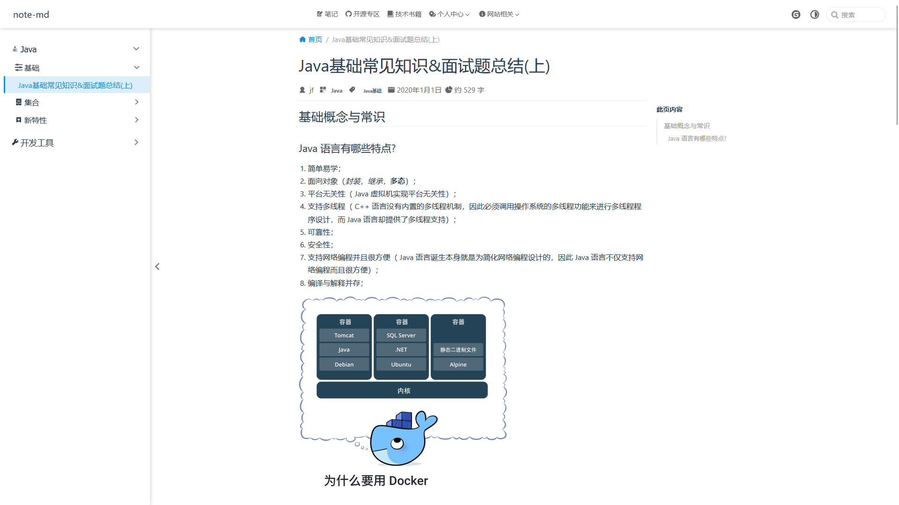
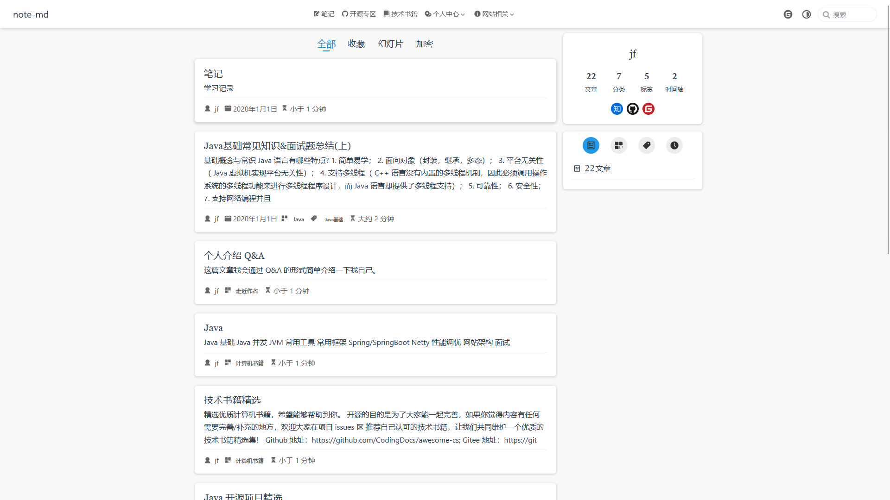

## topsjf

- [🚀🚀预览地址🚀🚀](https://topsjf.github.io/)
- [github仓库](https://github.com/topsjf/topsjf.github.io)
- [gitee仓库](https://gitee.com/topsjf/topsjf.gitee.io)
- [存储评论消息仓库](https://github.com/topsjf/giscus-discussions)
- [vuepress-theme-hope官网文档](https://vuepress-theme-hope.github.io/v2/zh/)、[github仓库](https://github.com/vuepress-theme-hope/vuepress-theme-hope)
- [使用Java压缩md文件中使用到的图片](https://gitee.com/cps007/imgfileserve)
--------
- [releases](https://github.com/topsjf/topsjf.github.io/releases)


-------

[](https://stackblitz.com/github/topsjf/topsjf.github.io)

-------


- 依赖选择：

```
++++++++vue++++++++vuepress++++++++++vuepress-theme-hope
- -  (`3.2.37+`)->(`2.0.0-beta.49`)->(`2.0.0-beta.91`) **［使用中］** 
- -  (`3.2.37+`)->(`2.0.0-beta.50`)->(`2.0.0-beta.94+`) 部署github-pages后，手机端的一些按钮操作报错

```


## 添加新文件步骤

1、创建文件 `./docs/java/demo.md`

2、添加路由 `.vuepress/sidebar.ts` 或 `.vuepress/sidebars/java.ts`

```json
{
  text: "Java",
  icon: "java",
  prefix: "java/",
  collapsable: true,
  children: [
    "demo",
  ]
}
```

## md文件设置frontmatter

```text
#顶置，你可以将sticky设置为number来设置它们的顺序。数值大的文章会排列在前面。
sticky: true
#收藏
star: true
#是否是文章，或者 plugins.blog.filter 自定义哪些页面是文章。
article: false
#是否显示在时间线
timeline: false
```


## 目录结构

```text
topsjf:
│
├─ docs //md 文件系统 
│  ├─ .vuepress         // vuepress 项目 
│  │  ├─ sidebar            // 侧边栏json数据设置 
│  │  │  └─ index.ts 
│  │  ├─ styles             // css样式配置 
│  │  │  └─ index.scss 
│  │  ├─ navbar.ts          // 导航栏配置 
│  │  ├─ sidebar.ts         // 侧边栏、路由配置 
│  │  ├─ theme.ts           // 主题配置 
│  │  └─ config.ts          // 项目配置 
│  │   
│  │  =====下面开始就是自己的md文件，可以包含多级目录==== 
│  ├─ java 
│  │  ├─ basis              // java基础
│  │  │  └─ basis.md
│  │  └─ README.md          // java首页
│  │
│  ├─ home.md           // 快速导航页面
│  └─ README.md         // index 首页
│
├─ .gitignore               // git 配置 
├─ package-lock.json        // 锁定依赖版本
├─ pnpm-lock.yaml           // 锁定依赖版本
└─ package.json             // 依赖版本

```

## 效果预览






## 技术选型

- 设置淘宝源

```shell
npm config set registry https://registry.npm.taobao.org
```

- 安装Pnpm：

```shell
corepack enable
corepack prepare pnpm@7.14.2 --activate
```
卸载：corepack disable pnpm


- 创建初始化项目： 


```shell
pnpm create vuepress-theme-hope@next docs
```

```shell
npm init vuepress-theme-hope@next docs

```

> docs这里的 docs 是一个参数，代表 VuePress 项目的文件夹名称，在本教程中，我们将 VuePress 项目生成至项目文件夹下的 `docs`子文件夹。如果你有需求，你可以更改此参数来使用一个新文件夹，或使用 `.` 直接使用当前的文件夹。

- 技术版本列表

| 技术                      | 地址                                                                                                |
|-------------------------|---------------------------------------------------------------------------------------------------|
| node                    | <a href="https://www.npmjs.com/package/node" target="_blank">16.x</a>                          |
| npm                     | <a href="https://www.npmjs.com/package/npm" target="_blank">8.x</a>                            |
| pnpm                    | <a href="https://www.npmjs.com/package/pnpm" target="_blank">7.x</a>                           |
| vue                     | <a href="https://www.npmjs.com/package/vue" target="_blank">🚀🚀</a>                           |
| vuepress-theme-hope     | <a href="https://www.npmjs.com/package/vuepress-theme-hope" target="_blank">🚀🚀</a>           |
| vuepress                | <a href="https://www.npmjs.com/package/vuepress" target="_blank">🚀🚀</a>                      |
