# Centos7 Docker使用

## 前导

Docker 包括三个基本概念:

- **镜像（Image）**：Docker 镜像（Image），就相当于是一个 root 文件系统。比如官方镜像 ubuntu:16.04 就包含了完整的一套 Ubuntu16.04 最小系统的 root 文件系统。
- **容器（Container）**：镜像（Image）和容器（Container）的关系，就像是面向对象程序设计中的类和实例一样，镜像是静态的定义，容器是镜像运行时的实体。容器可以被创建、启动、停止、删除、暂停等。
- **仓库（Repository）**：仓库可看成一个代码控制中心，用来保存镜像。

| Docker | 面向对象 |
| :----- | :------- |
| 镜像   | 类       |
| 容器   | 对象     |

| 概念                   | 说明                                                         |
| :--------------------- | :----------------------------------------------------------- |
| Docker 镜像(Images)    | Docker 镜像是用于创建 Docker 容器的模板，比如 Ubuntu 系统。  |
| Docker 容器(Container) | 容器是独立运行的一个或一组应用，是镜像运行时的实体。         |
| Docker 客户端(Client)  | Docker 客户端通过命令行或者其他工具使用 Docker SDK (https://docs.docker.com/develop/sdk/) 与 Docker 的守护进程通信。 |
| Docker 主机(Host)      | 一个物理或者虚拟的机器用于执行 Docker 守护进程和容器。       |
| Docker Registry        | Docker 仓库用来保存镜像，可以理解为代码控制中的代码仓库。一个 Registry 中可以包含多个仓库（Repository）；每个仓库可以包含多个标签（Tag）；每个标签对应一个镜像。通常，一个仓库会包含同一个软件不同版本的镜像，而标签就常用于对应该软件的各个版本。我们可以通过 **<仓库名>:<标签>** 的格式来指定具体是这个软件哪个版本的镜像。如果不给出标签，将以 **latest** 作为默认标签。 |
| Docker Machine         | Docker Machine是一个简化Docker安装的命令行工具，通过一个简单的命令行即可在相应的平台上安装Docker，比如VirtualBox、 Digital Ocean、Microsoft Azure。 |

------------


## 一、下载与安装

请确保您 [满足先决条件](https://docs.docker.com/engine/install/centos/#prerequisites)，然后 [安装Docker](https://docs.docker.com/engine/install/)。

安装 [window](https://docs.docker.com/desktop/windows/install/)、[linux](https://docs.docker.com/desktop/linux/install/debian/) 桌面版

```
sudo apt-get -y install ./docker-desktop-4.8.1-amd64.deb
```

### A、前提条件 

#### 1、卸载旧版本

```bash
sudo yum remove docker docker-client docker-client-latest docker-common docker-latest docker-latest-logrotate docker-logrotate docker-engine 

sudo apt-get remove docker docker-engine docker.io containerd runc
sudo apt-get update

sudo apt-get -y install apt-transport-https ca-certificates curl gnupg2 software-properties-common lsb-release
```

### B、安装方法

#### 1、设置存储库《centos》

centos

```bash
---------华为--------------
1、若您安装过docker，需要先删掉，之后再安装依赖:
sudo yum remove docker docker-common docker-selinux docker-engine
sudo yum install -y yum-utils device-mapper-persistent-data lvm2
2、下载repo文件
sudo wget -O /etc/yum.repos.d/docker-ce.repo https://repo.huaweicloud.com/docker-ce/linux/centos/docker-ce.repo
软件仓库地址替换为：
sudo sed -i 's+download.docker.com+repo.huaweicloud.com/docker-ce+' /etc/yum.repos.d/docker-ce.repo
3、更新索引文件
sudo yum makecache fast
yum list docker-ce --showduplicates | sort -r
sudo yum -y install docker-ce-[VERSION]
```

debian

```ABAP
##########卸载旧版本
sudo apt-get remove docker docker-engine docker.io
sudo apt-get purge docker-ce docker-ce-cli containerd.io docker-compose-plugin

##########安装必要的一些系统工具
sudo apt-get -y install apt-transport-https ca-certificates curl gnupg2 software-properties-common lsb-release

##########信任Docker的GPG公钥:
sudo mkdir -p /etc/apt/keyrings
curl -fsSL https://repo.huaweicloud.com/docker-ce/linux/debian/gpg | sudo gpg --dearmor -o /etc/apt/keyrings/docker.gpg

##########添加软件仓库:设置 稳定 存储库
echo "deb [arch=$(dpkg --print-architecture) signed-by=/etc/apt/keyrings/docker.gpg] https://repo.huaweicloud.com/docker-ce/linux/debian $(lsb_release -cs) stable" | sudo tee /etc/apt/sources.list.d/docker.list > /dev/null

##########
sudo apt-get update
apt-cache madison docker-ce
sudo apt-get -y install docker-ce docker-ce-cli containerd.io docker-compose-plugin
```


#### 2、添加Docker官方的GPG密钥： 

```bash
-----------------debian
sudo mkdir -p /etc/apt/keyrings
curl -fsSL https://download.docker.com/linux/debian/gpg | sudo gpg --dearmor -o /etc/apt/keyrings/docker.gpg
-----------------centos
curl -fsSL https://download.docker.com/linux/ubuntu/gpg | sudo gpg --dearmor -o /usr/share/keyrings/docker-archive-keyring.gpg
```

设置 **稳定** 存储库

```bash
-----------------debian
echo \
  "deb [arch=$(dpkg --print-architecture) signed-by=/etc/apt/keyrings/docker.gpg] https://download.docker.com/linux/debian \
  $(lsb_release -cs) stable" | sudo tee /etc/apt/sources.list.d/docker.list > /dev/null
-----------------centos
echo \
  "deb [arch=$(dpkg --print-architecture) signed-by=/usr/share/keyrings/docker-archive-keyring.gpg] https://download.docker.com/linux/ubuntu \
  $(lsb_release -cs) stable" | sudo tee /etc/apt/sources.list.d/docker.list > /dev/null
```

> sudo apt-get update

#### 3、安装

***（1、2 选其一安装）****

1 **默认最新版本**

```bash
sudo yum -y install docker-ce docker-ce-cli containerd.io
sudo apt-get -y install docker-ce docker-ce-cli containerd.io
基础环境、docker、k8s环境准备ok，但未安装docker、k8s
```

2 **指定版本**

```bash
apt-cache madison docker-ce
 docker-ce | 5:20.10.14~3-0~ubuntu-impish
 docker-ce | 5:20.10.13~3-0~ubuntu-impish
 docker-ce | 5:20.10.12~3-0~ubuntu-impish
sudo yum install docker-ce 
yum list docker-ce --showduplicates | sort -r

## 格式
sudo yum -y install docker-ce-<VERSION_STRING> docker-ce-cli-<VERSION_STRING> containerd.io
sudo apt-get -y install docker-ce=<VERSION_STRING> docker-ce-cli=<VERSION_STRING> containerd.io docker-compose-plugin
## 栗：
sudo yum -y install docker-ce-20.10.8-3.el8 docker-ce-cli-20.10.8-3.el8 containerd.io --allowerasing
# deepin:
sudo apt-get -y install docker-ce=5:20.10.14~3-0~ubuntu-impish docker-ce-cli=5:20.10.14~3-0~ubuntu-impish containerd.io
apt-get -y install docker-ce= docker-ce-cli= containerd.io docker-compose-plugin
```

[设置镜像加速](#加速)

1 **启动Docker**

```bash
sudo systemctl start docker
sudo systemctl restart docker
sudo systemctl stop docker
sudo systemctl enable docker
sudo systemctl disable docker
sudo systemctl status docker
```

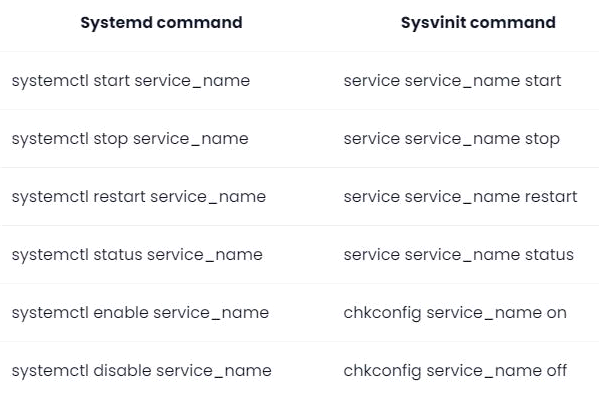

#### 非root用户:

```bash
sudo usermod -aG docker jf123 #非root用户
```

请记住注销并重新登录才能生效！

### C、卸载Docker 

卸载Docker Engine，CLI和Containerd软件包：

```bash
sudo yum remove docker-ce docker-ce-cli containerd.io
sudo apt-get purge docker-ce docker-ce-cli containerd.io
```

主机上的映像，容器，卷或自定义配置文件不会自动删除。要删除所有图像，容器和卷：

```bash
sudo rm -rf /var/lib/docker
sudo rm -rf /var/lib/containerd
```

您必须手动删除所有已编辑的配置文件。

## 二、Docker 镜像加速<a name="加速"></a>

[华为加速](https://console.huaweicloud.com/swr/?region=cn-north-4#/app/swr/huaweiOfficialList)

[阿里云镜像](https://cr.console.aliyun.com/cn-hangzhou/instances/mirrors)

### 2、在/etc/docker配置daemon.json

基本

```json
sudo mkdir -p /etc/docker

sudo tee /etc/docker/daemon.json <<-'EOF'
{
  "registry-mirrors": [
    "https://04eo9xup.mirror.aliyuncs.com",
    "https://098cc8006500f4db0f2fc01937bbce40.mirror.swr.myhuaweicloud.com"
  ]
}
EOF
```

k8s集群

```json
sudo mkdir -p /etc/docker

cat -s <<EOF > /etc/docker/daemon.json
{
  "exec-opts": ["native.cgroupdriver=systemd"],
  "log-driver": "json-file",
  "log-opts": {
    "max-size": "100m"
  },
  "storage-driver": "overlay2",
  "registry-mirrors": [
    "https://04eo9xup.mirror.aliyuncs.com",
    "https://098cc8006500f4db0f2fc01937bbce40.mirror.swr.myhuaweicloud.com"
  ]
}

EOF
```


```json
"https://04eo9xup.mirror.aliyuncs.com",
"https://hub-mirror.c.163.com",
"https://ustc-edu-cn.mirror.aliyuncs.com/",
"https://mirror.baidubce.com",
"https://docker.mirrors.ustc.edu.cn"
```

#启动服务：
sudo systemctl daemon-reload
sudo systemctl restart docker

## 三、常用操作指令

sudo vim ~/.bashrc

```BASH
###some more ls aliases
alias rmf='rm -rf'
alias ll='ls -l'
alias la='ls -all'
alias ggroup='cat /etc/group'
alias gpasswd='cat /etc/passwd'
alias stdk='systemctl start docker'
alias restdk='systemctl restart docker'
alias stopdk='systemctl stop docker'
alias enabledk='systemctl enable docker'
alias disabledk='systemctl disable docker'

#镜像检索
alias dkse='docker search'      #镜像名称
alias dklogin='docker login'    #登录远程镜像仓库
#推送
alias dkpull='docker pull'      #镜像名称
alias dkcommit='docker commit'  #提交容器为镜像         [-a='作者' -m='备注' 运行时容器ID 新镜像名称]
alias dkb='docker build'        #file文件构建镜像       [-f [DockerFile文件] -t [设置标签]:版本 . ]
alias dktag='docker tag'        #设置镜像为阿里|xx标签  [容器ID [设置标签]:version]
alias dkpush='docker push'      #镜像提交到仓库         [输入设置好的标签:verison]
#镜像列表
alias dki='docker images'       #镜像名称or镜像Id
#镜像删除
alias dkrmi='docker rmi'        #镜像名称or镜像Id
alias dkrmif='docker rmi -f'
#删除所有镜像
alias dkrmia='docker rmi $(docker images -q)'
#容器列表
alias dkps='docker ps'  #在运行的容器
alias dkpsa='docker ps -a'      #全部容器
#启动容器
alias dkstart='docker start'    #容器名称or容器Id
alias dkrestart='docker restart'  #容器名称or容器Id
#停止容器
alias dkstop='docker stop'      #stop 容器名称or容器Id
alias dkkill='docker kill'      #docker kill 容器ID or 容器名
#删除容器
alias dkrm='docker rm'  #docker rm 容器id
#强制删除容器
alias dkrmf='docker rm -f'      #容器ID1  容器ID2 中间空格隔开
alias dkrma='docker rm $(docker ps -a -q)'      #删除所有容器

# 宿主机和容器之间文件拷
#docker cp 容器ID:容器目录   宿主机目录
#docker cp 需要拷贝的文件或者目录  容器ID:容器目录
alias dkcp='docker cp'
#容器日志
alias dklogs='docker logs'      #容器名称/容器id
```

### --- 镜像 ---

#### 1、docker镜像检索

```bash
# docker search 镜像名
sudo docker search centos
```

#### 2、docker镜像下载 

可以在这里查看镜像： https://hub.docker.com/_/centos?tab=tags&page=1

```bash
# docker pull 镜像名
sudo docker pull centos:centos7
```

####  3、docker镜像列表

```bash
sudo docker images
```

| REPOSITORY | 镜像的仓库源                                                 |
| ---------- | ------------------------------------------------------------ |
| TAG        | 镜像的标签（版本）同一个仓库有多个TAG的镜像，多个版本；我们用REPOSITORY:TAG来定义不同的镜像； |
| IMAGE ID   | 镜像ID，镜像的唯一标识                                       |
| CREATE     | 镜像创建时间                                                 |
| SIZE       | 镜像大小                                                     |

**OPTIONS 可选参数：**

| -a         | 显示所有镜像（包括中间层） |
| ---------- | -------------------------- |
| **-**q     | 只显示镜像ID               |
| -qa        | 可以组合                   |
| --digests  | 显示镜像的摘要信息         |
| --no-trunc | 显示完整的镜像信息         |

#### 4、docker镜像删除

```bash
# docker rmi  image-id (镜像id)
sudo docker rmi 34336sdf12
sudo docker rmi 34336sdf12 5525636f12
```

 #### 5、删除所有镜像

```bash
sudo docker rmi  $(docker images -q)
```

###  --- 容器 ---

#### 指令

```bash
--name="容器新名字"：为容器指定一个名称；
-i：以交互模式运行容器，通常与-t或者-d同时使用；
-t：为容器重新分配一个伪输入终端，通常与-i同时使用；
-d: 后台运行容器，并返回容器ID；
-P: (大写)随机端口映射，容器内部端口随机映射到主机的端口
-p: 指定端口映射，格式为：主机(宿主)端口:容器端口
```

#### 1、创建并运行容器

```bash
 启动普通容器： docker run --name 别名 镜像ID  
 启动交互式容器：  docker run -it --name 别名 镜像ID 
# docker run 镜像命名
sudo docker run centos
# 指定容器名
sudo docker run --name webcentos  centos
# 以守护进程的方式运行容器
sudo docker run --name webcentos -d centos

sudo docker run -itd centos:centos7 /bin/bash
[root@0f6665eda526 /]# ls
anaconda-post.log  dev  home  lib64  mnt  proc  run   srv  tmp  var
bin                etc  lib   media  opt  root  sbin  sys  usr
```

 #### 2、容器列表

```bash
sudo docker ps
sudo docker ps -a
```

 #### 3、启动容器

```bash
# docker start 容器名称/容器Id
# docker restart 容器名称/容器Id
sudo docker start webcentos
```

 #### 4、停止容器

```bash
# docker  stop 容器名称/容器Id
sudo docker stop webcentos
#暴力删除，直接杀掉进程 （不推荐）
sudo docker kill 容器ID or 容器名
```

####  5、删除容器

```bash
# docker rm 容器id
sudo docker rm 235483s15c
# 强制删除docker rm -f 容器ID
sudo docker rm -f 235483s15c
#删除多个容器 
#docker rm -f 容器ID1  容器ID2 中间空格隔开
sudo docker rm -f 235483s15c 235483s169
```

####  6、删除所有容器

```bash
sudo docker rm $(docker ps -a -q)
```

 #### 7、容器日志

```bash
# docker logs 容器名称/容器id
sudo docker logs webcentos
```

 #### 8、登陆、进入\退出容器

```bash
# docker attach 容器名称/容器id
# docker exec：推荐大家使用 docker exec 命令，因为此退出容器终端，不会导致容器的停止。
# docker exec -it 容器名称/容器id  /bin/bash
docker exec -itd  /bin/bash
sudo docker exec -it webcentos /bin/bash
# exit 退出
```

　　其中， -t 选项让Docker分配一个伪终端（ pseudo-tty）并绑定到容器的标准输入上， -i 则让容器的标准输入保持打开。

#### 9、宿主机和容器之间文件拷贝

```bash
#docker cp 容器名称：容器目录   宿主机目录
[root@hdas software]# sudo docker cp 45bb56e75d40:/software/a/ /software/
[root@hdas software]# ll
total 28
drwxr-xr-x. 2 root root     6 May 24 20:39 a

# docker cp 需要拷贝的文件或者目录  容器名称：容器目录
[root@hdas software]# sudo docker cp /d/soft-win/jdk/jdk-17.0.3_linux-x64_bin.tar.gz centos7:/soft
[root@hdas software]# sudo docker exec -it 45bb56e75d40 /bin/bash
[root@45bb56e75d40 /]# cd software/
[root@45bb56e75d40 software]# ll
total 0
drwxr-xr-x. 2 root root 6 May 24 12:39 a
drwxr-xr-x. 2 root root 6 May 24 12:42 b
```

#### 10、提交运行时容器成为镜像 commit

```bash
docker commit -a='作者' -m='备注' 运行时容器ID 新镜像名称:[版本]

# sudo docker ps
CONTAINER ID   IMAGE            COMMAND 
c8e6eb47f268   centos:centos7  "/bin/bash"  

# sudo docker images
REPOSITORY          TAG                 IMAGE ID            CREATED             SIZE
centos              centos7             b5b4d78bc90c        2 weeks ago         203MB
-----------------------------------------------------------------
docker commit -a='jf' -m='jf' ce4ad0d3dd40 centos:7.9-jdk17
$ docker commit -a='yu' -m='no log tomcat' c8e6eb47f268 yu/centos7:1.0

# sudo docker images
REPOSITORY          TAG                 IMAGE ID            CREATED             SIZE
yu/centos7          1.0                 3642a1c65bfe        5 seconds ago       203MB
centos              centos7             b5b4d78bc90c        2 weeks ago         203MB
```

#### 11、推送镜像到hub服务器

https://hub.docker.com/ 注册得到docker id和密码,用docker login登陆hub服务器,docker push推送

查看:	登陆 https://hub.docker.com/  点击 Repositories 菜单

#### 12、推送镜像到阿里云<推荐><a name="推送到阿里镜像仓库"></a>

##### a, [阿里开通镜像服务](https://cr.console.aliyun.com/)

##### b, 创建命名空间-创建镜像仓库

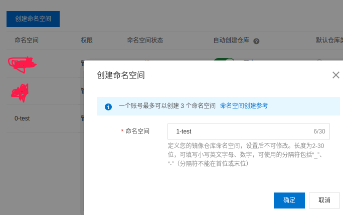

创建镜像仓库

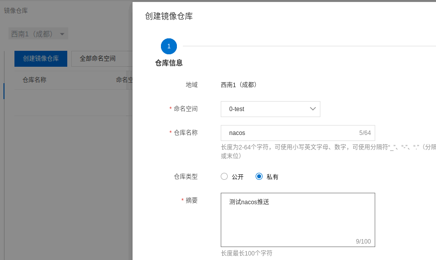

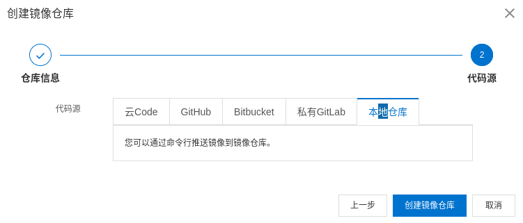

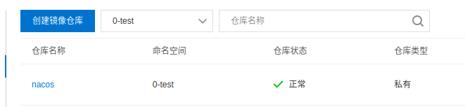

##### c. 登录阿里云Docker Registry

```bash
$ docker login --username=程序app registry.cn-chengdu.aliyuncs.com
```

用于登录的用户名为阿里云账号全名，密码为开通服务时设置的密码。

##### d. 从Registry中拉取镜像

```bash
$ docker pull registry.cn-chengdu.aliyuncs.com/0-test/nacos:[镜像版本号]
```

##### e. 将镜像推送到Registry

```bash
$ docker login --username=小牛程序app registry.cn-chengdu.aliyuncs.com
$ docker tag [镜像ID] registry.cn-chengdu.aliyuncs.com/0-test/nacos:[镜像版本号]
$ docker push registry.cn-chengdu.aliyuncs.com/0-test/nacos:[镜像版本号]
```

##### g. 示例

使用"docker tag"命令重命名镜像，并将它通过专有网络地址推送至Registry。

```bash
kong@k:~$ dkps
CONTAINER ID        IMAGE                      COMMAND                  CREATED             STATUS              PORTS                               NAMES
a4dcf4c99xxx        nacos/nacos-server:1.4.2   "bin/docker-startup.…"   6 weeks ago         Up 4 hours          0.0.0.0:8848->8848/tcp              nacos
-----------------------------------------------------------------------------
kong@k:~$ dki
REPOSITORY      TAG       IMAGE ID    CREATED    SIZE
-----------------------------------------------------------------------------
kong@k:~$ docker commit -a='yu' -m='no logs' a4dcf4c99xxx yu/nacos:1.0
kong@k:~$ dki
REPOSITORY           TAG       IMAGE ID        CREATED        SIZE
yu/nacos             1.0       89f1d606e613    2 seconds ago  965MB
-----------------------------------------------------------------------------
kong@k:~$ docker tag 89f1d606e613 registry.cn-chengdu.aliyuncs.com/0-test/nacos:1.0
kong@k:~$ dki
REPOSITORY     									TAG     IMAGE ID    
yu/nacos       									1.0     89f1d606e613
registry.cn-chengdu.aliyuncs.com/0-test/nacos   1.0     89f1d606e613
-----------------------------------------------------------------------------
kong@k:~$ docker push registry.cn-chengdu.aliyuncs.com/0-test/nacos:1.0
```

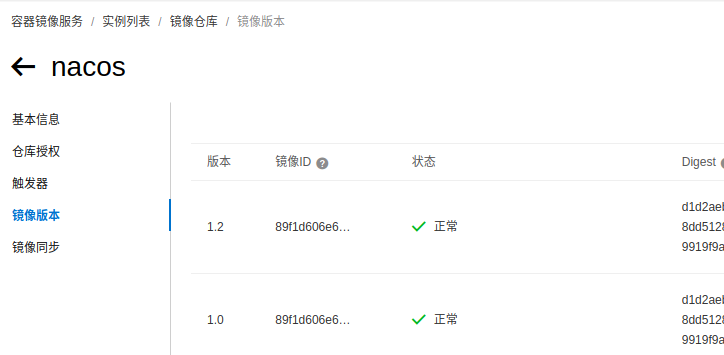


#### 13、查看容器元信息

docker inspect 容器ID

#### 14、docker update 修改容器配置

```
Usage:  docker update [OPTIONS] CONTAINER [CONTAINER...]

Update configuration of one or more containers

Options:
      --blkio-weight uint16        块IO（相对权重），介于10和1000之间，或0禁用（默认为0）
      --cpu-period int             限制CPU CFS（完全公平调度程序）周期
      --cpu-quota int              限制CPU CFS（完全公平调度程序）配额
      --cpu-rt-period int          以微秒为单位限制CPU实时周期
      --cpu-rt-runtime int         以微秒为单位限制CPU实时运行时间
  -c, --cpu-shares int             CPU份额（相对权重）
      --cpus decimal               CPU数量
      --cpuset-cpus string         允许执行的CPU（0-3，0,1）
      --cpuset-mems string         允许执行的MEMs（0-3，0,1）
      --kernel-memory bytes        内核内存限制
  -m, --memory bytes               内存限制
      --memory-reservation bytes   内存软限制
      --memory-swap bytes          交换限制等于内存加交换：“-1”以启用无限制交换
      --pids-limit int             调整容器pids限制（设置-1表示无限制）
      --restart string             当容器退出时要应用的重新启动策略
```


## 四、容器目录挂载

作用：

```bash
我们可以在创建容器的时候，将宿主机的目录与容器内的目录进行映射，这样我们就可以实现宿主机和容器目录的双向数据自动同步；
我们通过容器目录挂载，能够轻松实现代码上传，配置修改，日志同步等需求；
```

实现：

```bash
语法：
docker run -it -v /宿主机目录:/容器目录 镜像名

多目录挂载
docker run -it -v --privileged=true /宿主机目录:/容器目录 -v /宿主机目录2:/容器目录2  镜像名

注意：
如果你同步的是多级目录，可能会出现权限不足的提示；
这是因为Centos7中的安全模块selinux把权限禁掉了，我们需要添加  --privileged=true 来解决挂载的目录没有权限的问题；
```

挂载目录只读：

```bash
docker run -it -v  /宿主机目录:/容器目录:ro 镜像名
```

## 五、DockerFile 构建镜像

### 常用指令:

> - **FROM**  #定制的镜像都是基于 FROM 的镜像[nginx\centos...]
> - **RUN** ["可执行文件", "参数1", "参数2"] #构建镜像时需要运行的[Linux、自定义]命令（可以写多条，建议使用 **&&** 连接符）；是在 docker build 时运行。
>   - RUN ["./test.jar", "dev", "offline"] 等价于RUN ./test.jar dev offline
>   - RUN yum -y install wget
>   - RUN tar -zxvf redis.tar.gz
>   - 简化，使用&&连接：RUN yum -y install wget \ && RUN tar -zxvf redis.tar.gz
> - **CMD** #指定容器启动时要运行的命令，假如有多个CMD，最后一个生效；用于运行程序，在 docker run 时运行。CMD <shell 命令> ；
>   - CMD ["\<可执行文件或命令\>","\<param1>","\<param2>",...] 
>   - CMD ["\<param1>","\<param2>",...]  # 该写法是为 ENTRYPOINT 指令指定的程序提供默认参数
>   - CMD ["\<可执行文件或命令>","\<param1>","\<param2>",...] 
>   - CMD ["\<param1>","\<param2>",...]  # 该写法是为 ENTRYPOINT 指令指定的程序提供默认参数
> - **MAINTAINER** xxx #声明镜像维护者信息
> - **LABEL** name="xxx" \ build-date="20201212" #镜像描述元信息（可以写多条）
> - **WORKDIR** /root/xx #设置终端默认登录进来的工作目录
> - **EXPOSE** 8088 #当前容器对外暴露出的端口
> - **ADD** 文件 容器内部目录  #将宿主机的文件复制到容器内，如果是一个压缩文件，将会在复制后**自动解压**
> - **COPY** ["源文件" "容器内部路径"] #和ADD相似，但是如果有压缩文件是**不能解压**
>   - COPY home.txt /mydir/ #路径不存在的话，会自动创建。
> - **VOLUME** #创建一个可以从本地主机或其他容器挂载的挂载点，一般用来存放数据库和需要保持的数据等
> - **ENV** \<key>=< value>：为容器设置 Linux 环境变量 ，定义了环境变量，那么在后续的指令中，就可以使用这个环境变量。
>   - ENV JAVA_HOME /home/jdk1.8.0_151
>   - ENV CLASSPATH \$JAVA_HOME/lib/dt.jar:$JAVA_HOME/lib/tools.jar
> - **ARG** \<key>=< value>： 设置环境变量，环境变量只作用于Dockerfile内。
> - **ENTRYPOINT** #指定容器启动时要运行的命令 
>   - ENTRYPOINT ["\<executeable>","\<param1>","\<param2>",...]
>   - ENTRYPOINT nginx -g "daemon off;"
>   - **USER** 用于指定执行后续命令的用户和用户组 USER 用户名:用户组
>   - USER kong:k
> - **ONBUILD**  #当构建一个被继承的Dockerfile时运行的命令，父镜像在被子镜像继承后父镜像的onbuild被触发。可以把ONBUID理解为一个触发器。

### DockerFile 示例:

#### 基于nginxDockerFile<a name="nginxDockerFile"></a>

```bash
FROM nginx
MAINTAINER kong9
ADD dist-vue.tar.gz /usr/share/nginx/html
ADD conf.tar.gz /etc/nginx
EXPOSE 80
ENTRYPOINT nginx -g "daemon off;"
```

#### 基于CentosDockerFile<a name="CentosDockerFile"></a>

```bash
FROM centos
MAINTAINER kong9
LABEL name="Java1234 CentOS Image" \
    build-date="20191112"
WORKDIR $WORKPATH
RUN yum -y install net-tools
RUN yum -y install vim

EXPOSE 80
CMD /bin/bash
```

#### 基于TomcatDockerFile<a name="基于TomcatDockerFile"></a>

#tomcat:9.0.62-jre8-temurin-focal、tomcat:8.5.78-jre8-temurin-focal
#tomcat:9.0.62-jre11-temurin-focal、tomcat:8.5.78-jre11-temurin-focal
#tomcat:9.0.62-jre17-temurin-focal、tomcat:8.5.78-jre17-temurin-focal

```bash
#使用的基础镜像
FROM tomcat:8.5
#启动时运行tomcat
CMD ["catalina.sh", "run"]
#设置启动命令
#ENTRYPOINT ["/usr/local/tomcat/bin/catalina.sh","run"]
```

```bash
FROM tomcat:9.0.62-jre11-temurin-focal
MAINTAINER kong9
# jdk
ADD server-jre-8u151-linux-x64.tar.gz /home/
ADD apache-tomcat-8.5.37.tar.gz /home/
# java项目的jar包
ADD eureka.jar /eureka.jar
ENV WORKPATH /home/apache-tomcat-8.5.37/
WORKDIR $WORKPATH
# 配置java环境
ENV JAVA_HOME /home/jdk1.8.0_151
ENV CLASSPATH $JAVA_HOME/lib/dt.jar:$JAVA_HOME/lib/tools.jar
ENV CATALINA_HOME /home/apache-tomcat-8.5.37/
ENV CATALINA_BASE /home/apache-tomcat-8.5.37/
ENV PATH $PATH:$JAVA_HOME/bin:$CATALINA_HOME/lib:$CATALINA_HOME/bin
EXPOSE 8080
CMD ["/home/apache-tomcat-8.5.37/bin/catalina.sh","run"]
#ENTRYPOINT ["/usr/local/tomcat/bin/catalina.sh","run"]
# 指定容器启动时要运行的命令 
ENTRYPOINT ["java","-jar","/eureka.jar"]
```

#### 基于centos7的java项目镜像<a name="基于centos7的java镜像"></a>

```bash
FROM registry.cn-chengdu.aliyuncs.com/jinfang/centos:7.9

MAINTAINER jf
LABEL name="demo"

#添加JVM参数
ENV JAVA_OPTS="-server -Xmx1024M -Xms1024M -Xmn750M -XX:MetaspaceSize=256M -XX:MaxMetaspaceSize=512M -XX:GCTimeRatio=19 -XX:+ClassUnloading"

# 项目打包后的jar包名
ENV JAR_FILE=web-1.0.0.jar
ENV JDK_FILE=jdk-17.0.3_linux-x64_bin.tar.gz

# 项目根目录
ENV ROOT_DIR=/data/web
#动态加载配置文件
ENV ROOT_DIR_CONFIG=/data/web/config
#jdk目录
ENV JAVA_DIR=/usr/local/java

RUN mkdir -p $JAVA_DIR && mkdir -p $ROOT_DIR && mkdir -p $ROOT_DIR_CONFIG

#在容器运行时声明一个 volume, 在容器中创建目录
VOLUME $ROOT_DIR
VOLUME $JAVA_DIR

#设置终端默认登录进来的工作目录
WORKDIR $ROOT_DIR

# 配置中文字符 默认：LANG="en_US.UTF-8"
# RUN echo 'LANG="zh_CN.UTF-8"' > /etc/locale.conf && source /etc/locale.conf
# RUN echo "export LC_ALL=zh_CN.UTF-8" >> /etc/profile && source /etc/profile
RUN ln -sf /usr/share/zoneinfo/Asia/Shanghai /etc/localtime \
	&& yum -y install kde-l10n-Chinese \
	&& yum -y reinstall glibc-common \
	&& localedef -c -f UTF-8 -i zh_CN zh_CN.UTF-8 \
	&& echo 'LANG="zh_CN.UTF-8"' > /etc/locale.conf \
	&& source /etc/locale.conf \
	&& yum clean all
ENV LANG=zh_CN.UTF-8 \
    LC_ALL=zh_CN.UTF-8

# 配置jdk
COPY ./$JDK_FILE $JAVA_DIR
# RUN 构建镜像时需要运行的Linux命令、CMD #指定容器启动时要运行的命令
RUN tar -zxvf $JAVA_DIR/$JDK_FILE -C $JAVA_DIR && rm -rf $JAVA_DIR/$JDK_FILE
# 设置环境变量
ENV JAVA_HOME=$JAVA_DIR/jdk-17.0.3
ENV CLASSPATH=.:$JAVA_HOME/lib:$CLASSPATH
ENV PATH=$PATH:$JAVA_HOME/bin
# RUN source /etc/profile && java -version
CMD ["source","/etc/profile","java","-version"]

# java项目的jar包
COPY ./target/$JAR_FILE $ROOT_DIR
COPY ./src/main/resources $ROOT_DIR_CONFIG

RUN echo "java -Djava.security.egd=file:/dev/./urandom ${JAVA_OPTS} -jar $ROOT_DIR/$JAR_FILE" > /run_module.sh

# 当前容器对外暴露出的端口
EXPOSE 51155
EXPOSE 51156
EXPOSE 51157

# 指定容器启动时要运行的命令
#ENTRYPOINT ["java","-jar","/web-1.0.0.jar","--spring.profiles.active=prod"]
ENTRYPOINT ["/bin/bash", "/run_module.sh"]
#["java","-Djava.security.egd=file:/dev/./urandom","-jar","/home/javacode.jar"]
```

#### 基于jdk的java项目镜像<推荐><a name="基于jdk的java镜像"></a>

```bash

# 添加JAVA启动的必要镜像，推荐使用jre版本
# openjdk:8-jre(295.16 MB)、openjdk:11-jre(328.63 MB)、openjdk:17-jdk|oracle(492.57 MB)
FROM registry.cn-chengdu.aliyuncs.com/jinfang/openjdk:17-jdk
#声明镜像维护者信息
MAINTAINER jf
#镜像描述元信息
LABEL name="web"

#添加JVM参数
ENV JAVA_OPTS="-server -Xmx1024M -Xms1024M -Xmn750M -XX:MetaspaceSize=256M -XX:MaxMetaspaceSize=512M -XX:GCTimeRatio=19 -XX:+ClassUnloading"

# 项目打包后的jar包名
ENV JAR_FILE=web-1.0.0.jar

# 项目根目录
ENV ROOT_DIR=/data/web
#动态加载配置文件
ENV ROOT_DIR_CONFIG=/data/web/config

RUN mkdir -p $ROOT_DIR
RUN mkdir -p $ROOT_DIR_CONFIG

#在容器运行时声明一个 volume, 在容器中创建目录
VOLUME $ROOT_DIR

#设置终端默认登录进来的工作目录
WORKDIR $ROOT_DIR

# java项目的jar包
COPY ./target/$JAR_FILE $ROOT_DIR
# java项目的配置文件，使用这个文件为容器内部默认配置文件
COPY ./src/main/resources $ROOT_DIR_CONFIG

# Create a script 由于ENTRYPOINT无法使用dockerfile中定义的环境变量
# 所以需要按照指定的环境变量生成运行脚本，并输出到文件，之后ENTRYPOINT运行脚本文件就行了
#  --spring.config.location=${ROOT_DIR_CONFIG}/application-${PROFILES}.yml
#  --spring.profiles.active=$PROFILES
RUN echo "java -Djava.security.egd=file:/dev/./urandom ${JAVA_OPTS} -jar $ROOT_DIR/$JAR_FILE" > /run_module.sh

# 当前容器对外暴露出的端口
EXPOSE 51155
EXPOSE 51156
EXPOSE 51157

# 指定容器启动时要运行的命令
#ENTRYPOINT ["java","-jar","/web-1.0.0.jar","--spring.profiles.active=prod"]
ENTRYPOINT ["/bin/bash", "/run_module.sh"]
```

### DockerFile 构建java项目镜像

#### a, 编写DockerFile文件

 [# 基于jdk的java镜像](#基于jdk的java镜像)

#### b, 开始构建镜像

docker build -f [DockerFile文件] -t [设置标签]:版本 .

```bash
docker build -f myCentosDockerFile -t yu/mycentos:1.0 .
```

构建镜像OK后,推送到阿里镜像仓库 | docker hub镜像仓库

[#推送到阿里镜像仓库](#推送到阿里镜像仓库)

#### c, 运行镜像

```bash
docker run -itd 镜像ID || docker run -itd -p 80:8080 镜像ID
```

#### d, 查看镜像历史

```bash
docker history 镜像ID
```

## 六、Docker Compose

### 基础

Compose 使用的三个步骤：

- 使用 Dockerfile 定义应用程序的环境。
- 使用 docker-compose.yml 定义构成应用程序的服务，这样它们可以在隔离环境中一起运行。
- 最后，执行 docker-compose up 命令来启动并运行整个应用程序。

docker-compose.yml 的配置案例如下:

```yaml
# yaml 配置实例
version: '3'
services:
  web:
    build: ../../..
    ports:
      - "5000:5000"
      - "5001:5001"
    volumes:
      - .:/code
        - logvolume01:/var/log
    links:
      - redis
  redis:
    image: redis
volumes:
  logvolume01: { }
```

下载 Docker Compose 的当前稳定版本：（GitHub，可能不太稳定。）

```bash
$ sudo curl -L "https://github.com/docker/compose/releases/download/v2.2.2/docker-compose-$(uname -s)-$(uname -m)" -o /usr/local/bin/docker-compose
或
$ curl -L https://get.daocloud.io/docker/compose/releases/download/v2.4.1/docker-compose-`uname -s`-`uname -m` > /usr/local/bin/docker-compose
```

```bash
$ sudo chmod +x /usr/local/bin/docker-compose
$ sudo ln -s /usr/local/bin/docker-compose /usr/bin/docker-compose
$ docker-compose --version
cker-compose version 1.24.1, build 4667896b
```

### 使用

```
$ mkdir composetest
$ cd composetest
```

composetest/app.py

```ini
import redis
from flask import Flask

app = Flask(__name__)
cache = redis.Redis(host='redis', port=6379)
def get_hit_count():
  retries = 5
  while True:
    try:
      return cache.incr('hits')
    except redis.exceptions.ConnectionError as exc:
      if retries == 0:
        raise exc
      retries -= 1
      time.sleep(0.5)

@app.route('/')
def hello():
  count = get_hit_count()
  return 'Hello World! I have been seen {} times.\n'.format(count)
```

composetest/requirements.txt 

```
flask
redis
```

Dockerfile

```ini
FROM python:3.7-alpine
WORKDIR /code
ENV FLASK_APP app.py
ENV FLASK_RUN_HOST 0.0.0.0
RUN apk add --no-cache gcc musl-dev linux-headers
COPY requirements.txt requirements.txt
RUN pip install -r requirements.txt
COPY . .
CMD ["flask", "run"]
```

docker-compose.yml

```yaml
# yaml 配置
version: '3'
services:
  web:
    build: .
    ports:
     - "5000:5000"
  redis:
    image: "redis:alpine"
```

使用 Compose 命令构建和运行您的应用

```bash
docker-compose up -d
```


## N、docker 私有仓库

Docker私有仓库主要是企业内部用来存放镜像的仓库，相对官方仓库以及阿里云仓库，具有更高的保密安全级别；

### A 搭建仓库

#### 第一步：拉取私有仓库镜像 （私有仓库程序本身就是一个镜像）

docker pull registry 

#### 第二步：启动私有仓库容器

docker run -d -v /opt/registry:/var/lib/registry --name=myRegistry -p 5000:5000  registry

docker run -d -v /opt/registry:/var/lib/registry --name=myRegistry -p 5000:5000  --restart=always registry

#### 第三步：测试

http://localhost:5000/v2/_catalog

![](data:application/octet-stream;base64,iVBORw0KGgoAAAANSUhEUgAAAaQAAAC+CAIAAAD1FOwrAAAAAXNSR0IArs4c6QAAAARnQU1BAACxjwv8YQUAAAAJcEhZcwAADsMAAA7DAcdvqGQAAKS7SURBVHhe7b0FfFzJdiY+u5ulZLNJdvNPNvSSB8NmkmSL0TLDGMZjHh4PM8/YHqMsZpbMOIYZM7MtSzJLFjOr1Wrmrv936rSu2x4PvbxJfi+63+/4um7dU1WnTlV999Tt262HxA/C5XI5nU5O22w2h8PB6X89UC0qB1Cn2+3mTJxy4l8P76rQhN1u95xIoC84Wq1WHGEJJx4A2IXeoyZpoN3tMgu3WQiTEL0OYRSixyluNbpOFLcdLWo4UVJ/qqT2xIWKc1dqL5Y2nC+uO3mh4sT5Ozgtut6MU848c7n6Qkn9lRstSB89c/tcSe3PEpT6eXKlSQo1LQU1VHsJTmvpKgmpnSuqP3a27Fp559mimiOnb1262njqYuXd2u6X2nNFd04XVR06V3v+eldJadO5yzWHS9q/Lek+UKI5dqX97OWGM0UNh0o6Dxd3Xr7QcOV83dlL7aeKWs5duX2huOhC6elzpWdPlZaeLKk8dbn9zEXtxXO6y+e6i843Xb5UebHo+uVLZaVnOkvOdJ+7XH2q9PrJa0XHr948VqQ5Vtxy6saRszf2Xiy+dK6o7Ghp9f7rNd9erztwreZkcc2ZojrUdvxK+7GSBlw6XlKN+s9euQNTIWeLqk9daThe3HD06p1jV8uQf6b4zuHrt/ffvHnoxs2TpTevXLpZch72dB4q6d5/rWHfzcr9N28fvn7z7JUytHWquPJ4Sc3JovaTV5rOFN8+U3L1XFEleg0LcfVccenZkqvU68tNp4rRdM2hYu3hYs25y3VXLpZdO3fnyoWa41daD5U2oSNnSq5fuNiE/l45bTh3QQPj9926efjG1VMlZZfPaa6c0cEPZ4sqYefRq5XnLrVcuNiKjh+6Vn3gZunRa9cvXGi/cKEbvSNvnBVnzoiTl7uPldQdLWk5WlqHjsCAM+dcp84LtAhLTl1uPXupBY69cLnyWDFVdbb49rniq2eKy06W3DlVfOdMyU0Yf6rk9oFS9B0TAENw80JRGRKnrtTAY8eKm46WNB0vbjpZXIdM9BdXcYQP0RYyj2POo9ErlUUXai5cqjtc0vLt9YbD18qOXrt5+GolxuJYKbwH/9edKaq5ePkOEvtKDd+WmC5ebCg9VwdXnLnUeeha5bc3Kg+UaA9f0WI04Vt44/JZLSYSTD139srN0ltXLpdePF90/VpZccmNopKy05dunC+5c6a08nRp7YmrdcevNRy53nTkWsvRa01nSpSZX/e9ZAcCAiMolPEHpKHvgtvybu5fD9TJfOo5l+Acb8pGo57UA+FFdqgQZAdt8KJF8l19tzh3rfPQhfqzVztu1BrrNe52ozA5hdEhLE5Ss7k9R7NLmB3ykk3orMJkv3sVl1CVyf2TjlSPFNT/+xxR1v2d4706sEpvu2u5cnxAbU4qDlfCJ+B9WGgxCzM6KESXEBpBCS6LdC9cCDc6hA0FZREUdAjyJzsTYnXitiTcduF2krLTTUKqdjpAjTWNcCMsx61KdHPretx1pKBF6Fhx1U0mIR85OFLlUhNCfZEG8yXOgXkwEjVAk0YcA+TydKRTHqEATTTHZXlE2CSq1i1FKlCF0gDvVtAEdx+VcyaOZBL6KLsMt7ANqBY1kBNspICyaB2GUcgBq2S/UBxCrWOwZFUOq3DCI3Iu4ZQzoeCwk3CXURbNkdsxKBgFaSGEOwIdVkNZNAdjcIo2ISjCl1AnBPo4pa7QovAowGauDYI0sjCIXBV3lk1S2qI+So+x2z3OcZCR0ETrECQ83kBtDjIbaRZMPCP65RQGi5y0WEdyRAyyFMpqZbU48qrhGfsjkR0AalACH60Wxf9g8GYitPJL8KkSMwKonzuChMKDnAakygOAMeOwzul2ITiEW1GFwSVqO+3nrzUfPld5+XZXU4/osZGjeaQxjTAMSPAkQLrX4kl/94jafpagyAPr+QMc+5Yr7MeRKM9FLWoN36MvxWg2mR0m9A+aTrtwOWnOYZ7xLIca8jH5kOY7B4qwlxThFcJrADY4QXNSHBBpCVfCV8GGNqxqSQRW+v9uDUiQSXJJY83ADF6cyvokBb4qczgfKxaZSPPqwiVwCv7D6oIfYDb3BZeIeSW5Q4eYoo8syAZZCS55Vr40gK9KO0mg5kUcYPm7N05WkJkgOQf0MOtgG4igTbhahR0GUGFWpallNQqrYhjqYZthnmzCYBNmFKd88gjmud1NI0M5bDD/h7KoAX3HQEMTa0UnXJQj2QH1oTQBV+WNhyqTfqBVhUwIKoXINBGf5D4aaNK72xwXlHmkdre4vLkiX1pvoJCC1Ky4C5I/aUIibUAmK6N4l0u0CtHRN8FofOWAcis4QnCKduEBbl259ENkp1CAkrhvM/ivgWSY+yOvPyDAayBQNIEjwjfFcm/6MxhAUATvWO8+sIE8fOxHjdVd06Y7frn8/PWGyhYLAg34lJyL+yqmuJMmHvwFfbtcG5zGyOGSTa525CDQM1rcJrsbFf4sQeUQ1Pb7H6kGuln2pe+5ytbiqKQtiA7u1VGOsAcdb3diTdIUxPzD+mwSokqIOpnAKQKTRkTBMiFXr2iWyorgVMnBVQimMicUYTWPjkO0uTwBFyrkJiDIUYSLwABFuLh3bZzDBaEAC3FE07SEENa56BJyaqQggYbQQWR+txKcoqDSOtuv1A9BAjVAkMmayEQCOWgX/kE+MlE/Bya4hMwKIcqEuCOdCX09okInmQdN6MOqankJlaMUlj0s5MrROvJRA/IxQKiQM1EKmdCnTYaL0qgBBuASjx3SqJbtgSCfTcWROwVR7GeHcEGIosYKEEX/PuGr0L9PlOIssJPNQAKn3DsYDIdwx2vslIk+YulhNrrAlZJzkVBmLAunf4jszGYzyILTer3+ex9s/V5QaI5ZidNokRN/cKA5blEhOMBkMqGD3vT3XSDEwG0RAhNBdganqGrtvni9sqS8qUXrwEyCUxBCw26+gcBfEEmObpvdabJZLVY7jsixuZwOpydSVI4Quo/9tCPrK2V/5hFzALd3GncQct/RIfPvaprMVtqt250Wh53CK3kbflBtdMTN86pGvJBVFp12xj/p9KSMutC4ypCMqrDcqrC0O+OSqmetbZ0R0xSdej0sozQytTwqpTIqtTwy9U5Eam1ESkNEciskMrkpKrmOLqXckZcqI1NqI5MbIpNbohObJiVUT0zEpcrQtOoxWbVjMlqDk8xRCdopiddnxRfNiamcs6YJTUyJa4pOqkPBCYm1ExOrxyVVRidXR6bUUSspDWEpTREkDciBTlRKtWyuGjqT4usmJEKtLjStDlZFJ9dOjaubsa52dkz19LjqqOSG4LSm4DRUUjcpoXZqfOWkxNsTku5EJ7bAPJgakXYH1UYltUQnNUxIqpyQUjoh5eq4xAZSSKmNTrkzPb58alxtVLwOZgekdqOVCcnXpyTenhTXHh1nCk00B6Vog9Ib0PGpCeXT4++MS2yKTGqPTOyOTGqNTIW7bo5LLY1OKY9M6oxI1EUl9FBbKXeiU24jEwYEZNQFpdfB1ROSysMyrgZnlUalXYXzR2R3jspqn5B8e2rSpeiMs6FZxUFpLQFpncHptWhrSkL51ITb41JuoobglM6wpB60Cz9Hp95Ej4JTuiFQi0y7GZZaKz3QFJzaghpwhISmtoSlQKRX4QeS1rAUktCUVmoonSQ0tQk6yIFAH6coiKqQwBFqOMXoo5thmcWhWUWhGTdD08txDE6vhK/80zv9s2/65xQHZN0OysAEqAtLrYtIrhqXXD4lqXRW3Lm3cy/esRDbYhliNtI/rHEsFN730t74nhn74x9QKByn8MUfBEpVCp/+YQECtVgsYE/vqI3TyEfr/LSOCf37Ijv2EbQRbEMbPm3qNlytaLxwraLT6IJfiOlcwiBjH2jiiFuLzWG12bDLQQeJX3B00A7Yk7Y7bYg1Oe10Y49hd1AI+JOOUmiT53b/rCNRm9wx0BMz7PBkDOqJRPvy7ayv2Ol91Gi7H1gzogwEcTNzjCMy6wZkNERuEaPSXEOybUPzbCNyHGMyRHS8iE4Q/pnmkXm6kTk2n2yHbzaOuOoalisgSODUN9sKQWJYrmtormCRlxz+GS6Ibxb0HU8W2p4odOASToOz2iMy2iNSbBFJIjJRBKcI30zhkyX8MxyBmWb/LN2YbB21lSVGZIthOX1C1Tp8coy+OXq/LOuYTKrfL5N0ZIuyhnQRluqYkKQbm6JHQ0NyBQRloRmcbg7O0Aai8gzSHJFrHZZnRdmRWTBJjMky++d0+Gd3jcl0+WWIkTkONBGRaoxIcfimiyFZ4ol8MShfwLCgDLN/ivBJFUMzxSDUn2/zydVHpOmh6ZNBmiPQl0yBeoIyjGHpYEPr0CwxEEbCVLRFl2zwKupnX6F1OHDQes2Q9V3Ih8LvCsXv1gu/LFtQlmZkQfOQQs2QHDEErsh1jczV++Vo/LM1QRl6eGBYtsAl9AKdDcyAT2yocFC+C72DDMkTA2F2nkfYGyxDczyCGiDkZylQe3S9eLyQXA3DYDDnw4eomQqi/jzxpKwWjfpmm4cW6IcU6Efk0rQZmm8eWOB4PF9AkBhUaBxUYIMNA9F6nghY7wzN10ZlNo2NK16YehHxHYI7A1adXFvCYROIQJwQG51ihXnN2O8lOw6yQApKtOUdE/1BAIpRoiq08iOfFfy+QBNoSKFUJlluV2nx+4I75IK/wArQA691GV3XKptKyhtq23VwCrgP+UxzVB6MgmiJQI53uRx2mwWsJx/7uTTdCNIpH+KwozJKOJ1KiE189KNHD53+PEERFhQncpZCzzr60shUKqf6YbmLDHNZzEZYiF58881erwrvCnYQN9wiNKZtRGbXk6ldEzaIgCQxIlkMSHYOzBJD00VAggiOF76prpHp9pHpzlGpYmSqGJYucPXJbNeTueZBOboRWT2jMnRQQP6TGeKxTPFotngsRwzMMQ3KMQzKcg3OECgIGZZhH5ZpGpVu8s3QjspqHZbdPTDbNShd+CYJv0QxKoV0xqQ4/VMNY9I7/TI6R6WbR6STGYMyxJNoUcqgLOewLO3IzB7fNKsv7EkTQ+XVJ8AmWQJtDUujSqITOqMSO2Ez8mEPjqjKL80clNoZkNqDHsHaQdn2J3PsAzPF4HQxIk2gOb+MdrTrm+pEN4dmOkdkWIOSTRC0NTjL/mie9bE8EzWdbhqWIgalUXODs02D8jpHZCP8aUegh/wnkQ+r0mGbCy2GJmsDkq0D08Rj6WJwqhiRQj7ETcU33eCXZvBLtfulCL9kUh6Yq4VPIuPNEXECVj2WLfxSXAEphpHZ8FXPSBRMRi9cQ7N1A/O6h+b0BCWbgxKpI+g+lOGlMUnCP9lJCrnagdk0iOThbPtgsGqWeVimeUQGxEoDkeGU4oKgzlFpTt80O0mqEx1/JN/6WD5GoSc4WQfbaPjSnKPSrRhlFB+ZYcA40gzJcAWkaoNSekamW1HJmGQBQRMDc6yP5ojH4PM0TB7PGKFHsPPxdNsTyT0Bmd3RGTVzM69h0439rw7TFisQ7Oa0CqdZIA6hj3jun67fS3aY8iAIftTV3d29YsWKZcuW/WH5SNnAgkZv3Lhx69YtnQ6xwh8SXV1dR44cWbp06eLFi1966aWPP/44NzcX+diV47hx40Z08wc+dWGyMwvPk7X6TuPZkorrVS3MEEaX0+wEvVH4Q32xOamAFE1X97EjR5d9uXTxwkUvPv/Ch+9/cOLY8ZamZr7qsGEkKOGm57BEZD9diDqpwZ8s0CdBQQiGDxSN3aci4GJb31XWFHarzYlQEqWxx6UKXDlZ2fdXKwV3vwohJqc3RazvHbKubkpy98Q1HZOS7UGpIBSEeI6ANGNIij44xRySbA5P1oYn94YkORDUjMxwDckxD8vVjMppDciqD05vDk7VjwadpYkBoB4svBz38NwOn5xGn+xW/wxNWJIlLBEr3+WTYQtI6w1O6wjIbPbJbhucaxyS5fZPFgHJwifd5ZduQXORKR2RaVXh6VUhqdqAVJtfmntkuhiWKYZAstwjs4yjsxsDMxvDk/VhSbbRaY6RGW5cGowAJFMMB9llioBU87SECoh/uhH5ZE+WGIXILlU7NqV+XHJ9WLLZP9WBqoZlm1FkVLrwT7Xhalh6fVhaY0iKMSDF4ZdhHp1uDEvWRyZrwtPqA7LqhuU3D8trC8hoC0jTD08XkICMrsCsGv+cisCsinEpNVHJHTB1SIZARwLTemH/2KSOqQn14xM70MqALIGrfukO2IwaIlMbx6Y0jk3Qhye4R6fgTiAG5FlGZemnrjNOjbH5gDEzBVwKw0Zl9Y7KNOM+FJiIuNXol9VBvs3qgmFjE7XBKUa4Dh0E8wYmuyOTesnazEZE6E/m0EAMznEMz7KMzDL7ZOr9MiBGnwzzyEwbBpHFh0yywWmBqebgZBvG6NFC4+OFmvDU5vEJXcFJAubBDDQ9Ot0yOt08OlPjk6XFWIzKsI1Lah6X1OqT7h6eJgJxa0wUUBieZaams8RojCzuZJgwGMEM3F3E8I0gfYNfpjYyo2F6wuUySXaY08RmiOY4rAPrYdbKSUpxTN90JbLjwEeJbrDLw1HhHfBFTEzM/PnzV61apUR5Clj5h6FEVeBK7wd/HGQBJpMJZHfq1Knz588jk2Mx3myygpL4LthspQmAlZFz9uzZjz76aPbs2a+++uq0adOeffbZF198EayH48WLF/Py8p5//nnvgt8FqgY96J30UaPRKa7carp4ra7XTs6FyHCPP5CgOIgiZewGrY6yW+XPLX5+4fxF6akZX+/cfXD/obh18W++/tbsmU+fP3sBlZqNoBhhMoBFZRsYCIfTZsHtiNJHDh1+bvGzYMkpkya//+57C+cvWDBvPuSN116fNWPm4oW49OyM6TMz0jKhzFVBbBY7Klz51aqK8krOUS5BTAYjjk4E+WBvt83tsm7ckLdo4TMd7c3kMElqTrvLYxL811eQZUPhxvtyWECWuLUGfbl5Ys6tqak3zjaLFoeI3yOeWlcXnNMyKq/KP/N8aos4JUSpfNaeVSRmxjVMT9P5rKmbvU8cEuKEEGeFOGYXT6c3Bq+oD08TwdhSpToHrG2YtqUtMvnkUbe4LsQXe1zjV3aOThJB2PisaZmW2ZV8U1wSVPM+VFsrpuXrHo65OeOI+6IQ5xxU5JRLPJVwZ+za+ilppshU4+TN4rGlNaFZuujc1g294owQy4+IKWuaQmKbgtJ7g3PtWGMj4zr9krojN4nnvqFH4CVmMTaxdlh896gMx6D4nvAs7dP5bVdkR17ZZJqS1h2Z2TI0pnzmDpHcKI4KsueCEG/ubH86rW18bHNkUn1YXN3EhK6Zqc24BA+gvydlfzd0ieAMu09s8zOZN/Z1iRKZD5uX7O72z230yaqJWHfm2y7KKTXS4/mvdjeHZdUMzqgOzLuz6JhuP/ooxFUhjreKhUkdUeuMQxKdQwvFwPXisTWdZ83inElMLhS/WmYM3YRAyT4oxYxIMCpdhMebIpKrYMYRIU4LUSTEs/lV02PKolY1hCJ0Wmscl9395Unq+3ub24NztE+A7xCAZzoGphp9cqy+6TrftJ7AHPOgeM3Dazqid4snE83D0xyjs9xPrm4bm2vHnj1snSEwzfq7Dfrf5jWPT60dt7J2Yq4ITAdtWSIKHIPXdYPyJmwyDYlvGJLmCMq0f6sRGLIhqeK3ycIvSYQmC9/YztACy6B0A3a+GHF/EHSOeHitMWi9GJUjnkjDzt0SmIX7X/ni7BvlbtEhIw+akC6HpDm6T2NVY65DkM1zFfIQx1YAlj3iOHAH0wcAbgIQFoHpPvnkE/AUdJitoONNE98lQW+gyH1sxQEjjqifc8CtN2/ePHr0aFFRUW9vL2eiCcW8H4byYatiFegMXLZgwYKsrCyNBvt64vTGxsb8/PwlS5agR2C9efPmgWdx6fuCOzgC/jO4cLMQ3UZRdL25tKzDwO/QkTgsLoP8cMLqQvyMLrrEmVPnJ0+cFr8uubmxDacWk71XQ0TT3NCelJD6wrOv3L55x7Pvxe7Y4oQCj8T3icVkRVUff/jJyeNncIrYi/Jd4DIbhpXTVjPMpLGuKKt5bvGLpVducL5ea7aanGYDNeEpiKizuzMlOTFm7eprV0uemja98k4VMmEJ9O8RWQMfNxRuvi+Hj3BLsV68vOn0brs4hj7KByjx23ULEuoCUytDNpW/ean+uBArj4k5q28XXLFWCfH+lo6nUxrfOEYkNXunPjKpdHriuQsOcaBbzM3uDIjtGR5v9s1wzv5WbDETfVyWwWPCfuf8+J7QZOewOF1kctOay3Tp7V22kLgbE7Nqw5aXhK27Nv+SdZsQ2zrE06vOLE79Fgxy0S7mpXZGrGwcm9w74IuaSZvFRrsAU2B1gSlW7hVzY1qiE+mxvV+KdnSqfsJG95vFIgckIj+XLDeJqanVvsk9wevFU/tFSqcs6CB+fy2/PXzF7ajUukkbtZ+UiO0WMTWlZVrszV0txFBLD4in4uonJFRNTmsdF6eLXllxVCO215rnFZZOSr2N7k+IbRsV2zMhr/eIRlzuFZ/vbX0hr2JvuzgvxMiYc+Nyr26tF8V2sfJQx/sbbx+vIvZ555hu+OoTbx5pgG2ZXWL2xtvv77hSJ0TBJTEpphmMNmC9GJDjfvmMuCHEZ5tN4bHdwxKMwRsFgrKx28TI2J7RKzqnpGv3OMVnF8UzebaJcY0bm8QtKG/XzE/tjUgT8PzkgrrtzaJSK95Jrg7K0jyR73wkwxa8kyp5cm1zQLomML0rKL1n8nYxYZd4PFYzIt0ZWCDGZFjCc0wRqZ2RsS3jV3ZPzXU9XNgxs1TgxpB0RvgtMwxfI0IyLP4pXf7JveMLrQHxd0asuhmxQUSm6m9axPEu8XiK+eFC4ZchotNFWGxjREpdxHo9KHVCvnwwkmH3zTUNXdvum6hFiDoyvSc8u3180o1Z6040yo+D69vptRXctUkw1eXyxOTEOiUy65uxD9jGgsjAC0BLS8unn376lgROPZclmOyYYpD44fhOYSKF8rzpT+FW8F1paenu3buLi4uVuBI1eweD3welCbYT++7XXnsNXIZQkRkTRzQEauvp6UlISJgxY8brr7+OfjHbKjbcB+SCRRAWw4L6NsuF4saqBhvSXmSnky9pWSlocgltp+61V95aszKWnAs+MjjfePWduU8vplNwjUu89/YnLz63hAJFlzD0UhGSvsFAvjeFNda32C00dHt2ffvVslUeZZfo6dJzbW3Nmo8/+PyFZ1996flXX3nxzVlPPfP0zAVvvf7eO29+9MzsBa+98s7iBS+9+NwbrU09sITLok4EmIg3rWbsXrGhdr/52rvf7DmMHQCu4r5IarJyb9lQsOW+HBb0A/fVWbFHw7Oa/FOqvzzVetEq3t9snRzTFZisCc5u2GagBfx8Sk/Uh7fm5VzdZyXyClh6afDyiqiNYvDalqkbLNOSy7HOsTAmJFWOSuwenOl6OMn2m9XdgSldE7Pql5aIk26xfIeYs7IlOrUrNK32o7N6hCTvHBARyaYh6eboXWJsqnZcZu30Y9Ugsk+O26evOjsrYdf2FnFIJybHdU1Ks/ut04fkiWEpptE5Fv/MurfOdR+wiU+2iSlfdYSl60bn23zzsZ7FoCTjI3HaX6UYh6fWX7eLYo2ITKoZmGzFfuo38dZhqb2RaXUby8RtId7abhmX1BaR1xOYpw/IsfunmCISO8JW3XhtRzMiuNRb4L6uiKTG0GQQtBif4gABnTCISanlI764MXFt2/R0Z9h6EVXgvIbItFzMiimfHFv/+Wny1fILYm7GrSKH2NYiwteXhawvf+7r26Dm2CLxSk7DxRZx0yqm5NX6pd+asLFoj5nCzOmri0dldj+crnkyvnKzkT4yejH2ypycO+PXtwxKbH5kTW14esukrJansjtCYm5NKKyMzKoPiXWFrur+4jRZ++Fec9RavV+6GJziXnSwEwOxq0Q8s7JlVKblsQ20hR+SYfNNN0TkGifmaYPiaoYtv+UX1+Cb0jUiWROQ5/RJ1fomtEWmt4bF3J64uuzVFOPUuLZ/TLo2/aIZvVu70xC8vGdSgfCPax6b1Rqa3DI5p3N65m24Ahv8iOWV9T3iQrMI2mH+7VbxeFzn+PSuGQllU2OvTMi6E5RcPT7TgUBvYPLtSXu7p+a1jo1vCMvsjsztDo69OSn+8uLE47i/tttoMdKSYZHzFzNTPqORZNc3XT3bWCU0U5Y9eAGk8Nxzz73zzju4ynSGq2AHpJlT+KhEZw8ESE2pEwUVVlJKIUdJg+PKysqOHz9+5swZDscApcgDoZAmJ7itI0eOYNO6YcMGPlWqArZs2fLyyy8j4sP2dtasWcgxGsFWDwb2l/Ktfnpadquy8/zl5rbuu++L2ujtDexu9eRbBE4ucfTQWVBMVWU9uMMu6WPhguefW/QSKrKZ6Z7T2dYzf96ze7/eT6PSNwb3xXd2qwuUR6EWbS1FVUXtu29/0NXRg3z5sYGwmJ0Wo4NeEnWJzz5d1tWuhSZ4iltEuqNVQ1WRpvuj95c21nfhaltrzwfvfjJxwjS6JMWMRl0I9PR52RtfW/J+fXWnDb3yfLAldfqO6wsl2Xnl8NHmFlq3mL+uaExq16jc7rcv6BFwfbhfTEp0+sebRsfUIMw53SUWLOt8PU9EpxXl6cW3VjE1rTx6vRkbrhFJ5rA046S4O/s6aAMYtqZ0TK7Rf6cYuVWMKhRB6baxae2L93agzsRDYsYXLSCU8MzK2DIzFuT4uNsRSZ2D03ueTGj3+fzO/A09c4417RQiu1rMWHP+hYIDIIjTdhG9ui1knT48W4zMEKDRoRmmwIK2ty50gS5XfytmrtH7xncPyrQMyRUjCgRRXoH43UYkOm866K2aqOQ6kKDvdjFkg/Bb7w7PaCi4IW67xetbjKHrmgIyu31y9cPTbYNjekKTuuat1y5aXw3bMirFxOSOPK04CDs3IX6xn3GJLQ1iQmbD+IzOhRld0WvqR2dY5+wjqso8bpm06s64uKZnCtuwF97dLt7Ib0DAknVDDMioeHJ9s0/iWezlT+vFa6vLq+vFrXYRllQzZnNP6ObKdVUU9s5Pvhycrx2Y0Tpx/R3s6w80infX16Kq1A4RvskYkquflVPzrV7sc4nxeY2/+/Jk9Abd2AwRFatZc6EF9PrZaRGSbBuaKoamWuKrKeb9EoHbit4R6S5Ei8M3iEfW9UZtEhGZ2mFflLxzknbciC53YzMuxMB1rSOTOzdYxTG5iwenL8+1z49tWW4WO+TbcNiDIxyeCu+tq97mpLIw7LhdrDovglY0P5+pae0SZT0icHv7X6Q0TPraukNHm3qwJDb7GR1iQnJLZEJVUP7FhSca99upicNCrO8lA05axbOxB+EoLD+iD0zIPsHKQA7mMiiPCEDOVRwf4n0fMwViKGaWrq6uzz//fOrUqTgqXAMdVmOAR/gxP6jwB/gIRbgJTnPiPn4EaSqXEJRhJ3vo0KHr16/zHhPwbvc+MOECig3I+eKLL7BRra6Gt++ira0tMzNzzpw5oDnw3dy5c3HkS99fPy7YQGMOtyi51nThYovOSK9pwHr5ES2Rnc2FLTC8So9Hv/x0bczaBPgWnsXR6RBd3b1I6fT0LKxHS8F2bFzS8mWrXCA1UAUacCBIluPxHUF+b4/u5RdfeXbRc3t37+McmxVF6arRZAMrLf9qtbZHvmLuFkVXrj737EucxhFcZrOLZUvXVFY2b9m05+mnF+3/9shbb38wdcqMefMXvvLKq/MXPLt40Ytvv/PhvLnPxcQkJyVkv/feZyhJDcgalGPh+s335fARbjFZxevx1YGZxoG52tmHujDpX/9GTEsVT28S0XGaMx3icoN46XPNlI8aA+LOb3TRo6Kns275xtaO2yaCcpzgiLmp1cc04qxZTE6+FZJvfjzN8atE94A0EZBojEqsfPdINZZQ1mHx9JeWyDQRlN2b1UoREDKP2+iZHaK5xUm1Ez8vmbapbUUlPczaXSsuumjNvLe1Y3aCZhrYKtYCsvPdIEbmWP1zGxYduIkVuGa3WLjOFJVlHpljG5QuBiaLoUmOgemufykQo3Kay0yiplfMyGwckuR6OFn8wxrrsHTD+OzGb+poG/v2Zm1ETL1/evvIzB7s4yZsFpHJXRPjK1JvSLI4IUJXVmyzEiNM2ykmFXQfd3qe2aH73zSLmTEHA5NurK2iKOyTwtIJMaVhcdenZl6G8bs6xGfbOjVukX3cOTKxfWi+OTS14phFlLvEgrfOdreL8i4Rnt31ZLo2Mq89o1qUusW7u5rDN1h8M9tT7rhwd3lzk2FORgM8A+ofmdo1Jq57SV45otF8vRiSWDt5j/BLaRubqov86urhdmLbhXsswfmuYan2yFwNbjnfNIpnUjsi4+yj0uj1oOH54ndxRt90k19868sHiK0KtWLk6rLgHN3n9eLp4+K1EhHbLCbnNT2dW7mpTDQZxLLtYkDBzXlXddhlr867E7q8KzRLvFsq1jSIiPT66Zm1x8y02X9xi5j0ZXl1s7ijF/6bagft6Ck0iZPYZR9yTk2pnL1PtwfeaBUL08uf/+byPhjmElPS22bmtW5oJ2fubRIvxe2nl5Md9CkizUgI1itWhZyfyIRwNuc8pGwSQRbMSgiv1q1b9+KLL77wwgtvvPEG9oPTp0+fOXMmTpcsWQKmQLi3aNEihE6rV69WiOwHAPYBuymEgvqvXr166tSpgwcP7t+/H3Hc6dOnjx07dvjwYaT5YwokDhw4UFJSwnz3s8gOJiFwYyLDVc5nelV0+JTDVaQVVv0OED8hkkNwKi4X1V262AZvEdnJt9RAdvQ9CBeCG6rWZRML5i3JzimAW5tbWzTaHiQ+/PijKdOmsschFpt16/ZtL75MlNSrxxaYyrFYzEajQWe3WRC/2axmHPU6bWZG2uFDBwoL8rZs3piflxMfH2swGZ1ul1UyJVfIiWs3rr/2xutGs8mEcM4r34B9sVv09npOTWYEqZQ4cPDw1m07kOjohP1wGt0DTWbQF6zx3A4VKdyw/r4cFkydHoeYG3NzWGrnoELdm0UUoL29VwQt1T65tH3OdrHlDj38Wn9UPLO86dPzTix1cMG41ef9ExuC8qwDYloC4+sR1iE8+WRna/CXlwJznI9niifzhM8GEZnrjk4p//BUGYhp+XrX00vt4/PEmCwjIhQs3ewLupcyLr95uBrLr1Qr3k5u9Pn8xKScSiyDO/Ix3/4uS/gHB2YnaGfmimFrDPSmSJbryXR9wIaW94tboLb6azHxgyb/eA32wsP5Hb0cMTxH/CpXDE6tudKiv93UOy2p2idd+K4Xg3LEmHzX2Iy67eWi0ik+3GWYltUTVtD7eGLrwzGaIXG9oUkd7xykRZhxS8zJaJqQ0BSV0TZyXUVYfvuI1aUzMu9MS7/z1E5zbA3ZtrdaOyGjKK+T1vxrGVdm5jeNz6+bnHH6kFPsM4pV32q1ZpG8tSswyYimJxZ07+kSFzvFm58VO63iQo0YltjwWLZ5YqEl4aoodosvj5pGJ7QExFeVWEWlWzwV1xgcU7uuzgXPTN0mJiXrD9wStULM3WMdkmcakOV4fHXzlJSa+DM2xALpN5z+Wc2PJnaMyep+7agL3Lf8m+bo+OaQNOGTJkZkiF/HWP0KcFuyRWdrc9vENzYxf6s2MrXeJ6E+IFcXUGAYHFcbkFI1MbN8Zkbxqj093TqxeqN1SH7x9DM1NPT7Whbki5HrzD4Jt8avv+O7qmh8fPGKww0XLWLpYbEgtqXDJMoMYkTSpWlHbPDe1jIxK7U+JKkhaEvPBzdEuVsk7WreWa9BJP7CN5aAmPopadVLdrTDb2f14unPCkF22Jf16IngiOnufkYhc+6drp7Izvu5GMho6dKlzzzzzEsvvQReA9OB8pBArISj8pkmEl9++SVoginjBwCqAumgId5U9vT0gMVAagjfwHfMbuC7o0ePgu+QeeLECexDQXbFxcUcPP4AUCdTIVfO3Xn++edhvMFgUKgQV1kBgI7CbghL7wsz7wU24eAORF/i0uXaossd0DWC7zzflLKB7OR399A91Cuef/atc+cv6y30hAyCxIw5M2fNnc2nDqIU1/4jB6InjeMcg6kXDAzBNhfCaeJkB8yzZ2QmJ6fEGYw9mzYX7N230+W2njx1ZMlrLx08hkVBxT9f/sX7n3zw/CsvzHxm1uvvvBEYFvTsS88tfH7RvMXzn1k4F4nZc5954ZXXPvp0qbROdPfqONHV233izOltu3byKXykN9ErglYnn5Kd3pK/seC+HBadEOUC+9PSwQWNj2fUvPmt6apLrNgj5ua4h2f3jtjUMSLuTE4dcRMEnLWzg3Yo49beiCgwPJnYOnGf+OwWPa1bub/jxYzKCXEtY3LEr5PFw3ni4TSBaDE4qfiD0gbsaJZtdc1daQ5NF8Pi645gx+QQr8SXTf/ydsSaaxnlotklVuU1f3aw5rIQ33aJRSlXXizYgvWAFTI3wz7go5boTfRGy2M54slc1+Cs2mdP3gERrPtGPJckQjMcQ7PFwBQxIEEMiReIKP9lvRhd2KMRot0oJsdVPbnWPVi+0DsiR4xeV7aljIKsN7boIhLb/HK0g3JM2P8GrRdBKdqNPRRpLsi7FR1TMbMAoVBj1EZ9aEH72PyesLgOnxUdj6zWROW2X3PQDWDs2nNrsSMGy++2RuVofVIaIhMvnUH81Sq+OthscYicnZ0j12l+nWgKymo4aBXFveKtz8+0t4rLbWLk+rZf5Rv8klqz7tAnDG9v6RizsuKVrYZOqzh8QT8jvikstWPW1vITQsSUwxsanUHcqBOjVpUN2CB+UyBGbxQf7mgs7RXfdIjphXX+O1y/TeuI3tC4oVOcsIvZqbfGpnWNSXePTKMXcfzyxZgc18DllZOy2jEQezQi4PMTs/Oapm7oHpPaMCqpJrqwPaaCAmqMbBOmk0HkbLOGbLr8fHFVD+5J64unrm2OSLcHJV9NaqLNKe52oFRsP9ceFPOWVd5oFlc6xNT0G2lV9N2yhE2tE9bW+WXoH87pee6U0NhFXuLFWw0dmGYTM5v9k3unZNTPy7p5tJd26++kHmlyiE75OxFEZsR08j07etWu7207+R0hloeYApjsQFv8AAt7ya+++go7vpUrV4KbqKq+j1+RADtwKb70w78OALpRWEahHlQFcD6OYCuAT8FQiPtAdqWlpcrHFD8M77iMHz5+8MEHoOb6ekwqolrOxFGxBK2kpqZu376dT7//MxCX000xFHp+uai2+EonNoZ6AzETeqKzmGTch8rtFhOcKz587/N1cbF6S69T/tgEjs8sfPqNd1+3uS0Wp9lJ217HmrhVy1aBfexaYw+O8isNqMQjNieIEvRqzcpN+WrV51p9B9Kbtubv3L2ZFUx2w0eff/Dme2+grEPYDVadzty7Y8+2gk35yDHaDMhBK0VXL3254guzw2SwoF2h0emtTsdnyz6fu2jerLkzn3/luQXPzZ+76BnQInIWPf/cvEWLK2pqoSmfUdJXeNlaPuZvzL0vh48Yfiy20NSLI3LLR6Td/uokRVVLd4oJsR3DcjoHbWwOWH9nSmHFlHW35sbdfjajdGudQJAyK79rWGytf37vvJP0VCsXu6GU0mlx5RNSdb6Z4uFUMXyzeCRFBGebIzLLXz5RhYUUc1Q8va4tOLEzMLUaFHZAIxbF1T21qmlmVlfKLXHbJFZvbuZPM6fHFc1Nv/5M5p6cagtoFHvqsVnCJ8XtUyAey7APzLIMz2x460ovvXryjZj8VU9gim1EthhF3x8QY9LpqwuP5Qnf7O5LGnFDI6anNfskC8R9A1KET64Iy2ws4A8odtrD4roCMgw+OdaRWebBiZ3fgMrtWLTVk5JqouLag9d1hudqx2Q2jUyuisrT+K/sGJ8lAjaK0WkNJzrEDbOYt6H2pX2uIhv22hb/5KbgnLbJqdcQF2fXidfWl3bbRdLW5vEZvWNyzWFplQfM4lC9+DiptKJVnGoVw9Nv+mzTR6TW5tfSbn1GfOmM1Jr9raLXLj5afTJiVQ02+8GZN7+Wb/a8mFqvt4izN0V4atvjueI3WSIw33XJKsodYmbSpYCEssdTWn0L9U9tbcfdaH2jiFhTOT7b7ptg90kRo9LE4ESEfvbglO4p2d17jOKQTUxLvj0hsSxg7bWphe3hKVW5XfQo7dWtlbPW7k/a04jbdMr6rrDsyy+drASVFG4qmp2sCY7v3m+gqP/VPZpJMedSD5Q3O8WyLabnYmsq7OJSr5iRfCEPW2Cr+DTl2tzszjHp3Y+mtb11kYhsW0F5r0uc6xbjUmoCU7rGJ5ZPiysqFuKUVryRfLBZ/kqKHmyHVUoBnVXSnJl+iY3ejqVXU5UZ+70vFXd2dsbExCC+W7Vq1ffv8v5VYPYElNgQfHThwgXsYa9cuaK8gKJQ5AOhVKJsUTs6OhAnzps3Lz8/nzNhP4dvID4cQXm5ubno2pYtW5RSDwTTHJo3WERZRWfJ1ea2Ds+vcdAPPHj21na6k7jNlp62U0f3L35+bqe+DTTUZWjHccGLcxe+uED+kIPdIoxNnY2LXp6/edcmzsHRYNOCMSF2AVaixJ3aWxl5KfGpMXzJJkyp2Ym7vtmms2hwiiKoZ/eBrz9e9oHZZUJ6086NcxbPmvvsM3Y40m2GwtWy0oUvzcMR9zzo2KkhONFudBiQQ5a4zWcuny7Yki9tILG4EUw4kC9/Z4J+VYQttAoTjgVbc6Wax2bliBEqdYsZGVdnFNbMKGh4dacR/PL5CRGxrnXU2vqIvN6Q5LqIuKoZKc2RS68+m9d8yCJS68XY7IYnvrzy4VV6qr2uSkQmV0UkVYYlNYzNMw2M0wZvEKNzxaOruiJznaGJta/sa8Z6/vywLuqr89Nya6fkVSdX0xqOXFMyPaNmanY12OGEWbxaWH7WLY47xaS44qlJt2bl3H7rsAFxxOvHxJCvaiPyrP5ZxiFxrWM3mCNy2xbv02HhvX9ATExoQ2Q3LNnol6kNyu4Zg2WZbg3JEqPjWo84xDGHiEqtGxXbHZ4nAnPFyHR9aFZDfhPFJm/tEsFLOyalitErm+fvsdHDJpB+wh0woP9Kw4R0ERhvjSpEvFY+JqMmKLl6emrHuKTWMYVdfmkVZ3XikkGMzb01Y0cr7g3bb4vAtRcm5pe/9TX1dPkR/bQVJ27YxEWtmLy2dHzcrbd2d59ziOxi8VLypSP14opdTEu9PDXr+tS486fc4muLmJl7ZU7i5es2ca5RPLOqNCS5Y1h2z4jc2s+qKZre1SCuGcXctRfGJNT75ejCc1r3OsQhvXhtw42ZKVdHL78Ynd0WmtKaXEtP/ZfsFeGxhsm5wj9WhKWKUetwn3BGbhTDYjuDUnq228XXDjExrWVyetO4pOqxcWWTEssx4jvbxJSvjj+XdmX1ruYut0jYpY1MqHhjd7fVJXbtrw5b0z42VVeuEeWdYkJ8TcS66m2ntW1m8dWOnnkJN847xEGDWLj+/Lvf1CLiiztjxAj6ryoKSynLQtDnFB9tqDnVSx2Jjr8yNrl8XOLND49YMARHu8SrSQcbnPRpLOhDsgAWJBarJ5pDSgpmvmfGfi/ZgRHAQZ9++unChQs/++wzbCcV9vmDQGEZJiAAQSU4DnvYmzdvKtEirip09sNQ4k2QY1tb28svv/zOO+9gm8xcqcR0COLAp9jnLlmypKGhATk/sFNGGRTmH8yqazGcOHersk4PpgMlgOyoB3Q/AfmZhMuIXV13a+WLLy385MuP4VzcTHpN2nmL586eN8tkN8p7iwNR3nMvP4uEzU1xnwzuKB8chKBMb9G1dbeeLzqHMK1T24F8rie7IOvIycOs1q3r4iJdvZ04Gqx6ZHLOS6+9OP/ZeTiilbpmhGmUycL1eMuh4wc3bd+onFpdFiWtCIxE/Thm5mXcd4kFgXcVPYM7Gr7s6IS4K69/a8Me8/0zYkJm1zPbnEExdatuiPWdYnxC7fT0xr06YgRM4qCU22+eEltNIrdFzN9q8F99Kzi+Oiqn2yehftY+gWA7sUNE5Zgn5tgiEppWXBRH7eLdg91T00qmZNwctezEmyfcaKVQJ57e1j45uxzpo0Is3HAnroTCnPQKMTmpbGzsjaxGgWjrme2WGZtNUNhoEb5r7vjH3AlPqHr3GL1V+9ExMS6pNiLDHJhuSOuhnCXHhM/yqvGJvWMTWhByFmjFlPzmqIzOUau7fWN04fn64NSyxDtiX6/49ICYk2KZtEY7YV1TUgXFLM/trfFbdX5qtn1CqgiNFcOXt8Y10ocn84+4Xj0ltnWL8HV3/PLrEntFkVtsqRIjk66Mzij9toWeA0xE13KvlyJaMYvJq0sWZDfk3KGPLN/6Wjcvq2qflkKn59bXTVh7/rOjRvQxt1pErTz2yZHe00K8c9EUuO5Iwln7NYtIOCymxbWG5NhGrHcMLuget6dnm0GcdYlTJjEns3pMYntgZvchuMslXtlZ7/Px7ui4y3Py6yemVUXGV++0iDxsJ3Ndo1drIlNAdrboTBGeKYat6/bP0gdm6UKyda+eEVtdIrNTwIdP5TTnNYnPT4qvu8Qhg1iUeWtB2tUil8Amfc1R++w847v7XB1CfH3ZOCXfGRLX2SXElToRvLpm5gZxqkW+KX3QOiXh2mGX+NYmJqecmJVdtFMvdhvF52fEzMya1/aYcUvb0SPm5Da8vFtzwEm3ximp157fUH9Zfjy1r0q8vGqHBqGMXKQS8tMJ2rHSgkVcB8ElZbp+L9kBoA8wxccffwxe+PLLL38i6fxE3BdS8e6VP5RQWFXhwZ/SNHQURgPOnz//+uuvP/3004WFheA+5CBsrKioyMnJwQ731VdfPXPmjLJ7/b76UR0u6EzkO61JHDl1rfRWM9IgO7ppENORuBG00ZfKjMJpPH702EsvvvblFytu3riDSyaj552SlubOF1949blnX66pbsSprhf69BIJjjarGzTGahgserNE5iOTxs0tEhPStm7ZhYQTrbpFZ4fWanHRJxDy1RjWRHOzZs595eU3vtl36NUlbz09e35CfCpaofdRZEGD3koPbWX9KHXk8MmDB44hnxXMJoeiyTVDkEOTxy02rN/KOfcJ7hK4xy7aeHWHlu69iKROCdqZIkZYUyMC4itmb9Vt1NM0xVZ0S48IWnkuNK5ozubGzfK9eQj0sZJxdY9LzNjU8/Qu82EhcrrE05vNadVEIuApKCABnc0GMXNzV2Bi+ZyvzSAyVIviSCC+819+enzCleTbpAbWACOg1NN5TaFrbyzZ7z4gRF6XmJHfvk1HtmEjDAWoIZHZJMZlaVOb6XPSRdt0L+10oSDysdKQYAuf/1o8s1msN1IaBa9LOecU2TdEUgm9OYjoBkcow04sS1i+eId1i5Hamryjxz+5ERQDG/YIsU2Id/eKORktwXm1QblVc9PqThqorW0O6um4tTeiklrGZ+sj0zTr9VR8l1vscIrgxEb/2OrwtMZhX5W+dIRev/hWOvm1MyI0pzI44SpaP68Vc1d3TIm1BGbRjwv8LtUQucOx3UTd/Pxb9+hPro5fLz4upy7ATjA7uxQ+fO2o7eVDdtyHProiIjPbwjM7wzIR5HaOTuoaEdsQlNkycavWN7liZOwt/+Q7b12idqGMGhLrRWRS8QdnHKgKde42i4IWctpbR52DPr8ZnlSDTHgmt1cs+EZ8eLARlqA5jNeOXuryh6cpqN/jEHvsIjqp3G/p5Re/dm6Tr5XwhIEboxMaxyXWRcVXfH6BcnZp6Hnf7muiXC/O3XF9vKLQ5hbtzXq5GhFzOGi3JWcspiflIek1XX+I7BSuefPNN5966qk1a9aAkjjnDwJwk7KvLC4uRhR2+/Zt5TkdeFYhxB/YyaIGxc77cOzYMXD0c889B8rjT1ewt33ppZdeeeUV7JShgPq//2kdAS4CmejN5DVQwZXrdRdLarr1lIbw43xyowu2moUT8R29uXbpTPE7r330ynOvF2Zv2VK449iBMzEr4t9745N3Xvug8la93ejuatGhpA2+RHnQGj1b8KSVBDINGgunt2/cs3/3YRcH605sR8FJlCi5ePP9Nz9+bv4rs6Y+s/STVZxJn23IREtd18vPvrZ6WRz07Uaxetm6WVPnvfnKu+++/vHCOc+9/eqHz81/6a0lH8ycMufZeS+/uGjJlx+vLMjaiK5a9bJj2An0tbgpfxsn7hOj/OgzeNX+mbnXw+LOB8VeGbnmsk/M9SmbtWHZLRM3aQOSa31ibo3Lop8wCo67Nq2gPjzlZkBscXRS2aSUirExNyYl3pmaXhe89mbgurLgpOrwrJZxBV0jVtzyX1MxZ70xeFX5hJT6CSm1Y1PqQ+NrQpObQ5JbxiS2RucbJ220Baa0+cXUIXP4l6Xzt5uxJCalVM5Mr5gYV+r/5enJKRVDPjw1Oad5XEZjSELVlPzOh985Pn+HYVJaLS5Frr0yIbYkOvbWxEztuJze0OTbIYnXJmU0RMXVhiyvmJhQ93R+VVTspcDVlyelN/ssqwuMaZu5zQJaGZ90anry6VkptxfmdYxfUxay7ML0zOKQtfvHJp2ckFoMU6MTW2bk6kctKx2bfiM07cb4zaYBK+pCEzVjM43RO4VfRvek5J6ImKahcdWTtlmDl90J/vzmrM2msdhLxlROy9H5JPSMTDYNWoejwSfVNCbLOnaL8E03jErVhq63RW52DYxtit4mRmf1RG1xPLq6fHRG44K9LvDI5lsi/N366BjnsET66tWITeK3a1sD1lbOy+mKWnp7fII2OEsMWGcISamPSL4+PrN8XEZZYFxJcOKNCfkNW+xim0tE5jb7xJaFZjWPTq2NLOgOzevyTa4OSqsKSLo9Yk3x2Nz68QVNo+OvhaSVIzafurF16IrzwSm3xuXVDvnqXGha2fQtbWEZFQFplaMSqiOyjH7xjWGFtQHZFVM2Ys9uDy2oidpcP2xt04iY9hHxtydsb/dPaxy+ptpvTe20fEtwbMv4DH1Usm5sinFiuhUSFtsdtLo1KrFzYkZXWHzNzPWa0PjyF3d0z409/2nBtWbE3Qeq3l2WC7KjN7ewakARDqv8IQCsQflpLC9g/N83XX+I7MBBCO5AB9joLVu2bNWqVT9AOr8fmKdAOgjrwHfe7Iamf2IsCTWF75BAJYqdnZ2de/fufe+99xYvXvzuu++uWLECwWNHR4e3zg8zONyFCI5EiJYu27miO8U3m8BO9Bt2TkEPuqSOk3gbLiafWnU2k8a6fcOOtcti317yzsLZz676cnV2ch4RJPSxo0V5sJJBcpbMpNFCGEWPVt1OBIgm+iU5uiq5r6dVZzfIlpCDo9Wj6anNK1/bJpkY8Rr0mTflVZvOCasobReGLvCygIX31AkO1bs47WkdW3WQmbQzP6PAW1M54jrutAFfnZucUR2eWP70VtOEfG1IapdPfPvwda1BGfqQTH1wmiY0oyskrTUoqT4otTE8rzN6kz40vS0oqXFidk90emdgQmNYZndEgS5qs9U3oxvLOCRX75PY5p/UEZmuj0jqCYrpGJdpDUk0BiWbxxeKoDQxMs48JsU5IkY/JtE6ab0IT7EErMOS0EzI6I1IagxPro1Ib5q2xTJxozEgo2tYXJN/hmbsRtuY9O4xaR2DVtyGMRPzuyJT66cU6n0TtQFZlqCcTt+UmoDk1vH5limFzrEZ2sCEisis+qjczrF5ptAs56gEXWCOITCzPTS1aWxae9C61sgk/eRsx/gs88RcfVRmV3SeNixdMz7PPWqtJjJThGTYfBM6QrKM/qm2yDzhG2sdscYwKsk2dG3vrM0iMNYYmuUenWSelCmiEswR6fboXOG3qmt0nM4vUwxKdfsV0Dc6RuUKnzxwlnZIhsN/o3giSTc00/pEsnZUvmNIpvHRhK7or8WE3WJpmfhWJ1YcFrNi7TOzRWC+GFYoHkkXvgVicqFlfHzzhHWt45LMwdn0iynB6Wb/dQ2T840BsY0hyW2QRQfE14i/jCIoo90/tSU0p3PcZkNsB4WiCCERFCDkRCiX0SaiMlsCEWdltQelNIdnd4Vma8ZvNAdlaTBeAZk98HNArtEnxzw0RR+RK/wzbQNy9L9NbA9IsA5boXkkrfuRzO4xyZaJG4RPvnXEeptPljWqQExYL4KTbUFJ1pAUe3iqe9jy7pAEm3+MflyWKzxZH52pD4irf+2Y2GQSYzNqgnB/SixGtLivW8xctfvdjEP1DvkBhR3TEdMd81Er3BqPyB9/oonaN2O/l+yUd9D4o0ws5a4u7Lv/YFCIjOM7NMctAt4bUlCtwoA/ADCXwnc/DEVNiemMRuMPlIUdEJuNHoyB2opv1B89e62pk36kicUieRBi4zd7UBNSOII6zHa7EbcamSlF393LCSvCxT4dTnirUXV9CRdaVfLtbmOP3pPu07cZPAEgn5p76b1neiQodQwaHedTQ0q1XkKWeBWHcItKuyh44tAxTt8nmFw3BPYy9TM3mLB4/BM6h65uG5NsGp3mCMkVvqnOYQnGEQkG+u5kvjM02zQqpfuJ+DbM9aEp2uFJPZGFbr8U3ZNr20M2in9cXue70T0g0/irmFa/9e6QTWJ4isEnxRiZI/zjLRFZIixLjIhzDo93D09EXEM/6BSYI7Bl80vGAhY+68wTC8Sgr9pGxXeFr7eFFFofWdvol2cfkm4clGYamGF+PFEfgDqzLAHr3cEbnaPSNL/69OboTNNvVnf7bxF+GxxDM3uC1rsGJ2h//UWDT5rRL1MTVKAbmd7z+LrOgPVicJrr4YSeAak6n3RHxAb6pbmhiSb/LPeIFPvAWCPsod+hS7QGFYgnYvRDk2yjs5Ew+ufSD14NWecIyhJB2QKx1agEMWitJSBdBGcI3wR3QKoIyxZD15hGrLOOLRB+afT7VyPzxEAkkJ8lfrvO9GSqw3+z+Je1PaG7hM96MSTb8bt47dAc+tmlQen6JxObpn8tnso2hXzRGLZcO2aN9dFY578kux/OFsPy7cEZ2tErq2cVOEOT6EelRmaL8HwxOtEaCRqNN0QX4qjzie8NQfy4wf3wlxUB2YaQfPPIlPaxWxzB+bqBq6uCEltCk9qmFFhGrqoZHdc6aycs1wek6UfEUew5JK73dys7oneIgALxWJwB1OwHX6U4/VPcfhnisVzxeJYYnysmbRADCsWwbSIoXYyKtTycYKUfp0sVT6wx+GeKoXHmwGwxMskeiTtZlpi8BfczF7wRkKILTNOEZLRP32aObaY3tLF33iP5d1LG7ejVx1/MOl8rRL2T/tYEbvFy2RiFGxMeZNdN4kL67vL5XrLz3t8pj/B/9K23nw7wCzMajgq1IRNM5x0/Iv1TyA7wju8ATiutoBKwNp8qO2XkMOeC0znnu0A1KO+Un8Da3aKpw1R0o+7i9RqN2fOlMXpPRPpaLyMn6XGrSY8bg9VlNzht8BidIi250Wq39HKm24GBQQXMmfIjc2yE3RZoWowahxVGUr7V1ENqbgsl+pRRlirh4iglrNruFs5nBbSi1ADhFpX03eJolPNpD25mNTYVNXgu9VX+XaFPY7GNxRYpBdsWfXCmwKwNyqOfPBqcIAKwlrBiU4Vvrhia4nwyzuibL4ZuoF9tfDTd9WQGvcE7JEsMBE0UiLCD4rF88Q9p5kexWjaJf4jt/ftV3WHbxaB486A408g0EbpR+OWJAUn0C0gj0ESeeCTO9WQiVR5YIJ5cZwrIFaAYhDNPpFmfyLA/kuEYvEH8U5Lt0Rzht4cW26AN4m/XGR7LEcM2ilEbxeBs14hCMWqb+OcU9yNZYsh68etE0+NprjFbhe9GMIV7SL5jeKH4lwTzyE3i8RxaugPX49T5OAxGbYXOIYWuwWgOyzVfDIRCuhiQixzn0PXu4RsF1B4H08nf7wvdIR6JNQ9cZ43aLB5JtA3KFKPTBO4Hj8TbH0+h79L7ZpLa4DR6CWY0Gkowj0h3+eeLEenOUZnu4WmOUVlOn2zHk/Fa3AbgWL9cx8hMy5AM7bC8Dv/1mqDkjtC47uh0Zxh6B2Ng8CYxsNA8MqNrZFxjFAKuJO2gTIffZvFEnBv73CHxwjdDBBfQyyWSpu0BeWJ4qtUn0zkoQffo2vZRmWb/fGdAjn3I2q7wHHdQumNknD4owz001vjwss6IjQI8Phw1bBTDs8XAVPHPqx1Dc9AdSoNVR6eLEHRqo/wh0hjT4FW6obnid8nEaxEFInSreCTBPSDOMWEXBbBDsl0+heLJNOuj8eBuw7A065AU44h04+gcQ3CBcWhS3YB1ZX5ZdRN39gxYczUiTz9qbWNwbN2cvLaIT49XCNEgf+UJ856eoWPRY0FjCdIjPNyosdkCe3im6w9tY0E0AJOF8vbGHxAKn6JmZjRuC0fvbSbwA017q3FxAJlKEW+uRL5CiEh7R5ec+C5QAgLCgyqiJVTa3G05dKb00q36dqPnN+HYl3oHXcW2z+ogmpDv39Gxs6uJ0xY7fbEMabvDIP8OFP81KDrKV5c9+srRRr8E7ElDx+E0ctq7Hgf9ptz9+r26DhytNh2OTpdJyVdqQA7yOc06dvohTo8lbJXe1Ikj6ndT8OrRvO+IesuFmBJXPjmxZmoKfW0gIrYxMqEjKkkTmawds7Y1KL49MqMnPKUjPLV1XEZnOHavGe3DYmtD0jvH5fSOWVcbktQ8IVc7Or5+WGz1iMTaiE26wLzOkUjkdEXnYEdTNymnbUpee1BcRWhidVhKU0hKY3Rez5ikhsjs7uDUlvF53ZEZzSEJNdEZ2F3WhyVWR6a3+ifVhWK/md3ll9ISnN0dmqfDDmtUUlt4gQGb5fD83hGxNX4JdZM3GlEPuCB6oyU4s8snoX5CoX5srsY/vi4iozU0tWFMXOWkDYaAlGZYOyq+KTi7BxK9weGb3BqSWx+Ud8c39VpQdm1QRqdfXHtoui4ip3tU/PXIwsqgrJs+idfG5fciLJqY1RmRWuufUh2YUjMtvWVadvuIxPKgnMYJyU2RsTVR67tGpVSHJdVNzGwbufrW2Oy2qOSGyNiq2fmaqLjqiHWV07PbwtfdmZLRPC2rNXj1jadysCGtDIu5OSmtNiL29pTs2rG5N0fHnJqeXvZMet2UuKpJqU2BafU+GTUj0soDsyomZldMz6gYF3t9fEpFaGb96JR6jMX0AvuY1Y1Tck2hCS2QCRnd4zM6A2OqJmS2Tc5tn5hNvxoQnVYbmVQzLqWOfj5g9Z2wtdXPbDCFr6sNX1e/cId75NLb4QnNIfHNUSndQfGtEWnawPj2mdvFmJjmcWmdU7M6xsVXh8dUhMTSb+tPSqx7OqczLKHxqfWm6RktYStvTUhvn5StiU6oD4uvishsHJNc5ZdYMX5DV3hGw8TCjsCEivF5zROy6wNjr07NrQpPKJq9oTo69XJE3Omncm9NSS6fkVo9Lfbqi9nlz8adrXCIDvnDJ5iy9PxORnDe2xTaDfXN2B8iOxUEtwzu5Oc78CHorMcimnusxy7fKCprbOyxw8uIr3AEgYHyoIAID6GzcrTTU1Mw7n/AIzoOrgW1g301QnTLH0FpF/RiAUJB/hMziiCHhf9+CpRRioULcinvq6hTyYegkkYpuJlzAqLUDDU0DYZmYUvYGEU4B5e81RRBo98VbzWlQuXIotSgVOst0KyTprKLqqTwI6VqISqlAspyd6CvuOVHBbWhLARV8SigOCpBtRB4CbZxQ8iHo5DjPRCK3yBKX7y7gzRffaB4F2FBEZjELULYgd9N8ymO3Gs4h4U9AAsh3ASbwW7kGrggeor+IpojGpOP6xDCOSiQc2Ja2uVnfpicvPFRZqxKdj8GkJzL7dnMkk/pLzNpraK6VXvueuWh86VFt+rbdPS5ZT8UGTzDJZhsdA9VXCQZ3xPwQo0TEGTiKnQ8t1+Uk/OU0n23ExzpHxSQj40I3TBc2ORDuFHcVxThHL4KNZQgcHEIEqjWSzjH++o9OZ5M+VkeTGFRNKWC20kXZQaCcUTKUhMNoyNI0H+IdymU9hSnXtv1AjdF+Z1N+toJCVfXS4+XyC1Q5B5RCVzBfz9w7BP0iF1NEQ3VTc9b4BCwAAJ11IadHV1y0muh8D97TLqLTpVB4XGBoHpvQb63w2VZTxFFmX2jgH9HguH5YE+ec5qSMIl0kKbxQrUwFQZDvFvxWIUdlewCC/Wa0NdbzwSiOYQK5VShsqiEPcBOQIUsKtn9KMjH2PBiGmFo4WB2KG4pDd36K7drz14pu3St6npFc2WjpqHD3OsQEJ1T6F30pVkeRWUg/4MJJhDPe3YLewaiTC8IqylpFiqFic/LBY6Vi1YpiDRy+BLPXRbFmfeJosBlfw+htQKRHeFRhgG80jgTQpqwR/5pcLaTO4vNv9VBX0yxyaccVBsfnRTboxLogPxgJ/eUQxtevdh/0cNdKMupAjWlIz/xyAkYRm1JG5CjuAW20RvnXvlchAUFFfH05V6BDkxCDAVBwps+cJV7CndhrJjFkMZVtIKr0EERCDaQEK6H06gEp2wDp7lmiGKhRT49Id/KLrDApR7Kk0RPIl0KgTHcqFIn2+zdZZXsfgzSu26ny+mmWxavBPYsS7vWcq284fSlG+cu3Sy6Vn/2SuOp4tbTRW2nS9rOXGk/U9p+trgDR+Rw/n+k4+nixrMlFedKys4Vl58rrjhbXHW2uObsFdwAIHAFizxFfnHNqZKa46W1x67WniitPV1ce+5K7fkiOkLhVAllHr9aA4EalC8W1Vy8XHu2qPn0lVYWNEpype2uyBxF4fSV5lMl9aiKBU38wJGktOrU1bLTJRUoSMWLa0+Xlp++euN0aRm6JnPqT5dUyZxbVOpK24mi3hNXNCdK6k9crSBBc0WaU5f1JEhQneUkSFzpOn2559zlNnTheEnzqeLmooutly41HylthSANOSbT0Ll4qQ3+PFHcerwEQvo/KKzTeoKqhZ3NZy9rzl3sJbnUhRlIHSkm15291HP2ovHcRf25SxrKR0/RNfSFpOxsSbmUuwN3rogmMBWUAg8cL2k7Utp2rKSNGz1RgumN+uvPXak5f6XqYlEF5FJReVFRGeT8lXIa31LMja4TxR0HbtQevF4P2yBIQ5CP9OFrjcgn+4sxgqizHnVKIS+R24vazl7uOHu5C2ZL6YGcp95pzsGwu1OLBfaQE2Rxmg9wI2pm4UnCM1Ylux9D361Ext70hQWQHTgOfMeCU7otW0Rnp7GmrudiSdO50rYLJR1nS1rPF7fjeO5K25nilrNFtBT/ox1Bdkxkkt2wVM4VNUppPn+59fxlHCGNikAfE/3A9ebDV5uPlWKW0wTFEavoyFXKPHjt7iUstnOXWzHjacXKBdM39e8Xvgo1rCUsThRnQbU/cCS5Wn/sWhXW5/HiruPFGplTc+xaOTKPlXQcK+6h49X649fKjl8rp1I4BT1drT9yvfzIjVsk18upklKiLSS88iuOXG2EMWAfWHhaWlh0vufSBc2poh4I0hDkgyIvXtQg//xFDeyXDmn8MWEdYjrJUI3sJfLG5TZw0Pli4h26kSAHTAeauNzB+bgngaf6hO40944a+RyVsJzF/ayo49QVErq3gYOKWiHQlMqNFy/XQy5drmU5XwQKa4Mnz17qRR8PXGs7eLXt/AWwrRHp/dfbzl6CMfojJV0Hr3ZAjbiPyItt8BbvWeQRvh8cvkr1sBy43koT5lojXE3DVIr7Zc2pUhA6GLxM3oMrMC2VGauS3Y+iL272kJ3LTr/G7qCHoG632eFGdM0xPIRex/MK+jgUN7tIlMz/SMK7BhakPbsb+AG7P/nR/13BXkPu/njjhqOykYFgr4FTZEKw+8A2BJnYmtG20Us454HCCvA2quLd0A8Lb5oUUXJgxn3yXZ3vE9bn3ROO3BEy2+kxz22nR+i8O+M/6Mb59IKEfLqOjrBLf+IR4hkIOdOo5r6tJQkGAvVz6977cblD52H6rvBOU5H7rv6wQB9egm3cZXYFfWrg8Awu77XZV1Dj+mGMIhQ9yKMnkrj3KvqLSjB/WPiBAM8ZVIhq2S3eTvBejyrZ/ShAc555Aoc75G+E8Oc+7E2HU1jMDvqzEjiRjy082v1AMJMwvZg+lHnmmaZS2EUsuB0gB2o0y2VauY+44dm+ghCsUo/XnXS4r877RCnFasihtviBjhS+D7F450OkYRhA+tgBw4mErBPjKwebOZp0iDGoCD8q6qtPXpIiHxsp9vDxu8LKSECBDeAiqIps86rWc5St//ARxdFx9mqfY81uQX8axfPAXnIE58u/IkBF+MiimEfKfYIiXIoakoIEi1JEUYNw60ggHzoogCJIQ5mGUvIX9LkuroFrVqplwSU+SqEXgvmVBhakUYQg61E8wBVycxCuCle5fs6EgOz60hhJ+tCRghe2DLmeSqkM5XNJak/OUT5FPkKePk1SQ3d40yft+mUhm70rHsvYHk7evfZde5DT133W9mgS+v6/qyMfhlLvsELsTtyTpI50OqVwGbdup9PhsjvdDv5r/9IVvHDsXkKfdrAwe3Km203inW+XItP3FPmZRy71fUfoeGzAEZkPEqqnz/i7Atsswm4UdjMJ/R12q/zgX37u6BGaUrIhbpGvkqPhSJ6VLFIPeTjSKfwtP2eDbznuka6wWYUFYhEmi0xAkCldhMr7qr1PiIrk55E8evcIWrLIiMszBWSoYaIjAnY2jP4z3P3i0X3C1vYJWdAnWExooc947g33wuMW+ZY62rLIcedTXOT1xCLrl6pK2ltQCENjpVGgT8xwhP8ROblEj5uO8AyRHdayXM7I6ZWjQH0lofZIcJWPEEleGEobpO9nuUl4xHmGwEqrfKOd24XwDQ8J9LGvCP+pQnQH6vKUGqFCyvzxdFyuINld8owcSrQC422Ig+3CJMUAoTdAXZY+6sMWS96gpLc9DvcSTyZViLaoTpBdn50uq9DrhdVspY/GXY3C1APjUMgJcnVqnQY0AvKGKpp1Iny0kGsQOiLfCgtkCzAB2TZBv6oGRvAaLiYGSnOSe+fJ9oLXJY94avC67C3oLIatj9Shj//lN4HRQeTCsUYb2QLz4Bs3TKJyEsiB9+Vg0XdN5STkpjz8TiLPZZ0kDG4F+X1mMDjtLZ7qpGkekTl3FXDgKSczcVEOHtKwGCG//Ls9dEMjS+4WgcbPOhK+/wgd9jONFzIfJFSPtOx+gZ19QrZ/p+A9uD9TOb+bJcE53AJ8A7fJEYEfsLCNwqQX+l6hRwKn8gNPyUjQ7PPePeKN+y9BWw6K55SBzPvUePSlGl2V4q3gLfcAlRPPYDHDNLmHg8GSvEiQ1BKN3q2vr+l78Z0MCU8ujR07HyIrQbXstftGk/Il6eDWa3PQz/8To8B9uICyFkktHCJZhNlEP+6D/ainuNIEC4p4C5eCyD6ChDxNewpTCl2DIjEqmAFDiRPU05cPob4r6hBclQlURWtELhPZL6YxEqnxXdybyV7FEWQnv0tkNnoGwunSO6wdwtomN8NUucZgsVnlnxN0aR30HSLYRRShdWss5lYH5hyKSUJ3kg4qwhTEEmVbqQ93zaIucVL2oc8jfeBT6am7Ir1A5t7VYEGevCeg0j5HY9SlR4js2LF9I2Ax406irEkqTuVx2Ug/zQSyw+0KpbgpL7KTBqAFdjSDc3CU9VBVgNcpkhBOU9/l7coj0huswDpcOTLRGJIsZADdOXDjgdik2aSMIr8I2BrqlMdqL7kXrOktvyTQPDueTKMzyXe4oSKcIc/gFJn0R4swylCTA3afVchQ5F547PdWuF/Hk8WayvBIa2RZglKSNBWwPmzC7KKvP8t9Lt29yEZo4jqRXTc9bkKWjFEwP6noPfV8T/XAA7J+FGw2rMICxmKXTVIECOsk68EMz0y0StpilR8VzE+PyD56CpJ1bCSlPA4BZ0my43UJ4IBl2DfGXiUUkeDissTvi4cQVlJ1TApyJVLaRc//EMSRT3T00xrQ4T/uZ3YbrNYeugV00+/oGoUZNwEz6FJaIsnDUxnKUG2Ee8iOs/q4TGb3gU/hsr6rJJ5rDNZQBBchffGdvF3IIrgEuuuxkv3YKCD8tdHPtcEwqEGZFAhwMeJxKVRUsZMOPIryDG3I6j3gViX69D05fOotd8uyyLL3KMj8n0h2pP9LgHtEotj1g03d1fdk/FJA/ewRFx14uGQgThyCI3Mc9kMYPkXzXqu+v0ceze+56g3WZPlOK0r5e6pgTRjnTXYY0/vIDlskSXayfxDCPfV8T/XAA7J+HA6b3W4zORxaN+4acoqjEiduH2gccw6W0q+Y28xOvcUhTf0R8SxSFkl26CMNBpe9q9rnkAeRHTMdRLpU6ivlqCiBi8sSPwteFT2kR5eRsgurlrbIHrLDRhREBxs08qct5PK0yz8sD4IjCrRYhZWe2mqETo/ICEbQnKMeog+esWTbkObynCAhcIYnuw98+jPIDoLrOMpSaI09SBnIlyc2AyqhRwgYT5h+dwwIUIK63MCi58j05AP3tX6vGT8AroTroSM3oQhOZUOeqzhIBbSO/2EcixxsTBoWFEMeZXHBPzykVSSeRn6sKUWfivyScNmcJqfLJF0kvYBphmFVBKfSXVCQ3/CVU/Feq5TukNY98Nj/PVe9wZosXuPIUMrfUwVrwr77yE7ueKCJ6wrZycq4XsI99XxP9cADsn4CqBTak08h0R5Zg2WBU7iO7CShj1IRI3ha+EHxLBMWJjuuFXKPKtVLXYQb+jS5v/w/hBomSP17ihLYsj6dnw6vih6iNY6eWWnHTk6AjUbh0uAGKjV0FpiBsMdAM8vhdtPXISnCazcJvbvX6uCPewn0KBNVSM5z8KNkMx2pU4C3lfcZfTfNbZL/veQeeF+A0CNF6V56GEctSaImzxkt0mF83S2MditMQWeQd7c4wdsSb7CR33dVgbeOJ8EV9x2RSQPcd6Q54bl6d0Ql/SGb54jsPzKUFY1irC//61eAU+SMohd+7G56XuImj8g8JNw2F2XSGHMWxDMKvwxoNKUg0dcQj8v9o8OasAeBKEcJdM5BOpEdKePq3Wd2XO89dfzBgdqpLfzTCneX29TrMmqFpVU4G4W9ib66JpcS8S9xNNnJln6PKDRHcxuiUBjPYg+UArJtLsK0iCPSnM+6BEWfiij4jtpPhFdtD8Eog8nzsTERn0G+KgbmQ1wHtnIaXbYevbGVPopw6+zaDs+DQn5VRu5bqW/87hB9+CPFialpRShIf1iNfAdIKz3WIy1v1Eq6D2yVXOx35R54X4AQ2WElgJrhaw/ZMd+ZLaBm6KB+mIQ8o1sY7M4eStPkk9QOBVkNjw2LzEMpNgyCRF9zBHl6F6zDoFKs6CV3p4IUHuy7Cp4WlRMIqpGTDPUy2d21qs/m/gJyi+w1Nj5u3JENZpqtBqPQQZAwCz3uunK3gbXzb+MfMobH2pNBRvbJXbAa5t59ZOc14nRVhlTQxeSQCvfU8QcHJp8ZtAor2unr9vSLb53yO/iVUhrkb16Cf3EVxEefyKII9+w7wjOZ5e705incN2MlvIsRqAhoDpvZvs8w78U9yt7w8vlPh1IbkR04wGJFCIuox6zrkp/BakVzlejoFLevCxdorll0VwhjszA3C1O70GtFe5do7xY1jQgIjUjwmNIw0le1lbf7TPJZMo8fO4VTnkkgB7hvQngg1TyeUuQeeF+AENkhYruH7Hg+UbXYX5tbaTj1d4St1m243TfA2DhghqFdT3MoiFIQJGRZGCdvccTU0r8ea2U+wK0TmF35FJdghudin3hPBTKS+6gImpMt8gm6Qx9qI40zxSqPSWwPLvz+gP33yXdA9X+vDi7eJ78s0ACmFHXaAWrTiM5GUVchbt0UJbdE6R1xs1HUaES7Rf7pXvKXyeM6L8Pu6wuEcI8On9D5fZr3jBSLzOdZAZG493IfWA2TkCYnLinTDAlSJH3kY+XRXyOB4CqEr96tiU+85d7snwcUIMPNwl4h7FeFs0L+rn6J/BMaV4SrVFjLhBWZVfSbI7hzQPnBbXD3uY935b653ad5P/oWhd1JodPdIp7/visecIs/E171PASKNdgN8iN8o3BohLNbdNxZ/9K8Y5Of2jN1onDUCePtvS/PWx8VuuvFeaK9RrTV7V08b3NE0N65s4j4tAZa7KA3DKOLmI5/koVfce6Vv1SB8fNQOEwl0yVByFyZ9gw2ynPPlfH2ZHvD+wLEE9lhSlFBdjnaojqtLcLVJIw3hO3G2c0fH0h/6dLOj4W9RDirhbOZuomtOXEZacN2Ji05F+UQ4hIF2lyl4mekodXXOoGebfad4ioGz3PWJzyuinj6yIKeogy5AaCoRLZLVt3tTp8Cmgc7U4zw+4L7oNTq6ZIHik1UP19S5C68tVh+cRBNYKgM1aLyYM+3q28sn7t/VugG//BNgc98O3PF1S+/0eyrEVVG+Q6tvE142Ub/uAvwqtIdyL06nhRfusc/ykVF+nRYWeLey33oq4q3EX1j/R2yAxVCqCqp7bnqqUxJQaDCCQkl++cBBZzC2FlbfWvztYvrbl5IrCpKqi5afefi0opLy8surL5xPrGsOLu98Wun9aZw2ehp3gPa4L6zsNWKkH7fJh1QFJCQmX35cntIv3uL/rLQFVZg4eqVU1nKU8/PglIDyA7xl42ssTqt8lmptVUY27fOmn49esapqAnCUicsDWcnzbwePuPwlFmipVm0N+VGBx6YFrp/3mSh6xY9KOLhCZfNDLJrkTQnf3nK0U0vf9K9WWPUYC7a7cKEezDYwWmwaOnD9l5Ns9XazaZYrHR/RtKKOSDNQ5RjNNmQMuhRx/2mS3YA2dGfwDIYDOiDzQU/wx1G4e4UumuXd355NG3BiaQZwnpANOQI696i3LkHkhZe2rlK9N4Szk6Hvgv1wNEm+Qom2jC67Ca7fMgNmjOZ5N/XoiG0IFIlP1sdrl7+LU+HjEetdnSUyI5+ph1r0tijWGeyYCzpB3+Z5mwOnBLZOd0Ok9mKSzY7vRyG2kGQOLXbLDZjL019h0W4nfROILYTGoNNXiVFtwlXLWaYRyRvp8/KCEjgFLBaPTGy0QgKJjidnj9tbqZS4AKH02WFnyVvonr6ex24ir4Y9FhyZLfdasM4otc9nW2yz7Lb8mdWcZQqokuLnaMwWmmwflEgWtMJQ5fQHus48e7+98LSQ/3yRo352ueRwt88uv63SPjkjAhNC3n/2/eOd56Emkbgtu1ZOWQb/ZO3ELpJOOQfgaMe8aMorYEGCCl9j5bnktGg83wuidGwm2w2jB29loFz1IlpiTUq/4Yyuc6Juyw51or9GJEVVOE9OSjyj8djMmA/SGTntBjheYwyinXqLFQVqqctorxP28nbRqMeF0CFeovnM1CzhWY+xG2jKIF+3582oFQ/gCsmWCYTPweoyi6c7dcuxpk1642t+a6uQntLiqs91dWe7urMM7etN7RvvVESQ3/9nP5a3n0N8HxgQW8wk+lhlt0BWzDByCGY01bMPqxL+tyTPAnRYmTQawstnF4tTUWcYQY53LRs4QiTXAuYelCwmKinEKsRE54M6MIuEyTQ97di6C3kPig/Rc4/yst/Q4JnNdK4xEujsxPrVDxkcFEzFNjRgqY/fioqb26Z/czBkMklz78u2qtFW23Rord3DZt0bN5borpVdLcefv/59ZNGbJoXIZrv0JsnNERkqfxrCC7UCuvpxWNhcAqd3mHFqU3YzxddWL0qHblOew+1gs6io8J4/OjOEcOGjxrhFxYeNCbANzg8ys8/zMcnKCg4YsLEaeiH5y/7MWTn+4RcQr2F+ZKzKM+BEepwd125vP0TYT0irLuEeeP1xNGdW6eWrhspzJuJ+Gq3X976hbA30FJyOfQGTCvR68DO1m10oTE5QqA5fs3bTX+O9uyp6yuWJ+iNbVYHwlZ6IE6DYbUaLa1tHdXTp84f4xfl5+czbnxEUFCQ3+jAkJCwCZMmtrW1gd20vV0ObLSFY8u2jUVFlwwmOEs0Nbd++MGneoNVg/WFO0Rr11tvvg4u62qrfefNl0OC/VFJYMjYqTPm+4dEzV+wCGbAVy5bT4+ma8qUaYWFG5KSUp54YkBAQFBYWERUVPTkyVPBwhqNFuO6efNWnY5mBqaBVqubN28ezO3pwcg4jCasQDtmp9VmvHGzdNeuHaQp/dnTjdETa1asvHPrOhGE27F7x/aTJ45ZMcRCVFRUrF0XY7XRvIarMS1xZJ//cjAJc5NoXd+8ee7W+aMSfAdnDB24cdBvNvzmnzb84682/hMSA9cPHJwx2CfRb962BVBrFO1675e80B/qCJjOLm8h9vzsjJKSKzaHfemK1d06E9Rqq+vysrJdNhleSVq8cb34jTdfga8wE46fPPbya6/rzTa9yanVe14d1ek1IK/Gxvo5c+aacDd3i4ULnmtrpRsn0PfL2JicDk13O5hu/55dT82YotH1onaMotlOM7a5qW5cVOiY4UPHR4aFBo2OGhsWHj1hmF/Q6KDQwPDwEb5+dyqqQJ3aTiwWcreuS/vh2+8T8WG1GUyoiuVn+h99RE8brl1ebu1JNbclie5UV0uMaI8T7QmiM9XWnmHqzL5VukyIYgp97h9gWnEsdgdoxYFZhKPDiTRNqsb6hucWvtHb7XJgvrvBDTqjSeOgv9vk0PV6mIuEHGA1mVsxpdt6tdDVWd23yqtffOm11uYOslHyO6QXJHW3iIfRlN8bRwLextFisXj/GQn6QTanU/mtcrptED85HqI/YIAu4a5ldht70T1EX1ahMwuNCbchzyvVWDiI1uQHR0LXKUy1iJuEuQwLWW+20IMmNITbpgVEQLGRpD8cG4TuDu6QWCs6h15r0s2b+/q5U1epFrcefGLodNjNnRcvfLtj2050zOmytHY0frF8JXkYE80h3n330/YOLG+5Ghncc/YEzU66v/Goo5QLxjtBo7Ule74S9iOiJakuL7gs7jH7nqieQj/3ngmdhWFVeeMR4gnr6V0xL4ieGnoW5BbdRguGS++mb95QgI2FYTSCjtvKK102eo36anHN6ZNy+IWGIjsMQw/aBLQGU/uKZcnyDVfkyJsbrjvc69at02roDv/1rm2YypERIT6+wyPCQydPnvjI7x6Njh7vM3L0tGlzwsc+NWvey0aT/Zt9ezatz4QDraYeXW837nJmG2qnW5FODx62nT66OyJo+IynpjU3tYMgly1d2aPRs0OQeGr6bJuVHIKrXy1fjQSRqER2dvbhwwctFpPeAHuw1KwHDu7esnX9rdvXCgvzadrQ36LVffLRSm23adXyrzpbGvSajp6u1vTkBG1Pp3yFTWzduvXCxctoDfZoemmxoTVet78ceoX2iDgy5djkXyf+9rHcJ2bfeGZJx+tjjgU+vPWxR7Y9jsSStteQ+XjegN8k/Q5qh+jvxBthG00hqgAOYbKz2g2aq0UXVi774vjxo+cunF+5NraxreuLZauuX7114tARB+I1t6u1sQ7+yc1Jz8tPDwn1/90jv54wabxfQOAov8BJ058ODp88Zfocg8kot2CuuLh1+fmF7L38vA07d+xBor2d7oXd3d12RMj0I9aOkkvnFz4z+0rxudfefr2lw2iQ91C5/4BVNjIUa9JpunmrtHDz9o5eq8FBjKszWTnMgaLL7DJ06BbMmNdQ2UDl5K0f5Vo6NdD8mf6HNxBI1lwr+tTaG2ttXyM0caJltWiLEW3rRGeCsz3J3Jly++on8u/Kaj1+pDbkivMImpV/O5SO2MBgUdhd9JqG1ag3jAubQe6hF6ZQGLxAe9Xung7qiktu7ECCRpPTprdZW53uXlBFixaBEkJa19Rps9paOql6l+hpacfRipmPKUaF3URxmNWIqD23E4o2mPUYCOW0Wi2zHvKhBr5DUdyrcDTZnA9RGGYWNt6mwTyLA5bbdXo03wMb6A1D0YAlJL9QQSG4sxs3P2E7LxxY/O2Io1A3xVhgd2sHsRiiWIoRHaK3uvrU1uCggP/3yKNhkyMixkeFBs8YNiho2pSQwDEDQkeNO/nNReHsOXZ48/rcQulQe1dPS1JaJllhETqdIzU1v6en74kYKdzrempV0O+OSPdjb+gw6ymytFfsi50tjFvvZI4WJ6ZZtowQ+4LEnmCxK6wtY3j3xtCytEBh2Xtzy4fCWidsGFHa6aEXCGzorXGn2WnUUajbbfzqjXcDRw8ODhkzeEBAdNRTo/x+Nzrw0TFjxgQHjo+KmIYwCjxTXXt99YosWIDtDDaJvdjXw0KX+OiDD3HzcDpsFkOv2aTDXfDc2ZPHDx+iay5x+WLRqmWrTUYnaIPsxybfaY+LWVZZVkTjIbfzTa1a9ItcTh21uywdWAXz5z2j7SH2/+zTpdgRyJd8aFW8/NJrLc0diBZ9Ro2JjBgXFhoVF5v0xOODBgwYFBoaOnjw4IjIkLDwQNAc+jp12jj/AJ9RPsMmTZowbNgI/zEhGLQVyxMtRvHRe+9W3r5+6ezJ0AC/GVMn+fuODA0Jun796tNPPzNs+MhBw0aOnTB56KjRC59/GbYZLPSM8pdDl+h8q+z1R3b99nfbfzviyMj3bR/kicKZ5U8/svnJR7cMmFE2O0fkv2d93+fIqEd2Pgy1N26/0Sa08CecJg2D42RYJx+NffD2q831NSdPHj999swHn35xvawyNiF16+YdfsNHjo+IWjT3aSj3dDW/886Sjs5GpHHDbe5oQVVYKxodtrWeahHOnDt35oMP3sNCMxjoZtnRrnnl5de7OhEOKLstl8VqyEhPfvnZZ806LB3zsdNHX3/7c7atV49tneXc6WPBPv7NtfW4eu365fyNW3EVEp+euXHrDmoI680lNK2aOVNmWxB8oCTWv8X51Yo1r7zxNqzCEPxM/0uyE1XXrnxk611j7fhKdK8TzatF6zqSjgRXW6K1M+n21Q+EOP/DZOeidY+E3eZ5KgKx3rx67dk5b2hbXPQ3kSlewX/0Z0+QpGpAVfSKB2/UYIamorJoznPPgy1aesA7IC/aZFMLcuNg65XfR3YJbRdtQoH7OstMh42X0Wj0juyQlpEH6YPjkOoxmHF8iIhJTz81Di/DeHOvUe+yvZa4Imz1+89kxYO06+ziyWUxA5PzJ6bvw7Ag48qu164Xzrix83mHpcghDChL23OXWbg0NreFniqAQFGtqevk7vyyyiokETH12oy0mUeB3jrh6DJgFqFJR9eRQxvGR47z9QkIDRvjHzTKZ0xgYPCEoKDxY8ZEREdPRxew1ff8XX0AR0pIp0uyQx94AtGdhL7I0So6T5dvWyIMOTVZQx1f+4rdI/SFT4q9wWJPlDg0WewLa80dIXrzTqydIixlwt4pXMQWqMTgNoPbXS7MKlAIgjfnwujJFJW69GiAPq8X3WY7bv70hG7+3Ffs6K29DdvYvKxvjFra+JJViHd0FpPWkLAu1m4EUyPH/tSUiSOHDIyOCA0LCMjPztq3c8/14msnDp6YPHF2yY0WjJKVhsZlNrbnZsWEBA338x3hHxAyZdr8gUOCfvvw0IiIqILctC8+fCk8cNCY0aMmT5q+Yf2WpV+uCAwIHRc9CcfHHh0wccJUk5Ge8oDyYtbGI5GbU1h85RrqBeRzDceFi6cPHtqzd9/26zcvoc3Kqtvbtm3p7aXw0GIS772zFMZ/+v77HY3VIIhzJ48e/AbRCixzZWdn7t69F1X0Gul+t3Pv/tSsPAMiYB6NXwydoj18X9Dfbvmrh/f/y798/auoq1FvmN72Pxn0q/xf/3PBb5B43fgWMn/79T8/cuDXUAvZF9wqNDwfpGGYIR6yO35gT1XZNXRn397dY6PHh40d7x8S8fpb74+LGA/tzOTU44f2O6yG995esn//Lout5933XoueEDFh6sRBw4ZPnz3f1z9i7KQ5ze06RHbw5OLFC8F3aICek6Iltygvq3p69jxqUqKpqSF6XMTOHVtw7rZh3hsxtWrqtX6BU0+fvyRjQ7NRR28yvLT4hfNnD5ZXlOZt2FJ0vSogYuypS0Ww32iyaTX64oslz89/3qGzmbpo5b/16tsBY4JHjhr91NNzseH9+f7HTMd0qwHZWXVr7O1fia440RgjmpNEc7JoS3W1Jdk6FLKTXEMNyOVGggYVsdN3MPpojlYNVqrevHj2m+219Lc9sR7tduyKDAZzl8mi78EmBVW5hB67ebcw6toxvHX1pQteXiL5gVYxFHQ9ktMRAfRg0dF2z4abh+ykTmdABpMa4hPcVGSU4gHvZ/lOwzEdJZzEeb1WWppai01Gdi5qyQAGdLvMVoNG2CM/eykyZ/nAT5a0CNEmRFD6hoCN+/3WbK+kaqsPp08uzYkq2TxLiKsOgcCRuk77R/rbDBTd0kewelisvXB027HT55oNZgN9qdj13jsxGF8EX10tt9d9nkpdFNqzp7fv3v61hTYf1orqm0mpWUQR2Fp2W1etSkR36KMAOZ8InoR0fR/Z6e1OCjBw6jSInrKm4wmiKa9lc3TnxhG6zY+LPUNF6xu9G0dY94xrzRluLHjEtH5AQ8ZoYdx7JP55YW0STqPTgRuLQ2PR2umGI3+5A4taL96Zs9Cia9j7zeaoiOlDB48Oixow+akRqanJuP7corfNJlimBdmNGfVUoO/csVGTR/v5jAsfGx4Q/tT4KePCIxGKd7e2YtgNPV046jWdn737HgbPZbS989pb+am5GakFURMWdOrEq2+87+s34uTxPXYLJoFxw/rca9fL4Id3P1hJNxLqMli/taHqSlRY8Afvf4KYjlrHDgF2SgWEe/SOkyS7hPgUdpqu1zRv3oL6+vpDhw4MGz7IYESIYX3nvVd8Rw/GrWXY8IG+vqPGj58YFBi5cf3umNWZTfVdiTEx14vOuazGVcs+12k6X3v5hdaWpo8++qCrS1Nb17Bp286qusb3Pv68o4difx6ZXw4gO/8tI/96w5/9auf/+7st/x9IbfChgf+w4R9+ve3Xv932OyQGHRzwm12/+vutf/PPX/+/v97w576bRzLZYVZIwzBJiOlYetoaZk+ffP1aKS5V1Tdj9jW1dn3+0RfdTa1fb93aUF1x8dzJiePCUlNjwET0gZnDqDPTRzE6M/0MBq0RrGKXmDlr2pYtm1A5fxCEgcBtBs4/dfLcokXPIsrYvHnzK6+8ZDBqly39wmnGmrA4XNpjZw5t33UM4Vh6dt64iZEuFwVE5m4T/SFgYbx+88LGbbuwCBA6aEwWo42GXdPVG+QbFDQyINI/fMb46QHDx2jbteiYxUrRSkNH17zFz/9M/0uHiIbSKx9LslspOhNFQ4JoTBeN2aIVkmbrwDb2IyFwO1Q+oHgw2d24Xvz07OnRY8MGDPjd6dOHrdbelvrmOZNewFQF9XW2tixc+NS4if6+/oM6Na2oBiv6/Xe+mjB2ZlRo5K5tBcUX9w4e8qtBvqMHjI7atPvo5WuVs2YtYrJrr2ucHD52xvgJwT6+B/fuhQ3LvlwaFBQSGRW9YcMG2py63QUFBVFRUUOHDv3000/lJ0Kiubl5+fLl/v7+48aNw1XotHd0hU+YtOvgoRGBQaV3Kh5CLES/0mPpNpjaHUKnF9oW0f10zOvBXz4/J/kr+lzVLZ79Mi9iScKcFXvogYS78erut29smHF95/PCUWql3+iVrEw/hNJppa9c2OmPkeK+76o7+W3KoRNHnnnltWZ9S0tPx8rleRW3UIcmKfbjM9+WwCk2Y8ORQ/knj5yAJ11uc6+hc3VMAsYZZIeN+bJl6xoa5HNfFmqdE0x28Dg9TzI5HPTQHEnsSTU3T6Y+Lyy7GwqDe7eNdH4z3LjtCXFtlqh9s3PHOOfBKXe+/M9i8yM3v/onod9ckvuGsPLHFFbceI30N/phupn4tdsodOK9Oc+aemsuXzmen7sd7VqctQePZ2dmprudYvGCN5sa262O9vbOusR1O+kRLbpA21GBHYeutTs9LtGuxb0RFOw4+s3eedOnjRjwRPjoMeNDw4JHjgEbFqTmnj95xeES3fIOWltXmZsdJ5xwuSE7K7W+odVkEV8sS9ZonbRvpTtD9/FDm2Y/NX3L5p1XS28NH+br5xs4fdrsEcP9sA+dMH7q4UMn6utaDHprRPi4yIjxCfGpCPfgLEwCnqmzn56+Z+82dBCRCyq8U3GzoCCPvVpR3vzpR2thx7JPP626VWo3aBLXra6vrlj2+ScoazDgTiYuFxVv3bnbIh8qYU32Wsj5PCy/EDSic+LOsY9t/effbPqHR77+1SP7fvWPO//mb7f/33/Z/w+/2f8rJP5hx//38N5/enT3P/9uyz88tvVfxu+I7hC6B5AdvVlm2JCTVn6jtPjK5VE+ftNmPTPMLyi7YHNLfeu1i0XPz53X1dq0ZWP+lUun16/PgH/WrF0WGhH42MDH58xfMHjEaL/gcZOeWtylteflF67fkGeVnzjq9cannpqJuwsaI/pxiz179n3++edoGFNS09Ox4qtl5Hj5FO7bI3vSs7ZhEyHfdrevW/flxHERkyMmTYycOHL4I5FjRyPSHB0yfkRAaFDUuDkLnh03fopRB76Vb1LZhaFNRwkEFuBtTAUddtVy3VE3fzo4RGgsvfKptTfG3rZGdKSKugzRkCfq14tmSJatPUM+syuSjckGUMQjiIc80tPV+sG7b2DXz39l+PnFz1SUXe3p0Myb8oqmnmzOSksFXbZ3VZZcP/vmO69iZezbd+KrpUmIhrDatF2NoIs7FRdffue9NhNFXBqje9GiJdjGVt+ufnrK9NtFpQ6wEZaPy3XiyNE1q1abzVarDQbBt459+/bhjsKR3ddff/3ll18is7S0tK6urqWlpaKi4osvvrh165bRZBk/fUbBjl1Uv9X+UKdbbwKF06N31N3bKrqbRXej0NYLQwO9YSyMNFrkJaw2+izAXS2cp4R1n7AeRpRndvbA47ThlptwC001ORr0UXRlQfZ7R04d2H/6dMbGDIdwpSZv3bHlEKp8dsFTbr0wE3cazp7aFegXEB4aFRI6OjDEd/SY4LDQKSNHhmAnO27cUxSG0vsa0gaAXI//JNnRUGC90VRyul0uK3i7R9jr9q1bIKz7S5P9DHuiercNF4eDxe0F4toicfv1qyv+vvqr/9G49i96CgKFcdephJeEvpZeoMFqcFrll7TNTlsvkZ3FhSj+pYkz4Zat23O2bP6azBDtB48WnDlzStNlXjj/VfooXRgbm2qy0vZiOrY2011XvqGO0Xet+PQLu84orLaCjLTQ0b7njx+lnbDTlZeatr1wM+k4RHZq/mj/8e9+TJ/J3Lx5PT8nGRU6rNqVK5b26szYIb37/nIc6+oaPnzvdae59fjBbS8tXqzrNsStSWAf7Nt7MDdnPVxiNNGHBcuWr/bxDVixMgY5584XRUaNDw0N9/X1jYwMHzjo8admTLbaDD3atk8/e89v9IiAQD/kDx8+EoxpMri/+Gytode2ZsVXjTUVh7/dMz4yNCIkcNTI4ZERYefOnbNYLGfOnv/o409hKmxHeIDjL/32Sa/QvHj4ufADAQ/n/dOvN/79b77+u7/f81d/f/D//OWe//F/9v3p3+//q7/b9Ve/3fX3D2/4xyfyfj32m6CXDj6nue8DClhKYZ25sermsIGPInZDJtaAwUwzy+oQne1dCWvX5Wdm0ydsTkNV1dUdOzY4XSbc++XDJmxJ3HpJ6+gqbsNYby46c5nN5lOnTq1fv1G+Y0FkR59cScgXIFwtLU1vvP7qzau0d+7Vt2Rkpyx57SPMCNhmo48yrbqeDjjRSbPIXFN3KyUjG/XS8y35uADsgD4YeoxToqeE+ASNDYwcHz7eb8To8dGTfP0C/IPDTp67yGH9zwC06e7bev3ylzZtnL1ttehMlmRXIBrAdAWiJc3ennSnFJFdkbxDSBfiH1EkH2n/h2NNRVlIsP8Y3+FBgX5B/j4jRwwuvnyut0u7cObrIBEumJwcExYxOmJswIJFc602OEQ7acKs5xa9QjW49G5nW3VNyfwXX+2Uf2/+Tl3HzJkLO1o1F05fXPrJZwiZyFQsGbejpaF28qQJzy5eiEodLifmecy6uCcHDsDcRnA3ZsyYl1540Wax6rS99bV10VFjAwICRo0a0dra3NjUMnveopYeE+7NoK+HuDNma6cD+2j5SnATvVzXVSOaGkWzyfPdkWvCcVk4bwn7deE8KwzfCudJYTyP2E04e6kGEjiSXkPUWRDigek0Rl3ptm2rKmuvtna1vPPhWzaHtbKi4ZOPvurq6M7OzMGY06cibpGRnnTqBE1Bu8PQ1d26LiaZno7JOletSOAdvsV836h6moTw2jOasYHXyy/3NcPOY5nPCsveaxlhjoMzrTtCxJ0XxKVpzav+snbpn5Z98b/KV/9WGDaX5y4R+gphoedx2GPDF10Wg/z+m5k+dEGWzv3GU/OETXfi1H4/P5/AoNEhYaMCg0dmZ2fCgoULnu/swL3A1djYnJ25BRt1stAtbCA7t+jt0SHw7miD61wGPdTsc55+CpMjLDQ4MGBMSFBoUEDwaN+AZxe9YLO7DUZaVI2N9VmZ6dBPS0n94IOPUAkCgFeWvIlLd+7c2bZ146FDXzfV3lmy4Fl7pxGTaWrU5MigyHFjJ47yGRMSMdY3ILixDZG1qGlp+2pdnMFBK5LXfFpaGtjKRi92kccQdKxYsbynp7umpio7Oxt9WblydXNTe2JCqk5nWPrFl/V1NU45Bs1NDYhT2tvRC3ru/sknn4SFhd2pqEKdDieso9kIgAflM0HlrYu7iX8ldEL3jW3v9P1T/mHN3/yu8J8f/uaf/+ab//3n3/7J/z35P//6+J/+t60P/e2OP/c5NnD4picfWfPPc/c+dUD/rZ5/UthTAeyDJTSmBQVpW7cWlBRfbGpqmDp1un9A6MyZ83vonS/x5utvXL5YDGWDsbm6jl7HgYvyCuNCwoeP9guKiJjqNzpo5Kgx06Y+26ul5wb8PAgRxAcffIAE4osPP/zw3LkL1KAERxxHjx5dsmRJZHjE2TOn4LDZs2cOGDj06rXbtFAwb52SD+hpKcxzlJXfKARvYnVLx5LgksWm1fTGxsRBx2ahpxZKx9Izss6eu2Dvo9efChQnEmm/eW65U5NgbflcdK0S7WmiLV/UpovuHEvdF6233qwufre9Ik9YO/vIrq9dOpLNON4pv71gAb3SBDEZsROnY2tzx/w5L+s07mvFlVMnzTp+7LTL5bp27dqiRYtkeXriVlVd7us75Msv33ULbXXtzRdffZujpcbmXkR2zU0dRw+fwNqhz+zcDnq1g4aPRrCirMQ/wOeDzz6B/tsffHzizFkY4nIJO70AKRwmy1OTpsSsWgkmNeh7Fy2ci61Sb2/vzJmLDSb6cb5evfshqgdRp6vXSj9hQl9+qBemJenvP7f22Q/T3ux11blF+dkDb57b8Uzj0Q9Fzy5h2nbn0JKbh94r+uYzYbxOkZFDbzea+YVNTHJYIN8hxL3LsHDR1I6uWtwnP/n0/YaGOtwDTUZ7elpeRXkjlA16Oyj+iy+Wyl0STcrWtsb4uDRc0mmddqtYtzYVZGdCJI9KycUKyMUQBFK4A2JmWckpaFEn3O3CXHYw5w1hO3M+ZbLm6/kd+cGi9DlL5qMi5zc1n/73qrW/rssME71793wxi75MZjB2NNFH+DAf9xoK7twG7K7pK5hG98cLX+5ubjh+4sDWbYVmC4yEIgT7l94lS17jR/tdndrsrALEghCrpe8JoxCrVq1iU11um94Ah9B7qrdv3xw/Pvrll5fQFU+P0BGq88iRQzt3fn3pUtGrS97k/sI5q1evHTZs2Pjx4ysqyk+eOtrb3fHu86/aWnppA4OGHOKbr7/Nys5nxu8y0NamsVuzJjkFCZNL6K1WxLyJiYkXLlxgAuJ1uHTpUpzeuHFj+/btoKoVK1Ygs7UVd2QMxxfY9uIq8nt6etA0CG716tVXr1796KOPysvLn32WHktBU6vVzp49+/Tp02A67CO2bNmCmX327NmnnnoKV/8gMArjLVEWWx83efekx9Mf+d3mf/mbzX/5Fzv/+//c8dBff/u//vHb//vrbX/7q9S/fWzNv0zfMKmgMbtVNNMPV9ydLfAtzSs5N8wnTh48cnR/Wdmt9PRMo8H2ycfLiq9cP3PmjI+Pz/lzRXo9Vqymuq44ORn7L5Gdt6amvgT1YE5whU/PfFHTyUudXhtGl9Ff+Y4xkfv69etLSkqQht9whHMWL1588+ZNrDe4dPny5fBed3f3jBkzOjoQUdBejMcCleAITTgQCYBrAKCDQUlNJXsYyou1WVlZcDWnfwbQFr0q31h+foWrJ9HR+bnoWS5aE0VjmmjNEpo0oVvdfPPF7pov667FC3Mt/ZqvNO+76OrqQgexc8SeEaewB67Q9hjmzH4WNL5397HpU+ey39auiXv55ZfR9zNnT8BVOn0nOO6Dj15taausqL49a86C1k4TguO6xq7Zsxdi79ja0rlgwYLqyiqLWd/R2nDj6qXTJ/Z3d9ZiOty8eWXxkpfqO7vPFBXPX/y8vG2I2oqa08dOuSy2qeMnVt66hRV48MC+iRPGVlbdbmpqmjBuFgVxxBbiIYeGXv81mjsQ3CC6w6LsEK6Ilyc/89ncmW9MttL7dXXnjnxacuDNioMfCyc2oRsu7Zt4bOvk47sWy419NaYIbSXhRiO9P40kfdXWIYov1nz8/ldoBGQnXzskr/VoDMlJWewFkF1jQ9vrr79pNOq7NW1Qa2tvWvrlarYMkcn7735Bb/5LZZK7kBpSPL87SB9ZY04bhKNdWCqvHkwU5gvCcOhW3szGwokt2f5NCU/UrPg7y3rfUx/8nTBtFabjxxNfF5Zu+qUWp2jp0HNhkJ3VIb/GYHe423TPTpplI1dZXciRbGXFuQ7Rrmv69BkaDe1bG+pbAvxDp06Z6T8mbOqU2VGREx595MnRo+kpaX19vdvt5NcvUfbjT95/9923UbyqqmbMmICoyPFdXfA3euEoLS0OQbwXGg6ys1npz/mgZqOBgpQ+0KsM4L9FM54G05k7sNemomdPn/t6916z3WG027voLS5R0diQlJ3Va6bP2u0yxsFEPHnyJJYfx1/AsmXLsGwwTT/77LPnn39++vTpWHIIWDBfsSzBa/Hx8aGhoUOGDHn11VehHxsbO2rUKF6lSUlJWLGYu9DHJAbZIRP1bN68GQv70qVLs2bN4gX8r4eFvtDTfluU5bXlhWaF+RX4PFHw2NA9Tz628zePbvv10F1P+mwcGpw/Zsn+F7a1bLojbmtENzzgNVtgBk8Mq8HYfez4/mvXr5w/f3b79p1QWLTwpc8+XfbOO+/U1dV9/tlyULzV0X6n6tLGjZtRMit3dWT0KJ9RgWP8okYM9x3tFzguajaIT9eLDbBj69athw8fBumfP38e9wPspIYPH84sD9IEi82ZMycnJ0faIBAdy/e6CQilwX2SWInLOBMoKiqCA3mAcATf8ceObW1tERERvr6+fn5+Y8eODQoKwqBg74bR2b17tyz6c4DFadcJZ1Vl6UqHNtalXSZMa4QmXXTm2uqSjHUrhX51edEcuya27maMcNd4/ZDHAwCPYZJPnDgR3QdZI6empm7B/BeaG+lHBF584fV/+sffYV3k5a4HLeKq2aJ/Zu7MwCCfgMBRVTU3kGG09M6YPW/6zAXZeVvqGjveeeeTquoGDA0mVWRk5PARg995+zXMAqOuc8lLCwLHDIseF1pWXQm/YJQ/W/rVlKnTfXz8PnznAycCX51h5+atEyIjw4ODCgtyXnxh8Y2bpbgnvbbkw9YmI3gJFPwQrxmwJsiuyy46XKJVmN9P/uytmDffXf2aQ+hcroaDez4+uvU1+m6p47Rw7Cg99kLxsTeunl4m3CVO8y2Xpc1hoR+EwZYSldIXpxzCYhAZydsrbjcfOHAgLDwwPCL4iSceGz9+4qiRo4ODokKCxwYGRLz/3id5uRsQzvCCx7zs6GzJyS68frV69sxngwOjFy9c4gR1WlyYYX3TlwF9RQjYd9C0xtjYOxHc2dsuH8x+V9gvie49QrfjWmJoVWpQY7q/6EoUPQXCcuBk8gvCUi26GhHVWw3yKwGYpggTESO6MBFRlcvZbvjq3c87Wxr7yBrLxtGtaX/hhedGjBiGyI7fnq+taczMyOOveWi69fygGli5ciXufrDQZNZ99PF7IaEB1TV3vG3u0ejffvvdY8eOoNqUlCRsKpE5YcKksNCoyIhxgwcNnzxpOkgTMwlE8847b0FNp+l+56VXu+taV3z8ZfiY4KEDhozx8w8MCgmGf8MjXnvnndVxcb6BgRl5eZW1dcN9fJEZEBT42GOPTZs2bcKECQEBAVjbnZ30rBQAqWHBYDvGpwj3QkJCEKzxKaDT6cB9GRkZKAUiQw4oErtaxCDPPfcccpQYhGM9Bu/y/iDAvadH6FpF54HOw5NiJj9VMCMiOzy0IPjJ2MeGJQ3xS/GZtXn6upI15y1nOkRrL70Hb6Zg6R6yo3nFfLf/wJ6Dh77B5gt3KX4KfPtWJWJbdNNscrz//vsWe0dF9RXkgGi27sioqb9KEw91yAqnTZnf0007l+PHj2NQ/P39J0+eDIbibT5w69Yt3FeQ2LRpU2FhIbgMiw33iY0bNyITvuIvM6WlpX388cdUQIJvDHfu3EG17DrFgSBN3JBgD5/CKmZD1IP6+TbzM2GnLy+BlG7Fa5pX6Vq+sHWttrak2VsLhXaHoz3T3Rt78+KinpbVt66sFM5KYcLtDd57AGCDMvoAYlu2jW640l30ZI8eQCGA9dhMfXXbLFZaX4jv5KAgvqWHLTojPaI0W2Tgcndv7urVYgXBALvNrHU7jE5aobRUDVbS79GiL+AcCrdt2IphM2sxO+kbWw6rxSBfoRddHfSjMvRqvls85DK7NB3tdqcOnI/GEZTDlh5hxC6uzdjolB87yJ9/uS6Mxdiqkwt0N4S5UtiwFUVMh7pQzmWx0GvKdqcDpIcoxmbTGXrbUB/6K82FkQR+YcKO2ET+QAWJBzQp6dsnyHEJox6hnTyyzj2aANyhCF2ij0HhXQc2MbgXaYWrXTjqdye/fjr/7XPZzwvLMWHZL0y7SzOmnUyeeTh5sbDeEcZGYTO79TSbUbd0IsI8s1uYHXaTfGNAdDd2oVq5gSWPt7Q2QBGbbju5CpPSwe/3kgFgeQxC3xiDB/n+DAvJG/JlevTbZDJgC0w2S1fIdxdcclQ8fcHM9/5iDU8UwEJf5oONLoeePpt3W+ljX9KRB0R2GE0WRHNWp8vuoBjfhF70wXtqMpQc0B9vx7DsMWs57tBoNMqmCasOQEJZh9DEEQsV3YQmZwJc53fb+v2ATpqEpdXReaHxSsrB9Ovu22Wi4qa4fcBw6IK4WCJK6kV9J33RR2cUBrOLfm9ScV0faF5hXcnVRfMQNhO99Kmhv6TlSRgcLi2zj0aLsabB7WynI6JsHiJ610cC+tDklx64EhyZzkD93lEbwN7jI1wHNyoKnIlTBMtI8EAAcD57W8lhYHTg8/vq/8nA3Vzj0N++fTW5/PryO9c/qr6+tPxiTMWllJsn1908u+rGxQ+Kzi6pvbO2oSqfnt6TB763IbYcG232mGfQ+xzbqzXixs9fFu7rggsLB/Fd36DQd2b71OmZlMXqme5wkZyExFJuF5zgkC/C0vB19tCb9p29vQYLfVOb4BY6LXZjwmaSr7W6XXq594JgN8O1Y23iCv3Ek7xgNTvoYyxU2UrfVnN0mbCpRXV2m6VLuOrd1jJhLCMSsRvod+swuvC3nn53EBQlTXWZLHosNEwMvQFuwgLA4PW43UTkWM+YCvyQSxGwMH+GhXGVLrCD+DvaQaDyT2Kga2ANox3hEunfAznvSLySVCcoEmQK/kKs3i0MVcJZIxxlexOev1j4dsmGt0TXEfqMxYyNfTPdtexonrgabWFd2dyYyER26LWTnuNyCyAODBWNjRwkh3zSLzjSkY2SMMfxW29y6D1TQZIUzh19YyyvIYXbl6dTdBVHwBMjuEV3Vy8qBGPyXJH3TKjJJ8Fu0dPeDf4kC2ldmeF6XHY43Rod/E8fF3LFej1FWxxzIShQgi/MPJ586ELfLOQmPGCyU4DR4aXFK5mv8iYLpXidA0qCp/4fCtQ1enHTVt3doBfmXoE7g6FT9LRhwtMP22Gm4K5hpkbhKh4ylLnbG1gOw8D/JhNKCwfbTzMFylINnrHTnRpRPRaJWXYNtRjNVpqKELonYSpisjvo+ypKB9Fl7jWKKOyjpKnaPp8gh73Hl+B2nh6AoqMANSi3GWgqw4Gl65l1Uuf3uqNg1qE59Au7zvNSioT5urBUChfIHcdzMvOcVIAalH9kNHnmKHdBg8GkjD8SHKahj+g4+sIfZDsxd2WCVPpmL89bCDukr0KXw26FkLLb5XaRDkry0KF+nc5A/AMywVzAGOl6DRRMuHo0tKlCeXCuXkc7MERjD5mtJjt9+m0zWw08W7girFlqyWFz0iMn3MbBXBoHCAKjBWPQIFai/EkSOfigZFe3rgs0oTOiGRQxa7rqZMIq32WlMcb9DPqYZ7wt5dnG61kqyHq5x0QcLs9PABAtUvHvQPIFIhmytE9wRl/qRrhuduhaKPbsrRbOJuGoc7dcIO7TV9BP2hk6HaB/h9B3EV9TlIuOuUEhOvmnlikswpw3I/KjqQZW75E/FkJtKPs+jAr4CJyCpUKrxWM21UU/huFyybJUhF/LgjQ14TZA4OdfVqsd1Gk2310VSNAtQQKV87zBFNfIwcMUoa/ly4Z4tcik5xdWIJhSPEtww8E5f4dfAa4qDSmbWWUXhgWG5cTxhfcC4wSDV6wCtKVUiLRSipf0HwRGvYlpHb1Dh3UW+loueogj9x93ac+EtAuLRv50GPvCA3lBCuah02WF3yhelnd7HJXYWfIIFpVVPpN1mCzwAxE6xXQojPHFfV0uQESyWOHgGhx5qcMJ3GWFwrwdxdGfQpEKkTFoUPvchVIKnQFKEQyKQm3IhA439HvwnZW++AJvoHdgN0ircMo/toWwCAkb1iwyMUu7iVxg111P3gM2gC1Hj3gaKJOBu8/OAeT94y7YITwboSG/lEI6mJNcA+8bcLeQ/OhxAi1Kucj4R4MgPFcBao5icHrh0bNAyCqd/LGfu3jISZ/xgn6JM2AbDS0CQgvIQliwxaNi2Gdp7PQ1N1AsNsYu2uJhrpg5ZoEJoFsH7q4IjqBOHQM9yd9pwTS10TrHvh19QBBLDuLwx4xJK22CvnSKq0eL5ecCTVBxftdECsiRvv75AEiyQ5UQJOXchdDagHnE92iCAj2brpViPQt8gXlsxP5f3tkRbtGRxImbBk10ss5usLro5UXz3a9D0S8j4dgXpnmA8aZvCwGyXcVIZYwBkIWcEHSJZ4ZyD/ReDyjCg8pHDDNuiTxFFLrBDECL6BtqB7vJJwbyx4JkApeUheexx0KeBDC3+BJa5Ml03+RDc97L5r4pywllQQLQx5GnO4BLSqfQkFL8DwMMqAW+kNMcvsEkw77C6KZPjCBoigXt0xBJHdnrPuAcudCgn+jggAK+pamIGY+pL0MPydpUnm/M8sc85EMVCYqR6dcW6PGC8vNZGCkeLPlk1gM4VgmWAXYaOwqXOKEU/G5CAexBDvTZmVxQcbLiYWUIfirQZXYRdlGOHvomu8OKrSp5D4JaLegyzg30xX4OAu5x5j1QHl8o9qC/RvkainSmbKZva4+JwQn2CfyPUAsJqaYI9ZGnIs9YhmeVUSZ8RRZhBvKdFYuCq+UpDaZD/XALe4+rxWYZ447F+xBuixhxum0RZE1IQo1FZiMPSdgITVSIya+I3PRZJWPKQI2LQwuCvuBINlOTnroUUL43vHRwSZEfBhSUciyylFKaRQLXYA0ZyUL5+OcphX9wKLqGVUWjAdtxgqMszkqK/Bvgwa3AGG/7WTxQzu+TP27ADzyZ5MyEIAOd5zxF2CM8OPd3mXOhxAmW70LJxxHKmAycIzO5aZY/asD+vj55Ujigr5joEO405yv//+wuo4wyMH1V3Yd7nPlz9SW80314UB6gVO5QyK7vAqIhZTLxksJBvtXNDpG0CH1Egh5xyho8uviH61wDfIcj5X5PH+7BvTp9Bv0IuDkWpKXAWojSifuE+Ex2BGmiZo+gPMwl+VeT3U/RAb6vNiX/AVdhDPcLR3a4NE+CT+6TP3pgr4BbKe5AciFyp+AVxQtIe3r6YI955SvyQKA65RLPBIbM5yaolT968OrwAAl0mp2JHrM/+3CP5s8AqkB1LEh71aiAnemp/Kfqe9Tpv74R6QOfKXIvUC36RvVjGwuqou2n1MICx9bd+1kvWYA+4z8mO3rcgbYg0hdKA5IEve2mglJ+SSjNk6keoYMX2bHZLMx0d8nOUws6I1lelkBHuOy9Oj8d7ASvjvcZdi/YOV5qHnCmx5h7FGTXpG2wkKTP51J4VLxzPPJHDMw7pzA76CdDzJLy+u7KXi6V/8MbfNOlpzFS4+dCutpTpyQ7Txr5Svo/AuAf6UY4CuuAWUD2zuM22V95d5Fqv4czedZ5yw/jPmXIXbDjFenLumeqK1eZtCB82gfuEY4espMUTtexM5UfNnM9VCNy7MQdku8g9NDIKQUJyXdeFXs8JUth8w9BGpX8kmADvMzgJHebbWbx5jsvIpNdJbLjhKcGLsuO+zlAJdyarI2BKhS5C9aUOg/IV+SeeqAoDfsepuMuSJFzmnX+iNFHdgYn8R39WAPfmBWRo+yij/Tpk3VS+H27LNcDV8pzxJOW89mTBv64/SntB5HxMygsT06gv+imsnLpkttzFTm/R5dRxFt+EOTY79Vnxysis7D1ltI325Evp8FduatMwCKSgwuy89wtUYr+Qw/lO2UedWjg1Eyk1hftUTZffaBQRbxK2X1IfBceK6U8EN4K36ej4MFq3kYpXoCwcdwRuTA4Q9Icy73FfxoUG7wqJJFQ6rqnOtbsa/culBoeUA8UZS8UIpPCNMfSl4mrUGNq+GMG7KfFKY+eWEMZSi/hzuLqvR77EXirybmKDPKXXOSeauT694wRzrn+P17AfuIyeeQEhD6R6BPOUS4hgSK/JNi33uIFzlAGmpxPTCf3YbQVo0FSFHDOCU819E8W8Yyay4vsaBDRW60ceFbFSGsoE2m6CqAYizxH/gOFwDV6it0L5dKPXmX5Ydyn7G3hvVQi05wh86CjMHKfptflvgp/CliTxat1xgNqBljTq10PlBoeXA8OTHaeSyA45UbXR3bMdFi7kLsV/1EC3bnHFewqntPeM9urm+yEnwJvtT6yozxJBJ40lgDWPDeAczbjjxcwHj1Fp3jacxodVJjuvks4/kL9RbVS+v6/O5BeY8lncqBpSpNh4DinnNqS7DDVWQEnEO8p0VePLCXbeIj+Y3Wc0t/fBLvhLkrX5Kh3Ev2xAhVm1zDlIwCUZVlXkb42pB04/y68tb8LZHqMu1ceDNkK3dLlXR2C4fESvgMwEbC1LB5NdMdrRJW+3NWB/DC4gLdwKU5LcG2KeMCa3iYxOJ/tf0A93N++Vrh3XiIzEeNgZ2ejI02FP2LAevSepzB7QvZHesIj9I910HWPAv77KfBWwzT4UbJDA31T5Y8U7CtFcOrpFy8ETKEH6fxceKp9IJR6ea5KslMGF+JVViaJQzhsx5SmmQ+ac9rvJTtc9VQHQdpTx92qUC+hj+xkM9iou4VO7he4FvQfgZ4S2eEfjz2TXZ932EQcOQGRkDU8EKzK8l14X/WWB0O2Ai/Qsa+/zBRSvIlA4TuqjdXQBRyRlvVzL7gLJFzbD4Nt8xYuhUQf7lboyZBgTan2gHxF7q2HDtzTvuKefvUd5VUZ1hHT/UcgO2Ui85JAjhT+n/4hE5dYjRXov58CbzVMA7nwqDhmhbKNRT6mulItt/FHC293cQeRQ12T/eI05ys6dPXn43tLce0Q9uS9kR0f+8rKJCYwiXzfQ858THJmOkx4WVJe9djL4qmjrx6pRnjoW8KBb785RMf9e77dv/vbb/fJTGAfnSITl0g4BzpSSI0093+Dw4H937COovlvCTaY7SHZ/0D5hkyV1t6jLIVxj/0o4nXpp+O7pZRqPTX3wbtdb3AND6yHwfl09PSr78j53+z/9pv9fJQZf8zAvPIWmceevCvfUfg9IF3Hq4DS+yhNp3LCE7hm9vAfMfocxb1jBwJKv2TON4eg8K/z548W9LTYtypJv29tPgA8n1GKpjqLlzJPdUX6+nW/DYjsVKhQoeI/Ph5yqFChQkU/gBrZqVChol/gIbcKFSpU9AOokZ0KFSr6BVSyU6FCRb+ASnYqVKjoFyCyMxqN2NAqP+jo8vrpVAVOCc+J8PzaKv9on1JW+QFCVkY+0jqdjhMA18yVcyaOnKn8MCEK8q/xKb/vyr+GiHy6LAEFQPnJQIvFAjXlZ3KhyXXyJc4ElF+I5R8UBPgU4MpZASZ5//6iN9hmrhngytF3xXVsEopzhTDD2wAVKlT8O4I+oPAk+36qG0sURyxp0AeWMU45B4CystSxpBW+4Ewc+Wd1lRWu/JYpCnZ0dHjThEI9ijKuojlmPaYbFOerbBhfUmiR2/LmLP41ZwCZoBsui6YVwuWj8tu/3hUyTym/UY6ybAOqUn7IFxZyF+AQvqoQrsJ3DFZj4JK3kSpUqPh3AUV2vb29yqJV+IIBImCCwPJmBkEaOpxgcBFltXOEpdCcQhN8CnAOwLEb4P0T+wCqeqC+QnP855zZBrZcMQkJ1udTpazSQYAvcSUAV8vdZDVOA/d5AwDHKVcBUHZbWxsSSuv8NwTYfmgi4d01FSpU/HvhIYUFsDIfkuCFCrZCmjNxqgR3rI+1jRxmNNZHvveP8TODKH89hDX5bxfwJa4QvMY0AYAlkanQHGiFAzqOAfmoBGUMZliFNAGuDQTEdqJC5HCLIB2QkULKDK7Qu3IoIPFnf/ZnKPs//sf/QFkAHVEKIoEWcZX1/8//+T//6T/9pz/5kz9h9kQR6UXP8wE0+pd/+Zd8qkKFin9H0CLkHRmI4L/8l/+CBNPQ3/3d34F9/vt//+9IK2yiEJOyCWXwqRLyMMexshLXMFmwDjKVwArshkvMRwxQA9SU2hSWAVCQA0wYyWZzJo6ohyth+xUoRKPQOgpCB5WgKsU8QGHS//bf/hu6oBRkjgYUBUDhcVa7b6OKTG9lpSoVKlT8e+Eh/nNkvJ6VNQkKQBr08Z//839WQi0wGpY0qIfZhzmFN3oKheHIyx5XQS5gHxRHmosw3SgsBnhzHMCXvIkDRf7n//yfHPQp/KjQFjKZdNgYpj+lONMZN420tyagVIJqkQnjkcM67AdQHipkygYUWlRYjK2FMlphNXQHXoIC18CZ7EwkVKhQ8e8IiqHwHygJa/Jv/uZvQA3Kgyq+xGyoPIMDlDTvW8EUCnEoRKAsfj4FmDRRJwB2QCmOB3HkS967USigLBMTM4XCuZzJrARr2UgYzxzHTwxBUkx8zHSgM76KU865j/i4cu6FYjPXzPoK03FB1kcfYTy4WCFEBqrF1rXvL8NScexz5RUVKlT8u4F4hEmHTrwiOxyVfCXuQ6CHSwh5/uRP/oSXMXRwinxsgXEJ+f/1v/5XaCLBtUGNWQOn2BT/6Z/+qfKJJ3JwyppMNEgACjUggVNUzvnIAY8wGf3Zn/0ZckA0SIPg/tf/+l84BengiAqpcF9tyikAkkIRZKI4Tr35FODHbThVqI1ZjHsKiueyzHRsBjzDe3+lCF/lehjgR+9TFSpU/LvgIWWVKgvS+2ETwAue1aADLuN1DgpDAiEMFjzSWOS4igSTC4dpXCdqAM1xqAWFP//zP0dBvoRMUBUXuc8S/hAAZcEmKMWMw5Ugh60CUDNqQ+tMVazAVzmaY+pk4gZvsgJq5lYAZisGeqfUgEY5E2W5QhRhlsQpkxqs+ou/+At4TLGHE3xXYEcBSKDXHDIzrXOEyBaqUKHi3wC04JV9KxYzcwoAOuD1rIAXNjIVVmLOQlQFvgDX4Ahe8N7WIQdUiCWtMIs3yyDBaWUXzJSETI4lAegrgR5iK5wiAQXmEfAR14BTtMXcwSSlEA0rMJDm6AyAPtfW2dnJmazjDZihOIErB0kp7oLZ8IlSEJp8n2C3cCaTGurnUkpt991RVKhQ8UvDsyY5nAFh8SmiKoWAsFyZg0AKWMMKkTEt8qoGEYBiOJpDCMMP9aCprHlsV1EPL3XEcdAH0SjRIjRRnJ8AggXAntAEZcAGGAaGZfMYaBdxE6e7u7uxiUYCVSlt8QsrAFpUyIhJB2GgYj93SomzkM8BJj+jBLgeKLB5nKmAiRIAkSlpgDVhs2IGGJNt4BYVQJN9qEKFin8D3I2hQFVYk9hUYnljHSpkxCuZyYIXLecza2CpMxOBnv7+7/8elxCIKdwE9kT9HOkofMGV8BEAu2EvzGkOf3CJ4zKFDXHkUAitwBJwFqr1ZlsAfIojt8KExdwKNlQ4hZX5FJGdzLtbA/QVBYXrAcVFuAooHQHAX8hhO2EY+wqtc+VKDAgvoUeKo5QXEtlCFSpU/BuA1jYWMzOXQjoAL2AGljSWJViMP3xA7IZMrF6sbVz667/+a2TiEgI6AOk/+7M/Q5SEBNTAGkwBXBZBGfMmKgFnoU7wAogMBoALoABwWX46pjAauIzrAdA0SvEHFzhFPhWTQCscYHJtaAVHcC7a4naRQA6TEbMPFesD18beAGAYUxuTL/zzV3/1V3AFOuW998dRcZdSJ1vOxrAOgLLcCzShtKJChYp/A3jWJC9CWu5yWfI+FEsaV5U1yW91AFjPvKQ5MOHX3xQmAn9xbIg0Vw7KgD6nWQ3UgLL8cgZX4g3ogH85n1kGgBmoFuAcnLINAAd9yraRTxlsvLJ/BN/xozeA2cqb07l+7iZa4fq5LBMlDONW2IbKykoc//f//t9wGliVCyKQVJ4AcltI437ANSg+REPf7bgKFSp+OdyNSpiMFAZREgxet97cp7Abg/OJLGX4hqsKrQAKx/EpgNXuSUkwY4LjvKtlHYWqmJ5ANAqdee8oAShwcRyZXJiV7uNNQKmBM9EE8y/SqJOv3mehcsoJZW8LZcUMOM3bPAWI75R+oTg8422MChUq/g1Ab//jP+/NmpLAssQS9V7bTIjI4d0ZyjJ/4QhNvgogzflgHF7k3kzqvc6VHTSg5CvEiiMMU2gCUCIjJiZosnlK63yqXMWR8zkNA/iSUo/SOoA0Fwf4qR+rIZMtV1hMIWWuFgWZiLlyBrsIZZW2FNZW1BTGVKFCxS8Nz7MkFSpUqPiPDZXsVKhQ0S+gkp0KFSr6BVSyU6FCRb+ASnYqVKjoF1DJToUKFf0CKtmpUKGiX0AlOxUqVPQLqGSnQoWKfgGV7FSoUNEvoJKdChUq+gVUslOhQkW/gEp2KlSo6BdQyU6FChX9AirZqVChol9AJTsVKlT0C6hkp0KFin4BlexUqFDRL6CSnQoVKvoFVLJToUJFv4BKdipUqOgXUMlOhQoV/QIq2alQoaJfQCU7FSpU9AuoZKdChYp+AZXsVKhQ0S+gkp0KFSr6BVSyU6FCRb+ASnYqVKjoF1DJToUKFf0CKtmpUKGiX0AlOxUqVPQLqGSnQoWKfgGV7FSoUNEvoJKdChUq+gVUslOhQkW/gEp2KlSo6BdQyU6FChX9AirZqVChol9AJTsVKlT0C6hkp0KFin4BlexUqFDRL6CSnQoVKvoFVLJToUJFv4BKdipUqOgXUMlOhQoV/QIq2alQoaJfQCU7FSpU9AuoZKdChYp+AZXsVKhQ0S+gkp0KFSr6BVSyU6FCRb+ASnYqVKjoF1DJToUKFf0CKtmpUKGiX0AlOxUqVPQLqGSnQoWKfgGV7FSoUNEvoJKdChUq+gVUslOhQkW/gEp2KlSo6BdQyU6FChX9AirZqVChol9AJTsVKlT0C6hkp0KFin4BlexUqFDRL6CSnQoVKvoFVLJToUJFv4BKdipUqOgXUMlOhQoV/QIq2alQoaJfQCU7FSpU9AuoZKdChYp+AZXsVKhQ0S+gkp0KFSr6BVSyU6FCRb+ASnYqVKjoF1DJToUKFf0CKtmpUKGiX0AlOxUqVPQLqGSnQoWKfgGV7FSoUNEvoJKdChUq+gVUslOhQkW/gEp2KlSo6BdQyU6FChX9AirZqVChol9AJTsVKlT0C6hkp0KFin4BlexUqFDRL6CSnQoVKvoFVLJToUJFv4BKdipUqOgXUMlOhQoV/QIq2alQoaJfQCU7FSpU9AuoZKdChYp+AZXsVKhQ0S+gkp0KFSr6BVSyU6FCRb+ASnYqVKjoF1DJToUKFf0AQvz/3GG+CqpVizIAAAAASUVORK5CYII=)

看到这个 说明启动OK。因为仓库里还没有镜像，所以就是空的； 

#### 第四步：etc/docker 修改daemon.json，让docker信任私有仓库地址

```bash
{
  "registry-mirrors": ["https://0xp.mirror.aliyuncs.com"],
  "insecure-registries": ["localhost:5000"]
}
```

#### 第五步：修改配置后重启docker；

 systemctl restart docker

### B 添加镜像到仓库

#### 第一步：标记此镜像为私有仓库的镜像

docker tag nginx:stable-perl localhost:5000/nginx:1.0

#### 第二步：上传镜像到私有仓库

docker push localhost:5000/nginx:1.0

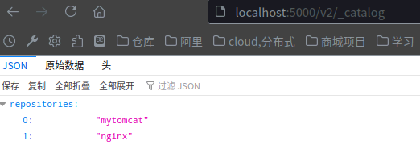

此时私有仓库里已经有了这个镜像；

#### 第三步：删除localhost:5000/nginx本地仓库镜像

dkrmi localhost:5000/nginx:1.0

#### 第四步：从私有仓库拉取localhost:5000/nginx镜像，并运行；

docker pull localhost:5000/nginx:1.0

docker run -it -p 80:80 localhost:5000/nginx:1.0

#### 第五步：浏览器运行 http://localhost:8080测试

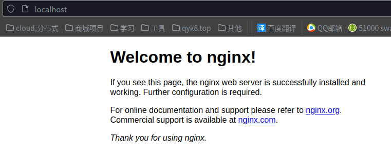

### C 搭建管理界面 harbor-2.2.x

[下载地址](https://github.com/goharbor/harbor/releases ) 			

#### 设置本地域名/etc/hosts:

192.168.101.6   dk.harbor.com
192.168.101.6   dkharbor.qyk8.top

#### 生成证书颁发机构证书 

##### ---生成 CA 证书私钥。 

```sh
openssl genrsa -out ca.key 4096
```

##### ---生成 CA 证书。 

```sh
openssl req -x509 -new -nodes -sha512 -days 3650 \
 -subj "/C=CN/ST=Beijing/L=Beijing/O=example/OU=Personal/CN=dkharbor.qyk8.top" \
 -key ca.key \
 -out ca.crt
```

#### 生成服务器证书 

##### ---生成私钥。 

```sh
openssl genrsa -out dkharbor.qyk8.top.key 4096
```

##### ---生成证书签名请求 (CSR)。  

```sh
openssl req -sha512 -new \
    -subj "/C=CN/ST=Beijing/L=Beijing/O=example/OU=Personal/CN=dkharbor.qyk8.top" \
    -key dkharbor.qyk8.top.key \
    -out dkharbor.qyk8.top.csr
```

##### ---生成 x509 v3 扩展文件。 

```sh
cat > v3.ext <<-EOF
authorityKeyIdentifier=keyid,issuer
basicConstraints=CA:FALSE
keyUsage = digitalSignature, nonRepudiation, keyEncipherment, dataEncipherment
extendedKeyUsage = serverAuth
subjectAltName = @alt_names

[alt_names]
DNS.1=dkharbor.qyk8.top
DNS.2=dkharbor.qyk8
DNS.3=k
EOF
```

##### ---使用 `v3.ext`文件为您的 Harbor 主机生成证书。 

```sh
openssl x509 -req -sha512 -days 3650 \
    -extfile v3.ext \
    -CA ca.crt -CAkey ca.key -CAcreateserial \
    -in dkharbor.qyk8.top.csr \
    -out dkharbor.qyk8.top.crt
```

#### 向 Harbor 和 Docker 提供证书 

```sh
cp dkharbor.qyk8.top.crt ./data/cert/
cp dkharbor.qyk8.top.key ./data/cert/
```

2,兑换 `yourdomain.com.crt`至 `yourdomain.com.cert`，供 Docker 使用。 

Docker 守护进程解释 `.crt`文件作为 CA 证书和 `.cert`文件作为客户端证书。 

```sh
openssl x509 -inform PEM -in dkharbor.qyk8.top.crt -out dkharbor.qyk8.top.cert
```

3,将服务器证书、密钥和 CA 文件复制到 Harbor 主机上的 Docker 证书文件夹中。  您必须先创建适当的文件夹。 

```sh
sudo cp dkharbor.qyk8.top.cert /etc/docker/certs.d/dkharbor.qyk8.top/
sudo cp dkharbor.qyk8.top.key /etc/docker/certs.d/dkharbor.qyk8.top/
sudo cp ca.crt /etc/docker/certs.d/dkharbor.qyk8.top/
```

如果您映射默认 `nginx`端口 443 到不同的端口，创建文件夹 `/etc/docker/certs.d/yourdomain.com:port`， 或者 `/etc/docker/certs.d/harbor_IP:port`. 

4,重启 Docker 引擎。 

```sh
systemctl restart docker
```

#### 启动

```bash
#区别，前者会remove掉容器、image、网络，停的更干净，后者只是停服务
sudo docker-compose down -v 或 sudo docker-compose stop  
#重启Harbor
sudo docker-compose up -d                       
```

#### HTTPS访问

某些浏览器可能会显示一条警告，指出证书颁发机检查 `/etc/docker/daemon.json`文件以确保 `-insecure-registry`未为 设置选项 [https://yourdomain.com ](https://yourdomain.com)。 

从 Docker 客户端登录 Harbor。 

```sh
docker login yourdomain.com
docker login yourdomain.com:port
```

帐号密码为 admin/Harbor12345 (https://dkharbor.qyk8.top/)

#### 上传实例:

##### -- 新建项目

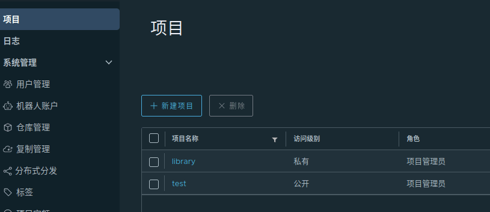

##### -- 推送

dktag b84b6fdf2183 dkharbor.qyk8.top/test/nginx:1.0.1

dkpush dkharbor.qyk8.top/test/nginx:1.0.1

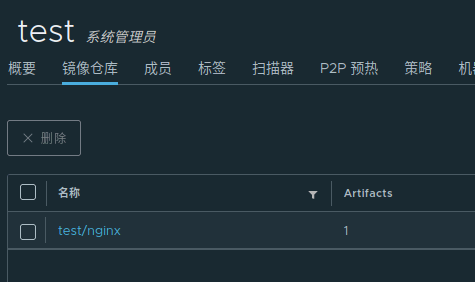

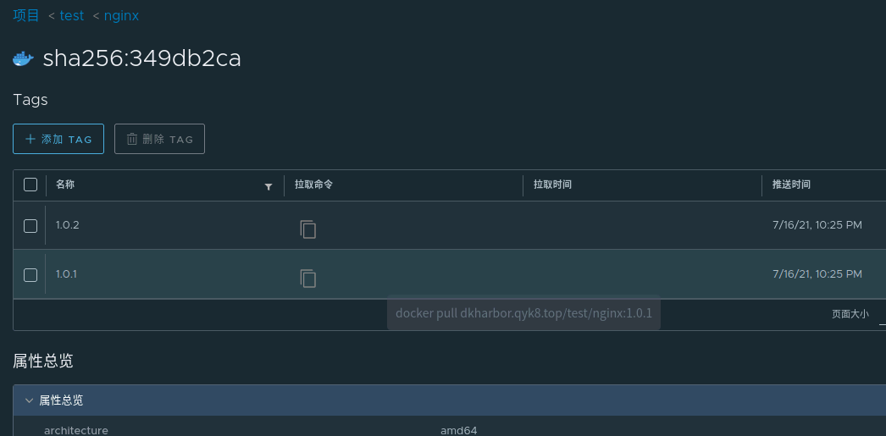


