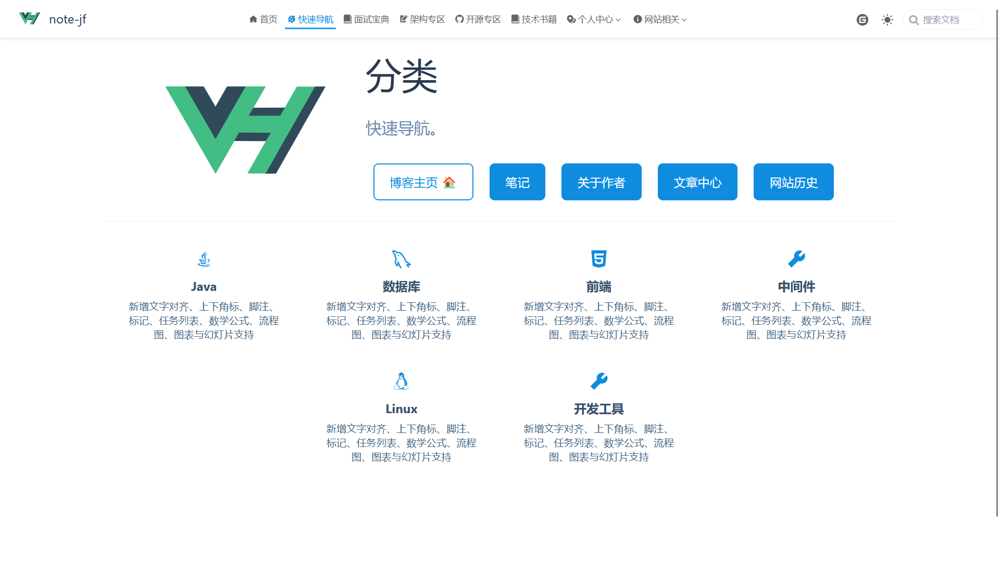
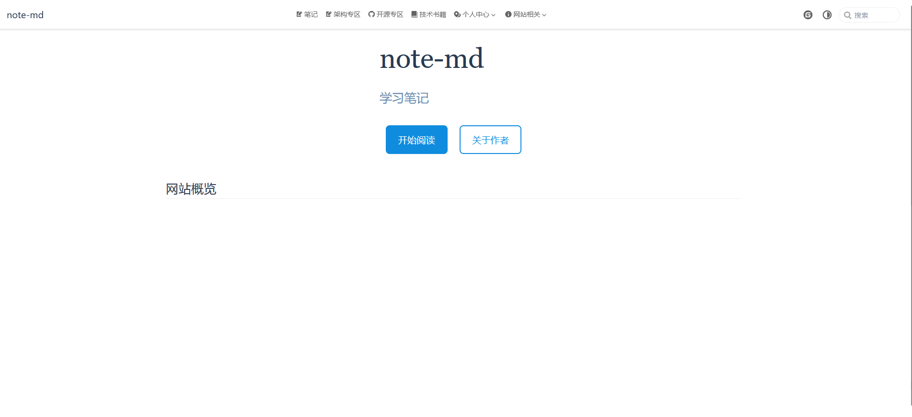

**版本发布历史**

## [2.3.0]() (2022-11-20)

- 使用搜索引擎客户端 vuepress-plugin-search-pro: `2.0.0-beta.124`
- vue: `3.2.45`
- vuepress-theme-hope: `2.0.0-beta.124`

## [2.2.6]() (2022-11-12)

- 更新主题版本

- 依赖版本为
- - vue: `3.2.44`
- - vuepress: `2.0.0-beta.53`
- - vuepress-theme-hope: `2.0.0-beta.122`

## [2.2.5]() (2022-10-30)

- dev与main部署分离，通过创建tags来自动部署稳定版本

- main 依赖版本为
- - vue: `3.2.41`
- - vuepress: `2.0.0-beta.49`
- - vuepress-theme-hope: `2.0.0-beta.91`

- dev 依赖版本暂为new

## [2.2.4]() (2022-10-28)

- 添加评论模块
- 更新vue: `3.2.41`
- 其他

## [2.2.3]() (2022-10-22)

- 使用pnpm [需要请看我](https://github.com/notejf/notejf.github.io/blob/main/.github/workflows/docs.yml)
- 更新依赖
- - vue: `3.2.40`
- - vuepress: `2.0.0-beta.49`
- - vuepress-theme-hope: `2.0.0-beta.91`

## [2.2.2]() (2022-09-3)

更新依赖

vue  `3.2.39`

## [2.2.0]() (2022-08-16)

更新版本库+简单布局

## [2.1.2]() (2022-07-21)

添加面试宝典

## [2.1.1]() (2022-07-16)

发布 2.1.1 版本

1. 更新mq内容

## [2.1.0]() (2022-07-06)

发布 2.1.0 版本 

## [2.0.0-beta.48]() (2022-07-06)

更新，处理了xxxx问题

## [2.0.0-beta.47]() (2022-07-01)

init初始化项目

