## 面向对象基础

### 核心：一切行为，让对象自己做自己的事情，其他人不能手动操作

### 前提案例：

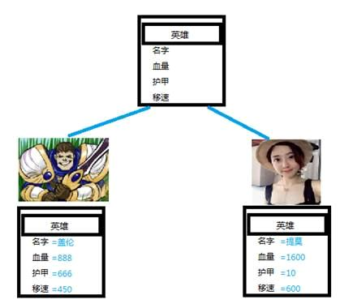

 

### 案例演示：

需求：创建一个女神泪

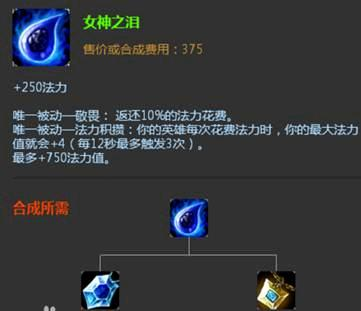

女神泪装备类：

名称

价格

效果

Left-装备

Right-装备

被动功能：f(){}

主动功能

默认功能：合成其他装备

 

### 结构图：

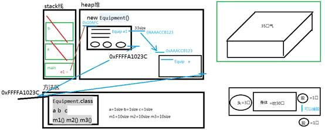

 

### 案例代码：

 ```java
 /**
 * <p>Title: Demo5.java</p>  
 * <p>Description: 
 女神泪装备类：
 名称
 价格
 效果
 Left-装备
 Right-装备
 被动功能：f(){}
 主动功能
 默认功能：合成其他装备
 * </p>  
 * <p>Copyright: Copyright (c) 2017</p>  
 * <p>Company: com.haoyu</p>  
 * @author 大师  
 * @date 2019年7月31日  
 * @version 1.0
  */
 public class Demo5 {
 	public static void main(String[] args) {
 //		a();
 		//蓝水晶装备
 		Equipment leftE=new Equipment();
 		leftE.name="蓝水晶";
 		leftE.price=10;
 		leftE.main="加法力量";
 		//仙女护符装备
 		Equipment rightE=new Equipment();
 		rightE.name="仙女护符";
 		rightE.price=10;
 		rightE.main="恢复法力";
 		//女神泪装备
 		Equipment girlEyeWater=new Equipment();
 		girlEyeWater.name="女神泪";
 		girlEyeWater.price=375;
 		girlEyeWater.main="加250法力";
 		girlEyeWater.fix(leftE, rightE);
 		//合成一个大天使
 		Equipment bigAngle=new Equipment();
 		bigAngle.name="大天使";
 		bigAngle.fix(girlEyeWater.getOut(),null);//如果没有对象，可以使用null代替
 		
 	}
 	static void a() {
 		b();
 	}
 	static void b() {
 		
 	}
 }
 //需要创建装备对象，需要装备模型
 class Equipment{
 	//模型有了，现在要搞他的组件
 //	名称
 	String name;
 //	价格
 	int price;
 //	效果
 	String main;
 //	Left-装备，理论上应该有这个类型的其他装备，实际上现在没有任何东西
 	//类属性  类组件  类成员变量
 	Equipment leftEquip;//
 //	Right-装备
 	Equipment rightEquip;
 	//主动
 	void f1() {
 		System.out.println("主动功能");
 	}
 	//被动
 	void  f2() {
 		System.out.println("被动功能");
 	}
 	//自己与其他装备融合
 	void fix(Equipment leftEquip,Equipment rightEquip) {
 		//代码有一个就近原则，谁离这个变量近，这个变量就是谁
 		//为了让成员变量，组件，起作用，使用this关键字
 		this.leftEquip=leftEquip;
 		this.rightEquip=rightEquip;
 	}
 	//把自己提供给其他装备,供其融合
 	Equipment getOut() {
 		return this;//this=0X10AFC=new Equipment()=(girlEyeWater=new Equipment())
 	}
 }
 
 ```

### 1、类和对象

类：class  对象模型，模板

对象：new出来的  具体的东西

### 2、对象属性

属性：这里主要强调模板属性，能够提供特别信息和功能的组件

#### 属性的类型

String：字符串—用来存储一串文字

Int：用来存储整数

Float：用来存储小数（浮点数）

#### 属性名称

自定义——驼峰命名格式，首字母小写

### 3、对象方法

方法：函数，特殊功能，执行内容—method-function—js

特点：

返回值—— 一个方法执行之后要返回信息，将信息存进变量中，提供这个有值的变量，供其他地方使用

方法名称——驼峰命名，首字母小写

方法参数——自定义传不传参数，传多少个，传的类型，传递的对象的顺序

 

### 模拟语境训练:

游戏：组件—价格，房间号 ，被开被关  方法— 我嘿你 你嘿我 

游客：组件—体重  方法—开， 关门 跑 嘿嘿，被嘿

教练：组件—衣服  方法—tip，run，被嘿 ，嘿嘿

阐述需求：

游客给钱，选择 门，开门，关门，教练tip，run，嘿嘿，游客被嘿

 ```java
 package com.haoyu;
 
 public class Demo6 {
 	public static void main(String[] args) {
 		Game game=new Game();
 		game.run(1500);
 	}
 }
 //顾客
 class Customer{
 	//体重
 	int weight=1000;
 	//名字
 	String name="游客";
 	//方法
 	//开门
 	void openDoor(Room room) {
 		System.out.println("游客开门");
 		room.openDoor();
 	}
 	//关门
 	void closeDoor(Room room) {
 		System.out.println("游客关门");
 		room.closeDoor();
 	}
 	//跑
 	void run(Game game) {
 		System.out.println("游客运动之前的体重"+this.weight);
 		System.out.println("游客跑起来");
 		//if 如果
 		if(game.price==500) {
 			this.weight-=5;//this.weight=this.weight-5;
 		}else if(game.price==1000) {
 			this.weight-=10;
 		}else {
 			this.weight-=20;
 		}
 	}
 	//主动技能
 	void function1(Waiter waiter) {
 		System.out.println(this.name+" 我嘿你："+waiter.name);
 		System.out.println("游客体重为："+this.weight);
 	}
 	//被动技能
 	void function2(Waiter waiter) {
 		System.out.println("你嘿我：");
 		waiter.function1(this);
 	}
 }
 //服务员
 class Waiter{
 	//cloth衣服Status 状态  boolean =true false
 	boolean clothStatus=true;
 	String name="服务员";
 	//tip
 	void tip(Game game) {
 		if(game.price==1500) {
 			System.out.println("如果我追到你，我就把你嘿嘿嘿！！！");
 		}else {
 			System.out.println("你追我，嘿嘿嘿！！！");
 		}
 	}
 	void run() {
 		System.out.println("waiter--run");
 	}
 	//主动技能
 	void function1(Customer customer) {
 		System.out.println(this.name+" 我嘿你："+customer.name);
 		System.out.println("游客体重为："+customer.weight);
 	}
 	//被动技能
 	void function2(Customer cutomer) {
 		System.out.println("你嘿我：");
 		cutomer.function1(this);
 	}
 }
 //游戏
 class Game{
 	//价格 500-5  1000-10  1500-20
 	int price=500;//默认是0
 	//房间
 	Room room=new Room();
 	//游客
 	Customer c1;
 	//服务员
 	Waiter w1;
 	//一切让游戏自动地运转起来
 	void run(int price) {
 		this.price=price;
 		before();
 		start();
 		after();
 	}
 	//加上private之后，你看都看不到，屌不屌？
 	//游戏的开始
 	private void before() {
 		//先准备好游客和服务员
 		c1=new Customer();
 		w1=new Waiter();
 		c1.openDoor(this.room);
 	}
 	//游戏过程
 	private void start() {
 		c1.run(this);//this--game  new game
 		w1.run();
 		//游戏过程应该调用游戏方法本身
 		if(this.price==1500) {
 			wHeiC(w1,c1);
 		}else {
 			cHeiW(w1,c1);
 		}
 	}
 	//游戏的结束
 	private void after() {
 		c1.closeDoor(this.room);
 	}
 	//两种游戏方法
 	//w嘿c
 	void wHeiC(Waiter waiter,Customer customer) {
 		//游戏方法真正起作用的是玩家和服务员
 		waiter.function1(customer);//w hei c
 	}
 	//c嘿w
 	void cHeiW(Waiter waiter,Customer customer) {
 		customer.function1(waiter);
 	}
 }
 //房间
 class Room{
 	//房间号
 	String rnum;
 	//房间开门状态  true 开启门  false  关闭门
 	boolean doorStatus=false;
 	//被开门
 	void openDoor() {
 		System.out.println("门自己开了");
 		this.doorStatus=true;
 	}
 	//关门
 	void closeDoor() {
 		System.out.println("门自己关闭");
 		this.doorStatus=false;
 	}
 }
 
 ```


## 变量

看效果

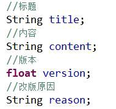

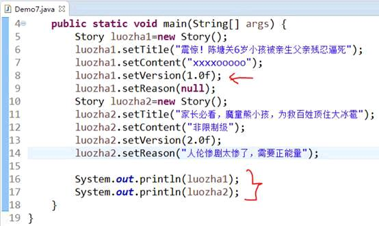


### 什么是变量

变量的定义：用来命名一个数据的标识符

1949年，这个1949代表的是一个年份

如果要给这个1949取名字，year=1949，int year=1949；

加法运算：1+2=3；

Int a=1；

Int b=2；

Int c=a+b;

C=3

#### 变量的分类

局部变量：在方法中的变量


全局变量-成员变量

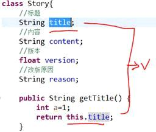

 
 

#### 变量的修饰类型

- 类类型

自定义以及系统自带的类(例如：java.lang.String)

- 基本数据类型

> Byte short char int float double long boolean
>
> 整型（byte，short，int，long），字符型（char），浮点型（float，double），布尔型（boolean）


### 基本变量类型

#### 探讨整型（byte，short，int，long）滴取值范围

##### 原码，补码，反码

计算机所有的运算都是补码层面进行运算，原码层面进行呈现

正数：原码，反码，补码组成内容一样

负数：原码，反码：原码符号位不变，其他位取反，补码+1

案例：

十进制+1

> 原码：0-0000001
>
> 反码：0-0000001
>
> 补码：0-0000001

十进制-1

> 原码：1-0000001
>
> 反码：1-1111110
>
> 补码：1-1111111

特别的值：

> 0-0000000:0
>
> 1-0000000：-128---》规定这个就是-128
>
> 最大值：127:0-1111111

Byte：-128~127


注意事项：如果给变量的值草出了变量类型的取值范围，就会出点问题

例如：

编译都无法通过，所以写的时候要注意类型的取值范围

思考题：

```java
		int a=130;
		byte b=(byte)130;
		System.out.println(b);//-126
		/*
		 计算机中的一切运算都是补码运算
		 int a=130;
		 a：32位二进制 0-0000000000000000000000000000000
		 			0-0000000000000000000000010000010	
		 b:8位二进制10000010--补码
		 		  1-0000010
		 		  1-0000001--反码
		 		  1-1111110--原码    -126
		 */

```


##### 注意1：

基本数据类型的相互转型，要注意他们滴取值范围，范围类操作没有问题，范围外操作，出大问题，尽量禁止范围外类型互相转换

##### 注意2：

有一个基础前提：如果出现了一个整型数字，这个数字就是int类型

默认的向下转型案例

​     **byte** a=1;//int 1   (byte)1 基本数据类型自动向下转型     //等价于(byte)          **float** a2=(**float**)3.3;//3.3 double      **float** a3=3.3f;  

##### 注意3：

一个常量是不可以被改变的

例如：

12

‘A’

true

#### 字符型

Char类型用于存放一个字符，使用单引号表示（双引号表示的是字符串）

其长度和short一样是16位：二进制位 1010101010101010

单引号之内只能存放一个字符，超过就会报错

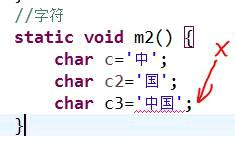


#### 浮点型

Float：32位

Double：64位

注意：默认的小数值就是double类型

Float f=54.321会产生编译错误，

在后面加f，解决编译问题


#### 布尔类型

Boolean a=true;//1

Boolean b=false;//0

 

作业：

请大家分别为下面的数据查找合适的类型

3.14

2.567473

365

 ‘吃’

False

“不可描述”

答案：

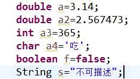

 

### 字面量=字面值

Hero h=new Hero();

Int a=1;

解释：创建一个英雄对象会用到new关键字，但是给一个基本数据类型变量赋值是不需要new关键字滴，基本类型的变量在java中是一种特别的内置数据类型，并非某个对象

定义：给基本类型变量赋值的方式就叫做字面量或者字面值

Float hp=120;

Int armor=10;

#### 整数字面值

```java
		long val=26L;//以L结尾代表long型
		int decVal=26;//默认常数就是int
		int hexVal=0x32;//16进制--十进制50
		int oxVal=032;//8进制--十进制26
		int binVal=0b1101011;//二进制写法--十进制107
		System.out.println(binVal);
```

当以L或者l结尾的时候，一个整型的字面量是long类型，否则就是int类型。建议用L而非小写的l，容易和1混淆。

Byte，short,int,long 的字面量都可以通过int类型的字面量来创建，整数字面量可以用四种类型来表示：

二进制

八进制

十进制

十六进制

#### 浮点类型字面量

```java
		float f1=1234.1F;//以F结尾的字面量表示浮点型
		double d1=123.3;
		double d2=1.2e2;//科学计数法  1.2e2--120--en  10^n
		System.out.println(d2);

```

浮点类型尽量用F

浮点类型可以用科学计数法 e2表示10的2次方


#### 字符和字符串字面量

```java
		String name="啦抓";
		char a='拿';
		//以下是转义字符
		char tab='\t';
		char enter='\r';//回车
		char newline='\n';//换行
		char doubleq='\"';//双引号
		char singleq='\'';//字符类型单引号
		char backslash='\\';
		System.out.println(backslash);
```

\ 表示转义，将特殊的带有格式效果的格式符号转换成字符效果的符号

 作业：

给出变量类型。赋予合法的字面量

Byte b;

Short s;

Int I;

Long L;

Float f;

Double d;

Char c;

String str;

 

### 命名规则

变量名称只能用  字母，数字，$ _

变量名第一个字母不能使用数字

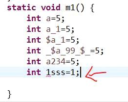编译会出问题

使用完整英文单词名称，而非缩写

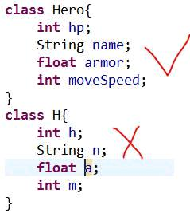

不能使用关键字


凡是系统自带的具有特殊意义的关键字，通通不能作为变量名称

关键字的列表

| 说明       | 类型                                               |
| ---------- | -------------------------------------------------- |
| 异常       | try catch finally throws throw                     |
| 对象相关   | new extends implements class instanceof this super |
| 字面值常量 | 1 2 3… false true null                             |
| 方法       | void return                                        |
| 包相关     | package import                                     |
| 保留字     | goto const                                         |

其他关键字

八种基本数据类型不可以

| 说明       | 类型                                                         |
| ---------- | ------------------------------------------------------------ |
| 循环       | for do while break continue                                  |
| 分支关键字 | if else else if switch case default                          |
| 方法       | private public protected final static abstract synchronized transist volatile strictfp |

中文词组也可以当做变量名只是不常用，建议，不要用

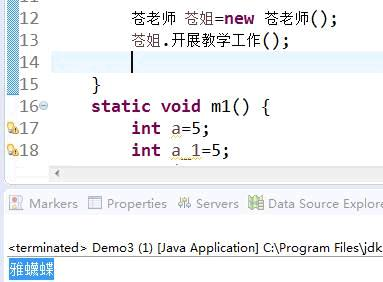

 

### 作用域

#### 字段，属性，field—（成员变量—类—模板的组件）

只要是成员变量就可以被整个作用域给访问到

作用域：一对大括号

#### 参数

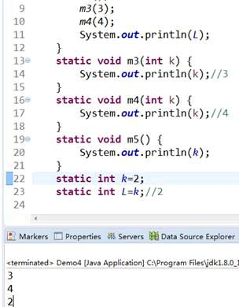

如果一个变量，是声明在一个方法上，就叫做参数

参数的作用域是该方法内所有的代码——{}包含的

其他方法和类中的其他位置，都是不可以访问这个参数的

#### 局部变量

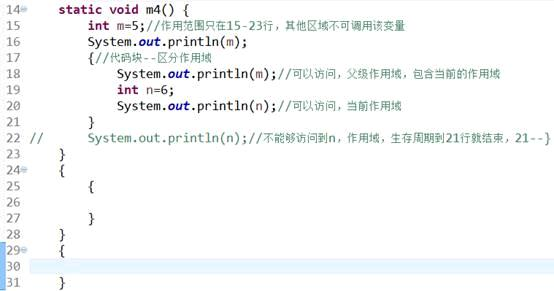

定义在方法内的变量就叫做局部变量

作用域就是包含他的那对大括号{}

#### 作业

取什么值？

 ```java
 Public class HelloWorld{
 	Int i=1;
 	Public void method1(int i){
 		System.out.println(i);
 }
 Public static void main(String[] args){
 	New HelloWorld().method1(5)；//匿名类表达方式
 	//?打印出来是多少
 }
 }
 
 ```


### Final

#### 声明时候赋值


Final代表最终状态，不可以被修改

#### 在声明的时候没有赋值


如果在声明的时候没有赋值，可以在后面的代码中国赋值唯一一次——final修饰的

#### Final可以修饰类也可以修饰方法

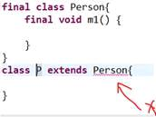

 

Final修饰的类与方法，均不可以被继承与修改

#### 参数中也可以使用final


### 表达式

以分号结尾的代码就是一个表达式


单一的； 分号，就是一个完整的表达式

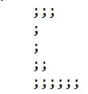

### 代码块

{ }

可以在一个类中的任意位置，任意嵌套，任意并排排列

### 变量的初始化TODO


## 操作符

\+ - % / = > < >> << >>> ~ ^ ++ -- += -= == *= /= -= !=

### 算术操作符

\+ - * / % ++ --

a++，先做（）中a的呈现，再在括号外做自增1 ++a 

++a,先自增1，然后再做呈现（参与运算）

同理--

 ```java
 int a=1+2;
 		int b=a+1;// - * /
 		
 		int c=a%2;//取余数  取模
 		System.out.println(c);//1   [3 / 2=1---]<=>3%2--(1)=c
 		
 		//a=3
 		//++ -- 前后区别即可
 		//如果没有参与表达过程，++ -- 在前在后都完全等于 a=a+1  b=b-1
 //		++a;//4
 //		System.out.println(++a);//  5
 //		System.out.println(++a);//  6----++a  等于 每次自增1
 		System.out.println("--------------------------");
 		System.out.println(a);//3
 		//System.out.println(a++);//3  (a)-a++
 		//a++ 呈现为原来没有增加的值  当前表达式完成后值发生了变化
 		//(a)之后，分号；之前  --?对的，因为如果正确(1+a++)--(1+a)-a++
 		
 		//所以推到出来a++，先做（）中a的呈现，再在括号外做自增1 ++a
 		System.out.println(1+a++);
 		System.out.println(a);//4
 		
 		System.out.println(a++);
 		System.out.println(a);
 //		System.out.println(a++);//4  5  6
 
 ```


### 关系操作符

 

关系操作符生成的是一个Boolean结果

关系操作符包括(<、>、<=、>=、==、!=)

```java
		//<、>、<=、>=、==、!=
		System.out.println(1<2);
		System.out.println(1>2);
		System.out.println(1!=2);
		System.out.println(1==2);
		System.out.println(1<=2);
		System.out.println(1>=2);
//		true
//		false
//		true
//		false
//		true
//		false

```

### 逻辑操作符

&&（短路与）、&（与）、||（短路或）、|（非短路或）

 ```java
 		//推荐用&&  ||
 		//false && error   逻辑与  如果左面正确，再判断右面是否正确，如果左面false，不需要再判断右面的boolean值
 		if ((23 > 24) && (100 / 0 == 0)) {
 											
 		}if ((23 > 24) & (100 / 0 == 0)) {//如果左面false，依然要判断右面boolean值
 		
 		}if ((23 < 24) || (100 / 0 == 0)) {//如果左面是true，不需要再判断右面
 		
 		}if ((23 > 24) | (100 / 0 == 0)) {// | or  如果左面true，依然要看右面的Boolean值 
 		
 		}
 
 ```

### 位移操作符

在二进制层面，对二进制位进行移动和取舍操作，强调，所有的位移操作都是补码层面上进行的

  ```java
  
  	// System.out.println(-4>>2);
  	// System.out.println(-5<<3);
  	static void m1() {
  		System.out.println(2 >> 3);
  		/*
  		 * 00000000000000000000000000000010 00000000000000000000000000000000010
  		 * 00000000000000000000000000000000=0
  		 */
  		System.out.println(2 >>> 3);
  		/*
  		 * 00000000000000000000000000000010 00000000000000000000000000000000010
  		 * 00000000000000000000000000000000=0
  		 */
  		System.out.println(13 << 3);
  		/*
  		 * 00000000000000000000000000001101 00000000000000000000000001101000=104
  		 */
  		System.out.println(-4 >> 2);
  		/*
  		 * 10000000000000000000000000000100 11111111111111111111111111111011
  		 * 11111111111111111111111111111100 11111111111111111111111111111111=补码
  		 * 11111111111111111111111111111110=反码 10000000000000000000000000000001=-1=原码
  		 */
  		System.out.println(-5 << 3);
  		/*
  		 * 10000000000000000000000000000101=原码 11111111111111111111111111111010=反码
  		 * 11111111111111111111111111111011=补码 11111111111111111111111111011000=补码
  		 * 11111111111111111111111111010111=反码 10000000000000000000000000101000=-40=原码
  		 */
  		System.out.println(~2);
  		/*
  		 * 00000000000000000000000000000010 11111111111111111111111111111101
  		 * 11111111111111111111111111111100 10000000000000000000000000000011=-3
  		 */
  		System.out.println(3 ^ 8);
  		/*
  		 * 00000000000000000000000000000011 00000000000000000000000000001000
  		 * 00000000000000000000000000001011=11
  		 */
  	}
  }
  /*
   * <<表示左移，不分正负数，低位补0；
   * 
   * 注：以下数据类型默认为byte-8位
   * 
   * 左移时不管正负，低位补0
   * 
   * 正数：r = 20 << 2
   * 
   * 20的二进制补码：0001 0100
   * 
   * 向左移动两位后：0101 0000
   * 
   * 结果：r = 80
   * 
   * 负数：r = -20 << 2
   * 
   * -20 的二进制原码 ：1001 0100
   * 
   * -20 的二进制反码 ：1110 1011
   * 
   * -20 的二进制补码 ：1110 1100
   * 
   * 左移两位后的补码：1011 0000
   * 
   * 反码：1010 1111
   * 
   * 原码：1101 0000
   * 
   * 结果：r = -80
   * 
   * >>表示右移，如果该数为正，则高位补0，若为负数，则高位补1；
   * 
   * 注：以下数据类型默认为byte-8位
   * 
   * 正数：r = 20 >> 2
   * 
   * 20的二进制补码：0001 0100
   * 
   * 向右移动两位后：0000 0101
   * 
   * 结果：r = 5
   * 
   * 负数：r = -20 >> 2
   * 
   * -20 的二进制原码 ：1001 0100
   * 
   * -20 的二进制反码 ：1110 1011
   * 
   * -20 的二进制补码 ：1110 1100
   * 
   * 右移两位后的补码：1111 1011
   * 
   * 反码：1111 1010
   * 
   * 原码：1000 0101
   * 
   * 结果：r = -5
   * 
   * >>>表示无符号右移，也叫逻辑右移，即若该数为正，则高位补0，而若该数为负数，则右移后高位同样补0
   * 
   * 正数： r = 20 >>> 2
   * 
   * 的结果与 r = 20 >> 2 相同；
   * 
   * 负数： r = -20 >>> 2
   * 
   * 注：以下数据类型默认为int 32位
   * 
   * -20:源码：10000000 00000000 00000000 00010100
   * 
   * 反码：11111111 11111111 11111111 11101011
   * 
   * 补码：11111111 11111111 11111111 11101100
   * 
   * 右移：00111111 11111111 11111111 11111011
   * 
   * 结果：r = 1073741819
   */
  
  ```


### 赋值操作

= ！= 》= 《=》 ==

### 三元操作符：三目运算

 ```java
 		System.out.println(1>2?true:false);
 		System.out.println(1>2?false:true);
 		System.out.println(1>2?"难受":"舒服");
 		int a=1;
 		//三目运算中的每一个表达式都可以进行无限的三目运算下去
 		System.out.println( (true&&false)||(a<=2&&true!=false)?1>2?"a":"b":true );//b
 
 ```


## 控制流程（选择语句+循环）

1， if语句

2， switch

3， while，do while

4， for，增强for循环（foreach）

5， continue，break

 

### if语句

 ```java
 	boolean flag=true;
 		//最简单表达式
 		if(flag) {
 			System.out.println("ojbk");
 		}
 		//简单表达式
 		if(1>2||2>1) {
 			System.out.println("ojbk2");
 		}
 		//复杂表达式
 		int a=1;
 		if(a+1>2?true:true) {
 			System.out.println("ojbk3");
 		}
 
 ```


#### If语句的坑

 ```java
 		boolean b=false;
 		if(b);//这个分号是个坑，；代表表达式结束
 		System.out.println("yes");
 
 ```


#### If else 

 ```java
 		int score=80;
 		if(score>90) {//如果
 			System.out.println("A");
 		}else {//其他
 			System.out.println("B");
 		}
 
 ```


#### else if

 ```java
 		int score=80;
 		
 		if(score>90) {//如果
 			System.out.println("A");
 		}else if(score>80&&score<=90){//其他
 			System.out.println("B");
 		}else if(score>70&&score<=80) {
 			System.out.println("C");
 		}else {
 			System.out.println("D");
 		}
 
 ```

注意：如果满足多个条件，第一个执行后就结束判断

 ```java
 		int score=99;
 		if(score>80) {//如果
 			System.out.println("B");
 		}else if(score>90){//其他
 			System.out.println("A");
 		}
 		//B
 
 ```


### Switch

 ```java
 		char level = 'C';// A B C
 		switch (level) {
 		//case 小案子  接收的内容
 		case 'A':
 			System.out.println("90-100");
 			break;
 		case 'B':
 			System.out.println("80-90");
 			break;
 		default://等同于 if else中的else
 			System.out.println("80以下");
 			break;
 		}
 
 ```

 ```java
 //byte short int char String jdk1.7之后，可以传String  enum 枚举类
 		/* 枚举类的样子
 		Color 黑色=Color.黑色;
 		//color-颜色
 		enum Color{  枚举类
 			黄色,白色,黑色;
 		}
 		*/
 ```


Switch是if else if else if else的一种变形，格式更加简洁，操作更加方便，但是不能适应复杂表达式，只能简单判断单一的值

### 选择语句练习题：

 ```java
 	//需求：排位选英雄    王者荣耀
 	//5V5  
 	//每一方一个上单，中单，打野，adc，辅助
 	//现在大家水平砖石守门员，我选了你就别想选
 	//108个梁山好汉
 	//一盘对局
 	//水晶被推失败
 	
 	//主题：人工智能打王者荣耀
 	//1，选英雄阶段
 	//对108个英雄随机分配默认位置
 	//确定选择英雄了之后，控制台打印出这个英雄的属性，能力，默认位置，第几楼
 	//可以跟队友交换英雄，可以嘲讽队友
 	//2，对局阶段
 	//每个位置敌我双方英雄随机pk，随机死亡，当一方死亡总次数比另一方多30个头，判定数据小的一方为败方
 
 ```


## 循环

1+2+3+…+100=?

 ```java
 	static void m2() {
 		//和
 		int sum=0;
 		//i<101
 		//i<=100
 		//int i=0
 		//i<101
 		//sum+=i;
 		//i++
 		for(int i=0;i<101;i++) {
 			
 			sum+=i;
 		
 		}
 		System.out.println(sum);
 	}
 
 ```


打印一个九九乘法表

1*1=1

1*2=2  2*2=4

1*3=3  2*3=6 3*3=9

解决思路

 ```java
 	//从最简单的入手，一次改或者加一个需求，最终达到完善
 	/*
 	  1，找到分析的关键对象，2*3=6以及整个关键对象所代表的大范围1*3=3 2*3=6 3*3=9
 	  注释：2*3=6视为关键，原因：3个数都是不同的数，便于观察左右变化，发现，值都是左面两个变量的乘积，不用考虑
 	  要考虑的是左面两个变量，由于左面的第二个变量值不变，所有只观察左面第一个变量，既然是1 2 3 所以搞一个for循环，i从1-3
 	  for(int i=1;i<=3;i++){
 	  	System.out.println(i+"*" +j+"="+i*j+" ");
 	  }
 	  结果是：1*3=3
 	       2*3=6
 	       3*3=9
 	 2，解决上面的一个问题：不要换行如何做？由于现在我还不会不换行的写法，百度查一下换行，java--得出 print就是不换行
 	  for(int i=1;i<=3;i++){
 	  	System.out.print(i+"*" +j+"="+i*j);
 	  }
 	  1*3=32*3=63*3=9
 	 3，解决上面的一个问题：所有的内容挤成了一堆，表达式与表达式之间应该有一个间隔
 	 解决方案：制表符'\t'但是，我忘记了怎么写，两种思路解决，第一种百度搜一下制表符，第二种先用空格简单替代一下
 	  for(int i=1;i<=3;i++){
 	  	System.out.print(i+"*" +j+"="+i*j+" ");
 	  }
 	 4，解决上面的一个问题：我需要打印出三行，例如：
 		1*1=1 
 		1*2=2 2*2=4 
 		1*3=3 2*3=6 3*3=9 
 		我先打印三行相同的内容再说
 		for(int k=1;k<=3;k++){
 		for(int i=1;i<=3;i++){
 	  		System.out.print(i+"*" +j+"="+i*j+" ");
 	  	}
 	  		System.out.println();
 	  	}打印如下
 	  	1*3=3 2*3=6 3*3=9
 	  	1*3=3 2*3=6 3*3=9
 	  	1*3=3 2*3=6 3*3=9
 	 5，解决上面一个问题：我需要有层次性地打印33乘法表，思路就是，那个j值必须有变化，j值的变化应该是从1*3（从上到下的从1*3）
 	 例如：
 	 	1*1=1 
 		1*2=2 2*2=4 
 		1*3=3 2*3=6 3*3=9 的每个式子的右面那个变量值是从上到下从1-3
 		解决思路就是把j放进一个for循环，从1-3
 		所有最终办法是把k值变成j值，从1-3
 		//i+"*" +j=i*j
 		for(int j=1;j<=3;j++) {
 			for(int i=1;i<=j;i++) {
 				System.out.print(i+"*" +j+"="+i*j+" ");
 			}
 			System.out.println();
 		}
 		即成功打印出33乘法表
 	6，解决上面一个问题：由于要打印的是九九乘法表，所以把j值的最值3改成9
 		//i+"*" +j=i*j
 		for(int j=1;j<=9;j++) {
 			for(int i=1;i<=j;i++) {
 				System.out.print(i+"*" +j+"="+i*j+" ");
 			}
 			System.out.println();
 		}	
 	 得到正解
 	 */
 	static void m3() {
 		//i+"*" +j=i*j
 		for(int j=1;j<=9;j++) {
 			for(int i=1;i<=j;i++) {
 				System.out.print(i+"*" +j+"="+i*j+" ");
 			}
 			System.out.println();
 		}
 	}
 
 ```


作业：

请输入一个任意数字，打印一个对应上行数的完整菱形

例如：

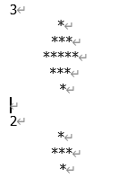

即，上面三角形的行数，下面三角形的行数是上面的行数减去一行的菱形表达形式

