# 基于VUE3.0+vite+ts

# 设计预览<a name="设计预览"></a>

## 首页

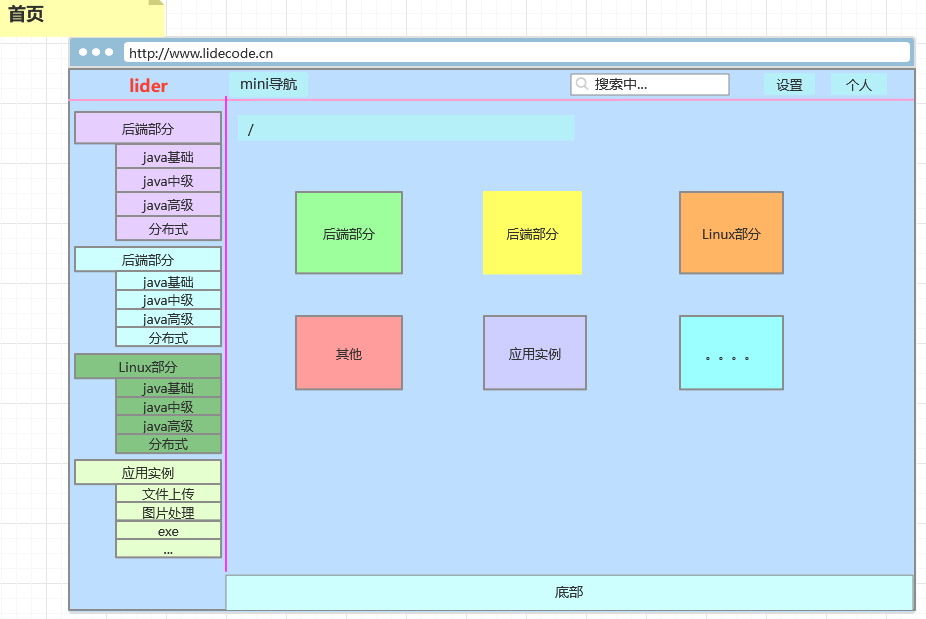

## 后端部分：java基础

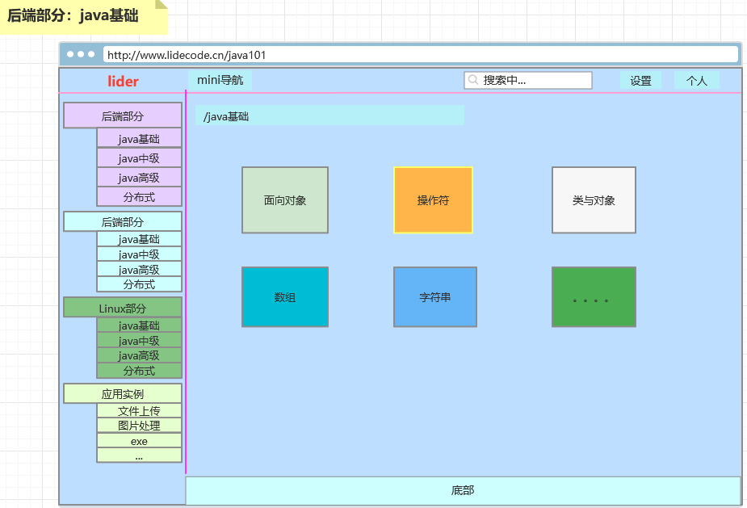

## 后端部分：java基础：面向对象（内容阅读）

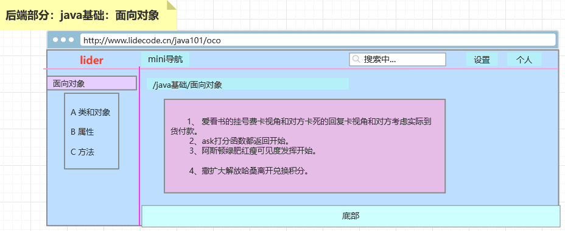

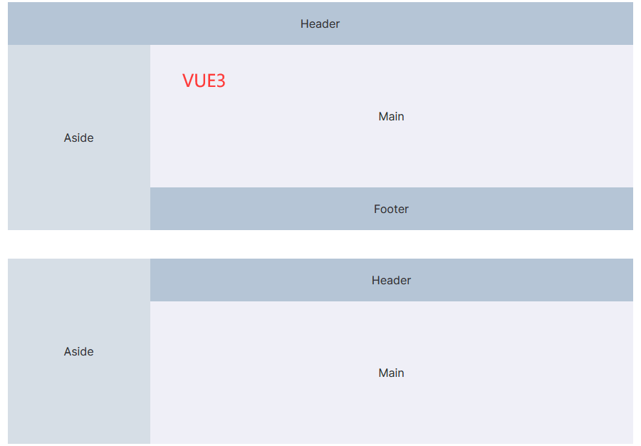

# 各个模块内容

Java基础：入门开始、面向对象、变量、操作符、控制流程、数组、类和对象、接口与继承、数字与字符串、日期

Java中级：异常、IO、集合、泛型、Lambda、多线程、JDBC、图形界面、网络编程

Java高级：反射、注解

Java框架：Hibernate、Struts2 、Hibernate+Struts2、Spring、Spring+Hibernate、Spring+Struts2、SSH、Spring MVC、mybatis、mybatis-plus、SSM、Spring Boot

Java工具&中间件：Maven、Tomcat、Servlet、HTTP、JSP、Thymeleaf、git、Redis、Nginx、WebSocket、微信登录、QQ登录、微博登录、搜索引擎、二维码QRCode、Shiro、Docker、定时器Quartz、日志Log4j、测试Junit、压力测试

分布式：

docker 容器：

k8s：

MQ：robiitMQ、roketMQ、

数据库：mysql、oracle、mycat

# 一、vue 配置

## router 分配列表

|                   |             |
| :---------------: | :---------- |
|   java 基础列表   | /java101    |
|   java 中级列表   | /java201    |
|   java 高级列表   | /java301    |
|   java 框架列表   | /java401    |
| java 工具和中间件 | /java501    |
|      分布式       | /cloud      |
|    docker 容器    | /docker     |
|     k8s 集群      | /k8s        |
|    mq 消息队列    | /mq         |
|      数据库       | /db         |
|       html        | /html       |
|        css        | /css        |
|        js         | /js         |
|       vue2        | /vue2       |
|       vue3        | /vue3       |
|       React       | /react      |
|      Element      | /element    |
|      Vuetify      | /vuetify    |
|     bootstrap     | /bootstrap  |
|       Ajax        | /ajax       |
|      JQuery       | /JQuery     |
|      webpack      | /webpack    |
|     linux列表     | /linuxlist  |
|     shell脚本     | /linuxshell |
|   app列表&工具    | /applist    |
|                   |             |


# 二、组件开发


## 1、通过 vuex 保存设置的主题，主题持久化 vue-persist

### 方式一

#### 按钮

```vue
<template>
 <!-- 开关切换主题 -->
    <el-link :underline="false" class="tag" type="success">
      <i-moon v-if="themeLight" @click="upTheme({pending_type : 'light'})" theme="filled" size="26" fill="#cccccc"
              :strokeWidth="1"/>
      <i-sun v-if="themeDark" @click="upTheme({pending_type : 'dark'})" theme="filled" size="26" fill="#070707"/>
    </el-link>
</template>
<script lang="ts" setup>
import {reactive, ref, watch} from "vue";
import {useStore} from 'vuex'
import {msgAuto, msgNotification} from "@/util/message";
import {LStorage} from "@/plugins/storage";

const state = reactive({
  themelight: false,
  themedark: true,
})
const themeLight = toRef(state, "themelight")
const themeDark = toRef(state, "themedark")

const upTheme = ({pending_type}: { pending_type: string }) => {
  let this_theme = store.state.theme
  if (pending_type !== this_theme) {
    // store.commit('upStyleTheme', type)
    store.dispatch('upTheme', pending_type)
    if (pending_type === 'light') {
      themeLight.value = false
      themeDark.value = true
    } else {
      themeLight.value = true
      themeDark.value = false
    }
  }
}
</script>
```

#### vuex

```js
//store/index.js
import {createStore} from 'vuex'
// @ts-ignore
import VuexPersist from 'vuex-persist';
import {LStorage} from "@/plugins/storage";
// 创建对象，借助浏览器缓存，存入localStorage
const vuexLocal = new VuexPersist({
    storage: LStorage.storage  // 可选，storage: SStorage.storage
})

export default createStore({
    state: {
        theme: 'light',//当前主题
    },
    //store.getters.getMsg
    getters: {
        getTheme(state) {
            return state.theme
        }
    },
    //修改数据：在组件中通过commit调用即可。
    mutations: {
        upStyleTheme(state, type) {
            state.theme = type
            const themeStyle = document.getElementById('themeStyle')
            // @ts-ignore
            themeStyle.href = type === 'light' ? '/src/styles/theme-light.scss' : '/src/styles/theme-dark.scss'
            const markdownStyle = document.getElementById('markdownStyle')
            // @ts-ignore
            markdownStyle.href = type === 'light' ? '/src/styles/github-markdown-light.scss' : '/src/styles/github-markdown-dark.scss'
            const hljscodeStyle = document.getElementById('hljscodeStyle')
            // @ts-ignore
            hljscodeStyle.href = type === 'light' ? '/src/styles/hljs-code-light.scss' : '/src/styles/hljs-code-dark.scss'
        },
    },
    //异步： 在组件store.dispatch('fetchMsg')
    actions: {
        upTheme(state, type) {
            state.commit('upStyleTheme', type)
        }
    },
    modules: {},
    plugins: [vuexLocal.plugin]
})
```

#### main.ts

```tsx
const mainStyle: string = store.state.theme

// 动态插入主体样式表
const head = document.getElementsByTagName('HEAD').item(0)
var themeStyle = document.createElement('link')
themeStyle.id = 'themeStyle'
themeStyle.href = mainStyle === 'light' ? '/src/styles/theme-light.scss' : '/src/styles/theme-dark.scss'
themeStyle.rel = 'stylesheet'
themeStyle.type = 'text/css'
// @ts-ignore
head.appendChild(themeStyle)
var markdownStyle = document.createElement('link')
markdownStyle.id = 'markdownStyle'
markdownStyle.href = mainStyle === 'light' ? '/src/styles/github-markdown-light.scss' : '/src/styles/github-markdown-dark.scss'
markdownStyle.rel = 'stylesheet'
markdownStyle.type = 'text/css'
// @ts-ignore
head.appendChild(markdownStyle)
var hljscodeStyle = document.createElement('link')
hljscodeStyle.id = 'hljscodeStyle'
hljscodeStyle.href = mainStyle === 'light' ? '/src/styles/hljs-code-light.scss' : '/src/styles/hljs-code-dark.scss'
hljscodeStyle.rel = 'stylesheet'
hljscodeStyle.type = 'text/css'
// @ts-ignore
head.appendChild(hljscodeStyle)
```

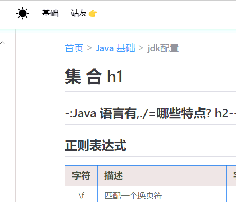

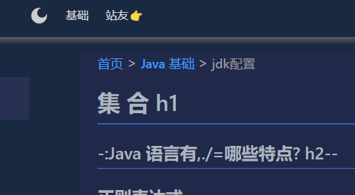

#### 存在问题

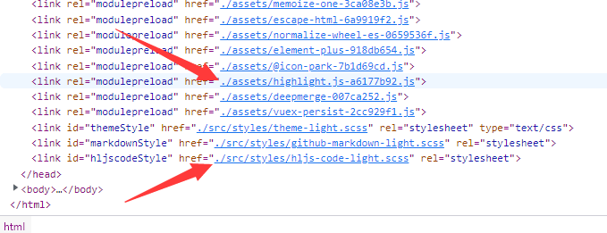

这个html效果是打包后的index.html文件，这个主题样式导入是不行的。


### 方式二（推荐）

#### index.html

```html
<!DOCTYPE html>
<html data-theme="light" lang="zh-CN">
<head>
    <meta charset="UTF-8"/>
    <link href="/favicon.ico" rel="icon"/>
    <meta content="width=device-width, initial-scale=1.0" name="viewport"/>
    <title></title>
</head>
<body>
<div id="app" class="app"></div>
<script src="/src/main.ts" type="module"></script>
</body>
</html>
```

#### main.ts 引入 scss 样式

```js
import {createApp} from "vue";
import App from './App.vue'
import "@/styles/index.scss";
```

#### styles/index： scss 样式

```js
@import "element-image-viewer.scss";
@import 'theme-dark.scss';
@import 'theme-light.scss';
@import 'hljs-code-dark.scss';
@import 'hljs-code-light.scss';
@import 'github-markdown-dark.scss';
@import 'github-markdown-light.scss';
```

#### vuex 永久存储浏览器当前设置的主题

```js
//store/index.js
import {createStore} from 'vuex'
import VuexPersist from 'vuex-persist';

// 创建对象，借助浏览器缓存，存入localStorage
const vuexLocal = new VuexPersist({
    storage: window.localStorage // window.sessionStorage
})

export default createStore({
    state: {
        theme: 'light',//当前主题
    },
    /**store.getters.getMsg*/
    getters: {
        getTheme(state) {
            return state.theme
        }
    },
    /**修改数据：在组件中通过 store.commit('changeTheme','import:data')调用即可。*/
    mutations: {
        upStyleTheme(state, type) {
            state.theme = type
        },
    },
    /**异步： 在组件store.dispatch('fetchMsg')*/
    actions: {
        upTheme(state, type) {
            state.commit('upStyleTheme', type)
        }
    },
    plugins: [vuexLocal.plugin]
})
```

#### App.vue 初始化主题，如果浏览器未清除数据（相当于第 N 次打开），需要获取上次设置的主题

```js
<script lang="ts" setup>
const store = useStore()

function init_app_theme() {
  const thisTheme = store.state.theme === '' || store.state.theme === null ? 'light' : store.state.theme
  const htmlHtmlElement: any = document.querySelector("html");

  if (thisTheme === "dark") {
    htmlHtmlElement.setAttribute("data-theme", "dark");
  } else {
    htmlHtmlElement.setAttribute("data-theme", "light");
  }
}

onMounted(() => {
  init_app_theme();
})

</script>
```

#### 按钮

```vue
<template>
  <div class="header-item">
    <el-link :underline="false" class="tag themeStatus" type="success">
      <sun v-if="isThemeLight" @click="upTheme({pending_type : 'dark'})">
        <svg>...</svg>
      </sun>
      <moon v-if="isThemeDark" @click="upTheme({pending_type : 'light'})"
            :strokeWidth="1">
        <svg>...</svg>
      </moon>
    </el-link>
  </div>
</template>
<script lang="ts" setup>
const store = useStore()

const isThemeLight = ref(store.state.theme === 'light' ? true : false)
const isThemeDark = ref(store.state.theme === 'dark' ? true : false)

/**
 * 处于 light 时，显示i-sun，pending_type=dark；<br/>
 * 处于 dark 时，显示i-moon，pending_type=light； <br/>
 * @param pending_type
 */
const upTheme = ({pending_type}: { pending_type: string }) => {
  let this_theme: string = store.state.theme

  if (pending_type !== this_theme) {
    const htmlHtmlElement: any = document.querySelector("html");
    if (pending_type === "dark") {
      htmlHtmlElement.setAttribute("data-theme", "dark");
      isThemeLight.value = false
      isThemeDark.value = true
    } else {
      htmlHtmlElement.setAttribute("data-theme", "light");
      isThemeLight.value = true
      isThemeDark.value = false
    }
    store.dispatch('upTheme', pending_type)
  }
}
</script>
```

#### css 文件设置，通过属性选择器 `选择器[属性+值]`

白色主题 ：theme-light.scss，样式以`html[data-theme=light]`开头

```css
html[data-theme=light] .app {。。。}
html[data-theme=light] .app .header {。。。}
.....自己的样式....
html[data-theme=light] .app .footer {。。。}
```

深色主题：theme-dark.scss，样式以`html[app-theme=dark]`开头

```css
html[data-theme=dark] .app {。。。}
html[data-theme=dark] .app .header {。。。}
.....自己的样式....
html[data-theme=dark] .app .footer {。。。}
```


## 2、回顶部按钮

```vue
<template>
  <router-view/>
  <i-to-top v-if="btnFlag" class="mbacktop" theme="filled" size="38" fill="#4e2be4" @click="backTop"/>
</template>
<script lang="ts" setup>

import {onMounted, onUnmounted, ref} from "vue";
import {msgAuto, msgNotification} from "@/util/message";

const btnFlag = ref(false);
const scrollTop = ref(0);

/**
 * 点击回滚TOP
 */
function backTop() {
  let timer = setInterval(() => {
    let isPeed = Math.floor(-scrollTop.value / 5)
    document.documentElement.scrollTop = document.body.scrollTop = scrollTop.value + isPeed
    if (scrollTop.value === 0) {
      clearInterval(timer)
    }
  }, 12)
}

/**
 * 监听滚动像素
 */
function scrollToTop() {
  scrollTop.value = window.scrollY || document.documentElement.scrollTop || document.body.scrollTop
  if (scrollTop.value > 500) {
    btnFlag.value = true
  } else {
    btnFlag.value = false
  }
}

onMounted(() => {
  window.addEventListener('scroll', scrollToTop)
});
onUnmounted(() => {
  window.removeEventListener('scroll', scrollToTop)
})

</script>
<style lang="scss" scoped>
.app .mbacktop {
  box-shadow: 2px 2px 10px 0 rgba(211, 213, 213, 0.6);
  background-color: #FDFDFDD7;
  position: fixed !important;
  display: flex;
  align-items: center;
  justify-content: center;
  border-width: 0;
  cursor: pointer;
  right: 2rem;
  bottom: 6rem;
  z-index: 899;
  width: 2.3rem;
  height: 2.4rem;
  padding: .5rem;
  border-radius: 1rem;
}

.app .mbacktop:hover {
  background-color: rgba(180, 189, 185, 0.31);
}
</style>

```


### SVG直接内联

```css
url("data:image/svg+xml,<svg xmlns='http://www.w3.org/2000/svg' viewBox='0 0 16 16' version='1.1' aria-hidden='true'><path fill-rule='evenodd' d='M7.775 3.275a.75.75 0 001.06 1.06l1.25-1.25a2 2 0 112.83 2.83l-2.5 2.5a2 2 0 01-2.83 0 .75.75 0 00-1.06 1.06 3.5 3.5 0 004.95 0l2.5-2.5a3.5 3.5 0 00-4.95-4.95l-1.25 1.25zm-4.69 9.64a2 2 0 010-2.83l2.5-2.5a2 2 0 012.83 0 .75.75 0 001.06-1.06 3.5 3.5 0 00-4.95 0l-2.5 2.5a3.5 3.5 0 004.95 4.95l1.25-1.25a.75.75 0 00-1.06-1.06l-1.25 1.25a2 2 0 01-2.83 0z'></path></svg>");

url('data:image/svg+xml,<svg width="38" height="38" viewBox="0 0 48 48" fill="none" xmlns="http://www.w3.org/2000/svg"><rect width="48" height="48" fill="white" fill-opacity="0.01"/><path d="M12 33L24 21L36 33" stroke="#2900ff" stroke-width="4" stroke-linecap="round" stroke-linejoin="round"/><path d="M12 13H36" stroke="#2900ff" stroke-width="4" stroke-linecap="round" stroke-linejoin="round"/></svg>') no-repeat center;

```


## 3、vue 站内搜索

## 4、

## 5、


# 三、配置多环境

.env.dev

```js
VITE_NODE_ENV='dev'
VITE_BASE_URL='http://localhost/lidecode-dev/'
VITE_OPEN_PROXY=true
```

.env.prod

```js
VITE_NODE_ENV='prod'
VITE_BASE_URL='http://localhost/lidecode/'
VITE_OPEN_PROXY=true
```

.env.test

```js
VITE_NODE_ENV='test'
VITE_BASE_URL='http://localhost/lidecode-test/'
VITE_OPEN_PROXY=true
```

package.json

```js
"scripts": {
  "dev": "vite --mode dev --host",
  "prod": "vite --mode prod",
  "test": "vite --mode test",
```

# 四、vite-pages 动态路由配置

> **vite-plugin-pages**：能够自动读取指定目录下的 Vue / Md 文件生成 Vue 路由，只需要管理好 views 文件夹的层级关系，无需再单独维护路由配置；

https://www.npmjs.com/package/vite-plugin-pages


# 五、vue+vite引入Hyperdown解析md插件，

> **vite-plugin-md **：一个能让 Markdown 文件像 Vue 组件一样导入使用的插件，它也基于 markdown-it，支持进行一系列 md 生态扩展
> **vite-plugin-components|unplugin-vue-components**：可以像 VuePress 一样，无需 import，会自动根据组件的标签名去 components 目录下寻找组件


## 1、将md文件内容（src）转成html格式

### a、hyperDown

```js
let hyperDown = new Hyperdown();
let html = hyperDown.makeHtml(src);
```

```text
<h1>集合h1</h1><h2>异常h2</h2><p><code>事实上达到顶峰</code> 手动阀手动<code>阀</code>烦烦烦， <em>斜体字体</em> ，<em>斜体字体</em>， <strong>加粗字体</strong> ，<strong>加粗字体</st
rong>， <strong><em>斜粗字体</em></strong>
```

### b、markdown-it

```js
"markdown-it": "12.3.2",
"markdown-it-mark": "^3.0.1",
"markdown-it-anchor": "^8.4.1",
"markdown-it-toc-done-right": "^4.2.0",
```

> 优点：h标签都带id内容，方便点击`内容目录`时进行md内容滚动

Markdown.render(src);

```tex
<h1 id="%E9%9B%86%E5%90%88h1" tabindex="-1">集合h1</h1>
<h2 id="%E5%BC%82%E5%B8%B8h2" tabindex="-1">异常h2</h2>
<p><code>事实上达到顶峰</code> 手动阀手动<code>阀</code>烦烦烦， <em>斜体字体</em> ，<em>斜体字体</em>，
```

Markdown.parse(src, '');

```json
[
  Token {
    type: 'heading_open',
    tag: 'h1',
    attrs: [ [Array], [Array] ],
    map: [ 0, 1 ],
    nesting: 1,
    level: 0,
    children: null,
    content: '',
    markup: '#',
    info: '',
    meta: null,
    block: true,
    hidden: false
  },
....
  Token {
    type: 'inline',
    tag: '',html标签
    attrs: null,
    map: [ 0, 1 ],
    nesting: 0,
    level: 1,
    children: [ [Token] ],
    content: '集合h1',文本
    markup: '',标记
    info: '',
    meta: null,
    block: true,
    hidden: false
  }
]
```

### c、marked


### d、vuepress-vite 项目

https://vuepress.github.io/zh/

https://github.com/vuejs/vuepress

为你的文档网站提供本地搜索能力。

```
@vuepress/plugin-search 或 @vuepress/plugin-docsearch@next
```

```text
|-- dist
|-- docs
  |-- .vuepress
    |-- public
    	|-- assets
      		|-- logo.png
    |-- styles
    	|-- index.scss
    |-- config.ts
    |-- navbar.ts（导航栏）
    |-- sidebar.ts(侧边栏导航)
  |-- md文件目录
 	 |-- aa.md
 	 |-- bb.md
|-- package.json
```

config.ts

```tsx
const { defineHopeConfig } = require("vuepress-theme-hope");
import themeConfig from "./themeConfig";

module.exports = defineHopeConfig({
  port: "8080",
  title: "JavaGuide",
  description: "Java学习&&面试指南",
  //指定 vuepress build 的输出目录
  dest: "./dist",
  // 是否开启默认预加载 js
  shouldPrefetch: (file, type) => false,
  head: [
    // 添加百度统计
    [
      "script", {},
      `var _hmt = _hmt || [];
      (function() {
        var hm = document.createElement("script");
        hm.src = "https://hm.baidu.com/hm.js?5dd2e8c97962d57b7b8fea1737c01743";
        var s = document.getElementsByTagName("script")[0]; 
        s.parentNode.insertBefore(hm, s);
      })();`
    ],
    [
      "link",
      {
        rel: "stylesheet",
        href: "//at.alicdn.com/t/font_2922463_99aa80ii7cf.css",
      },
    ],
  ],
  locales: {
    "/": {
      lang: "zh-CN"
    }
  },
  themeConfig,
});
```

sidebar.ts(侧边栏导航)

```tsx
import { defineSidebarConfig } from "vuepress-theme-hope";

export const sidebarConfig = defineSidebarConfig({
  // 应该把更精确的路径放置在前边
 '/about-author/':[  //path1
      "具体md文件"
  ],
  // '/'必须放在最后面
  '/':[  //path2
      {
        text: "面试准备",
        icon: "mianshi",
        prefix: "interview-preparation/",
        collapsable: true,
        children: [
          "具体md文件"
        ],
      },
      {//一级导航
        text: "Java",
        icon: "java",
        prefix: "java/", //文件目录
        collapsable: true,//可折叠
        children: [
            {//二级导航
              text: "基础",
              prefix: "basis/",
              icon: "basic",
              collapsable: true,
              children: [
                "具体md文件"
                {//三级导航
                  text: "重要知识点",
                  icon: "important",
                  collapsable: true,
                  children: [
                    "具体md文件"
                  ],
                },
              ],
            },
            {...}
        ],
      }
  ],
```

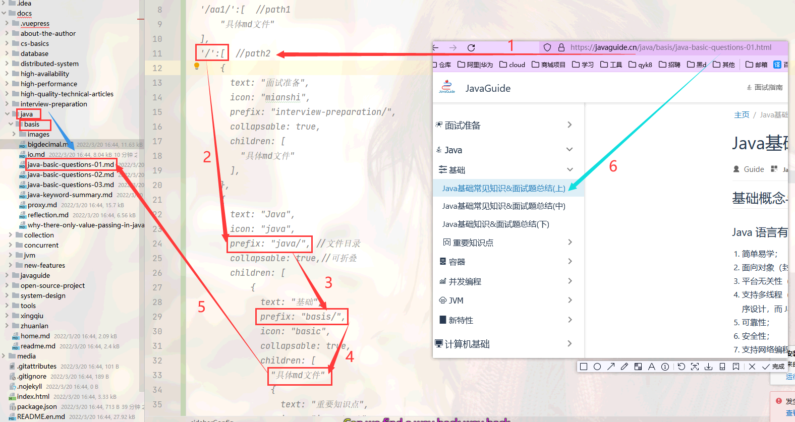


## 2、更换 html 内容的指定标签（可选项，根据自己的情况）


```js
let md_htmlContent = setting(hyperDown, "hyperDown");
```

设置

```js
/**
 * md-html全局设置
 * @param html
 * @param type markdown||hyperDown
 */
// @ts-ignore
function setting(html, type) {
    if (type === "hyperDown") {
        console.log("hyperDown")
        html = imgReplace(html)
        html = HTagUpdate(html)
        return html
    } else {
        return imgReplace(html)
    }
}
```

### 解析md时更改h1、h2... 标签

```javascript
const {parse} = require('node-html-parser')
```

解析 HTML 并返回一个根元素

```javascript
const root = parse(html)
```

```
root===
<ref *1> HTMLElement {
  parentNode: null,
  childNodes: [
    HTMLElement {
      parentNode: [Circular *1],
      childNodes: [Array],
      rawAttrs: '',
      nodeType: 1,
      rawTagName: 'h1',
      id: '',
      classList: [DOMTokenList]
    },
    ...
  ],
  rawAttrs: '',
  nodeType: 1,
  rawTagName: null,
  id: '',
  classList: DOMTokenList {
    _set: Set(0) {},
    _afterUpdate: [Function (anonymous)]
  }
}
```

查询选择器全部 hx 标签（标签名称+对应的内容）

```js
const h of root.querySelectorAll('h1, h2, h3, h4, h5, h6')
///////////////////////////////////////

<ref *1> HTMLElement {
  parentNode: HTMLElement {
    parentNode: null,
    childNodes: [
      [Circular *1], ... [HTMLElement]
    ],
    rawAttrs: '',
    nodeType: 1,
    rawTagName: null,
    id: '',
    classList: DOMTokenList {
      _set: Set(0) {},
      _afterUpdate: [Function (anonymous)]
    }
  },
  childNodes: [
    TextNode {
      parentNode: [Circular *1],
      childNodes: [],
      nodeType: 3,
      _rawText: '集合h1'
    }
  ],
  rawAttrs: '',
  nodeType: 1,
  rawTagName: 'h1',
  id: '',
  classList: DOMTokenList {
    _set: Set(0) {},
    _afterUpdate: [Function (anonymous)]
  },
  _attrs: {},
  _rawAttrs: {}
}
```

> **注意**：【_rawText: '集合h1'】、【rawTagName: 'h1',】

鼠标样式

```js
<h3 id="java-语言有哪些特点" tabindex="-1"><a class="header-anchor" href="#java-语言有哪些特点" aria-hidden="true">#</a> Java 语言有哪些特点?</h3>

.my-md a.header-anchor {
  font-size: .85em;
  float: left;
  margin-left: -.87em;
  padding-right: .23em;
  margin-top: .125em;
  opacity: 0;
  transition: opacity .2s;
}

.my-md h1 a.header-anchor:hover,
.my-md h2 a.header-anchor:hover,
.my-md h3 a.header-anchor:hover,
.my-md h4 a.header-anchor:hover,
.my-md h5 a.header-anchor:hover,
.my-md h6 a.header-anchor:hover {
  text-decoration: none;
  font-weight: 500;
  opacity: 1;
  color: #35e898;
}
```

```javascript
const {parse} = require('node-html-parser')
const root = parse(html)

for (const h of root.querySelectorAll('h1, h2, h3, h4, h5, h6')) {
    //读取H标签类型
    const tagName = h.rawTagName;
    //读取H标签值
    const tagTextContent: string = (h.rawText || h.textContent);

    //拼接h标签
    let oldHContent = '<' + tagName + '>' + tagTextContent + '</' + tagName + '>';

    let hrefT = replace(tagTextContent);

    //<h3 id="ja-rr" tabindex="-1"><a class="header-anchor" href="#ja-rr" aria-hidden="true">#</a>ja rr</h3>
    let newHContent = tagName === '' ? ''
        : '<' + tagName + ' id="' + hrefT
        + '" tabindex="-1"><a class="header-anchor" href="#' + hrefT + '" aria-hidden="true">#</a>'
        + tagTextContent + '</' + tagName + '>';

    //替换原来的H标签（html）
    html = html.replaceAll(oldHContent, newHContent);
}
return html;
```

```javascript
function replace(hT: string) {
    //#-: >?Java 语言有；。，:"':,./=哪些特点? h2--
    let idTextReg = /[^a-zA-Z\s0-9-*$\u4e00-\u9fa5]/g;//除开a-z、A-Z、0-9、中文、空格符、-
    let idTextReg2 = /[^a-zA-Z\s0-9\u4e00-\u9fa5]/g;//除开a-z、A-Z、0-9、中文、空格符
    let idTextReg3 = /[^a-zA-Z0-9\u4e00-\u9fa5]/g;//除开a-z A-Z 0-9 中文
    let trim1 = /^\s*|\s*$/g;//左右侧均无空格

    hT = hT.replaceAll(idTextReg, "")
        .replace(idTextReg2, '')
        .replace(trim1, '')
        .replaceAll(idTextReg3, "-");
    return hT
}
```


### 把img标签更换-el-image标签

```
// @ts-ignore
export function imgReplace(html) {
    let imgReg = /|\/>)/gi
    let srcReg = /src=['"]?([^'"]*)['"]?/i;
    let elimgReg = /<el-image.*?(?:"\/>|\/>)/gi

    /*
     * arr:筛选出md文件所有的 img 标签
     * [
     *    ,
     *    ,
     *    
     *  ]
     */
    let imgTagArr: any[] = []
    imgTagArr = html.match(imgReg)
    /*
     * srcList:获取 img 标签的 src 标签
     * [
     *    src="https://git",
     *    src="https://p6",
     *    src="https://p3"
     *  ]
     */
    const srcTagArr: any[] = []
    let preview_src_list: string = "";
    imgTagArr.forEach((imgTag, index, imgTagArray) => {
        /*
          src:(筛选 img 标签的 src 内容)：
          [src="https://im4b6.png",https://im4b6.png, index: 5, input: 'img标签',groups: undefined]
          [src="https://im222.png",https://im222.png, index: 5, input: 'img标签',groups: undefined]
         */
        let srcTag = imgTag.match(srcReg);
        srcTagArr.push(srcTag[0])
        /*
        * 拼接图片的 :preview-src-list="['xxx','xxx','xxx']"
        * */
        if (index == (imgTagArray.length - 1)) {
            // preview_src_list = preview_src_list + "\'" + srcTag[1] + "\'"
            preview_src_list = preview_src_list.concat("\'", srcTag[1], "\'")
        } else {
            // preview_src_list = preview_src_list + "\'" + srcTag[1] + "\',"
            preview_src_list = preview_src_list.concat("\'", srcTag[1], "\',")
        }
    })

    /**
     * 图片拼接123
     * value:单个数据
     * array:全部数据
     * fit: fill 充满 / contain 包含 / cover 覆盖 / none 没有 / scale-down 缩小
     */
    srcTagArr.forEach((srcTag, index, srcTagArray) => {
        let elimgTag = '<el-image class="image0" ' + srcTag + '  :initial-index="' + index + '"' +
            ' :hide-on-click-modal=true :preview-src-list=\"[' + preview_src_list + ']" :z-index=2000 fit="cover" />'
        html = html.replaceAll(imgTagArr[index], elimgTag);
    })
    return html
}
```


## 3、将 html 通过 compileSFC.parse 生成 vue 能解析的格式

```js
const ret = compileSFC.parse(`<template><div class="my-md hljs">${html}</div></template>`);
```

```json
{
  descriptor: {
    filename：'xxx.vue',
    source：“<template><div class="my-md hljs" v-highlight>解析的内容</div></template>”
	template: {
      type: 'template',
      content:“<div class="my-md hljs" v-highlight>解析的内容</div>”
      loc: [Object],
      attrs: {},
      ast: [Object],
      map: [Object]
    },
    script: null,
    scriptSetup: null,
    styles: [],
    customBlocks: [],
    cssVars: [],
    slotted: false,
    shouldForceReload: [Function: shouldForceReload]
  },
  errors: []
}
```

## 4、通过 compileDOM.compile 编译成 vue 需要的 js 代码格式

```js
const code = compileDOM.compile(ret.descriptor.template.content, {mode: 'module'}).code;
```

```js
import { createElementVNode as _createElementVNode, createTextVNode as _createTextVNode, resolveComponent as _resolveComponent, createVNode as _createVNode, resolveDirective as _resolveDirective, openBlock as _openBlock, createElementBlock as _createElementBlock, withDirectives as _withDirectives } from "vue"

export function render(_ctx, _cache) {
  const _component_el_image = _resolveComponent("el-image")
  const _directive_highlight = _resolveDirective("highlight")

  return _withDirectives((_openBlock(), _createElementBlock("div", { class: "my-md hljs" }, [
    _createElementVNode("h1", null, "集合h1"),
    _createElementVNode("h2", null, "异常h2"),
..........
}
```

## 5、highlight 代码高亮

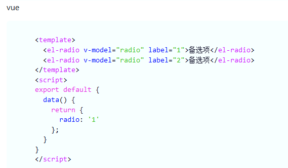

官网中各个css文件的效果展示：https://highlightjs.org/static/demo/

https://highlightjs.org/

### 配置 src/main.ts：`app.directive()`

### 代码块样式

```js
//import 'highlight.js/styles/...导入自己喜欢的scss

import 'highlight.js/styles/atom-one-light.css'
```

### 语法高亮

```js
const app = createApp(App)
/*语法高亮*/
app.directive('highlight', (el) => {
    let blocks = el.querySelectorAll('pre code')
    // @ts-ignore
    blocks.forEach((block) => {
        highlightJS.initHighlightingOnLoad()
        highlightJS.highlightBlock(block)
    })
});
```

### 解析 md 文件时 src/plugins/md.ts：`v-highlight`

```js
const ret = compileSFC.parse(`<template><div class="my-md hljs" v-highlight>${html}</div></template>`);
```

## 6、解析md生成目录，上下文章切换

### md内容生成目录

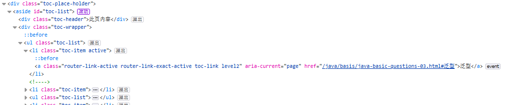


### 上下文章切换


## 7、md点击查看图片

### 点击查看图片

```java
	let html = hyperDown.makeHtml(src);
/////////////////////////////
	let imgReg = /|\/>)/gi
    let srcReg = /src=['"]?([^'"]*)['"]?/i;
    let elimgReg = /<el-image.*?(?:"\/>|\/>)/gi

    /*
     * arr:筛选出md文件所有的 img 标签
     * [
     *    ,
     *    ,
     *    
     *  ]
     */
    let imgTagArr: any[] = []
    imgTagArr = html.match(imgReg)
    /*
     * srcList:获取 img 标签的 src 标签
     * [
     *    src="https://git",
     *    src="https://p6",
     *    src="https://p3"
     *  ]
     */
    const srcTagArr: any[] = []
    let preview_src_list: string = "";
    imgTagArr.forEach((imgTag, index, imgTagArray) => {
        /*
          src:(筛选 img 标签的 src 内容)：
          [src="https://im4b6.png",https://im4b6.png, index: 5, input: 'img标签',groups: undefined]
          [src="https://im222.png",https://im222.png, index: 5, input: 'img标签',groups: undefined]
         */
        let srcTag = imgTag.match(srcReg);
        srcTagArr.push(srcTag[0])
        /*
        * 拼接图片的 :preview-src-list="['xxx','xxx','xxx']"
        * */
        if (index == (imgTagArray.length - 1)) {
            // preview_src_list = preview_src_list + "\'" + srcTag[1] + "\'"
            preview_src_list = preview_src_list.concat("\'", srcTag[1], "\'")
        } else {
            // preview_src_list = preview_src_list + "\'" + srcTag[1] + "\',"
            preview_src_list = preview_src_list.concat("\'", srcTag[1], "\',")
        }
    })

    /**
     * 图片拼接123
     * value:单个数据
     * array:全部数据
     * fit: fill 充满 / contain 包含 / cover 覆盖 / none 没有 / scale-down 缩小
     */
    srcTagArr.forEach((srcTag, index, srcTagArray) => {
        let elimgTag = '<el-image class="image0" ' + srcTag + '  :initial-index="' + index + '"' +
            ' :hide-on-click-modal=true :preview-src-list=\"[' + preview_src_list + ']" :z-index=2000 fit="cover" />'
        html = html.replaceAll(imgTagArr[index], elimgTag);
    })
```

### 背景

```
.my-md .image0 > .el-image-viewer__wrapper {
  background-color: #0a0a21;
}
```

## 8、代码copy按钮

```vue
  <button class="copy-code-pure-button" aria-label="复制代码" data-balloon-pos="left">
    <svg xmlns="http://www.w3.org/2000/svg" viewBox="0 0 1024 1024" class="icon-copy-code">
      <path
          d="M704 896v80c0 26.51-21.49 48-48 48H112c-26.51 0-48-21.49-48-48V240c0-26.51 21.49-48 48-48h144v592c0 61.758 50.242 112 112 112h336zm0-688V0H368c-26.51 0-48 21.49-48 48v736c0 26.51 21.49 48 48 48h544c26.51 0 48-21.49 48-48V256H752c-26.4 0-48-21.6-48-48zm241.942-62.058L814.058 14.058A48 48 0 0 0 780.118 0H768v192h192v-12.118a48 48 0 0 0-14.058-33.94z"></path>
    </svg>
  </button>
div[class*="language-"] .copy-code-pure-button {
  position: absolute;
  right: 3em;
  top: 0;
  z-index: 100;
}
button[aria-label][data-balloon-pos] {
  overflow: visible;
}
[aria-label][data-balloon-pos] {
  position: relative;
  cursor: pointer;
}
.copy-code-pure-button {
  box-sizing: content-box;
  width: .75rem;
  height: .75rem;
  padding: .8em;
  color: var(--code-ln-color, #9e9e9e);
}
.copy-code-button, .copy-code-pure-button {
  background-color: transparent;
  border-width: 0;
  cursor: pointer;
  outline: 0;
}
```


## 9、highlight添加行号

https://www.zoutl.cn/blog/165

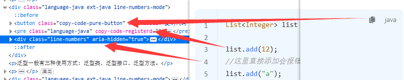


## 10、

http://www.npmdoc.org/markdown-it-anchorzhongwenwendangmarkdown-it-anchor-jszhongwenjiaochengjiexi.html

```
for (const h of root.querySelectorAll('h1, h2, h3, h4, h5, h6')) {
  const slug = h.getAttribute('id') || slugify(h.textContent)
  h.setAttribute('id', slug)
  h.innerHTML = `<a href="#${slug}>${h.innerHTML}</a>`
}
```

项目URL+#标题名称（h1、h2、h3...）

https://xxxxx.cn/java/demo/java.html#注释有哪几种形式


## 11、gray-matter：支持对 `.md` 文件的 TKD（文档标题、描述） 优化

例如：

```text---
title: Java基础常见知识&面试题总结(上)
category: Java
tag:
  - Java
---

下面是要书写的 Markdown 内容…
```

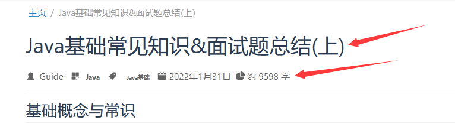


### @vueuse/head：

可以让你在 `.vue` 文件里实现优化，在 Vue 组件里的 `script` 部分，写入以下的代码，就可以实现 TKD 信息的配置。

```text
import { useHead } from '@vueuse/head'

useHead({
  meta: [
    {
      name: 'title',
      content: 'Java基础常见知识&面试题总结(上)'
    },
    {
      name: 'category',
      content: 'Java'
    },
    {
      name: 'tag',
      content: 'Java基础'
    }
  ]
})
```


## 12、代码块收缩显示


## 13、vue 百度统计

百度统计：vue-baidu-analytics

友盟统计：vue-cnzz-analytics

ts

```
head: [
    // 添加百度统计
    [
      "script", {},
      `var _hmt = _hmt || [];
      (function() {
        var hm = document.createElement("script");
        hm.src = "https://hm.baidu.com/hm.js?5dd2e8c97962d57b7b8fea1737c01743";
        var s = document.getElementsByTagName("script")[0]; 
        s.parentNode.insertBefore(hm, s);
      })();`
    ],
    [
      "link",
      {
        rel: "stylesheet",
        href: "//at.alicdn.com/t/font_2922463_99aa80ii7cf.css",
      },
    ],
  ],
  locales: {
    "/": {
      lang: "zh-CN"
    }
  },
```


# 六、


# 七、


# N、常用指令、问题

## 3、require 路径错误

```bash
require 路径错误：component: require(’…/components/movie/movie.vue’)
1：component: (resolve) => require([’@/views/home/home.vue’], resolve),
2：component: require(’…/components/movie/movie.vue’).default
```


