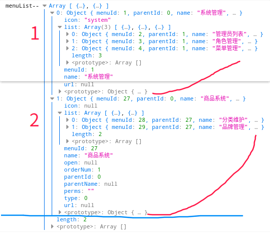
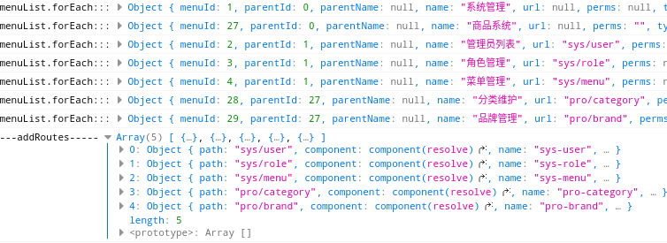
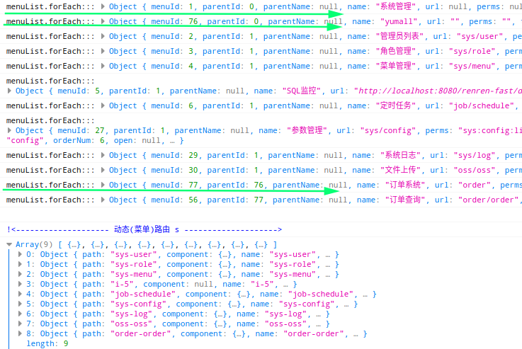
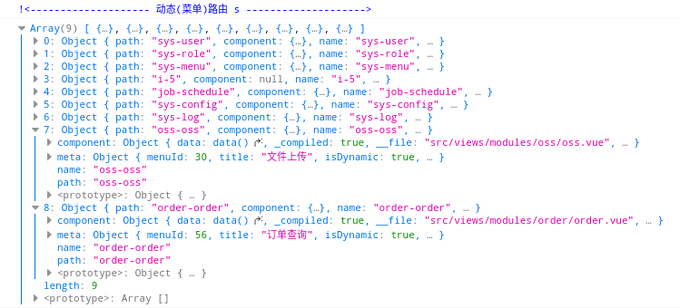

# shiro

## 一 pom依赖

```xml
		<dependency>
            <groupId>org.apache.shiro</groupId>
            <artifactId>shiro-spring</artifactId>
            <version>1.9.0</version>
        </dependency>
        <dependency>
            <groupId>org.apache.shiro</groupId>
            <artifactId>shiro-ehcache</artifactId>
            <version>1.9.0</version>
        </dependency>
```

## 二 Shiro配置

```java
@Configuration
public class ShiroConfig {
    /**
     * 将自己的验证方式加入容器
     */
    @Bean
    public Auth2Realm myAuth2Realm() {
        return new Auth2Realm();
    }
    /**
     * auth2过滤器
     */
    @Bean
    public Auth2Filter myAuth2Filter() {
        return new Auth2Filter();
    }
    /**
     * 注入安全管理器
     * 权限管理，配置主要是Realm的管理认证
     * @return SecurityManager
     */
    @Bean("securityManager")
    public SecurityManager securityManager() {
        DefaultWebSecurityManager securityManager = new DefaultWebSecurityManager();
        securityManager.setRealm(myAuth2Realm());
        return securityManager;
    }
    /**
     * url拦截
     * authc:所有url都必须认证通过才可以访问; anon:所有url都都可以匿名访问
     * @param securityManager 管理认证
     * @return ShiroFilterFactoryBean
     */
    @Bean("shiroFilter")
    public ShiroFilterFactoryBean shiroFilter(SecurityManager securityManager) {
        ShiroFilterFactoryBean shiroFilter = new ShiroFilterFactoryBean();
        shiroFilter.setSecurityManager(securityManager);
        Map<String, Filter> filters = new LinkedHashMap<>();
        filters.put("oauth2", myAuth2Filter());
        shiroFilter.setFilters(filters);
        Map<String, String> filterMap = new LinkedHashMap<>();
        filterMap.put("/druid/**", "anon");
        filterMap.put("/swagger**/**", "anon");
        filterMap.put("/captcha.jpg", "anon");
        filterMap.put("/sys/login", "anon");
        filterMap.put("/sys/logout", "anon");
        filterMap.put("**/**", "oauth2");

        shiroFilter.setFilterChainDefinitionMap(filterMap);
        return shiroFilter;
    }
    @Bean("lifecycleBeanPostProcessor")
    public LifecycleBeanPostProcessor lifecycleBeanPostProcessor() {
        return new LifecycleBeanPostProcessor();
    }
    /**
     * 加入注解的使用，不加入这个注解不生效
     */
    @Bean("authorizationAttributeSourceAdvisor")
    public AuthorizationAttributeSourceAdvisor authorizationAttributeSourceAdvisor(SecurityManager securityManager) {
        AuthorizationAttributeSourceAdvisor advisor = new AuthorizationAttributeSourceAdvisor();
        advisor.setSecurityManager(securityManager);
        return advisor;
    }
}
```
## 三 自定义Realm

```java
@Component
public class Auth2Realm extends AuthorizingRealm {
    @Autowired
    private ShiroService shiroService;

    @Override
    public boolean supports(AuthenticationToken token) {
        return token instanceof Auth2Token;
    }
    /**
     * 授权(验证权限时调用)
     */
    @Override
    protected AuthorizationInfo doGetAuthorizationInfo(PrincipalCollection principals) {
        //根据accessToken，查询用户信息
        SysUserEntity user = (SysUserEntity) principals.getPrimaryPrincipal();
        SimpleAuthorizationInfo simpleAuthorizationInfo = new SimpleAuthorizationInfo();
        //用户权限列表
        Set<String> permsSet = shiroService.getUserPermissions(user.getUserId());
        simpleAuthorizationInfo.addStringPermissions(permsSet);
        return simpleAuthorizationInfo;
    }
    /**
     * 认证(登录时调用)
     */
    @Override
    protected AuthenticationInfo doGetAuthenticationInfo(AuthenticationToken token) throws AuthenticationException {
        String accessToken = (String) token.getPrincipal();
        //根据accessToken，查询用户信息
        SysUserTokenEntity tokenEntity = shiroService.queryByToken(accessToken);
        //token失效
        if (tokenEntity == null || tokenEntity.getExpireTime().getTime() < DateUtils.getDataTimeByLong()) {
            throw new QYException(QYExceptionCode.TOKEN_INVALID.getCode(), QYExceptionCode.TOKEN_INVALID.getMsg());
        }
        //查询用户信息
        SysUserEntity user = shiroService.queryUser(tokenEntity.getUserId());
        //账号锁定
        if (user.getStatus() == 0) {
            throw new QYException(QYExceptionCode.ACCOUNT_LOCKED.getCode(), QYExceptionCode.ACCOUNT_LOCKED.getMsg());
        }
        return new SimpleAuthenticationInfo(user, accessToken, getName());
    }
}

```
## 四 自定义过滤器Auth2Filter

```java
/**
 * auth2过滤器
 *
 * @author kong
 * @email iskong88@163.com
 * @date 2021-06-12 21:39:35
 */
public class Auth2Filter extends AuthenticatingFilter {

    @Override
    protected AuthenticationToken createToken(ServletRequest request, ServletResponse response) {
        System.out.println("auth2过滤器createToken");
        //获取请求token
        String token = getRequestToken((HttpServletRequest) request);
        if (StringUtils.isBlank(token)) {
            return null;
        }
        return new Auth2Token(token);
    }

    @Override
    protected boolean isAccessAllowed(ServletRequest request, ServletResponse response, Object mappedValue) {
        System.out.println("auth2过滤器 isAccessAllowed");
        if (((HttpServletRequest) request).getMethod().equals(RequestMethod.OPTIONS.name())) {
            return true;
        }
        return false;
    }

    @Override
    protected boolean onAccessDenied(ServletRequest request, ServletResponse response) throws Exception {
        System.out.println("auth2过滤器 onAccessDenied");
        //获取请求token，如果token不存在，直接返回401
        String token = getRequestToken((HttpServletRequest) request);
        if (StringUtils.isBlank(token)) {
            HttpServletResponse httpResponse = (HttpServletResponse) response;
            httpResponse.setHeader("Access-Control-Allow-Credentials", "true");
            httpResponse.setHeader("Access-Control-Allow-Origin", HttpContextUtils.getOrigin());

            String json = new Gson().toJson(R.error(HttpStatus.SC_UNAUTHORIZED, "invalid token"));

            httpResponse.getWriter().print(json);

            return false;
        }

        return executeLogin(request, response);
    }

    @Override
    protected boolean onLoginFailure(AuthenticationToken token, AuthenticationException e, ServletRequest request, ServletResponse response) {
        System.out.println("auth2过滤器 onLoginFailure");
        HttpServletResponse httpResponse = (HttpServletResponse) response;
        httpResponse.setContentType("application/json;charset=utf-8");
        httpResponse.setHeader("Access-Control-Allow-Credentials", "true");
        httpResponse.setHeader("Access-Control-Allow-Origin", HttpContextUtils.getOrigin());
        try {
            //处理登录失败的异常
            Throwable throwable = e.getCause() == null ? e : e.getCause();
            R r = R.error(HttpStatus.SC_UNAUTHORIZED, throwable.getMessage());

            String json = new Gson().toJson(r);
            httpResponse.getWriter().print(json);
        } catch (IOException e1) {

        }

        return false;
    }

    /**
     * 获取请求的token
     */
    private String getRequestToken(HttpServletRequest httpRequest) {
        //从header中获取token
        String token = httpRequest.getHeader("token");
        System.out.println("auth2过滤器-----从header中获取token= " + token);
        //如果header中不存在token，则从参数中获取token
        if (StringUtils.isBlank(token)) {
            token = httpRequest.getParameter("token");
        }

        return token;
    }


}

```
## 五 Auth2Token

```java
public class Auth2Token implements AuthenticationToken {
    private String token;
    public Auth2Token() {
    }
    public Auth2Token(String token) {
        this.token = token;
    }
    /**
     * 返回在身份验证过程中提交的帐户标识
     *
     * @return token
     */
    @Override
    public String getPrincipal() {
        return token;
    }
    /**
     * 返回用户在验证的身份验证过程中提交的凭据
     * 提交的{getPrincipal() 帐户标识}。
     *
     * @return token
     */
    @Override
    public Object getCredentials() {
        return token;
    }
}

```
## 六 登录接口

```java
public Map<String, Object> login(SysLoginForm form) {
        R token = sysUserTokenService.createToken(user.getUserId());
        /*
         * shiro 认证，授权 token
         */
        Subject subject = SecurityUtils.getSubject();
        subject.login(new Auth2Token(token.get("token").toString()));
        return token.put("permissions", Objects.nonNull(permissions) ? permissions : "");
    }
```

# 基于JWT


```xml
<dependency>
    <groupId>com.auth0</groupId>
    <artifactId>java-jwt</artifactId>
    <version>0.9.1</version>
</dependency>
```

```java
private static Validator validator;
static {
   validator = Validation.buildDefaultValidatorFactory().getValidator();
}
Handler dispatch failed; nested exception is java.lang.ExceptionInInitializerError
Caused by: java.lang.ExceptionInInitializerError: null

Caused by: javax.validation.NoProviderFoundException: Unable to create a Configuration, because no Bean Validation provider could be found. Add a provider like Hibernate Validator (RI) to your classpath.
HV000030: No validator could be found for constraint 'javax.validation.constraints.NotBlank' validating type 'java.lang.String'. Check configuration for 'roleName'
```

```java
private static Validator validator = Validation.buildDefaultValidatorFactory().getValidator();
```

# [Spring Security](https://spring.io/projects/spring-security)


# [sa-token](https://sa-token.dev33.cn/)


# 前端

## 1、动态路由

```js
console.log("menuList--", menuList)
menuList.forEach((data, index, arrayDataAll) => {
  console.log("menuList.forEach:::",data)
})
console.log("-------addRoutes-----",routes)
```




自己

人人






