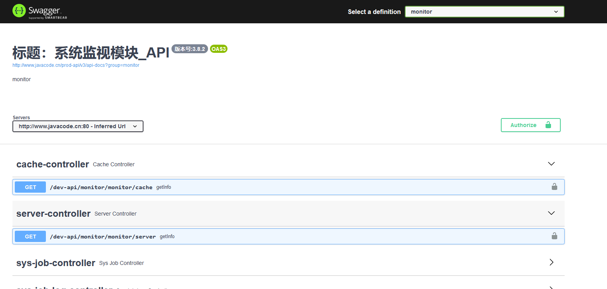

## 一、注解说明

Swagger 使用的注解及其说明：

## 作用于-Controller类

### @Api

> @Api：用在类上，说明该类的作用。
>
> ```java
> @Api(value = "代码生成", tags = "代码生成")
> public class TestController{}
> ```


## 作用于-方法

### @ApiOperation：给方法增加说明。

> ```java
> @ApiOperation(value = "获取用户列表", notes = "获取用户列表")
> public R userList() {}
> ```
>
> > value：显示在 Controller 里面
> >
> > tags：显示在 Controller 外部
> >
> > ```java
> > @ApiOperation(value = "添加学生", tags = "添加学生")
> > @ApiOperation(value = "删除学生", tags = "删除学生")
> > 
> > @ApiOperation(value = "获取学生list")
> > @ApiOperation(value = "获取学生by ID")
> > ```
>
> 


### @RequestBody 接收对象传参

```java
@PostMapping("/add")
@ResponseStatus(HttpStatus.CREATED)
@ApiOperation(value = "新增用户", notes = "新增用户")
public void addUser(@RequestBody User user) {
    logger.info("LandLord DTO is: "+user);
}
```


### @ApiImplicitParam：给方法参数增加说明。

> ```java
> @ApiOperation(value = "获取用户详细", notes = "获取用户详细")
> @ApiImplicitParam(name = "userId", value = "用户ID", required = true, paramType = "path", dataType = "Integer", dataTypeClass = Integer.class)
> public R getUser(@PathVariable Integer userId) {}
> ```
>
> | 参数                | 说明                                                         |
> | :------------------ | :----------------------------------------------------------- |
> | name: String         | 参数名                                                       |
> | value: String        | 参数说明&描述                                                |
> | defaultValue: String | 参数的默认值                                                 |
> | required: boolean    | 参数是否必须传                                               |
> | dataType: String     | 参数类型                                                     |
> | paramType: String    | 指定参数放在哪个地方。<br>header：请求参数放置于RequestHeader，使用 @RequestHeader 获取<br/>query：请求参数放置于请求地址，使用 @RequestParam 获取<br/>path：（用于 restful 接口）使用 @PathVariable 获取<br/>body：（不常用）<br/>form（不常用） |
>


### @ApiImplicitParams : 用在方法上包含一组参数说明。

> ```java
>  @ApiImplicitParams({
>     @ApiImplicitParam(paramType = "query", name = "username", value = "用户名", required = true, defaultValue = "test"),
>     @ApiImplicitParam(paramType = "query", name = "password", value = "密码", required = true, defaultValue = "123")
>  })
>  @PostMapping("/user")
>  public String addUser(@RequestParam String username, @RequestParam String password) {
>      return "新增用户：" + username + " " + password;
>  }
> ```
>


### 接收 参数&对象组合

```java
    @ApiOperation(value="修改医生信息", notes="")
    @ApiImplicitParam(paramType="query", name = "doctorId", value = "医生ID", required = true, dataType = "Integer")
    public String updateDoctor(@RequestParam Integer doctorId, @RequestBody DemoDoctor doctor){}
```

### 接收 参数&header组合

```java
    @ApiImplicitParams({
        @ApiImplicitParam(paramType="header", name = "token", value = "token", required = true, dataType = "String"),
        @ApiImplicitParam(paramType="query", name = "pageIndex", value = "当前页数", required = false, dataType = "String"),
        @ApiImplicitParam(paramType="query", name = "pageSize", value = "每页记录数", required = true, dataType = "String"),
    })
    public PageInfo<DemoDoctor> getDoctorList(@RequestParam(value = "pageIndex", required = false, defaultValue = "1") Integer pageIndex,
            @RequestParam(value = "pageSize", required = false) Integer pageSize,
            HttpServletRequest request){}
```


### @ApiResponses：用于表示一组响应

### @ApiResponse：用在@ApiResponses中，一般用于表达一个错误的响应信息

> > code：数字，例如400
> >
> > message：信息，例如"请求参数没填好"
> >
> > response：抛出异常的类
>
> ```java
> @ApiOperation(value = "删除用户", notes = "根据 id 删除用户")
> @ApiImplicitParam(name = "id", value = "用户ID", required = true, dataType = "Integer", paramType = "path", dataTypeClass = Integer.class)
> @ApiResponses({
>       @ApiResponse(code = 200, message = "删除成功！"),
>       @ApiResponse(code = 500, message = "删除失败！")
> })
> public R delete(@PathVariable Integer id) {}
> ```

### 注意：

在@RequestMapper中必须指定RequestMethod的类型，否则Sawgger会默认为全类型皆可访问， API列表中会生成多条项目。


## 作用于-实体类

### @ApiModel：描述一个Model的信息

（一般用在请求参数无法使用@ApiImplicitParam注解进行描述的时候）

> ```java
>@ApiModel(value = "UserEntity", description = "用户实体")
> public class UserEntity {}
> ```
> 

### @ApiModelProperty：描述一个model的属性

> ```java
>@ApiModelProperty(value = "用户ID")
> private Integer userId;
> ```

## 二、swagger2 配置

Swagger 文档: 	http://192.168.56.1:51156/dev/swagger-ui.html


```xml
        <!--swagger2-->
        <dependency>
            <groupId>io.springfox</groupId>
            <artifactId>springfox-swagger2</artifactId>
            <exclusions>
                <exclusion>
                    <groupId>com.google.guava</groupId>
                    <artifactId>guava</artifactId>
                </exclusion>
            </exclusions>
            <version>2.9.2</version>
        </dependency>
        <dependency>
            <groupId>io.springfox</groupId>
            <artifactId>springfox-swagger-ui</artifactId>
            <version>2.9.2}</version>
        </dependency>
        <dependency>
            <groupId>com.google.guava</groupId>
            <artifactId>guava</artifactId>
            <version>25.1-jre</version>
        </dependency>
```


```java
/**
 * Swagger2 的接口配置
 *
 * @author jf
 */
@Configuration
@EnableSwagger2
public class SwaggerConfig implements WebMvcConfigurer {
    /**
     * 系统基础配置
     */
    @Autowired
    private ModelConfig modelConfig;

    /**
     * 是否开启swagger
     */
    @Value("${swagger.enabled}")
    private boolean enabled;

    /**
     * 设置请求的统一前缀
     */
    @Value("${swagger.pathMapping}")
    private String pathMapping;

    /**
     * 分组:sys管理
     *
     * @return Docket
     */
    @Bean
    public Docket sys_api_app() {
        return new Docket(DocumentationType.SWAGGER_2)
                // 是否启用Swagger
                .enable(enabled)
                .apiInfo(apiInfo("标题：学生管理_API", "学生"))
                .select()
                .apis(RequestHandlerSelectors.basePackage("cn.springboot.model.web.controller"))
//                .apis(RequestHandlerSelectors.withMethodAnnotation(ApiOperation.class))
                // .apis(RequestHandlerSelectors.any())
//                .paths(PathSelectors.any())
                .paths(PathSelectors.ant("/stu/**"))
                .build()
                .groupName("学生")
                .securitySchemes(securitySchemes())
                .securityContexts(securityContexts())
                .pathMapping(pathMapping);
    }

    @Bean
    public Docket clas_api_app() {
        return new Docket(DocumentationType.SWAGGER_2)
                // 是否启用Swagger
                .enable(enabled)
                .apiInfo(apiInfo("标题：班级管理_API", "班级"))
                .select()
                .apis(RequestHandlerSelectors.basePackage("cn.springboot.model.web.controller"))
//                .apis(RequestHandlerSelectors.withMethodAnnotation(ApiOperation.class))
                // .apis(RequestHandlerSelectors.any())
//                .paths(PathSelectors.any())
                .paths(PathSelectors.ant("/class/**"))
                .build()
                .groupName("班级")
                .securitySchemes(securitySchemes())
                .securityContexts(securityContexts())
                .pathMapping(pathMapping);
    }

    /**
     * 安全模式，这里指定token通过Authorization头请求头传递
     */
    private List<SecurityScheme> securitySchemes() {
        List<SecurityScheme> apiKeyList = new ArrayList<SecurityScheme>();
        apiKeyList.add(new ApiKey("Authorization", "Authorization", In.HEADER.toValue()));
        return apiKeyList;
    }

    /**
     * 安全上下文
     */
    private List<SecurityContext> securityContexts() {
        List<SecurityContext> securityContexts = new ArrayList<>();
        securityContexts.add(
                SecurityContext.builder()
                        .securityReferences(defaultAuth())
                        .forPaths(o -> o.matches("/.*"))
                        .build());
        return securityContexts;
    }

    /**
     * 默认的安全上引用
     */
    private List<SecurityReference> defaultAuth() {
        AuthorizationScope authorizationScope = new AuthorizationScope("global", "accessEverything");
        AuthorizationScope[] authorizationScopes = new AuthorizationScope[1];
        authorizationScopes[0] = authorizationScope;
        List<SecurityReference> securityReferences = new ArrayList<>();
        securityReferences.add(new SecurityReference("Authorization", authorizationScopes));
        return securityReferences;
    }

    /**
     * 构建api文档的详细信息
     *
     * @param title       标题
     * @param description 描述
     * @return ApiInfo
     */
    private ApiInfo apiInfo(String title, String description) {
        return new ApiInfoBuilder()
                .title(title)
                .description(description)
                // 作者信息
                .contact(new Contact(modelConfig.getName(), null, null))
                .version("版本号:" + modelConfig.getVersion())
                .build();
    }

    @Override
    public void addResourceHandlers(ResourceHandlerRegistry registry) {
        registry.addResourceHandler("swagger-ui.html")
                .addResourceLocations("classpath:/META-INF/resources/");
        registry.addResourceHandler("/webjars/**")
                .addResourceLocations("classpath:/META-INF/resources/webjars/");
        registry.addResourceHandler("/static/**")
                .addResourceLocations(ResourceUtils.CLASSPATH_URL_PREFIX + "/static/");
        WebMvcConfigurer.super.addResourceHandlers(registry);
    }
}

```


## 三、swagger3 配置

Swagger 文档: 	http://192.168.56.1:51156/dev/swagger-ui.html



```xml
<!-- Swagger3依赖 -->
        <dependency>
            <groupId>io.springfox</groupId>
            <artifactId>springfox-boot-starter</artifactId>
            <version>3.0.0</version>
            <exclusions>
                <exclusion>
                    <groupId>io.swagger</groupId>
                    <artifactId>swagger-models</artifactId>
                </exclusion>
            </exclusions>
        </dependency>
        <dependency>
            <groupId>io.swagger</groupId>
            <artifactId>swagger-models</artifactId>
            <version>1.6.2</version>
        </dependency>
```


```java
/**
 * Swagger 的接口配置
 *
 */
@Configuration
public class SwaggerConfig {
    
    @Value("${project.name}")
    private String name;
    
    @Value("${project.version}")
    private String version;
    
    /**
     * 是否开启swagger
     */
    @Value("${swagger.enabled}")
    private boolean enabled;

    /**
     * 设置请求的统一前缀
     */
    @Value("${swagger.pathMapping}")
    private String pathMapping;


    /**
     * 分组:sys管理
     *
     * @return Docket
     */
    @Bean
    public Docket sys_api_app() {
        return new Docket(DocumentationType.OAS_30)
                // 是否启用Swagger
                .enable(enabled)
                // 用来创建该API的基本信息，展示在文档的页面中（自定义展示的信息）
                .apiInfo(apiInfo("标题：系统管理模块_API", "system"))
                // 设置哪些接口暴露给Swagger展示
                .select()
/////////////////////////////////////////////////////扫描
                .apis(RequestHandlerSelectors.basePackage("com.ruoyi.project.system.controller"))
                //.apis(RequestHandlerSelectors.withMethodAnnotation(ApiOperation.class))
                // .apis(RequestHandlerSelectors.any())
/////////////////////////////////////////////////////请求路径
                //.paths(PathSelectors.any())
                .paths(PathSelectors.ant("/system/**"))
                .build()
/////////////////////////////////////////////////////设置安全模式，swagger可以设置访问token
                .securitySchemes(securitySchemes())
                .securityContexts(securityContexts())
                .groupName("system")
                .pathMapping(pathMapping);
    }

    /**
     * 分组: tool 管理
     *
     * @return Docket
     */
    @Bean
    public Docket tool_api_app() {
        return new Docket(DocumentationType.OAS_30)
                .enable(enabled)
                .apiInfo(apiInfo("标题：系统工具模块_API", "tool"))
                .select()
            .apis(RequestHandlerSelectors.basePackage("com.ruoyi.project.tool.gen.controller"))
                .paths(PathSelectors.ant("/tool/**"))
                .build()
                .securitySchemes(securitySchemes())
                .securityContexts(securityContexts())
                .groupName("tool")
                .pathMapping(pathMapping + "/tool");
    }

    /**
     * 安全模式，这里指定token通过Authorization头请求头传递
     */
    private List<SecurityScheme> securitySchemes() {
        List<SecurityScheme> apiKeyList = new ArrayList<SecurityScheme>();
        apiKeyList.add(new ApiKey("Authorization", "Authorization", In.HEADER.toValue()));
        return apiKeyList;
    }

    /**
     * 安全上下文
     */
    private List<SecurityContext> securityContexts() {
        List<SecurityContext> securityContexts = new ArrayList<>();
        securityContexts.add(
                SecurityContext.builder()
                        .securityReferences(defaultAuth())
                        .operationSelector(o -> o.requestMappingPattern().matches("/.*"))
                        .build());
        return securityContexts;
    }

    /**
     * 默认的安全上引用
     */
    private List<SecurityReference> defaultAuth() {
        AuthorizationScope authorizationScope = new AuthorizationScope("global", "accessEverything");
        AuthorizationScope[] authorizationScopes = new AuthorizationScope[1];
        authorizationScopes[0] = authorizationScope;
        List<SecurityReference> securityReferences = new ArrayList<>();
        securityReferences.add(new SecurityReference("Authorization", authorizationScopes));
        return securityReferences;
    }

    /**
     * 构建api文档的详细信息
     *
     * @param title       标题
     * @param description 描述
     * @return ApiInfo
     */
    private ApiInfo apiInfo(String title, String description) {
        return new ApiInfoBuilder()
                .title(title)
                .description(description)
                // 作者信息
                .contact(new Contact(name, null, null))
                .version("版本号:" + version)
                .build();
    }
}
```


## 四、使用 swagger-bootstrap-ui

```xml
<dependency>
    <groupId>com.github.xiaoymin</groupId>
    <artifactId>swagger-bootstrap-ui</artifactId>
    <version>1.9.6</version>
</dependency>
```

Swagger 文档: 	http://192.168.56.1:51156/dev/doc.html


