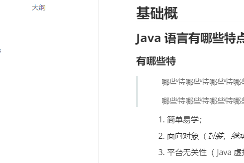
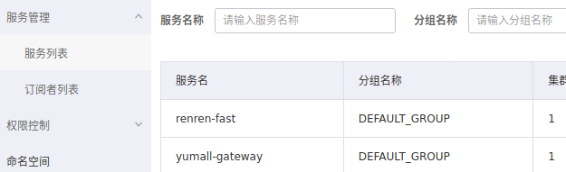

# 测试md

## 基础概 h2

### Java 语言有哪些特点? h3

#### 有哪些特 h4

##### 有哪些特 h5

# 有 h1

::: details 点击查看代码

```js
console.log('你好，VuePress！')
```

:::

```text
<PDF url="/java/pdf/date.pdf" :height="420" />
```

<PDF url="https://topjfk.oss-cn-chengdu.aliyuncs.com/docker/01.为什么要学习.pdf" />

------


@include(./test-i.md)


> 哪些特哪 *些特* 哪些特哪 **些特** 哪些特
>
> 哪 ==些特== 哪`些特哪些特哪些`特哪些特

重中之重`走着走着`自作主张自增

1. 简单易学；
2. 面向对象（*封装*，*继承*，**多态**）；
3. 平台无关性（ ==Java== 虚拟机实现平台无关性）；

- aaa
- 手动阀手动阀
-
    - 了了离开了

| 参数   | 说明                                               |
|------|--------------------------------------------------|
| name | *xxx*22                                          |
| age  | `22`                                             |
| xx   | xx **xx** xx实现==平台无关==性x<br/><code>sdfsdf</code> |
| xx   | xx **xx** xx实现平台无关性x                             |





```yaml
spring:
  profiles:
    # prod、 `dev`、test
    active: dev
  cloud:
    nacos:
      config:
        shared-configs:
          - data-id: application-${spring.profiles.active}
            group: ${spring.profiles.active}
            refresh: true
```

```java

@FeignClient("yumall-search")
public interface SearchFeignService {
    @PostMapping("/search/save/product")
    R productStatusUp(@RequestBody List<SkuEsModel> skuEsModels);
}

/**
 * @author jf
 * @version 1.0
 * @Description 描述
 * @date 2022/07/05 15:46
 */
@Configuration
public class FeignConfig {

    @Bean("requestInterceptor")
    public RequestInterceptor requestInterceptor() {
        return new RequestInterceptor() {
            @Override
            public void apply(RequestTemplate template) {
                //1、使用RequestContextHolder拿到刚进来的请求数据
                ServletRequestAttributes requestAttributes = (ServletRequestAttributes) RequestContextHolder.getRequestAttributes();
                if (requestAttributes != null) {
                    //老请求
                    HttpServletRequest request = requestAttributes.getRequest();
                    if (request != null) {
                        //2、同步请求头的数据（主要是cookie）
                        //把老请求的cookie值放到新请求上来，进行一个同步
                        String cookie = request.getHeader("Cookie");
                        template.header("Cookie", cookie);
                    }
                }
            }
        };
    }
}

```
