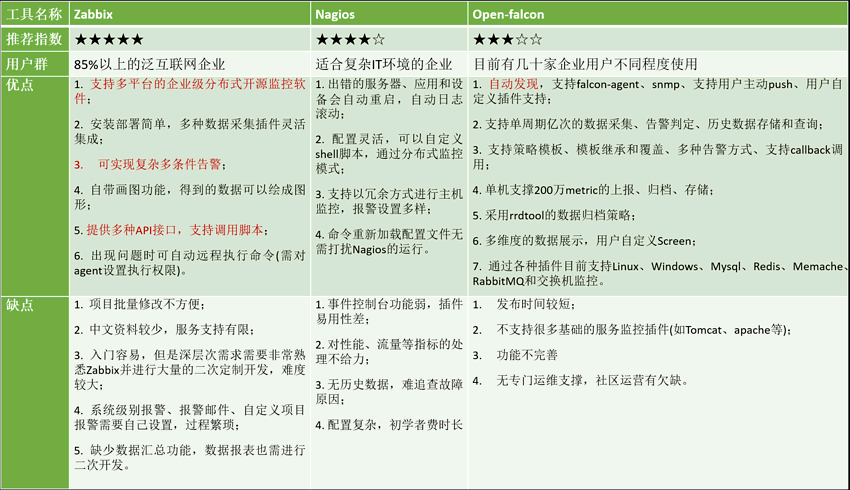

## Linux

- [Linux 基础](./basis/basis.md)
- [常用Linux命令实例](./command-examples.md)
- [网卡配置](./network.md)
- [yum源配置](./yum-repo.md)
- [升级内核](./update-kernel.md)
- [Shell 编程](./shell.md)
- [Jenkins自动化部署](./jenkins.md)
- [命令大全](./basis/command.md)

## 运维监控工具

- [Zabbix 监控平台](./monitoringtools/zabbix.md)
- [Nagios 监控平台](./monitoringtools/nagios.md)
- [Open-Falcon 监控平台](./monitoringtools/open-falcon.md)

Zabbix、Nagios、Open-Falcon这3大开源运维监控工具的比较:

## ansible

- [AD-Hoc命令执行工具](./ansible/ansible.md)
- [ansible安装与基础概念](./ansible/ansible-basis.md)
- [doc 模块功能查看工具](./ansible/ansible-doc.md)
- [playbook 任务编排工具（剧本）](./ansible/ansible-playbook.md)
- [galaxy 官方应用模板](./ansible/ansible-galaxy.md)
- [安装 Docker](./ansible/ansible-docker.md)
- [安装 JDK](./ansible/ansible-jdk.md)
- [安装 MySQL](./ansible/ansible-mysql.md)
- [安装 Nginx](./ansible/ansible-nginx.md)
- [安装 redis](./ansible/ansible-redis.md)
