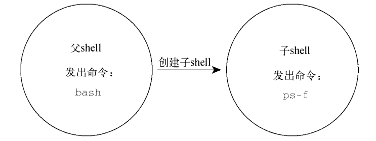
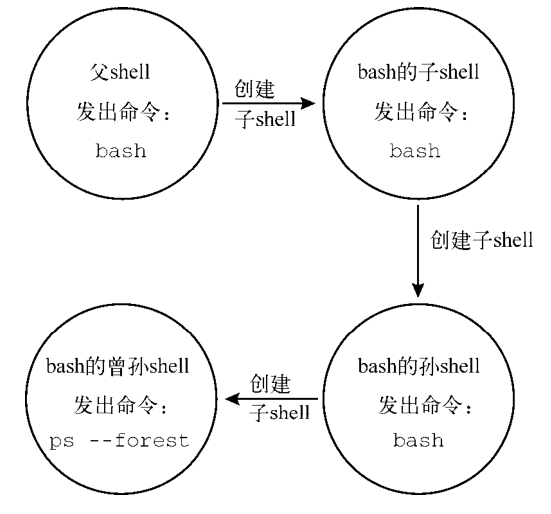
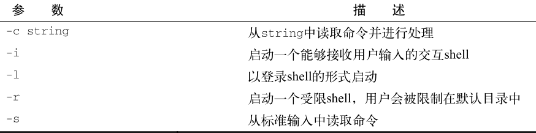
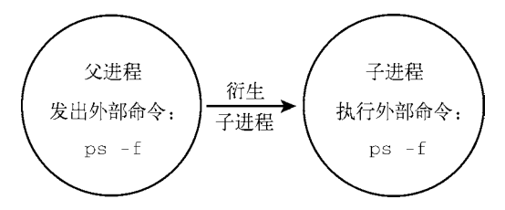
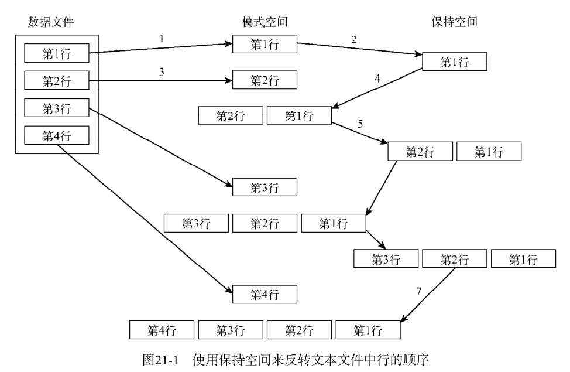

# Shell 脚本编程

## 基础认识

### 终端仿真器

GNOME Terminal（一般系统默认）  https://help.gnome.org/users/gnome-terminal/stable

Konsole Terminal  http://konsole.kde.org

Eterm  http://www.eterm.org

Final Term  http://finalterm.org

Guake  https://github.com/Guake/guake

LillyTerm  http://lilyterm.luna.com.tw/index.html

LXTerminal  http://wiki.lxde.org/en/LXTerminal

mrxvt  https://code.google.com/p/mrxvt

ROXTerm  http://roxterm.sourceforge.net

Terminator  https://launchpad.net/terminator

Terminology  http://www.enlightenment.org/p.php?p=about/terminology

UXterm  http://manpages.ubuntu.com/manpages/gutsy/man1/uxterm.1.html

Wterm  http://sourceforge.net/projects/wterm

xterm  http://invisible-island.net/xterm


### shell 类型

```
/bin/bash	/bin/sh		/bin/tcsh
/bin/dash	/bin/csh
```


### shell 的父子关系-bash

#### 1、bash进程

```shell
[root@admin ~]# ps -f
UID         PID   PPID  C STIME TTY          TIME CMD
root       1490   1479  0 10:06 pts/0    00:00:00 -bash
root      12459   1490  0 10:33 pts/0    00:00:00 ps -f
[root@admin ~]#
[root@admin ~]# bash
[root@admin ~]#
[root@admin ~]# ps -f
UID         PID   PPID  C STIME TTY          TIME CMD
root       1490   1479  0 10:06 pts/0    00:00:00 -bash
root      12590   1490  0 10:33 pts/0    00:00:00 bash
root      12661  12590  0 10:33 pts/0    00:00:00 ps -f
```

输入命令 bash 之后，一个子shell就出现了。第二个 ps -f 是在子shell中执行的。可以从显示结果中看到有两个bash shell程序在运行。第一个bash shell程序，也就是父shell进程，其原始进程ID是 *1490* 。第二个bash shell程序，即子shell进程，其PID是 *12590*。注意，子shell的父进程ID（`PPID`）是 *1490* ，指明了这个父shell进程就是该子shell的父进程



在生成子shell进程时，只有部分父进程的环境被复制到子shell环境中。这会对包括变量在内的一些东西造成影响。

```shell
[root@admin ~]# ps -f
UID         PID   PPID  C STIME TTY          TIME CMD
root       1490   1479  0 10:06 pts/0    00:00:00 -bash
root      12590   1490  0 10:33 pts/0    00:00:00 bash
root      14253  12590  0 10:37 pts/0    00:00:00 ps -f
[root@admin ~]#
[root@admin ~]# bash
[root@admin ~]# bash
[root@admin ~]# bash
[root@admin ~]# ps -f
UID         PID   PPID  C STIME TTY          TIME CMD
root       1490   1479  0 10:06 pts/0    00:00:00 -bash
root      12590   1490  0 10:33 pts/0    00:00:00 bash
root      18624  12590  0 10:48 pts/0    00:00:00 bash
root      18655  18624  0 10:48 pts/0    00:00:00 bash
root      18679  18655  0 10:48 pts/0    00:00:00 bash
root      19698  18679  0 10:50 pts/0    00:00:00 ps -f
[root@admin ~]# ps --forest
   PID TTY          TIME CMD
  1490 pts/0    00:00:00 bash
 12590 pts/0    00:00:00  \_ bash
 18624 pts/0    00:00:00      \_ bash
 18655 pts/0    00:00:00          \_ bash
 18679 pts/0    00:00:00              \_ bash
 18730 pts/0    00:00:00                  \_ ps
```

 bash 命令被输入了三次。这实际上创建了三个子shell。 `ps -forest` 命令展示了这些子shell间的嵌套结构。



**参数**




#### 退出子进程

exit

```shell
[root@admin ~]# ps -f
UID         PID   PPID  C STIME TTY          TIME CMD
root       1490   1479  0 10:06 pts/0    00:00:00 -bash
root      12590   1490  0 10:33 pts/0    00:00:00 bash
root      18624  12590  0 10:48 pts/0    00:00:00 bash
root      18655  18624  0 10:48 pts/0    00:00:00 bash
root      18679  18655  0 10:48 pts/0    00:00:00 bash
root      21975  18679  0 10:56 pts/0    00:00:00 ps -f
[root@admin ~]# exit
exit
[root@admin ~]# exit
exit
[root@admin ~]# ps -f
UID         PID   PPID  C STIME TTY          TIME CMD
root       1490   1479  0 10:06 pts/0    00:00:00 -bash
root      12590   1490  0 10:33 pts/0    00:00:00 bash
root      18624  12590  0 10:48 pts/0    00:00:00 bash
root      22071  18624  0 10:56 pts/0    00:00:00 ps -f
```


#### 2、进程列表


```shell
[root@admin ~]# pwd ; ls ; cd /etc ; pwd ; cd ; pwd ; ls
/root
anaconda-ks.cfg  df.sh  first.sh
/etc
/root
anaconda-ks.cfg  df.sh  first.sh
[root@admin ~]#
[root@admin ~]# (pwd ; ls ; cd /etc ; pwd ; cd ; pwd ; ls)
/root
anaconda-ks.cfg  df.sh  first.sh
/etc
/root
anaconda-ks.cfg  df.sh  first.sh
```

在上面的第一个例子中，所有的命令依次执行，不存在任何问题。不过这并不是进程列表。

命令列表要想成为进程列表，这些命令必须包含在括号里。括号的加入使命令列表变成了进程列表，生成了一个子shell来执行对应的命令。

要想知道是否生成了子shell，得借助一个使用了环境变量的命令。这个命令就是 echo $BASH_SUBSHELL；**如果该命令返回 0 ，就表明没有子shell。如果返回 1 或者其他更大的数字，就表明存在子shell**。如下：

```shell
[root@admin ~]# pwd ; ls ; cd /etc ; pwd ; cd ; pwd ; ls ; echo $BASH_SUBSHELL
/root
anaconda-ks.cfg  df.sh  first.sh
/etc
/root
anaconda-ks.cfg  df.sh  first.sh
0
[root@admin ~]# (pwd ; ls ; cd /etc ; pwd ; cd ; pwd ; ls ; echo $BASH_SUBSHELL)
/root
anaconda-ks.cfg  df.sh  first.sh
/etc
/root
anaconda-ks.cfg  df.sh  first.sh
1
```

你甚至可以在命令列表中嵌套括号来创建子shell的子shell。

```shell
[root@admin ~]# (pwd ; ls ; cd /etc ; pwd ; cd ; pwd ; ls ; (echo $BASH_SUBSHELL))
/root
anaconda-ks.cfg  df.sh  first.sh
/etc
/root
anaconda-ks.cfg  df.sh  first.sh
2
[root@admin ~]# (pwd ; ls ; cd /etc ; pwd ; cd ; pwd ; ls ; (echo $BASH_SUBSHELL))
/root
anaconda-ks.cfg  df.sh  first.sh
/etc
/root
anaconda-ks.cfg  df.sh  first.sh
2
```


#### 3、后台模式

`sleep` 命令会在后台（ `&` ）睡眠30秒。当它被置入后台。

使用 `jobs` 命令来显示后台作业信息。 jobs 命令可以显示出当前运行在后台模式中的所有用户的进程（作业）。使用`-l` 来显示进程的 PID。

```shell
[root@admin ~]#  sleep 30&
[1] 35051
[root@admin ~]# ps -f
UID         PID   PPID  C STIME TTY          TIME CMD
root       1490   1479  0 10:06 pts/0    00:00:00 -bash
root      12590   1490  0 10:33 pts/0    00:00:00 bash
root      18624  12590  0 10:48 pts/0    00:00:00 bash
root      35051  18624  0 11:28 pts/0    00:00:00 sleep 30
root      35093  18624  0 11:28 pts/0    00:00:00 ps -f
[root@admin ~]# jobs
[1]+  运行中               sleep 30 &
[root@admin ~]# jobs -l
[1]+ 35051 运行中               sleep 30 &
[root@admin ~]# jobs -l
[1]+ 35051 完成                  sleep 30
```

> 需要提醒的是：后台作业的结束状态可未必会一直等待到合适的时候才现身。当作业结束状态突然出现在屏幕上的时候，你可别吃惊啊。


#### 4、将进程列表置入后台

```shell
[root@admin ~]# (sleep 2 ; echo $BASH_SUBSHELL ; sleep 2)
1
[root@admin ~]# (sleep 2 ; echo $BASH_SUBSHELL ; sleep 2)&
[1] 39128
[root@admin ~]# 1		<=== 按回车

[1]+  完成                  ( sleep 2; echo $BASH_SUBSHELL; sleep 2 )
```

把进程列表置入后台会产生一个作业号和进程ID，然后返回到提示符。不过奇怪的是表明单一级子shell的数字 1 显示在了提示符的旁边！不要不知所措，只需要按一下回车键，就会得到另一个提示符。


在CLI中运用子shell的创造性方法之一就是将进程列表置入后台模式。你既可以在子shell中进行繁重的处理工作，同时也不会让子shell的I/O受制于终端。

当然了， sleep 和 echo 命令的进程列表只是作为一个示例而已。

```shell
[root@admin ~]# (tar -cf user1.tar /home/user1 ; tar -cf df.log.tar /home/df.log)&
[3] 2423
[root@admin ~]# ls
anaconda-ks.cfg  df.log.tar user1.tar
```


#### 5、协程 coproc

协程可以同时做两件事。它在后台生成一个子shell，并在这个子shell中执行命令。

除了会创建子shell之外，**协程基本上就是将命令置入后台模式**。当输入 coproc 命令及其参数之后，你会发现启用了一个后台作业。屏幕上会显示出后台作业号（ 1 ）以及进程ID（ 43011）

```shell
[root@admin home]# coproc sleep 10
[1] 43011
[root@admin home]# jobs
[1]+  运行中               coproc COPROC sleep 10 &
```

使用命令的扩展语法自己设置这个名字。

-----

**说明：** 协程能够让你尽情发挥想象力，发送或接收来自子shell中进程的信息。只有在拥有多个协程的时候才需要对协程进行命名，因为你得和它们进行通信。否则的话，让 coproc 命令将其设置成默认的名字 COPROC 就行了。

-------

```shell
[root@admin home]# coproc My_Job { sleep 10; }
bash: 警告:execute_coproc: coproc [43011:COPROC] still exists
[2] 43087
[1]   完成                  coproc COPROC sleep 10
[root@admin home]# jobs
[2]+  完成                  coproc My_Job { sleep 10; }
```

将协程与进程列表结合起来产生嵌套的子shell。只需要输入进程列表，然后把命令 coproc 放在前面就行了。

```shell
[root@admin home]# coproc ( sleep 10; sleep 2 )
[1] 43423
[root@admin home]# jobs
[1]+  运行中               coproc COPROC ( sleep 10; sleep 2 ) &
[root@admin home]# ps --forest
   PID TTY          TIME CMD
  1490 pts/0    00:00:00 bash
 12590 pts/0    00:00:00  \_ bash
 18624 pts/0    00:00:00      \_ bash
 43423 pts/0    00:00:00          \_ bash
 43424 pts/0    00:00:00          |   \_ sleep
 43479 pts/0    00:00:00          \_ ps
```


**记住**：生成子shell的成本不低，而且速度还慢。创建嵌套子shell更是火上浇油！
在命令行中使用子shell能够获得灵活性和便利。要想获得这些优势，重要的是理解子shell的行为方式。对于命令也是如此。


### 理解 shell 的内建命令

内建命令和非内建命令的操作方式大不相同。

#### 1、外部命令

外部命令，有时候也被称为文件系统命令，是存在于bash shell之外的程序。它们并不是shell程序的一部分。外部命令程序通常位于`/bin`、`/usr/bin`、`/sbin`或`/usr/sbin`中。

ps 就是一个外部命令。你可以使用 which 和 type 命令找到它:

```shell
[root@admin ~]# which ps
/usr/bin/ps
[root@admin ~]# type -a ps
ps 是 /usr/bin/ps
[root@admin ~]# ls -l /usr/bin/ps
-rwxr-xr-x. 1 root root 100112 10月  1 2020 /usr/bin/ps
```

当外部命令执行时，会创建出一个子进程。这种操作被称为衍生（forking）。外部命令 ps 很方便显示出它的父进程以及自己所对应的衍生子进程。

作为外部命令， ps 命令执行时会创建出一个子进程。



```shell
[root@admin ~]# ps -f
UID         PID   PPID  C STIME TTY          TIME CMD
root       1490   1479  0 10:06 pts/0    00:00:00 -bash
root      49716   1490  0 12:04 pts/0    00:00:00 ps -f
[root@admin ~]# ps -f
UID         PID   PPID  C STIME TTY          TIME CMD
root       1490   1479  0 10:06 pts/0    00:00:00 -bash
root      49723   1490  0 12:04 pts/0    00:00:00 ps -f
[root@admin ~]# ps -f
UID         PID   PPID  C STIME TTY          TIME CMD
root       1490   1479  0 10:06 pts/0    00:00:00 -bash
root      49731   1490  0 12:04 pts/0    00:00:00 ps -f
```

当进程必须执行衍生操作时，它需要花费时间和精力来设置新子进程的环境。所以说，外部命令多少还是有代价的。

------

**说明** 就算衍生出子进程或是创建了子shell，你仍然可以通过发送信号与其沟通，这一点无论是在命令行还是在脚本编写中都是极其有用的。发送信号（signaling）使得进程间可以通过信号进行通信。

-----


#### 2、内部命令

内建命令不需要使用子进程来执行。它们已经和shell编译成了一体，作为shell工具的组成部分存在。不需要借助外部程序文件来运行

```shell
[root@admin ~]# type cd
cd 是 shell 内嵌
[root@admin ~]# type exit
exit 是 shell 内嵌
[root@admin ~]# type -a echo
echo 是 shell 内嵌
echo 是 /usr/bin/echo
[root@admin ~]#
[root@admin ~]# type -a pwd
pwd 是 shell 内嵌
pwd 是 /usr/bin/pwd
```

既不需要通过衍生出子进程来执行，也不需要打开程序文件，内建命令的**执行速度要更快，效率也更高**。


### linux 环境变量

#### 1、全局环境变量

要查看全局变量，可以使用 env 或 printenv 命令：

```shell
[root@admin ~]# printenv
XDG_SESSION_ID=1
HOSTNAME=admin
TERM=xterm
SHELL=/bin/bash
HISTSIZE=1000
SSH_CLIENT=192.168.0.5 9649 22
SSH_TTY=/dev/pts/0

[root@admin ~]# env
XDG_SESSION_ID=1
HOSTNAME=admin
TERM=xterm
SHELL=/bin/bash
HISTSIZE=1000
SSH_CLIENT=192.168.0.5 9649 22
SSH_TTY=/dev/pts/0
USER=root

```

要显示个别环境变量的值，可以使用 printenv 命令，但是不要用 env 命令

```shell
[root@admin ~]# printenv HOME
/root
[root@admin ~]# env HOME
env: HOME: 没有那个文件或目录
[root@admin ~]# echo $HOME
/root
[root@admin ~]# ls $HOME
anaconda-ks.cfg  df.log.tar  df.sh  first.sh  user1.tar
```


#### 2、局部环境变量

局部环境变量只能在定义它们的进程中可见。

查看局部环境变量的列表有点复杂。遗憾的是，在Linux系统并没有一个只显示局部环境变量的命令。 set 命令会显示为某个特定进程设置的所有环境变量，包括局部变量、全局变量以及用户定义变量。

```shell
[root@admin ~]# set
BASH=/bin/bash
[...]
BASH_VERSINFO=([0]="4" [1]="2" [2]="46" [3]="2" [4]="release" [5]="x86_64-redhat-linux-gnu")
BASH_VERSION='4.2.46(2)-release'
[...]
HISTFILE=/root/.bash_history
HOME=/root
HOSTNAME=admin
```


----------

**说明** 命令 `env` 、 `printenv` 和 `set` 之间的差异很细微。 **set** 命令会显示出全局变量、局部变量以及用户定义变量。它还会按照字母顺序对结果进行排序。 **env** 和 **printenv** 命令同 set 命令的区别在于前两个命令不会对变量排序，也不会输出局部变量和用户定义变量。在这种情况下， env 和 printenv 的输出是重复的。不过 env 命令有一个 printenv 没有的功能，这使得它要更有用一些。

-------


#### 3、设置用户定义变量

可以通过等号给环境变量赋值，值可以是数值或字符串。

```shell
[root@admin ~]# echo $my_variable

[root@admin ~]# my_variable=Hello
[root@admin ~]# echo $my_variable
Hello
```

非常简单！现在每次引用 my_variable  环境变量的值，只要通过 \$my_variable 引用即可。
如果要给变量赋一个含有空格的字符串值，必须用单引号来界定字符串的首和尾。

```shell
[root@admin ~]# my_variable=Hello World
-bash: World: 未找到命令
[root@admin ~]# my_variable="Hello World"
[root@admin ~]# echo $my_variable
Hello World
```

没有单引号的话，bash shell会以为下一个词是另一个要执行的命令。注意，你定义的局部环境变量用的是小写字母，而到目前为止你所看到的系统环境变量都是大写字母。

------

**注意：** 所有的环境变量名均使用大写字母，这是bash shell的标准惯例。如果是你自己创建的局部变量或是shell脚本，请使用小写字母。变量名区分大小写。在涉及用户定义的局部变量时坚持使用小写字母，这能够避免重新定义系统环境变量可能带来的灾难。

-----


设置了局部环境变量后，就能在shell进程的任何地方使用它了。但是，如果生成了另外一个shell，它在子shell中就不可用。

```shell
[root@admin ~]# bash
[root@admin ~]# echo $my_variable

[root@admin ~]# exit
exit
[root@admin ~]# echo $my_variable
Hello World
```

类似地，如果你在子进程中设置了一个局部变量，那么一旦你退出了子进程，那个局部环境变量就不可用。

````shell
[root@admin ~]# bash
[root@admin ~]# my_0="1112323"
[root@admin ~]# echo $my_0
1112323
[root@admin ~]# exit
exit
[root@admin ~]# echo $my_0
````


#### 4、设置全局环境变量 export

创建全局环境变量的方法是先创建一个局部环境变量，然后再把它导出到全局环境中（`export`）。

```shell
[root@admin ~]# vmy_variable="I am Global now"
[root@admin ~]# export vmy_variable
[root@admin ~]# echo $vmy_variable
I am Global now
[root@admin ~]# bash
[root@admin ~]# echo $vmy_variable
I am Global now
[root@admin ~]# exit
exit
[root@admin ~]# echo $vmy_variable
I am Global now
```

在定义并导出局部环境变量 my_variable 后， bash 命令启动了一个子shell。在这个子shell中能够正确的显示出变量 my_variable 的值。该变量能够保留住它的值是因为 export 命令使其变成了全局环境变量。

修改子shell中全局环境变量并不会影响到父shell中该变量的值。这种改变只是在子进程中有效，并不会被反映到父shell中。

```shell
[root@admin ~]# bash
[root@admin ~]# vmy_variable="I am Global now 66666"
[root@admin ~]# echo $vmy_variable
I am Global now 66666
[root@admin ~]# exit
exit
[root@admin ~]# echo $vmy_variable
I am Global now
```


#### 5、删除环境变量 unset

```shell
[root@admin ~]# echo $vmy_variable
I am Global now
[root@admin ~]# echo $my_variable

[root@admin ~]# unset my_variable
[root@admin ~]# echo $my_variable

```


如果你是在子进程中删除了一个全局环境变量，这只对子进程有效。该全局环境变量在父进程中依然可用。

```shell
[root@admin ~]# bash
[root@admin ~]# echo $vmy_variable
I am Global now
[root@admin ~]# unset my_variable
[root@admin ~]# echo $my_variable

[root@admin ~]# exit
exit
[root@admin ~]# echo $vmy_variable
I am Global now
```


------

**窍门**   如果要用到变量，使用 \$ ；如果要操作变量，不使用 \$ 。这条规则的一
个例外就是使用 printenv 显示某个变量的值。

------


#### 6、默认的 shell 环境变量

默认情况下，bash shell会用一些特定的环境变量来定义系统环境。这些变量在你的Linux系统上都已经设置好了，只管放心使用。bash shell源自当初的Unix Bourne shell，因此也保留了Unix Bourne shell里定义的那些环境变量。

```tex
$变量 			 描述
CDPATH		冒号分隔的目录列表，作为 cd 命令的搜索路径
HOME		当前用户的主目录
IFS			shell用来将文本字符串分割成字段的一系列字符
MAIL		当前用户收件箱的文件名（bash shell会检查这个文件，看看有没有新邮件）
MAILPATH	冒号分隔的当前用户收件箱的文件名列表（bash shell会检查列表中的每个文件，看看有没有新邮件）
OPTARG		getopts 命令处理的最后一个选项参数值
OPTIND		getopts 命令处理的最后一个选项参数的索引号
PATH		shell查找命令的目录列表，由冒号分隔
PS1			shell命令行界面的主提示符
PS2			shell命令行界面的次提示
```

除了默认的Bourne的环境变量，bash shell还提供一些自有的变量

```tex
$变量 			 描述
BASH			当前shell实例的全路径名
BASH_ALIASES	含有当前已设置别名的关联数组
BASH_ARGC		含有传入子函数或shell脚本的参数总数的数组变量
BASH_ARCV		含有传入子函数或shell脚本的参数的数组变量
BASH_CMDS		关联数组，包含shell执行过的命令的所在位置
BASH_COMMAND	shell正在执行的命令或马上就执行的命令
BASH_ENV		设置了的话，每个bash脚本会在运行前先尝试运行该变量定义的启动文件
BASH_EXECUTION_STRING	使用 bash -c 选项传递过来的命令
BASH_LINENO		含有当前执行的shell函数的源代码行号的数组变量
BASH_REMATCH	只读数组，在使用正则表达式的比较运算符=~进行肯定匹配（positive match）时，包含了匹配到的模式和子模式
BASH_SOURCE		含有当前正在执行的shell函数所在源文件名的数组变量
BASH_SUBSHELL	当前子shell环境的嵌套级别（初始值是0）
BASH_VERSINFO	含有当前运行的bash shell的主版本号和次版本号的数组变量
BASH_VERSION	当前运行的bash shell的版本号
BASH_XTRACEFD	若设置成了有效的文件描述符（ 0 、 1 、 2 ），则 'set -x' 调试选项生成的跟踪输出可被重定向。通常用来将跟踪输出到一个文件中
BASHOPTS		当前启用的bash shell选项的列表
BASHPID			当前bash进程的PID
COLUMNS			当前bash shell实例所用终端的宽度
COMP_CWORD		COMP_WORDS 变量的索引值，后者含有当前光标的位置
COMP_LINE		当前命令行
COMP_POINT		当前光标位置相对于当前命令起始的索引
COMP_KEY		用来调用shell函数补全功能的最后一个键
COMP_TYPE		一个整数值，表示所尝试的补全类型，用以完成shell函数补全
COMP_WORDBREAKS		Readline库中用于单词补全的词分隔字符
COMP_WORDS		含有当前命令行所有单词的数组变量
COMPREPLY		含有由shell函数生成的可能填充代码的数组变量
COPROC			占用未命名的协进程的I/O文件描述符的数组变量
DIRSTACK		含有目录栈当前内容的数组变量
EMACS			设置为 't' 时，表明emacs shell缓冲区正在工作，而行编辑功能被禁止
ENV				如果设置了该环境变量，在bash shell脚本运行之前会先执行已定义的启动文件（仅用于当bash shell以POSIX模式被调用时）
EUID			当前用户的有效用户ID（数字形式）
FCEDIT			供 fc 命令使用的默认编辑器
FIGNORE			在进行文件名补全时可以忽略后缀名列表，由冒号分隔
FUNCNAME		当前执行的shell函数的名称
FUNCNEST		当设置成非零值时，表示所允许的最大函数嵌套级数（一旦超出，当前命令即被终止）
GLOBIGNORE		冒号分隔的模式列表，定义了在进行文件名扩展时可以忽略的一组文件名
GROUPS			含有当前用户属组列表的数组变量
histchars		控制历史记录扩展，最多可有3个字符
HISTCMD			当前命令在历史记录中的编号
HISTCONTROL		控制哪些命令留在历史记录列表中
HISTFILE		保存shell历史记录列表的文件名（默认是.bash_history）
HISTFILESIZE	最多在历史文件中存多少行
HISTTIMEFORMAT	如果设置了且非空，就用作格式化字符串，以显示bash历史中每条命令的时间戳
HISTIGNORE		由冒号分隔的模式列表，用来决定历史文件中哪些命令会被忽略
HISTSIZE		最多在历史文件中存多少条命令
HOSTFILE		shell在补全主机名时读取的文件名称
HOSTNAME		当前主机的名称
HOSTTYPE		当前运行bash shell的机器
IGNOREEOF		shell在退出前必须收到连续的 EOF 字符的数量（如果这个值不存在，默认是 1 ）
INPUTRC			Readline初始化文件名（默认是.inputrc）
LANG			shell的语言环境类别
LC_ALL			定义了一个语言环境类别，能够覆盖 LANG 变量
LC_COLLATE		设置对字符串排序时用的排序规则
LC_CTYPE		决定如何解释出现在文件名扩展和模式匹配中的字符
LC_MESSAGES		在解释前面带有 \$ 的双引号字符串时，该环境变量决定了所采用的语言环境设置
LC_NUMERIC		决定着格式化数字时采用的语言环境设置
LINENO			当前执行的脚本的行号
LINES			定义了终端上可见的行数
MACHTYPE		用“CPU  公司  系统”（CPU-company-system）格式定义的系统类型
MAPFILE			一个数组变量，当 mapfile 命令未指定数组变量作为参数时，它存储了 mapfile 所读入的文本
MAILCHECK		shell查看新邮件的频率（以秒为单位，默认值是 60 ）
OLDPWD			shell之前的工作目录
OPTERR			设置为1时，bash shell会显示 getopts 命令产生的错误
OSTYPE			定义了shell所在的操作系统
PIPESTATUS		含有前台进程的退出状态列表的数组变量
POSIXLY_CORRECT		设置了的话，bash会以POSIX模式启动
PPID			bash shell父进程的PID
PROMPT_COMMAND		设置了的话，在命令行主提示符显示之前会执行这条命令
PROMPT_DIRTRIM		用来定义当启用了 \w 或 \W 提示符字符串转义时显示的尾部目录名的数量。被删除的目录名会用一组英文句点替换
PS3				select 命令的提示符
PS4				如果使用了bash的 -x 选项，在命令行之前显示的提示信息
PWD				当前工作目录
RANDOM			返回一个0～32767的随机数（对其的赋值可作为随机数生成器的种子）
READLINE_LINE		当使用 bind –x 命令时，存储Readline缓冲区的内容
READLINE_POINT		当使用 bind –x 命令时，表示Readline缓冲区内容插入点的当前位置
REPLY			read命令的默认变量
SECONDS			自从shell启动到现在的秒数（对其赋值将会重置计数器）
SHELL			bash shell的全路径名
SHELLOPTS		已启用bash shell选项列表，列表项之间以冒号分隔
SHLVL			shell的层级；每次启动一个新bash shell，该值增加1
TIMEFORMAT		指定了shell的时间显示格式
TMOUT			select 和 read 命令在没输入的情况下等待多久（以秒为单位）。默认值为0，表示无限长
TMPDIR			目录名，保存bash shell创建的临时文件
UID				当前用户的真实用户ID（数字形式）
```


#### 7、设置 PATH 环境变量

```shell
[root@admin ~]# echo $PATH
/usr/local/sbin:/usr/local/bin:/usr/sbin:/usr/bin:/root/bin
[root@admin ~]# PATH=$PATH:/home/user1
[root@admin ~]# echo $PATH
/usr/local/sbin:/usr/local/bin:/usr/sbin:/usr/bin:/root/bin:/home/user1
```

------

**窍门** 如果希望子shell也能找到你的程序的位置，一定要记得把修改后的 PATH 环境变量导出。

-----


#### 8、定位系统环境变量

**登录 shell**

当你登录Linux系统时，bash shell会作为登录shell启动。登录shell会从5个不同的启动文件里
读取命令：

- /etc/profile
- $HOME/.bash_profile
- $HOME/.bashrc
- $HOME/.bash_login
- $HOME/.profile

etc/profile文件是系统上默认的bash shell的主启动文件。系统上的每个用户登录时都会执行
这个启动文件。

HOME：提供一个用户专属的启动文件来定义该用户所用到的环境变量。

shell会按照按照下列顺序，运行第一个被找到的文件，余下的则被忽略：

```
$HOME/.bash_profile
$HOME/.bash_login
$HOME/.profile
```

注意，这个列表中并没有$HOME/.bashrc文件。这是因为该文件通常通过其他文件运行的。


#### 9、交互式 shell 进程

如果bash是作为交互式shell启动的，它就不会访问/etc/profile文件，只会检查用户HOME目录中的.bashrc文件

```
[root@admin ~]# cat .bashrc
# .bashrc

# User specific aliases and functions

alias rm='rm -i'
alias cp='cp -i'
alias mv='mv -i'

# Source global definitions
if [ -f /etc/bashrc ]; then
        . /etc/bashrc
f
```


#### 10、非交互式shell

最后一种shell是非交互式shell。系统执行shell脚本时用的就是这种shell。不同的地方在于它没有命令行提示符。但是当你在系统上运行脚本时，也许希望能够运行一些特定启动的命令。

-----

窍门 脚本能以不同的方式执行。只有其中的某一些方式能够启动子shell

-----

为了处理这种情况，bash shell提供了 BASH_ENV 环境变量。当shell启动一个非交互式shell进程时，它会检查这个环境变量来查看要执行的启动文件。如果有指定的文件，shell会执行该文件里的命令，这通常包括shell脚本变量设置。

在CentOS Linux发行版中，这个环境变量在默认情况下并未设置。如果变量未设置， printenv 命令只会返回CLI提示符：

```shell
$ printenv BASH_ENV
```


在Ubuntu发行版中，变量 BASH_ENV 也没有被设置。记住，如果变量未设置， echo 命令会显示一个空行，然后返回CLI提示符：

```shell
$ echo $BASH_ENV
```


那如果 BASH_ENV 变量没有设置，shell脚本到哪里去获得它们的环境变量呢？别忘了有些shell脚本是通过启动一个子shell来执行的（参见第5章）。子shell可以继承父shell导出过的变量。

举例来说，如果父shell是登录shell，在/etc/profile、/etc/profile.d/ * .sh和$HOME/.bashrc文件中设置并导出了变量，用于执行脚本的子shell就能够继承这些变量。

要记住，由父shell设置但并未导出的变量都是局部变量。子shell无法继承局部变量。

对于那些不启动子shell的脚本，变量已经存在于当前shell中了。所以就算没有设置 BASH_ENV ，也可以使用当前shell的局部变量和全局变量


#### 11、环境变量持久化

对全局环境变量来说（Linux系统中所有用户都需要使用的变量），可能更倾向于将新的或修改过的变量设置放在`/etc/profile`文件中，但这可不是什么好主意。如果你升级了所用的发行版，这个文件也会跟着更新，那你所有定制过的变量设置可就都没有了。

最好是在/etc/profile.d目录中创建一个以.sh结尾的文件。把所有新的或修改过的全局环境变量设置放在这个文件中。

在大多数发行版中，存储个人用户永久性bash shell变量的地方是 HOME/.bashrc文件。这一点适用于所有类型的shell进程。但如果设置了 BASH_ENV 变量，那么记住，除非它指向的是 HOME/.bashrc，否则你应该将非交互式shell的用户变量放在别的地方。


#### 12、数组变量

要给某个环境变量设置多个值，可以把值放在括号里，值与值之间用空格分隔。

```shell
[root@admin ~]# mytest=(one two three four five)
[root@admin ~]# echo $mytestecho $mytest
one
[root@admin ~]# echo $mytest
one
[root@admin ~]# echo ${mytest[2]}
three
[root@admin ~]# echo ${mytest[*]}
one two three four five
[root@admin ~]# mytest[2]=seven
[root@admin ~]# echo ${mytest[*]}
one two seven four five
[root@admin ~]# unset mytest[2]
[root@admin ~]# echo ${mytest[*]}
one two four five
[root@admin ~]# echo ${mytest[2]}

[root@admin ~]# echo ${mytest[3]}
four
```


### 用户及组权限

#### /etc/passwd

```shell
[root@admin ~]# cat /etc/passwd
root:x:0:0:root:/root:/bin/bash
bin:x:1:1:bin:/bin:/sbin/nologin
[....]
nginx:x:385:385:Nginx web server:/var/lib/nginx:/sbin/nologin
mysql:x:27:27:MySQL Server:/var/lib/mysql:/bin/false
user1:x:1001:1001::/home/user1:/bin/bash
```

- 登录用户名
- 用户密
- 用户账户的UID（数字形式）
- 用户账户的组ID（GID）（数字形式）
- 用户账户的文本描述（称为备注字段）
- 用户HOME目录的位置
- 用户的默认shell


#### /etc/shadow

```shell
[root@admin ~]# cat /etc/shadow
root:$6$IuU9ujIkCecQ7kzi$TCClr5k7U9Zj8yJBxmqg0jpJOGTuJX0bci2YWVl70pRBrGWVSgZ529BI8BFZvhWgJCd0GbPSk4BtgFS6WL0jq.::0:99999:7:::
bin:*:18353:0:99999:7:::
daemon:*:18353:0:99999:7:::
...
```

- 与/etc/passwd文件中的登录名字段对应的登录名
- 加密后的密码
- 自上次修改密码后过去的天数密码（自1970年1月1日开始计算）
- 多少天后才能更改密码
- 多少天后必须更改密码
- 密码过期前提前多少天提醒用户更改密码
- 密码过期后多少天禁用用户账户
- 用户账户被禁用的日期（用自1970年1月1日到当天的天数表示）
- 预留字段给将来使用


#### /etc/group

```shell
[root@admin ~]# cat /etc/group
root:x:0:
bin:x:1:
daemon:x:2:
sys:x:3:
[...]
nginx:x:385:
docker:x:384:
mysql:x:27:
user1:x:1001:
```

-  组名
- 组密码
- GID
- 属于该组的用户列表

**千万不能通过直接修改/etc/group文件来添加用户到一个组，要用 usermod 命令**


需要参考基础知识：

- [参考：用户及权限管理](/linux/basis/basis.html#用户及权限管理)
- [参考：目录文件管理](/linux/basis/basis.html#目录文件管理)
- [参考：磁盘管理](/linux/basis/basis.html#磁盘管理)
- 等等


## shell 脚本编程基础

### 构建基本脚本

```shell
#!/bin//bash
# 构建基本脚本

name=demo
testing='date'

echo 666666
echo "Let's see who's logged"
echo 'Rich says "scripting is easy".'
echo 使用系统变量：$HOME + $LANG
echo 使用用户变量：$name + $testing
testing=$(date)
echo 更改用户变量：$testing
echo 重定向输出 > demo.log
echo 重定向输出追加 >> demo.log

cat <<EOF >>./demo2.log
重定向输入追加1
重定向输入追加2
重定向输入追加3
EOF
```

#### expr 命令操作符

```
ARG1 | ARG2		如果 ARG1 既不是null也不是零值，返回 ARG1 ；否则返回 ARG2
ARG1 & ARG2		如果没有参数是null或零值，返回 ARG1 ；否则返回 0
ARG1 < ARG2		如果 ARG1 小于 ARG2 ，返回 1 ；否则返回 0
ARG1 <= ARG2	如果 ARG1 小于或等于 ARG2 ，返回 1 ；否则返回 0
ARG1 = ARG2		如果 ARG1 等于 ARG2 ，返回 1 ；否则返回 0
ARG1 != ARG2	如果 ARG1 不等于 ARG2 ，返回 1 ；否则返回 0
ARG1 >= ARG2	如果 ARG1 大于或等于 ARG2 ，返回 1 ；否则返回 0
ARG1 > ARG2		如果 ARG1 大于 ARG2 ，返回 1 ；否则返回 0
ARG1 + ARG2		返回 ARG1 和 ARG2 的算术运算和
ARG1 - ARG2		返回 ARG1 和 ARG2 的算术运算差
ARG1 * ARG2		返回 ARG1 和 ARG2 的算术乘积
ARG1 / ARG2		返回 ARG1 被 ARG2 除的算术商
ARG1 % ARG2		返回 ARG1 被 ARG2 除的算术余数
STRING : REGEXP		如果 REGEXP 匹配到了 STRING 中的某个模式，返回该模式匹配
match STRING REGEXP		如果 REGEXP 匹配到了 STRING 中的某个模式，返回该模式匹配
substr STRING POS LENGTH	返回起始位置为 POS （从 1 开始计数）、长度为 LENGTH 个字符的子字符串
index STRING CHARS		返回在 STRING 中找到 CHARS 字符串的位置；否则，返回 0
length STRING		返回字符串 STRING 的数值长度
+ TOKEN			将 TOKEN 解释成字符串，即使是个关键字
(EXPRESSION)	返回 EXPRESSION 的值
```

```shell
#!/bin//bash

echo 使用expr：
expr 12 + 22
expr 12 \* 22
expr 66 / 1
var1=10
var2=20
var3=$(expr $var2 / $var1)
echo The result is $var3
```

#### 使用方括号

可以用美元符和方括号（ $[ operation ] ）将数学表达式围起来；

用方括号执行shell数学运算比用 expr 命令方便很多。

```shell
#!/bin//bash

echo 使用方括号：
var3=$[1 + 5]
echo $var3
var4=$[$var3 * 2]
echo $var4
var5=$[$var4 * 2 + ( 12 + 2 ) ]
echo $var5
```


#### 浮点解决方案

格式：variable=$(echo "options; expression" | bc)

```shell
#!/bin//bash

echo 浮点解决方案:
var6=$(echo "scale=4; 3.44 / 5" | bc)
echo The answer is $var6
var7=100
var8=45
var9=$(echo "scale=4; $var7 / $var8" | bc)
echo The answer for this is $var9
v1=10.46
v2=43.67
v3=33.2
v4=71
v5=$(bc << EOF
scale = 4
a1 = ( $v1 * $v2)
b1 = ($v3 * $v4)
a1 + b1
EOF
)
echo The final answer for this mess is $v5
```


#### 退出脚本

```shell
exit status

查看退出状态码
echo $?
```

Linux退出状态码

```
0		命令成功结束
1		一般性未知错误
2		不适合的shell命令
126		命令不可执行
127		没找到命令
128		无效的退出参数
128+x	与Linux信号x相关的严重错误
130		通过Ctrl+C终止的命令
255		正常范围之外的退出状态码
```

可以改变这种默认行为，返回自己的退出状态码。 exit 命令允许你在脚本结束时指定一个退出状态码。

```shell
#!/bin//bash

exit 5
```


### 使用结构化命令

#### 使用 if-then 语句和 else

格式

> if  command
> then
> 	commands
> fi
>
> if  command;	then
> 	commands
> else
> 	commands
> fi

```shell
#!/bin/bash

if pwd
then
  echo "It worked"
fi

if IamNotaCommand; then
  echo "It worked"
  echo "It worked2"  
fi
echo "We are outside the if statement"

testuser=user1
if grep $testuser /etc/passwd; then
  echo "This is my first command"
fi

if pwd;	then
	echo okokokok
else
	echo nononono
fi
```


#### 嵌套 if 语句

> if  command1;	then
>
> ​	commands
>
> elif  command2;	then
>
> ​	more  commands
>
> elif  command3;	then
>
> ​	more  commands
>
> [....]
>
> fi

```shell
#!/bin/bash

if pwd;	then
  if ls -d /home/user1/; then
	  echo okokokok
  fi   
else
	echo nononono
fi

if pwd;	then
	echo ok-5555
elif ls -d /home/user1/; then
	echo ok-6666
elif ls -d /home/user2/; then
	echo ok-8888	
fi
```


#### test 命令

> if test condition; then
>
> ​	commands
>
> fi

如果不写 test 命令的 condition 部分，它会以非零的退出状态码退出，并执行 else 语句块。


```shell
if test pwd; then
  echo "No expression returns a True"
else
  echo "No expression returns a False"
fi
```

bash shell提供了另一种条件测试方法，无需在 if-then 语句中声明 test 命令:

> if [  condition ] ; then
>
> ​	commands
>
> fi

test 命令可以判断三类条件：

- - 数值比较

```shell
n1 -eq n2		检查 n1 是否与 n2 相等
n1 -ge n2		检查 n1 是否大于或等于 n2
n1 -gt n2		检查 n1 是否大于 n2
n1 -le n2		检查 n1 是否小于或等于 n2
n1 -lt n2		检查 n1 是否小于 n2
n1 -ne n2		检查 n1 是否不等于 n2
```

```shell
value1=13
value2=11
value3=11
if [ $value1 -gt $value2 ]; then
  echo "$value1 大于 $value2"
fi
if [ $value2 -eq $value3 ]; then
  echo "$value2 等于 $value3"
else
  echo "$value2 不等于 $value3"
fi
```


- - 字符串比较

```
str1 = str2		检查 str1 是否和 str2 相同
str1 != str2	检查 str1 是否和 str2 不同
str1 < str2		检查 str1 是否比 str2 小
str1 > str2		检查 str1 是否比 str2 大
-n str1			检查 str1 的长度是否非0
-z str1			检查 str1 的长度是否为0
```

```shell
#!/bin/bash

username=root
if [ $USER = $username ]; then
  echo "Welcome $username"
fi
vs1=baseball
vs2=hockey
if [ $vs1 \> $vs2 ]; then
  echo "$vs1 > $vs2"
elif [ $vs1 \< $vs2 ]; then
  echo "$vs1 < $vs2"
else 
  echo   "$vs1 !< !> $vs2"
fi

vs3=gfstes
vs4=''
if [ -n $vs3 ]; then
  echo "The string '$vs3' is not empty"
else
  echo "The string '$vs3' is empty"
fi
if [ -z $vs4 ]; then
  echo "The string '$vs4' is empty"
else
  echo "The string '$vs4' is not empty"
fi
```


- - 文件比较

```
-d file				检查 file 是否存在并是一个目录
-e file				检查 file 是否存在
-f file				检查 file 是否存在并是一个文件
-r file				检查 file 是否存在并可读
-s file				检查 file 是否存在并非空
-w file				检查 file 是否存在并可写
-x file				检查 file 是否存在并可执行
-O file				检查 file 是否存在并属当前用户所有
-G file				检查 file 是否存在并且默认组与当前用户相同
file1 -nt file2		检查 file1 是否比 file2 新
file1 -ot file2		检查 file1 是否比 file2 旧
```

```shell
#!/bin/bash

jump_directory=/home/shell
jump_directory2=/home/shell/demo.sh
#
if [ -d $jump_directory ]; then
  echo "The $jump_directory directory exists"
  cd $jump_directory
  ls
else
  echo "The $jump_directory directory does not exist"
fi
if [ -f $jump_directory2 ]; then
  echo "存在 $jump_directory2 文件"
  if [ -s $jump_directory2 ]; then 
    echo "$jump_directory2 不是空文件"
  fi
  if [ -w $jump_directory2 ]; then 
    echo "$jump_directory2 文件可写"
  fi
  if [ -x $jump_directory2 ]; then 
    echo "$jump_directory2 文件可执行"
  fi   
  if [ -x $jump_directory2 ]; then 
    echo "$jump_directory2 文件可执行"
  fi 
fi
```


-----

- 复合条件测试

if-then 语句允许你使用布尔逻辑来组合测试。有两种布尔运算符可用：

- [ condition1 ] && [ condition2 ]	
- [ condition1 ] || [ condition2 ]

```shell
#!/bin/bash

if [ -d $HOME ] && [ -w $HOME/testing ]; then
	echo "The file exists and you can write to it"
else
	echo "I cannot write to the file"
fi
```


------

- 使用双方括号和双括号

**双括号**命令允许你在比较过程中使用高级数学表达式。 test 命令只能在比较中使用简单的算术操作。双括号命令提供了更多的数学符号，这些符号对于用过其他编程语言的程序员而言并不陌生。

`(( expression ))`

expression 可以是任意的数学赋值或比较表达式。除了 test 命令使用的标准数学运算符

```tex
val++		后增
val--		后减
++val		先增
--val		先减
!			逻辑求反
~			位求反
**			幂运算
<<			左位移
>>			右位移
&			位布尔和
|			位布尔或
&&			逻辑和
||			逻辑或
```

**双方括号**命令提供了针对字符串比较的高级特性。双方括号命令的格式如下：

[[ expression ]]

----

**说明** 双方括号在bash shell中工作良好。不过要小心，不是所有的shell都支持双方括号

----


```shell
val12=10
#
if (( $val12 ** 2 > 90 ))
then
(( val13 = $val12 ** 2 ))
echo "The square of $val12 is $val13"
fi

if [[ $USER == r* ]]; then
  echo "Hello $USER"
else 
  echo "Sorry, I do not know you"
fi
```


-----

- case 命令

在模式匹配中，可以定义一个正则表达式来匹配字符串值

> case  variable in 
>
> pattern1 |  pattern2 )  
>
> ​	commands1 ;;
>
> pattern3 )  
>
> ​	commands2 ;;
>
> *)  default commands ;;
>
> esac

```shell
case $1 in
  install)
     echo "安装ok" ;;
  -h)
    echo "sh $0 { *默认执行 | install | start | stop | disable | -h }" ;;
  *)
     echo “执行默认方法” ;;
esac
```


### 更多的结构化命令

#### for

> for var in list
> do
> 	commands
> done

```shell
#!/bin/bash

#读取列表中的值
for test in Alabama Alaska Arizona Arkansas California Colorado
do
	echo The next state is $test
done
echo "The last state we visited was $test"
test=Connecticut
echo "Wait, now we're visiting $test"

#读取列表中的复杂值
for test2 in I don\'t know if this\'ll work
do
	echo "word:$test2"
done

for test3 in Nevada "New Hampshire" "New Mexico" "New York"
do
	echo "Now going to $test3"
done

#从变量读取列表
list="Alabama Alaska Arizona Arkansas Colorado"
list=$list" Connecticut"
for state in $list
do
	echo "Have you ever visited $state?"
done

#从命令读取值
file="states"
for state in $(cat $file)
do
	echo "Visit beautiful $state"
done
$ cat states
Alabama
Alaska
Arizona
Arkansas
Colorado
Connecticut
Delaware
Florida
Georgia

#更改字段分隔符：空格、制表符、换行符
#IFS=$'\n'  将这个语句加入到脚本中，告诉bash shell在数据值中忽略空格和制表符
#IFS=$'\n':;" 这个赋值会将换行符、冒号、分号和双引号作为字段分隔符。如何使用 IFS 字符解析数据没有任何限制。
file="states"
IFS=$'\n'
for state in $(cat $file)
do
	echo "Visit beautiful $state"
done

#用通配符读取目录
for file in /home/demo/test/*
do
if [ -d "$file" ]; then
	echo "$file is a directory"
elif [ -f "$file" ]; then
	echo "$file is a file"
fi
done

for file in /home/demo/.b* /home/demo/badtest
do
if [ -d "$file" ]; then
	echo "$file is a directory"
elif [ -f "$file" ]; then
	echo "$file is a file"
else
	echo "$file doesn't exist"
fi
done

for (( b = 1; b <= 3; b++ ))
do
	echo " Inside loop: $b"
done
```


#### while

> while test command
> do
> 	other commands
> done

while 命令中定义的 test command 和 if-then 语句中的格式一模一样。

```shell
#!/bin/bash

var1=10
while [ $var1 -gt 0 ]
do
	echo $var1
	var1=$[ $var1 - 1 ]
done

#使用多个测试命令
#只有最后一个测试命令的退出状态码会被用来决定什么时候结束循环。
var2=10
while echo $var2 
	[ $var2 -ge 0 ]
do
	echo "This is inside the loop"
	var2=$[ $var2 - 1 ]
done
#【...】

This is inside the loop
1
This is inside the loop
0
This is inside the loop
-1
```

while 循环会在 var1 变量等于 0 时执行 echo 语句，然后将 var1 变量的值减一。接下来再次执行测试命令，用于下一次迭代。 echo 测试命令被执行并显示了 var 变量的值（现在小于 0 了）。直到shell执行 test 测试命令， whle 循环才会停止。

这说明在含有多个命令的 while 语句中，在每次迭代中所有的测试命令都会被执行，包括测试命令失败的最后一次迭代。要留心这种用法。另一处要留意的是该如何指定多个测试命令。

**注意**：每个测试命令都出现在单独的一行上。


#### until

until 命令和 while 命令工作的方式完全相反。 until 命令要求你指定一个通常返回非零退出状态码的测试命令。只有测试命令的退出状态码不为 0 ，bash shell才会执行循环中列出的命令。一旦测试命令返回了退出状态码 0 ，循环就结束了。

> until test commands
> do
>
> ​	other commands
> done

```shell
var1=100
until [ $var1 -eq 0 ]
do
	echo $var1
	var1=$[ $var1 - 25 ]
done
$ ./test12
100
75
50
25

var2=100
until echo $var2 [ $var2 -eq 0 ]
do
	echo Inside the loop: $var2
	var2=$[ $var2 - 25 ]
done
$ ./test13
100
Inside the loop: 100
75
Inside the loop: 75
50
Inside the loop: 50
25
Inside the loop: 25
0

var1=3
until [ $var1 -eq 0 ]
do
    echo "Outer loop: $var1"
    var2=1
    while [ $var2 -lt 5 ]
    do
        var3=$(echo "scale=4; $var1 / $var2" | bc)
        echo " Inner loop: $var1 / $var2 = $var3"
        var2=$[ $var2 + 1 ]
    done
    var1=$[ $var1 - 1 ]
done
$ ./test16
Outer loop: 3
Inner loop: 3 / 1 = 3.0000
Inner loop: 3 / 2 = 1.5000
Inner loop: 3 / 3 = 1.0000
Inner loop: 3 / 4 = .7500
Outer loop: 2
Inner loop: 2 / 1 = 2.0000
Inner loop: 2 / 2 = 1.0000
Inner loop: 2 / 3 = .6666
Inner loop: 2 / 4 = .5000
Outer loop: 1
Inner loop: 1 / 1 = 1.0000
Inner loop: 1 / 2 = .5000
Inner loop: 1 / 3 = .3333
Inner loop: 1 / 4 = .2500
```


#### 嵌套循环


```shell
var1=5
while [ $var1 -ge 0 ]
do
	echo "Outer loop: $var1"
	for (( var2 = 1; $var2 < 3; var2++ ))
	do
		var3=$[ $var1 * $var2 ]
		echo " Inner loop: $var1 * $var2 = $var3"
	done
	var1=$[ $var1 - 1 ]
done
$ ./test15
Outer loop: 5
Inner loop: 5 * 1 = 5
Inner loop: 5 * 2 = 10
Outer loop: 4
Inner loop: 4 * 1 = 4
Inner loop: 4 * 2 = 8
Outer loop: 3
Inner loop: 3 * 1 = 3
Inner loop: 3 * 2 = 6
Outer loop: 2
Inner loop: 2 * 1 = 2
Inner loop: 2 * 2 = 4
Outer loop: 1
Inner loop: 1 * 1 = 1
Inner loop: 1 * 2 = 2
Outer loop: 0
Inner loop: 0 * 1 = 0
Inner loop: 0 * 2 = 0
```


#### 循环处理文件数据

通常必须遍历存储在文件中的数据。这要求结合已经讲过的两种技术：

- 使用嵌套循环
- 修改 IFS 环境变量

通过修改 IFS 环境变量，就能强制 for 命令将文件中的每行都当成单独的一个条目来处理，即便数据中有空格也是如此。一旦从文件中提取出了单独的行，可能需要再次利用循环来提取行中的数据。

典型的例子是处理/etc/passwd文件中的数据。这要求你逐行遍历/etc/passwd文件，并将 IFS变量的值改成冒号，这样就能分隔开每行中的各个数据段了。

```shell
#!/bin/bash

IFS.OLD=$IFS
IFS=$'\n'
for entry in $(cat /etc/passwd)
do
    echo "Values in $entry –"
    IFS=:
    for value in $entry
    do
    	echo " $value"
    done
done
```

这个脚本使用了两个不同的 IFS 值来解析数据。第一个 IFS 值解析出/etc/passwd文件中的单独的行。内部 for 循环接着将 IFS 的值修改为冒号，允许你从/etc/passwd的行中解析出单独的值。

在运行这个脚本时，你会得到如下输出。

```
[root@admin shell]# sh demo2.sh
demo2.sh:行3: IFS.OLD=: 未找到命令
Values in root:x:0:0:root:/root:/bin/bash –
 root
 x
 0
 0
 root
 /root
 /bin/bash
Values in bin:x:1:1:bin:/bin:/sbin/nologin -
```

内部循环会解析出/etc/passwd每行中的各个值。这种方法在处理外部导入电子表格所采用的逗号分隔的数据时也很方便。


#### 控制循环

- break  退出任意类型的循环，包括 `while` 和 `until` 循环

- - 跳出单个循环

  ```shell
  #!/bin/bash
  
  for var1 in 1 2 3 4 5 6 7
  do
  if [ $var1 -eq 5 ]; then
      break
  fi
  echo "Iteration number: $var1"
  done
  echo "The for loop is completed"
  ------------
  [root@admin shell]# sh demo3.sh
  Iteration number: 1
  Iteration number: 2
  Iteration number: 3
  Iteration number: 4
  The for loop is completed
  ------------
  
  var2=1
  while [ $var2 -lt 8 ]
  do
  if [ $var2 -eq 5 ]
  then
      break
  fi
      echo "Iteration: $var2"
      var2=$[ $var2 + 1 ]
  done
  echo "The while loop is completed"
  ------------
  [root@admin shell]# sh demo3.sh
  Iteration: 1
  Iteration: 2
  Iteration: 3
  Iteration: 4
  The while loop is completed
  ------------
  ```

  - 跳出内部循环

  ```shell
  for (( a = 1; a < 4; a++ ))
  do
      echo "Outer loop: $a"
      for (( b = 1; b < 100; b++ ))
      do
          if [ $b -eq 5 ]; then
              break
          fi
          echo " Inner loop: $b"
      done
  done
  ----------
  Outer loop: 1
   Inner loop: 1
   Inner loop: 2
   Inner loop: 3
   Inner loop: 4
  Outer loop: 2
   Inner loop: 1
   Inner loop: 2
   Inner loop: 3
   Inner loop: 4
  Outer loop: 3
   Inner loop: 1
   Inner loop: 2
   Inner loop: 3
   Inner loop: 4
  ----------
  ```

  

  - 跳出外部循环 break n

  其中 n 指定了要跳出的循环层级。默认情况下， n 为 1 ，表明跳出的是当前的循环。如果你将n 设为 2 ， break 命令就会停止下一级的外部循环。

  ```shell
  for (( a = 1; a < 4; a++ ))
  do
      echo "Outer loop: $a"
      for (( b = 1; b < 100; b++ ))
      do
      if [ $b -gt 4 ]; then
          break 2
      fi
      echo " Inner loop: $b"
      done
  done
  ---------
  Outer loop: 1
   Inner loop: 1
   Inner loop: 2
   Inner loop: 3
   Inner loop: 4
  ---------
  
  ```

  

- continue

可以提前中止某次循环中的命令，但并不会完全终止整个循环。可以在循环内部设置shell不执行命令的条件。

```shell
for (( var1 = 1; var1 < 15; var1++ ))
do
    if [ $var1 -gt 5 ] && [ $var1 -lt 10 ]
    then
        continue
    fi
echo "Iteration number: $var1"
done
-----------
Iteration number: 1
Iteration number: 2
Iteration number: 3
Iteration number: 4
Iteration number: 5
Iteration number: 10
Iteration number: 11
Iteration number: 12
Iteration number: 13
Iteration number: 14
-----------
```

当 if-then 语句的条件被满足时（值大于5且小于10），shell会执行 continue 命令，跳过此次循环中剩余的命令，但整个循环还会继续。当 if-then 的条件不再被满足时，一切又回到正轨。

也可以在 while 和 until 循环中使用 continue 命令，但要特别小心。当shell执行 continue 命令时，它会跳过剩余的命令。如果你在其中某个条件里对测试条件变量进行增值，问题就会出。

```shell
var1=0
while echo "while iteration: $var1"
    [ $var1 -lt 15 ]
do
	sleep 3;
    if [ $var1 -gt 5 ] && [ $var1 -lt 10 ]; then
        continue
    fi
    echo " Inside iteration number: $var1"
    var1=$[ $var1 + 1 ]
done
-----------
while iteration: 0
 Inside iteration number: 0
while iteration: 1
 Inside iteration number: 1
while iteration: 2
 Inside iteration number: 2
while iteration: 3
 Inside iteration number: 3
while iteration: 4
 Inside iteration number: 4
while iteration: 5
 Inside iteration number: 5
while iteration: 6
while iteration: 6
while iteration: 6
while iteration: 6
------------
```

在 if-then 的条件成立之前，所有一切看起来都很正常，然后shell执行了 continue 命令。当shell执行 continue 命令时，它跳过了 while 循环中余下的命令。不幸的是，被跳过的部分正是 $var1 计数变量增值的地方，而这个变量又被用于 while 测试命令中。这意味着这个变量的值不会再变化了，从前面连续的输出显示中你也可以看出来。

和 break 命令一样， continue 命令也允许通过命令行参数指定要继续执行哪一级循环：

continue n

其中 n 定义了要继续的循环层级。

```shell
for (( a = 1; a <= 5; a++ ))
do
    echo "Iteration $a:"
    for (( b = 1; b < 3; b++ ))
    do
        if [ $a -gt 2 ] && [ $a -lt 4 ]; then
            continue 2
        fi
        var3=$[ $a * $b ]
        echo " The result of $a * $b = $var3"
    done
done
----------
Iteration 1:
 The result of 1 * 1 = 1
 The result of 1 * 2 = 2
Iteration 2:
 The result of 2 * 1 = 2
 The result of 2 * 2 = 4
Iteration 3:
Iteration 4:
 The result of 4 * 1 = 4
 The result of 4 * 2 = 8
Iteration 5:
 The result of 5 * 1 = 5
 The result of 5 * 2 = 10
-----------
```

此处用 continue 命令来停止处理循环内的命令，但会继续处理外部循环。注意，值为 3 的那次迭代并没有处理任何内部循环语句，因为尽管 continue 命令停止了处理过程，但外部循环依然会继续。


#### 重定向循环的输出

```shell
for file in /home/shell/*
do
    if [ -d "$file" ]; then
        echo "$file is a directory"
    else
        echo "$file is a file"
    fi
done > output.txt

for (( a = 1; a < 10; a++ ))
do
    echo "The number is $a"
done >> output.txt
---------
/home/shell/demo6.sh is a file
/home/shell/demo7.sh is a file
/home/shell/demo.sh is a file
/home/shell/output.txt is a file
The number is 1
The number is 2
The number is 3
The number is 4
The number is 5
The number is 6
The number is 7
The number is 8
The number is 9
-----------
```

将循环的结果管接给另一个命令。

```shell
for state in "North Dakota" Connecticut Illinois Alabama Tennessee
do
echo "$state is the next place to go"
done | sort
------------
Alabama is the next place to go
Connecticut is the next place to go
Illinois is the next place to go
North Dakota is the next place to go
Tennessee is the next place to go
----------
```


#### 综合实例

- 查找可执行文件

首先是创建一个 for 循环，对环境变量 PATH 中的目录进行迭代。处理的时候别忘了设置 IFS 分隔符。

```shell
IFS=:
for folder in $PATH
do
```

现在你已经将各个目录存放在了变量 \$folder 中，可以使用另一个 for 循环来迭代特定目录中的所有文件。

```shell
for file in $folder/*
do
```

最后一步是检查各个文件是否具有可执行权限，你可以使用 if-then 测试功能来实现。

```shell
if [ -x $file ]; then
    echo " $file"
fi
```


好了，搞定了！将这些代码片段组合成脚本就行了。

```shell
IFS=:
for folder in $PATH
do
    echo "$folder:"
    for file in $folder/*
    do
        if [ -x $file ]; then
            echo " $file"
        fi
    done
done | more
```

运行这段代码时，你会得到一个可以在命令行中使用的可执行文件的列表。

```shell
/usr/local/sbin:
/usr/local/bin:
/usr/sbin:
 /usr/sbin/abrt-auto-reporting
 /usr/sbin/abrt-configuration
 /usr/sbin/abrtd
..... 
```


- 创建多个用户账户


```shell
#!/bin/bash

input="users.csv"
while IFS=',' read -r userid name
do
    echo "adding $userid"
    useradd -c "$name" -m $userid
done < "$input"
echo "$(tail -3 /etc/passwd)"
```

```
christine,Christine Bresnahan
barbara,Barbara Blum
tim,Timothy Bresnahan
```

```
[root@admin shell]# sh user.sh
adding christine
adding barbara
adding tim
christine:x:1002:1002:Christine Bresnahan:/home/christine:/bin/bash
barbara:x:1003:1003:Barbara Blum:/home/barbara:/bin/bash
tim:x:1004:1004:Timothy Bresnahan:/home/tim:/bin/bash
```


### 处理用户输入

#### 传递与读取参数 $n

sh demo.sh xiaoyu 20

在脚本内通过 \`$n` 来获取参数（ \$0 是程序名，\$1 是第一个参数， \$2 是第二个参数，依次类推，直到第九个参数 \$9 ）。

```shell
#!/bin/bash

echo 程序名称： $0
echo 参数1 $1
echo 参数2 $2

-------
[root@admin shell]# sh demo4.sh 123 3
程序名称： demo4.sh
参数1 123
参数2 3
-------
```

如果脚本需要的命令行参数不止9个，你仍然可以处理，但是需要稍微修改一下变量名。在第9个变量之后，你必须在变量数字周围加上花括号，比如 ${10}

```shell
#!/bin/bash

echo 程序名称： $0
echo 参11 $11
echo 参11 ${11}
echo 参12 ${12}

-------
[root@admin shell]# sh demo4.sh 1 2 3 4 5 6 7 8 9 10 "sdfw6513wer" 12 13
程序名称： demo4.sh
参11 11
参11 sdfw6513wer
参12 12
-------
```

但是这种写法是不可取的

```shell
if [ -n "$1" ]
then
    echo Hello $1, glad to meet you.
else
    echo "Sorry, you did not identify yourself. "
fi
```


#### 跟踪参数 \$# \$* \$@

##### 参数统计

```shell
if [ $# -ne 2 ]
then
    echo Usage: $0 a b
else
    echo
fi

echo The last parameter is ${!#}
echo The last parameter is $#
```

##### 抓取所有的数据

\$* 和 \$@ 变量可以用来轻松访问所有的参数。

\$* 所有参数当作一个单词保存

\$@ 所有参数当作同一字符串中的多个独立的单词，通常通过 for 命令得到每个参数

```shell
echo parameter \$*: $*
echo parameter \$@: $@

count=10
#
for param in "$*"
do
    echo "\$* Parameter #$count = $param"
    count=$[ $count + 1 ]
done
count2=100
for param in "$@"
do
    echo "\$@ Parameter #$count2 = $param"
    count2=$[ $count2 + 1 ]
done
```

```
$* Parameter #10 = 1 2 3 4 5 6 7 8 9 10 sdfw6513wer 12 13
$@ Parameter #100 = 1
$@ Parameter #101 = 2
$@ Parameter #102 = 3
$@ Parameter #103 = 4
$@ Parameter #104 = 5
$@ Parameter #105 = 6
$@ Parameter #106 = 7
$@ Parameter #107 = 8
$@ Parameter #108 = 9
$@ Parameter #109 = 10
$@ Parameter #110 = sdfw6513wer
$@ Parameter #111 = 12
$@ Parameter #112 = 13
```

通过使用 for 命令遍历这两个特殊变量，你能看到它们是如何不同地处理命令行参数的。 \$* 变量会将所有参数当成单个参数，而 \$@ 变量会单独处理每个参数。这是遍历命令行参数的一个绝妙方法。


#### 移动变量

```shell
#!/bin/bash

#count=1
#while [ -n "$1" ]
#do
#    echo "Parameter #$count = $1"
#    count=$[ $count + 1 ]
#    shift
#done
echo
echo "The original parameters: $*"
shift 2
echo "Here's the new first parameter: $1"
```

```
[root@admin shell]# sh shift.sh 1 2 3 4 5 6 7 8 9 10

The original parameters: 1 2 3 4 5 6 7 8 9 10
Here's the new first parameter: 3
```

这个脚本通过测试第一个参数值的长度执行了一个 while 循环。当第一个参数的长度为零时，循环结束。测试完第一个参数后， shift 命令会将所有参数的位置移动一个位置。

------

**窍门** 使用 shift 命令的时候要小心。如果某个参数被移出，它的值就被丢弃了，无法再恢复。

-------


#### 处理选项

##### 处理简单选项

```shell
echo
while [ -n "$1" ]
do
    case "$1" in
    -a) echo "Found the -a option" ;;
    -b) echo "Found the -b option" ;;
    -c) echo "Found the -c option" ;;
    *) echo "$1 is not an option" ;;
    esac
    shift
done

$ ./test15.sh -a -b -c -d
Found the -a option
Found the -b option
Found the -c option
-d is not an option
```

##### 分离参数和选项

对Linux来说，这个特殊字符是双破折线（ -- ）。shell会用双破折线来表明选项列表结束。在双破折线之后，脚本就可以放心地将剩下的命令行参数当作参数，而不是选项来处理了。

要检查双破折线，只要在 case 语句中加一项就行了。

```shell
echo
while [ -n "$1" ]
do
    case "$1" in
        -a) echo "Found the -a option" ;;
        -b) echo "Found the -b option";;
        -c) echo "Found the -c option" ;;
        --) shift
        break ;;
        *) echo "$1 is not an option";;
    esac
    shift
done
#
count=1
for param in $@
do
    echo "Parameter #$count: $param"
    count=$[ $count + 1 ]
done
```

在遇到双破折线时，脚本用 break 命令来跳出 while 循环。由于过早地跳出了循环，我们需要再加一条 shift 命令来将双破折线移出参数变量。

```
sh test16.sh -c -a -b test1 test2 test3
Found the -c option
Found the -a option
Found the -b option
test1 is not an option
test2 is not an option
test3 is not an option

sh test16.sh -c -a -b -- test1 test2 test3
Found the -c option
Found the -a option
Found the -b option
Parameter #1: test1
Parameter #2: test2
Parameter #3: test3
```

当脚本遇到双破折线时，它会停止处理选项，并将剩下的参数都当作命令行参数。


##### 处理带值的选项

```shell
while [ -n "$1" ]
do
    case "$1" in
        -a) echo "Found the -a option";;
        -b) param="$2"
            echo "Found the -b option, with parameter value $param"
            shift ;;
        -c) echo "Found the -c option";;
        --) shift
            break ;;
        *) echo "$1 is not an option";;
    esac
    shift
done
#
count=1
for param in "$@"
do
    echo "Parameter #$count: $param"
    count=$[ $count + 1 ]
done
```

```shell
$ sh demo4.sh -a -b test1 -d
Found the -a option
Found the -b option, with parameter value test1
-d is not an option
```

在这个例子中， case 语句定义了三个它要处理的选项。 -b 选项还需要一个额外的参数值。由于要处理的参数是 \$1 ，额外的参数值就应该位于 \$2 （因为所有的参数在处理完之后都会被移出）。只要将参数值从 \$2 变量中提取出来就可以了。当然，因为这个选项占用了两个参数位，所以你还需要使用 shift 命令多移动一个位置。

只用这些基本的特性，整个过程就能正常工作，不管按什么顺序放置选项（但要记住包含每个选项相应的选项参数）。

现在shell脚本中已经有了处理命令行选项的基本能力，但还有一些限制。比如，如果你想将
多个选项放进一个参数中时，它就不能工作了。

> sh test.sh -ac


##### getopt

它能够识别命令行参数，从而在脚本中解析它们时更方便。

> getopt optstring parameters
>
> optstring 是这个过程的关键所在。它定义了命令行有效的选项字母，还定义了哪些选项字母需要参数值。
> 首先，在 optstring 中列出你要在脚本中用到的每个命令行选项字母。然后，在每个需要参数值的选项字母后加一个冒号。 getopt 命令会基于你定义的 optstring 解析提供的参数。

简单例子:

> 如果指定了一个不在 optstring 中的选项，默认情况下， getopt 命令会产生一条错误消息。

```shell
[root@admin shell]# getopt ab:cd -a -b test1 -cd test2 test3
 -a -b test1 -c -d -- test2 test3
[root@admin shell]# getopt ab:cd -a -b test1 -cde test2 test3
getopt：无效选项 -- e
 -a -b test1 -c -d -- test2 test3
 [root@admin shell]# getopt -q ab:cd -a -b test1 -cde test2 test3
 -a -b 'test1' -c -d -- 'test2' 'test3'
```

> 注意 ： getopt 命令选项必须出现在 optstring 之前。

**在脚本中使用**

```shell
#!/bin/bash

set -- $(getopt -q ab:cd "$@")

while [ -n "$1" ]
do
    case "$1" in
        -a) echo "Found the -a option" ;;
        -b) param="$2"
            echo "Found the -b option, with parameter value $param"
            shift ;;
        -c) echo "Found the -c option" ;;
        --) shift
            break ;;
        *) echo "$1 is not an option";;
    esac
    shift
done
#
count=1
for param in "$@"
do
    echo "Parameter #$count: $param"
    count=$[ $count + 1 ]
done
```

```shell
[root@admin shell]# sh demo5.sh -ac
Found the -a option
Found the -c option

[root@admin shell]# sh demo5.sh -a -b test1 -cd test2 test3 test4
Found the -a option
Found the -b option, with parameter value 'test1'
Found the -c option
-d is not an option
Parameter #1: 'test2'
Parameter #2: 'test3'
Parameter #3: 'test4'
```

getopt 命令并不擅长处理带空格和引号的参数值。它会将空格当作参数分隔符，而不是根据双引号将二者当作一个参数。幸而还有另外一个办法能解决这个问题 **（使用更高级的 getopts）** 。

##### getopts

getopt会将命令行上选项和参数处理后只生成一个输出，而 getopts 命令能够和已有的shell参数变量配合默契。

每次调用它时，它一次只处理命令行上检测到的一个参数。处理完所有的参数后，它会退出并返回一个大于0的退出状态码。这让它非常适合用解析命令行所有参数的循环中。

getopts 命令的格式如下：

`getopts optstring variable`

optstring 值类似于 getopt 命令中的那个。有效的选项字母都会列在 optstring 中，如果选项字母要求有个参数值，就加一个冒号。要去掉错误消息的话，可以在 optstring 之前加一个冒号。 getopts 命令将当前参数保存在命令行中定义的 variable 中。

getopts 命令会用到两个环境变量。如果选项需要跟一个参数值， OPTARG 环境变量就会保存这个值。 OPTIND 环境变量保存了参数列表中 getopts 正在处理的参数位置。这样你就能在处理完选项之后继续处理其他命令行参数了。

```shell
#!/bin/bash

echo
while getopts :ab:c opt
do
    case "$opt" in
        a) echo "Found the -a option" ;;
        b) echo "Found the -b option, with value $OPTARG";;
        c) echo "Found the -c option" ;;
        *) echo "Unknown option: $opt";;
    esac
done
```

```shell
[root@admin shell]# sh demo5.sh -ab test1 -c
Found the -a option
Found the -b option, with value test1
Found the -c option
[root@admin shell]# -b "test1 test2" -a
Found the -b option, with value test1 test2
Found the -a option
[root@admin shell]# -abtest1
Found the -a option
Found the -b option, with value test1
[root@admin shell]# -acde
Found the -a option
Found the -c option
Unknown option: ?
Unknown option: ?
```

**特性：**

- 可以在参数值中包含空格
- 将选项字母和参数值放在一起使用，而不用加空格
- 将命令行上找到的所有未定义的选项统一输出成问号
- 知道何时停止处理选项，并将参数留给你处理

在 getopts 处理每个选项时，它会将 OPTIND 环境变量值增一。在 getopts 完成处理时，你可以使用 shift 命令和 OPTIND 值来移动参数。

```shell
while getopts :ab:cd opt
do
    case "$opt" in
        a) echo "Found the -a option" ;;
        b) echo "Found the -b option, with value $OPTARG" ;;
        c) echo "Found the -c option" ;;
        d) echo "Found the -d option" ;;
        *) echo "Unknown option: $opt" ;;
    esac
done
#
shift $[ $OPTIND - 1 ]
#
echo
count=1
for param in "$@"
do
    echo "Parameter $count: $param"
    count=$[ $count + 1 ]
done
```

```shell
[root@admin shell]# -a -b test1 -d test2 test3 test4
Found the -a option
Found the -b option, with value test1
Found the -d option
Parameter 1: test2
Parameter 2: test3
Parameter 3: test4
```


#### 将选项标准化

在创建shell脚本时，显然可以控制具体怎么做。你完全可以决定用哪些字母选项以及它们的
用法。

但有些字母选项在Linux世界里已经拥有了某种程度的标准含义。如果你能在shell脚本中支
持这些选项，脚本看起来能更友好一些：

```tex
选项		描述
-a		显示所有对象
-c		生成一个计数
-d		指定一个目录
-e		扩展一个对象
-f		指定读入数据的文件
-h		显示命令的帮助信息
-i		忽略文本大小写
-l		产生输出的长格式版本
-n		使用非交互模式（批处理）
-o		将所有输出重定向到的指定的输出文件
-q		以安静模式运行
-r		递归地处理目录和文件
-s		以安静模式运行
-v		生成详细输出
-x		排除某个对象
-y		对所有问题回答yes
```


#### 获得用户输入 read

尽管命令行选项和参数是从脚本用户处获得输入的一种重要方式，但有时脚本的交互性还需要更强一些。比如你想要在脚本运行时问个问题，并等待运行脚本的人来回答

##### 基本的读取 read -p

read 命令从标准输入（键盘）或另一个文件描述符中接受输入。在收到输入后， read 命令
会将数据放进一个变量。下面是 read 命令的最简单用法。

```shell
#!/bin/bash
echo -n "Enter your name: "
read name
echo "Hello $name, welcome to my program. "
```

```
sh test21.sh
Enter your name: xiao yu
Hello xiao yu, welcome to my program.
```

 read 命令包含了 -p 选项，允许你直接在 read 命令行指定提示符

```shell
#!/bin/bash
read -p "Please enter your age: " age name
days=$[ $age * 365 ]
echo "name $name; That makes you over $days days old! "
```

```
sh test22.sh
Please enter your age: 10 yu
name yu; That makes you over 3650 days old!
```

也可以在 read 命令行中不指定变量。如果是这样， read 命令会将它收到的任何数据都放进特殊环境变量 REPLY 中

```shell
#!/bin/bash
# Testing the REPLY Environment variable
#
read -p "Enter your name: "
echo
echo Hello $REPLY, welcome to my program.
```

```
sh test24.sh
Enter your name: Christine
Hello Christine, welcome to my program.
```

REPLY 环境变量会保存输入的所有数据，可以在shell脚本中像其他变量一样使用


##### 超时 read -t

使用 read 命令时要当心。脚本很可能会一直苦等着脚本用户的输入。如果不管是否有数据输入，脚本都必须继续执行，你可以用 -t 选项来指定一个计时器。 -t 选项指定了 read 命令等待输入的秒数。当计时器过期后， read 命令会返回一个非零退出状态码。

```shell
#!/bin/bash

if read -t 5 -p "Please enter your name: " name
then
    echo "Hello $name, welcome to my script"
else
    echo
    echo "Sorry, too slow! "
fi

$ sh test25.sh
Please enter your name: Rich
Hello Rich, welcome to my script
$ sh test25.sh
Please enter your name:
Sorry, too slow!
```

如果计时器过期， read 命令会以非零退出状态码退出。

当输入的字符达到预设的字符数时，就自动退出，将输入的数据赋给变量：

```shell
#!/bin/bash

read -n1 -p "Do you want to continue [Y/N]? " answer
case $answer in
    Y | y) echo
        echo "fine, continue on…";;
    N | n) echo
        echo OK, goodbye
    exit;;
esac
echo "This is the end of the script"
```

```
$ sh test26.sh
Do you want to continue [Y/N]? Y
fine, continue on…
This is the end of the script
$
$ sh test26.sh
Do you want to continue [Y/N]? n
OK, goodbye
```

-n 选项和值 1 一起使用，告诉 read 命令在接受单个字符后退出。


##### 隐藏方式读取 read -s

有时你需要从脚本用户处得到输入，但又在屏幕上显示输入信息。其中典型的例子就是输入的密码，但除此之外还有很多其他需要隐藏的数据类型。

-s 选项可以避免在 read 命令中输入的数据出现在显示器上（实际上，数据会被显示，只是 read 命令会将文本颜色设成跟背景色一样）。这里有个在脚本中使用 -s 选项的例子。

```shell
read -s -p "Enter your password: " pass
echo
echo "Is your password really $pass? "

$ sh test27.sh
Enter your password:
Is your password really T3st1ng?
```


##### 从文件中读取

也可以用 read 命令来读取Linux系统上文件里保存的数据。每次调用 read 命令，它都会从文件中读取一行文本。当文件中再没有内容时， read 命令会退出并返回非零退出状态码。

其中最难的部分是将文件中的数据传给 read 命令。最常见的方法是对文件使用 cat 命令，将结果通过管道直接传给含有 read 命令的 while 命令。

```shell
#!/bin/bas
count=1
cat test | while read line
do
    echo "Line $count: $line"
    count=$[ $count + 1]
done
echo "Finished processing the file"
$
$ cat test
The quick brown dog jumps over the lazy fox.
This is a test, this is only a test.
O Romeo, Romeo! Wherefore art thou Romeo?
$
$ sh test28.sh
Line 1: The quick brown dog jumps over the lazy fox.
Line 2: This is a test, this is only a test.
Line 3: O Romeo, Romeo! Wherefore art thou Romeo?
Finished processing the file
```


### 呈现数据

#### 输入和输出

**标准文件描述符**

Linux系统将每个对象当作文件处理。这包括输入和输出进程。Linux用文件描述符（ filedescriptor ）来标识每个文件对象。文件描述符是一个非负整数，可以唯一标识会话中打开的文件。每个进程一次最多可以有九个文件描述符。出于特殊目的，bash shell保留了前三个文件描述符（ 0 、 1 和 2 ）

```
文件描述符  	缩 写  		描 述
0  			STDIN		标准输入 <
1  			STDOUT		标准输出 > >>	
2  			STDERR		标准错误
```

- STDIN

对终端界面来说，标准输入是键盘。shell从 STDIN 文件描述符对应的键盘获得输入，在用户输入时处理每个字符。
在使用输入重定向符号（ < ）时，Linux会用重定向指定的文件来替换标准输入文件描述符。它会读取文件并提取数据，就如同它是键盘上键入的。许多bash命令能接受 STDIN 的输入，尤其是没有在命令行上指定文件的话。下面是个用 cat 命令处理 STDIN 输入的数据的例子。

```
$ cat
this is a test
this is a test
this is a second test.
this is a second test.
```

当在命令行上只输入 cat 命令时，它会从 STDIN 接受输入。输入一行， cat 命令就会显示出一行。

但你也可以通过 STDIN 重定向符号强制 cat 命令接受来自另一个非 STDIN 文件的输入。

```shell
$ cat < testfile
This is the first line.
This is the second line.
This is the third line.
```

现在 cat 命令会用testfile文件中的行作为输入。你可以使用这种技术将数据输入到任何能从STDIN 接受数据的shell命令中。

- STDOUT

STDOUT 文件描述符代表shell的标准输出。在终端界面上，标准输出就是终端显示器。shell的所有输出（包括shell中运行的程序和脚本）会被定向到标准输出中，也就是显示器。

默认情况下，大多数bash命令会将输出导向 STDOUT 文件描述符。如第11章中所述，你可以用输出重定向来改变。

```shell
$ ls -l > test2
$ cat test2
total 20
-rw-rw-r-- 1 demo demo 53 2014-10-16 11:30 test
-rw-rw-r-- 1 demo demo 0 2014-10-16 11:32 test2
-rw-rw-r-- 1 demo demo 73 2014-10-16 11:23 testfile

$ who >> test2
$ cat test2
total 20
-rw-rw-r-- 1 demo demo 53 2014-10-16 11:30 test
-rw-rw-r-- 1 demo demo 0 2014-10-16 11:32 test2
-rw-rw-r-- 1 demo demo 73 2014-10-16 11:23 testfile
demo pts/0 2014-10-17 15:34 (192.168.1.2)
```

who 命令生成的输出会被追加到test2文件中已有数据的后面。

但是，如果你对脚本使用了标准输出重定向，你会遇到一个问题。下面的例子说明了可能会出现什么情况。

```shell
$ ls -al badfile > test3
ls: cannot access badfile: No such file or directory
$ cat test3

```

当命令生成错误消息时，shell并未将错误消息重定向到输出重定向文件。shell创建了输出重定向文件，但错误消息却显示在了显示器屏幕上。注意，在显示test3文件的内容时并没有任何错误。test3文件创建成功了，只是里面是空的。

shell对于错误消息的处理是跟普通输出分开的。如果你创建了在后台模式下运行的shell脚本，通常你必须依赖发送到日志文件的输出消息。用这种方法的话，如果出现了错误信息，这些信息是不会出现在日志文件中的。你需要换种方法来处理。

- STDERR

shell通过特殊的 STDERR 文件描述符来处理错误消息。 STDERR 文件描述符代表shell的标准错误输出。shell或shell中运行的程序和脚本出错时生成的错误消息都会发送到这个位置。

默认情况下， STDERR 文件描述符会和 STDOUT 文件描述符指向同样的地方（尽管分配给它们的文件描述符值不同）。也就是说，默认情况下，错误消息也会输出到显示器输出中。

但从上面的例子可以看出， STDERR 并不会随着 STDOUT 的重定向而发生改变。使用脚本时，你常常会想改变这种行为，尤其是当你希望将错误消息保存到日志文件中的时候。


**重定向错误**

你已经知道如何用重定向符号来重定向 STDOUT 数据。重定向 STDERR 数据也没太大差别，只要在使用重定向符号时定义 STDERR 文件描述符就可以了。有几种办法实现方法。

- 只重定向错误

STDERR 文件描述符被设成 2 。可以选择只重定向错误消息，将该文件描述符值放在重定向符号前。该值必须紧紧地放在重定向符号前，否则不会工作。

```shell
$ ls -al badfile 2> test4
$ cat test4
ls: cannot access badfile: No such file or directory
```

运行该命令，错误消息不会出现在屏幕上了。该命令生成的任何错误消息都会保存在输出文件中。用这种方法，shell会只重定向错误消息，而非普通数据。这里是另一个将 STDOUT 和 STDERR 消息混杂在同一输出中的例子

```shell
ls -al test badtest test2 2> test5
-rw-rw-r-- 1 demo demo 158 2014-10-16 11:32 test2

$ cat test5
ls: cannot access test: No such file or directory
ls: cannot access badtest: No such file or directory
```


- 重定向错误和数据

如果想重定向错误和正常输出，必须用两个重定向符号。需要在符号前面放上待重定向数据所对应的文件描述符，然后指向用于保存数据的输出文件。

```shell
$ ls -al test test2 test3 badtest 2> test6 1> test7

$ cat test6
ls: cannot access test: No such file or directory
ls: cannot access badtest: No such file or directory
$ cat test7
-rw-rw-r-- 1 demo demo 158 2014-10-16 11:32 test2
-rw-rw-r-- 1 demo demo 0 2014-10-16 11:33 test3
```

> 可以用这种方法将脚本的正常输出和脚本生成的错误消息分离开来。这样就可以轻松地识别出错误信息，再不用在成千上万行正常输出数据中翻腾了。

如果愿意，也可以将 STDERR 和 STDOUT 的输出重定向到同一个输出文件。为此bash shell提供了特殊的重定向符号 &> 。当使用 &> 符时，命令生成的所有输出都会发送到同一位置，包括数据和错误。

```shell
$ ls -al test test2 test3 badtest &> test7

$ cat test7
ls: cannot access test: No such file or directory
ls: cannot access badtest: No such file or directory
-rw-rw-r-- 1 demo demo 158 2014-10-16 11:32 test2
-rw-rw-r-- 1 demo demo 0 2014-10-16 11:33 test3
```


#### 在脚本中重定向输出输入

**重定向输出**

##### 临时重定向行输出

在重定向到文件描述符时，你必须在文件描述符数字之前加一个 & ：

```shell
echo "This is an error message" >&2
```

```shell
#!/bin/bash
echo "This is an error" >&2
echo "This is normal output"

$ ./test8
This is an error
This is normal output
```

默认情况下，Linux会将 STDERR 导向 STDOUT 。但是，如果你在运行脚本时重定向了STDERR ，脚本中所有导向 STDERR 的文本都会被重定向。

```shell
./test8 2> test9
This is normal output
$ cat test9
This is an error
```

这个方法非常适合在脚本中生成错误消息。如果有人用了你的脚本，他们可以像上面的例子中那样轻松地通过 STDERR 文件描述符重定向错误消息


##### 永久重定向脚本中的所有命令 exec

如果脚本中有大量数据需要重定向，那重定向每个 echo 语句就会很烦琐。取而代之，你可以用 exec 命令告诉shell在脚本执行期间重定向某个特定文件描述符。

```shell
#!/bin/bash
exec 1>testout
echo "This is a test of redirecting all output"
echo "from a script to another file."
echo "without having to redirect every individual line"

$ ./test10
$ cat testout
This is a test of redirecting all output
from a script to another file.
without having to redirect every individual line
```

也可以在脚本执行过程中重定向 STDOUT 。

```shell
#!/bin/bash
# redirecting output to different locations
exec 2>testerror
echo "This is the start of the script"
echo "now redirecting all output to another location"
exec 1>testout
echo "This output should go to the testout file"
echo "but this should go to the testerror file" >&2

$ ./test11
This is the start of the script
now redirecting all output to another location
$ cat testout
This output should go to the testout file
$ cat testerror
but this should go to the testerror file
```


**重定向输入**

> exec 0< testfile

这个命令会告诉shell它应该从文件 testfile 中获得输入，而不是 STDIN 。这个重定向只要在脚本需要输入时就会作用。

```shell
#!/bin/bash
exec 0< testfile
count=1
while read line
do
    echo "Line #$count: $line"
    count=$[ $count + 1 ]
done

$ ./test12
Line #1: This is the first line.
Line #2: This is the second line.
Line #3: This is the third line.
```


#### 创建自己的重定向

**创建输出文件描述符**

可以用 exec 命令来给输出分配文件描述符。和标准的文件描述符一样，一旦将另一个文件描述符分配给一个文件，这个重定向就会一直有效，直到你重新分配。

```shell
#!/bin/bash
#exec 3>test13out
exec 3>>test13out
echo "This should display on the monitor"
echo "and this should be stored in the file" >&3
echo "Then this should be back on the monitor"

$ ./test13
This should display on the monitor
Then this should be back on the monitor
$ cat test13out
and this should be stored in the file
```

这个脚本用 exec 命令将文件描述符 3 重定向到另一个文件。当脚本执行 echo 语句时，输出内容会像预想中那样显示在 STDOUT 上。但你重定向到文件描述符 3 的那行 echo 语句的输出却进入了另一个文件。这样你就可以在显示器上保持正常的输出，而将特定信息重定向到文件中（比如日志文件）。


**重定向文件描述符**

现在介绍怎么恢复已重定向的文件描述符。你可以分配另外一个文件描述符给标准文件描述
符，反之亦然。这意味着你可以将 STDOUT 的原来位置重定向到另一个文件描述符，然后再利用
该文件描述符重定向回 STDOUT 。

```shell
#!/bin/bash
exec 3>&1
exec 1>test14out
echo "This should store in the output file"
echo "along with this line."
exec 1>&3
echo "Now things should be back to normal"

$ ./test14
Now things should be back to normal
$ cat test14out
This should store in the output file
along with this line.
```

首先，脚本将文件描述符 3 重定向到文件描述符1的当前位置，也就是 STDOUT 。这意味着任何发送给文件描述符 3 的输出都将出现在显示器上。

第二个 exec 命令将 STDOUT 重定向到文件，shell现在会将发送给 STDOUT 的输出直接重定向到输出文件中。但是，文件描述符 3 仍然指向 STDOUT 原来的位置，也就是显示器。如果此时将输出数据发送给文件描述符 3 ，它仍然会出现在显示器上，尽管 STDOUT 已经被重定向了。

在向 STDOUT （现在指向一个文件）发送一些输出之后，脚本将 STDOUT 重定向到文件描述符 3 的当前位置（现在仍然是显示器）。这意味着现在 STDOUT 又指向了它原来的位置：显示器。

这个方法可能有点叫人困惑，但这是一种在脚本中临时重定向输出，然后恢复默认输出设置的常用方法。


**创建输入文件描述符**

可以用和重定向输出文件描述符同样的办法重定向输入文件描述符。在重定向到文件之前，先将 STDIN 文件描述符保存到另外一个文件描述符，然后在读取完文件之后再将 STDIN 恢复到它原来的位置。

```shell
#!/bin/bash
exec 6<&0
exec 0< testfile
count=1
while read line
do
    echo "Line #$count: $line"
    count=$[ $count + 1 ]
done

exec 0<&6
read -p "Are you done now? " answer
case $answer in
    Y|y) echo "Goodbye";;
    N|n) echo "Sorry, this is the end.";;
esac
$ ./test15
Line #1: This is the first line.
Line #2: This is the second line.
Line #3: This is the third line.
Are you done now? y
Goodbye
```

在这个例子中，文件描述符 6 用来保存 STDIN 的位置。然后脚本将 STDIN 重定向到一个文件。read 命令的所有输入都来自重定向后的 STDIN （也就是输入文件）。

在读取了所有行之后，脚本会将 STDIN 重定向到文件描述符 6 ，从而将 STDIN 恢复到原先的位置。该脚本用了另外一个 read 命令来测试 STDIN 是否恢复正常了。这次它会等待键盘的输入。

**创建读写文件描述符**

尽管看起来可能会很奇怪，但是你也可以打开单个文件描述符来作为输入和输出。可以用同一个文件描述符对同一个文件进行读写。

不过用这种方法时，你要特别小心。由于你是对同一个文件进行数据读写，shell会维护一个内部指针，指明在文件中的当前位置。任何读或写都会从文件指针上次的位置开始。如果不够小心，它会产生一些令人瞠目的结果。

```shell
#!/bin/bash
exec 3<> testfile
read line <&3
echo "Read: $line"
echo "This is a test line" >&3


$ cat testfile
This is the first line.
This is the second line.
This is the third line.
$ ./test16
Read: This is the first line.
$ cat testfile
This is the first line.
This is a test line
ine.
This is the third line.
```

> 这个例子用了 exec 命令将文件描述符 3 分配给文件 testfile 以进行文件读写。接下来，它通过分配好的文件描述符，使用 read 命令读取文件中的第一行，然后将这一行显示在 STDOUT 上。最后，它用 echo 语句将一行数据写入由同一个文件描述符打开的文件中。

在运行脚本时，一开始还算正常。输出内容表明脚本读取了testfile文件中的第一行。但如果你在脚本运行完毕后，查看testfile文件内容的话，你会发现写入文件中的数据覆盖了已有的数据。

当脚本向文件中写入数据时，它会从文件指针所处的位置开始。 read 命令读取了第一行数据，所以它使得文件指针指向了第二行数据的第一个字符。在 echo 语句将数据输出到文件时，它会将数据放在文件指针的当前位置，覆盖了该位置的已有数据。

**关闭文件描述符**

如果你创建了新的输入或输出文件描述符，shell会在脚本退出时自动关闭它们。然而在有些情况下，你需要在脚本结束前手动关闭文件描述符。

要关闭文件描述符，将它重定向到特殊符号 &- 。

exec 3>&-
该语句会关闭文件描述符 3 ，不再在脚本中使用它。这里有个例子来说明当你尝试使用已关闭的文件描述符时会怎样。一旦关闭了文件描述符，就不能在脚本中向它写入任何数据，否则shell会生成错误消息。

```shell
#!/bin/bash
exec 3> test17file
echo "This is a test line of data" >&3
exec 3>&-
echo "This won't work" >&3

$ ./badtest
./badtest: 3: Bad file descriptor
```

在关闭文件描述符时还要注意另一件事。如果随后你在脚本中打开了同一个输出文件，shell 会用一个新文件来替换已有文件。这意味着如果你输出数据，它就会覆盖已有文件。

```shell
#!/bin/bash
exec 3> test17file
echo "This is a test line of data" >&3
exec 3>&-
cat test17file
exec 3> test17file
echo "This'll be bad" >&3

$ ./test17
This is a test line of data
$ cat test17file
This'll be bad
```

> 在向test17file文件发送一个数据字符串并关闭该文件描述符之后，脚本用了 cat 命令来显示文件的内容。到目前为止，一切都还好。下一步，脚本重新打开了该输出文件并向它发送了另一个数据字符串。当显示该输出文件的内容时，你所能看到的只有第二个数据字符串。shell覆盖了原来的输出文件。


#### 列出打开的文件描述符 lsof

该命令会产生大量的输出。它会显示当前Linux系统上打开的每个文件的有关信息。这包括后台运行的所有进程以及登录到系统的任何用户。有大量的命令行选项和参数可以用来帮助过滤 lsof 的输出。最常用的有 -p 和 -d ，前者允许指定进程ID（PID），后者允许指定要显示的文件描述符编号。

```
[root@admin shell]# lsof -a -p $$ -d 0,1,2
COMMAND  PID USER   FD   TYPE DEVICE SIZE/OFF NODE NAME
bash    1458 root    0u   CHR  136,0      0t0    3 /dev/pts/0
bash    1458 root    1u   CHR  136,0      0t0    3 /dev/pts/0
bash    1458 root    2u   CHR  136,0      0t0    3 /dev/pts/0
```

- COMMAND  正在运行的命令名的前9个字符
- PID  进程的PID
- USER  进程属主的登录名
- FD  文件描述符号以及访问类型（ r 代表读， w 代表写， u 代表读写）
- TYPE  文件的类型（ CHR 代表字符型， BLK 代表块型， DIR 代表目录， REG 代表常规文件）
- DEVICE  设备的设备号（主设备号和从设备号）
- SIZE  如果有的话，表示文件的大小
- NODE  本地文件的节点号
- NAME  文件名

与 STDIN 、 STDOUT 和 STDERR 关联的文件类型是字符型。因为 STDIN 、 STDOUT 和 STDERR 文件描述符都指向终端，所以输出文件的名称就是终端的设备名。所有3种标准文件都支持读和写（尽管向 STDIN 写数据以及从 STDOUT 读数据看起来有点奇怪）。

```shell
#!/bin/bash
exec 3> test18file1
exec 6> test18file2
exec 7< testfile
/usr/sbin/lsof -a -p $$ -d0,1,2,3,6,7


$ ./test18
COMMAND PID USER FD TYPE DEVICE SIZE NODE NAME
test18 3594 demo 0u CHR 136,0 2 /dev/pts/0
test18 3594 demo 1u CHR 136,0 2 /dev/pts/0
test18 3594 demo 2u CHR 136,0 2 /dev/pts/0
18 3594 demo 3w REG 253,0 0 360712 /home/demo/test18file1
18 3594 demo 6w REG 253,0 0 360715 /home/demo/test18file2
18 3594 demo 7r REG 253,0 73 360717 /home/demo/testfile
```


#### 阻止命令输出

有时候，你可能不想显示脚本的输出。这在将脚本作为后台进程运行时很常见。如果在运行在后台的脚本出现错误消息，shell会通过电子邮件将它们发给进程的属主。这会很麻烦，尤其是当运行会生成很多烦琐的小错误的脚本时。

要解决这个问题，可以将 STDERR 重定向到一个叫作null文件的特殊文件。null文件跟它的名字很像，文件里什么都没有。shell输出到null文件的任何数据都不会保存，全部都被丢掉了。

在Linux系统上null文件的标准位置是/dev/null。你重定向到该位置的任何数据都会被丢掉，不会显示。

```shell
$ ls -al > /dev/null
$ cat /dev/null
$ ls -al badfile test16 2> /dev/null
```


#### 创建临时文件

**创建本地临时文件**

模板可以包含任意文本文件名，在文件名末尾加上6个 X 就行了。

```shell
$ mktemp testing.XXXXXX
$ ls -al testing*
-rw------- 1 demo demo 0 Oct 17 21:30 testing.UfIi13
$ mktemp testing.XXXXXX
testing.1DRLuV
$ mktemp testing.XXXXXX
testing.lVBtkW
$ mktemp testing.XXXXXX
testing.PgqNKG
$ ls -l testing*
-rw------- 1 demo demo 0 Oct 17 21:57 testing.1DRLuV
-rw------- 1 demo demo 0 Oct 17 21:57 testing.PgqNKG
-rw------- 1 demo demo 0 Oct 17 21:30 testing.UfIi13
-rw------- 1 demo demo 0 Oct 17 21:57 testing.lVBtkW
```


```shell
#!/bin/bash

tempfile=$(mktemp test19.XXXXXX)
exec 3>$tempfile
echo "This script writes to temp file $tempfile"
echo "This is the first line" >&3
echo "This is the second line." >&3
echo "This is the last line." >&3
exec 3>&-
echo "Done creating temp file. The contents are:"
cat $tempfile
rm -f $tempfile 2> /dev/null

$ ./test19
This script writes to temp file test19.vCHoya
Done creating temp file. The contents are:
This is the first line
This is the second line.
This is the last line.
$ ls -al test19*
-rwxr--r-- 1 demo demo 356 Oct 29 22:03 test19*
```

>  mktemp 命令来创建临时文件并将文件名赋给 $tempfile 变量。接着将这个临时文件作为文件描述符 3 的输出重定向文件。在将临时文件名显示在 STDOUT 之后，向临时文件中写入了几行文本，然后关闭了文件描述符。最后，显示出临时文件的内容，并用 rm 命令将其删除。

**在/tmp 目录创建临时文件**

-t 选项会强制 mktemp 命令来在系统的临时目录来创建该文件。在用这个特性时， mktemp 命令会返回用来创建临时文件的全路径，而不是只有文件名。

```shell
$ mktemp -t test.XXXXXX
/tmp/test.xG3374
$ ls -al /tmp/test*
-rw------- 1 demo demo 0 2014-10-29 18:41 /tmp/test.xG3374
```

由于 mktemp 命令返回了全路径名，你可以在Linux系统上的任何目录下引用该临时文件，不管临时目录在哪里。

```shell
#!/bin/bash
# creating a temp file in /tmp
tempfile=$(mktemp -t tmp.XXXXXX)
echo "This is a test file." > $tempfile
echo "This is the second line of the test." >> $tempfile
echo "The temp file is located at: $tempfile"
cat $tempfile
rm -f $tempfile


$ ./test20
The temp file is located at: /tmp/tmp.Ma3390
This is a test file.
This is the second line of the test.
```


**创建临时目录**

-d 选项告诉 mktemp 命令来创建一个临时目录而不是临时文件。这样你就能用该目录进行任何需要的操作了，比如创建其他的临时文件。

```shell
#!/bin/bash
# using a temporary directory
tempdir=$(mktemp -d dir.XXXXXX)
cd $tempdir
tempfile1=$(mktemp temp.XXXXXX)
tempfile2=$(mktemp temp.XXXXXX)
exec 7> $tempfile1
exec 8> $tempfile2
echo "Sending data to directory $tempdir"
echo "This is a test line of data for $tempfile1" >&7
echo "This is a test line of data for $tempfile2" >&8
$ ./test21
Sending data to directory dir.ouT8S8
$ ls -al
total 72
drwxr-xr-x 3 demo demo 4096 Oct 17 22:20 ./
drwxr-xr-x 9 demo demo 4096 Oct 17 09:44 ../
drwx------ 2 demo demo 4096 Oct 17 22:20 dir.ouT8S8/
-rwxr--r-- 1 demo demo 338 Oct 17 22:20 test21*
$ cd dir.ouT8S8
[dir.ouT8S8]$ ls -al
total 16
drwx------ 2 demo demo 4096 Oct 17 22:20 ./
drwxr-xr-x 3 demo demo 4096 Oct 17 22:20 ../
-rw------- 1 demo demo 44 Oct 17 22:20 temp.N5F3O6
-rw------- 1 demo demo 44 Oct 17 22:20 temp.SQslb7
[dir.ouT8S8]$ cat temp.N5F3O6
This is a test line of data for temp.N5F3O6
[dir.ouT8S8]$ cat temp.SQslb7
This is a test line of data for temp.SQslb7
```


#### 记录消息

将输出同时发送到显示器和日志文件，这种做法有时候能够派上用场。你不用将输出重定向两次，只要用特殊的 tee 命令就行。

tee 命令相当于管道的一个T型接头。它将从 STDIN 过来的数据同时发往两处。一处是STDOUT ，另一处是 tee 命令行所指定的文件名：

tee filename

由于 tee 会重定向来自 STDIN 的数据，你可以用它配合管道命令来重定向命令输出

```shell
$ date | tee testfile
Sun Oct 19 18:56:21 EDT 2014
$ cat testfile
Sun Oct 19 18:56:21 EDT 2014
```

注意，默认情况下， tee 命令会在每次使用时覆盖输出文件内容，如果你想将数据追加到文件中，必须用 -a 选项

```shell
$ who | tee testfile
demo pts/0 2014-10-17 18:41 (192.168.1.2)
$ cat testfile
demo pts/0 2014-10-17 18:41 (192.168.1.2)

$ date | tee -a testfile
Sun Oct 19 18:58:05 EDT 2014
$ cat testfile
demo pts/0 2014-10-17 18:41 (192.168.1.2)
Sun Oct 19 18:58:05 EDT 2014
```

利用这个方法，既能将数据保存在文件中，也能将数据显示在屏幕上

```shell
#!/bin/bash

tempfile=test22file
echo "This is the start of the test" | tee $tempfile
echo "This is the second line of the test" | tee -a $tempfile
echo "This is the end of the test" | tee -a $tempfile

$ ./test22
This is the start of the test
This is the second line of the test
This is the end of the test
$ cat test22file
This is the start of the test
This is the second line of the test
This is the end of the test
```


#### 综合实例

这个样例脚本两件事都做了。它读取.csv 格式的数据文件，输出SQL  INSERT 语句来将数据插入数据库。

使用命令行参数指定待读取的.csv文件。.csv格式用于从电子表格中导出数据，所以你可以把数据库数据放入电子表格中，把电子表格保存成.csv格式，读取文件，然后创建 INSERT 语句将数据插入MySQL数据库。

```shell
#!/bin/bash
outfile='members.sql'
IFS=','
while read lname fname address city state zip
do
cat >> $outfile << EOF
INSERT INTO members (lname,fname,address,city,state,zip) VALUES
('$lname', '$fname', '$address', '$city', '$state', '$zip');
EOF
done < ${1}
```


### 控制脚本

#### 处理信号

##### 信号

```
信号  值		  描述
1  	SIGHUP		挂起进程
2  	SIGINT		终止进程
3  	SIGQUIT		停止进程
9  	SIGKILL		无条件终止进程
15  SIGTERM		尽可能终止进程
17  SIGSTOP		无条件停止进程，但不是终止进程
18  SIGTSTP		停止或暂停进程，但不终止进程
19  SIGCONT		继续运行停止的进程
```


##### sleep((生成信号:中断、暂停进程)、

sleep 100;

##### kill(结束进程)

kill -9 2152

##### trap(捕获信号)

> trap commands signals

展示了如何使用 trap 命令来忽略 SIGINT 信号

```shell
#!/bin/bash

trap "echo ' Sorry! I have trapped Ctrl-C'" SIGINT

echo This is a test script

count=1
while [ $count -le 10 ]
do
    echo "Loop #$count"
    sleep 1
    count=$[ $count + 1 ]
done
#
echo "This is the end of the test script"
```

```
$ ./test1.sh
This is a test script
Loop #1
Loop #2
Loop #3
Loop #4
Loop #5
^C Sorry! I have trapped Ctrl-C
Loop #6
Loop #7
Loop #8
^C Sorry! I have trapped Ctrl-C
Loop #9
Loop #10
This is the end of the test script
```

##### 捕获脚本退出

除了在shell脚本中捕获信号，你也可以在shell脚本退出时进行捕获。这是在shell完成任务时执行命令的一种简便方法。

要捕获shell脚本的退出，只要在 trap 命令后加上 EXIT 信号就行。

```shell
#!/bin/bash

trap "echo Goodbye..." EXIT

count=1
while [ $count -le 5 ]
do
    echo "Loop #$count"
    sleep 1
    count=$[ $count + 1 ]
done


$ ./test2.sh
Loop #1
Loop #2
Loop #3
Loop #4
Loop #5
Goodbye...
```

##### 修改或移除捕获

要想在脚本中的不同位置进行不同的捕获处理，只需重新使用带有新选项的 trap 命令。

```shell
#!/bin/bash
# Modifying a set trap
#
trap "echo ' Sorry... Ctrl-C is trapped.'" SIGINT
#
count=1
while [ $count -le 5 ]
do
    echo "Loop #$count"
    sleep 1
    count=$[ $count + 1 ]
done
#
trap "echo ' I modified the trap!'" SIGINT
#
count=1
while [ $count -le 5 ]
do
    echo "Second Loop #$count"
    sleep 1
    count=$[ $count + 1 ]
done
```

修改了信号捕获之后，脚本处理信号的方式就会发生变化。但如果一个信号是在捕获被修改前接收到的，那么脚本仍然会根据最初的 trap 命令进行处理。

```
sh test3.sh
Loop #1
Loop #2
Loop #3
^C Sorry... Ctrl-C is trapped.
Loop #4
Loop #5
Second Loop #1
Second Loop #2
^C I modified the trap!
Second Loop #3
Second Loop #4
Second Loop #5
```

也可以删除已设置好的捕获。只需要在 trap 命令与希望恢复默认行为的信号列表之间加上两个破折号就行了。

```shell
#!/bin/bash
# Modifying a set trap
#
trap "echo ' Sorry... Ctrl-C is trapped.'" SIGINT
#
count=1
while [ $count -le 5 ]
do
    echo "Loop #$count"
    sleep 1
    count=$[ $count + 1 ]
done

trap -- SIGINT
echo "I just removed the trap"

count=1
while [ $count -le 5 ]
do
    echo "Second Loop #$count"
    sleep 1
    count=$[ $count + 1 ]
done

$ ./test3b.sh
Loop #1
Loop #2
Loop #3
Loop #4
Loop #5
I just removed the trap
Second Loop #1
Second Loop #2
Second Loop #3
^C
```

移除信号捕获后，脚本按照默认行为来处理 SIGINT 信号，也就是终止脚本运行。但如果信号是在捕获被移除前接收到的，那么脚本会按照原先 trap 命令中的设置进行处理。

```shell
$ ./test3b.sh
Loop #1
Loop #2
Loop #3
^C Sorry... Ctrl-C is trapped.
Loop #4
Loop #5
I just removed the trap
Second Loop #1
Second Loop #2
^C
```


#### 后台模式 \&

当 & 符放到命令后时，它会将命令和bash shell分离开来，将命令作为系统中的一个独立的后台进程运行。

后台运行脚本

```shell
./test4.sh &
```

在非控制台下运行脚本（在退出终端会话时阻止进程退出）

```shell
nohup ./test1.sh &
```

#### 作业控制 jobs

**查看作业**

```tex
参 数  	描 述
-l		列出进程的PID以及作业号
-n		只列出上次shell发出的通知后改变了状态的作业
-p		只列出作业的PID
-r		只列出运行中的作业
-s		只列出已停止的作业
```

```shell
$ jobs
[1]+ Stopped ./test10.sh
[2]- Running ./test10.sh > test10.out &
$ jobs -l
[1]+ 1897 Stopped ./test10.sh
[2]- 1917 Running ./test10.sh > test10.out &
```

带加号`+`的作业会被当做默认作业。带减号`-`的作业成为下一个默认作业。

下面例子说明了队列中的下一个作业在默认作业移除时是如何成为默认作业的。有3个独立的进程在后台被启动。 jobs 命令显示出了这些进程、进程的PID及其状态。注意，默认进程（带有加号的那个）是最后启动的那个进程，也就是3号作业。

```shell
$ ./test10.sh > test10a.out &
[1] 1950
$ ./test10.sh > test10b.out &
[2] 1952
$ ./test10.sh > test10c.out &
[3] 1955
$ jobs -l
[1] 1950 Running ./test10.sh > test10a.out &
[2]- 1952 Running ./test10.sh > test10b.out &
[3]+ 1955 Running ./test10.sh > test10c.out &
$ kill 1955
$ jobs -l
[1]- 1950 Running ./test10.sh > test10a.out &
[2]+ 1952 Running ./test10.sh > test10b.out &
$ kill 1952
$ jobs -l
[1]+ 1950 Running ./test10.sh > test10a.out &
```


**重启停止的作业**

要以后台模式重启一个作业，可用 bg n 命令加上作业号。

```shell
$ ./test11.sh
^Z
[1]+ Stopped ./test11.sh
$ bg
[1]+ ./test11.sh &
$ jobs
[1]+ Running ./test11.sh &
```

命令 bg 2 用于将第二个作业置于后台模式。注意，当使用 jobs 命令时，它列出了作业及其状态，即便是默认作业当前并未处于后台模式。

```shell
$ ./test11.sh
^Z
[1]+ Stopped ./test11.sh
$ ./test12.sh
^Z
[2]+ Stopped ./test12.sh
$ bg 2
[2]+ ./test12.sh &
$ jobs
[1]+ Stopped ./test11.sh
[2]- Running ./test12.sh &
```

要以前台模式重启作业，可用带有作业号的 fg 命令

```shell
$ fg 2
./test12.sh
This is the script's end...
```


#### 调整谦让度 nice

调度优先级是个整数值，从 -20（最高优先级）到+19（最低优先级）。默认情况下，bash shell
以优先级0来启动所有进程

nice 命令允许你设置命令启动时的调度优先级。要让命令以更低的优先级运行，只要用 nice 的 -n 命令行来指定新的优先级级别。

```shell
$ nice -n 10 ./test4.sh > test4.out &
[1] 4973
$ ps -p 4973 -o pid,ppid,ni,cmd
PID PPID NI CMD
4973 4721 10 /bin/bash ./test4.sh
```

nice 命令会阻止普通系统用户来提高命令的优先级

```shell
$ nice -n -10 ./test4.sh > test4.out &
[1] 4985
$ nice: cannot set niceness: Permission denied
	[1]+ Done nice -n -10 ./test4.sh > test4.out
```


nice 命令的 -n 选项并不是必须的，只需要在破折号后面跟上优先级就行了.

```shell
$ nice -10 ./test4.sh > test4.out &
[1] 4993
$ ps -p 4993 -o pid,ppid,ni,cmd
PID PPID NI CMD
4993 4721 10 /bin/bash ./test4.sh
```


**renice**

有时你想改变系统上已运行命令的优先级。这正是 renice 命令可以做到的。它允许你指定运行进程的PID来改变它的优先级。

```shell
$ ./test11.sh &
[1] 5055
$ ps -p 5055 -o pid,ppid,ni,cmd
PID PPID NI CMD
5055 4721 0 /bin/bash ./test11.sh
$ renice -n 10 -p 5055
5055: old priority 0, new priority 10
$ ps -p 5055 -o pid,ppid,ni,cmd
PID PPID NI CMD
5055 4721 10 /bin/bash ./test11.sh
```

renice 命令会自动更新当前运行进程的调度优先级。和 nice 命令一样， renice 命令也有一些限制：

- 只能对属于你的进程执行 renice ；
- 只能通过 renice 降低进程的优先级；
- root用户可以通过 renice 来任意调整进程的优先级。

如果想完全控制运行进程，必须以root账户身份登录或使用 sudo 命令。


#### 定时运行作业

##### at

`at` 命令会将作业提交到队列中，指定shell何时运行该作业。 at 的守护进程 atd 会以后台模式运行，检查作业队列来运行作业。大多数Linux发行版会在启动时运行此守护进程。

`atd` 守护进程会检查系统上的一个特殊目录（通常位于/var/spool/at）来获取用 at 命令提交的作业。默认情况下， atd 守护进程会每60秒检查一下这个目录。有作业时， atd 守护进程会检查作业设置运行的时间。如果时间跟当前时间匹配， atd 守护进程就会运行此作业。

*命令的格式:*

> at [-f filename] time
>
> 默认情况下， at 命令会将 STDIN 的输入放到队列中。
>
> `-f` 参数来指定用于读取命令（脚本文件）的文件名
>
> `time` 如果指定的时间已经错过， at 命令会在第二天的那个时间运行指定的作业。

*时间格式:*

- 标准的小时和分钟格式，比如10:15。
- AM/PM指示符，比如10:15 PM。
- 特定可命名时间，比如now、noon、midnight或者teatime（4 PM）。除了指定运行作业的时间，也可以通过不同的日期格式指定特定的日期。
- 标准日期格式，比如MMDDYY、MM/DD/YY或DD.MM.YY。
- 文本日期，比如Jul 4或Dec 25，加不加年份均可。
- 你也可以指定时间增量
  - 当前时间+25 min
  - 明天10:15 PM
  - 10:15+7 天

使用 at 命令时，该作业会被提交到作业队列（job queue）。作业队列会保存通过 at 命令提交的待处理的作业。针对不同优先级，存在26种不同的作业队列。作业队列通常用小写字母 `a~z` 和大写字母 `A~Z` 来指代。

作业队列的字母排序越高，作业运行的优先级就越低。默认情况下， at 的作业会被提交到 a 作业队列。如果想以更高优先级运行作业，可以用 -q 参数指定不同的队列字母。

**获取作业的输出**

重定向输出

```shell
#!/bin/bash

echo > zz.log
echo "at 定时执行任务: $(date +%F,%T)" >> zz.log
sleep 5
echo "脚本任务执行完成: $(date +%F,%T)" >> zz.log


[root@admin shell]# at -f demo6.sh now
job 12 at Fri Sep 16 13:05:00 2022
[root@admin shell]# cat zz.log
at 定时执行任务: 2022-09-16,13:05:49
[root@admin shell]# cat zz.log
at 定时执行任务: 2022-09-16,13:05:49
脚本任务执行完成: 2022-09-16,13:05:54
```

> 如果不想在 at 命令中使用邮件或重定向，最好加上 -M 选项来屏蔽作业产生的输出信息。


使用 e-mail 作为 at 命令的输出极其不便。使用 `sendmail` 应用程序来发送邮件。

yum -y install sendmail


**列出等待的作业 atq**

```shell
at -M -f demo6.sh teatime
at -M -f demo6.sh tomorrow
at -M -f demo6.sh 13:04
at -M -f demo6.sh now
atq
```

```shell
[root@admin shell]# at -M -f demo6.sh teatime
job 13 at Fri Sep 16 16:00:00 2022
[root@admin shell]# at -M -f demo6.sh tomorrow
job 14 at Sat Sep 17 13:07:00 2022
[root@admin shell]# at -M -f demo6.sh 13:04
job 15 at Sat Sep 17 13:04:00 2022
[root@admin shell]# at -M -f demo6.sh now
job 16 at Fri Sep 16 13:07:00 2022
[root@admin shell]# atq
9       Sat Sep 17 13:02:00 2022 a root
13      Fri Sep 16 16:00:00 2022 a root
14      Sat Sep 17 13:07:00 2022 a root
15      Sat Sep 17 13:04:00 2022 a root
16      Fri Sep 16 13:07:00 2022 = root
```


**删除作业 atrm**

```shell
[root@admin shell]# atq
9       Sat Sep 17 13:02:00 2022 a root
17      Fri Sep 16 16:00:00 2022 a root
18      Sat Sep 17 13:11:00 2022 a root
19      Sat Sep 17 13:04:00 2022 a root
20      Fri Sep 16 13:11:00 2022 = root
[root@admin shell]# atrm {17,19,18}
[root@admin shell]# atq
9       Sat Sep 17 13:02:00 2022 a root
```


##### cron

[在线表达式生成器](http://cron.ciding.cc/)

用 at 命令在预设时间安排脚本执行非常好用，但如果你需要脚本在每天的同一时间运行或是每周一次、每月一次呢？用不着再使用 at 不断提交作业了。

**cron时间表**

*格式如下：*

> 分钟 小时 日期值（N号） 月 周 【需要执行的命令】
>
> min hour dayofmonth month dayofweek command
>
> - dayofmonth 表项指定月份中的日期值（\*，1-31）
> - dayofweek（\*，mon、tue、wed、thu、fri、sat、sun）或数值（\*，0为周日，6为周六）来指定。

cron时间表允许你用特定值、取值范围（比如1~5）或者是通配符（星号\*）来指定条目。

例如：在每天的10:15运行一个命令

```shell
15 10 * * * command
```

在每周一4:15 PM运行

```shell
15 16 * * 1 command
```

在每个月的第一天中午12点执行命令

```shell
00 12 1 * * command
```

> **说明**  如何设置一个在每个月的最后一天执行的命令，因为你无法设置dayofmonth的值来涵盖所有的月份。这个问题困扰着Linux和Unix程序员，也激发了不少解决办法。常用的方法是加一条使用 date 命令的 if-then 语句来检查明天的日期是不是01：
>
> ```shell
> 00 12 * * * if [ ` date +%d -d tomorrow ` = 01 ] ; then ; command
> ```
>
> 它会在每天中午12点来检查是不是当月的最后一天，如果是，cron将会运行该命令。

命令列表必须指定要运行的命令或脚本的全路径名:

```shell
15 10 * * * /home/shell/test4.sh > test4out
```


##### crontab


**浏览cron目录**

```shell
ls /etc/cron.*ly
```

有4个基本目录：`hourly`、`daily`、`monthly` 和 `weekly`

因此，如果脚本需要每天运行一次，只要将脚本复制到daily目录，cron就会每天执行它，以此类推。


**常见示例**

```tex
（1）0/2 * * * * ?   表示每2秒 执行任务
（1）0 0/2 * * * ?    表示每2分钟 执行任务
（1）0 0 2 1 * ?   表示在每月的1日的凌晨2点调整任务
（2）0 15 10 ? * MON-FRI   表示周一到周五每天上午10:15执行作业
（3）0 15 10 ? 6L 2002-2006   表示2002-2006年的每个月的最后一个星期五上午10:15执行
（4）0 0 10,14,16 * * ?   每天上午10点，下午2点，4点 
（5）0 0/30 9-17 * * ?   朝九晚五工作时间内每半小时 
（6）0 0 12 ? * WED    表示每个星期三中午12点 
（7）0 0 12 * * ?   每天中午12点触发 
（8）0 15 10 ? * *    每天上午10:15触发 
（9）0 15 10 * * ?     每天上午10:15触发 
（10）0 15 10 * * ?    每天上午10:15触发 
（11）0 15 10 * * ? 2005    2005年的每天上午10:15触发 
（12）0 * 14 * * ?     在每天下午2点到下午2:59期间的每1分钟触发 
（13）0 0/5 14 * * ?    在每天下午2点到下午2:55期间的每5分钟触发 
（14）0 0/5 14,18 * * ?     在每天下午2点到2:55期间和下午6点到6:55期间的每5分钟触发
（15）0 0-5 14 * * ?    在每天下午2点到下午2:05期间的每1分钟触发 
（16）0 10,44 14 ? 3 WED    每年三月的星期三的下午2:10和2:44触发 
（17）0 15 10 ? * MON-FRI    周一至周五的上午10:15触发 
（18）0 15 10 15 * ?    每月15日上午10:15触发 
（19）0 15 10 L * ?    每月最后一日的上午10:15触发 
（20）0 15 10 ? * 6L    每月的最后一个星期五上午10:15触发 
（21）0 15 10 ? * 6L 2002-2005   2002年至2005年的每月的最后一个星期五上午10:15触发 
（22）0 15 10 ? * 6#3   每月的第三个星期五上午10:15触发
```


##### anacron

如果某个作业在cron时间表中安排运行的时间已到，但这时候Linux系统处于关机状态，那么这个作业就不会被运行。当系统开机时，cron程序不会再去运行那些错过的作业。要解决这个问题，许多Linux发行版还包含了anacron 程序。

这个功能常用于进行常规日志维护的脚本。

只会处理位于cron目录的程序，比如/etc/cron.monthly。它用时间戳来决定作业是否在正确的计划间隔内运行了。每个cron目录都有个时间戳文件，该文件位于/var/spool/anacron。

```shell
[root@admin shell]# cat /var/spool/anacron/cron.monthly
20220908
```

anacron程序使用自己的时间表（通常位于/etc/anacrontab）来检查作业目录

```shell
[root@admin shell]# cat /etc/anacrontab
# /etc/anacrontab: configuration file for anacron

# See anacron(8) and anacrontab(5) for details.

SHELL=/bin/sh
PATH=/sbin:/bin:/usr/sbin:/usr/bin
MAILTO=root
# the maximal random delay added to the base delay of the jobs
RANDOM_DELAY=45
# the jobs will be started during the following hours only
START_HOURS_RANGE=3-22

#period in days   delay in minutes   job-identifier   command
1       5       cron.daily              nice run-parts /etc/cron.daily
7       25      cron.weekly             nice run-parts /etc/cron.weekly
@monthly 45     cron.monthly            nice run-parts /etc/cron.monthly
```

anacron时间表的基本格式和cron时间表略有不同：

> period delay identifier command

- period 条目定义了作业多久运行一次，以天为单位。anacron程序用此条目来检查作业的时间戳文件。
- delay 条目会指定系统启动后anacron程序需要等待多少分钟再开始运行错过的脚本。
- command 条目包含了run-parts程序和一个cron脚本目录名。run-parts程序负责运行目录中传给它的
  任何脚本。**注意** anacron不会运行位于/etc/cron.hourly的脚本。这是因为anacron程序不会处理执行时间
  需求小于一天的脚本。
- identifier 条目是一种特别的非空字符串，如 cron-weekly 。它用于唯一标识日志消息和错误邮件中的作业


##### 使用新 shell 启动脚本

回想一下当用户登入bash shell时需要运行的启动文件 [参见环境变量](#linux-环境变量)。另外别忘了，不是所有的发行版中都包含这些启动文件。基本上，依照下列顺序所找到的第一个文件会被运行，其余的文件会被忽略：

- \$HOME/.bash_profil
- \$HOME/.bash_login
- \$HOME/.profile

因此，应该将需要在登录时运行的脚本放在上面第一个文件中。每次启动一个新shell时，bash shell都会运行.bashrc文件。可以这样来验证：在主目录下的.bashrc文件中加入一条简单的 echo 语句，然后启动一个新shell。

```shell
$ cat .bashrc
# .bashrc
# Source global definitions
if [ -f /etc/bashrc ]; then
. /etc/bashrc
fi
# User specific aliases and functions
echo "I'm in a new shell!"

$ bash
I'm in a new shell!
$ exit
exit
```


## 高级 shell 脚本编程

### 创建函数

##### 基本的脚本函数

**创建函数**

```shell
#1
function  name {
	commands
}
#2
name () {
	commands
}
```


**使用函数**

```shell
#!/bin/bash

count=1

function func1 {
    echo "# $count - This is an example of a function111"
}
func2 () {
    echo "# $count - This is an example of a function222"
}


while [ $count -le 5 ]
do
    func1
    count=$[ $count + 1 ]
done

while [ $count -ge 5 ] && [ $count -le 10 ]
do
    func2
    count=$[ $count + 1 ]
done
echo
echo "This is the end of the loop"
func1
echo
func2
echo "Now this is the end of the script"
```

```shell
[root@admin shell]# sh demo7.sh
# 1 - This is an example of a function111
# 2 - This is an example of a function111
# 3 - This is an example of a function111
# 4 - This is an example of a function111
# 5 - This is an example of a function111
# 6 - This is an example of a function222
# 7 - This is an example of a function222
# 8 - This is an example of a function222
# 9 - This is an example of a function222
# 10 - This is an example of a function222

This is the end of the loop
# 11 - This is an example of a function111

# 11 - This is an example of a function222
Now this is the end of the script
```

**注意** 如果在函数被定义前使用函数，你会收到一条错误消息

##### 返回值

**使用 $?**

```
echo
echo "The exit status is: $?"
```

```shell
[root@admin shell]# sh demo7.sh
The exit status is: 0
```

**使用 return**

```shell
function dbl {
    read -p "Enter a value: " value
    echo "doubling the value"
    return $[ $value * 2 ]
}
dbl
echo "The new value is $?"
```

```
[root@admin shell]# sh demo8.sh
Enter a value: 2
doubling the value
The new value is 4
```

但当用这种方法从函数中返回值时，要小心了。记住下面两条技巧来避免问题：

- 记住，函数一结束就取返回值；
- 记住，退出状态码必须是0~255。

如果在用 \$? 变量提取函数返回值之前执行了其他命令，函数的返回值就会丢失。记住，\$? 变量会返回执行的最后一条命令的退出状态码。

第二个问题界定了返回值的取值范围。由于退出状态码必须小于256，函数的结果必须生成一个小于256的整数值。任何大于256的值都会产生一个错误值。


**使用函数输出**

`result=$(dbl)` 这个命令会将 dbl 函数的输出`echo`赋给 $result 变量

```shell
#!/bin/bash

function dbl {
    read -p "Enter a value: " value
    echo $[ $value * 2 ]
    echo 6666
}
result=$(dbl)
echo "The new value is $result"
```

```
[root@admin shell]# sh demo9.sh
Enter a value: 200
The new value is 400
6666
```

-----

**说明** 通过这种技术，你还可以返回浮点值和字符串值。这使它成为一种获取函数返回值的强大方法。

-------


##### 在函数中使用变量

**向函数传递参数**

```shell
#!/bin/bash

function addem {
    if [ $# -eq 0 ] || [ $# -gt 2 ]; then
    	echo 0个或大于2个参数
    elif [ $# -eq 1 ]; then
    	echo $[ $1 + $1 ]
    else
    	echo $[ $1 * $2 ]
    fi
}

echo -n "传入 10 15 "
value=$(addem 10 15)
echo 返回：$value
echo
echo -n "传入 10 "
value=$(addem 10)
echo 返回：$value
echo
echo -n "无参数 "
value=$(addem)
echo 返回：$value
echo
echo -n "传入 10 15 20 "
value=$(addem 10 15 20)
echo 返回：$value
echo
```

```
[root@admin shell]# sh demo10.sh
传入 10 15 返回：150

传入 10 返回：20

无参数 返回：0个或大于2个参数

传入 10 15 20 返回：0个或大于2个参数
```

由于函数使用特殊参数环境变量作为自己的参数值，因此它无法直接获取脚本在命令行中的参数值。下面的例子将会运行失败。尽管函数也使用了 $1 和 $2 变量，但它们和脚本主体中的 $1 和 $2 变量并不相同。要在函数中使用这些值，必须在调用函数时手动将它们传过去.。

```shell
#!/bin/bash

function badfunc1 {
    echo $[ $1 * $2 ]
}

echo $@
echo

if [ $# -eq 2 ]; then
    value=$(badfunc1)
    echo "The result is $value"
elif [ $# -eq 3 ]; then
   	value=$(badfunc1 $1 $2)
    echo "The result is $value"
else
    echo "Usage: badtest1 a b"
fi
```

```
[root@admin shell]# sh demo11.sh 12 2
12 2

demo11.sh:行4: *  : 语法错误: 期待操作数 （错误符号是 "*  "）
The result is
[root@admin shell]# sh demo11.sh 12 2 21
12 2 21

The result is 24
```


**在函数中处理变量**

- 全局变量

```shell
function dbl {
    value=$[ $value * 2 ]
    echo 函数内：$value
}
read -p "输入一个值: " value
dbl
echo "函数外: $value"
```

```shell
[root@admin shell]# sh demo12.sh
输入一个值: 12
函数内：24
函数外: 24
```

\$value 变量在函数外定义并被赋值。当 dbl 函数被调用时，该变量及其值在函数中都依然有效。如果变量在函数内被赋予了新值，那么在脚本中引用该变量时，新值也依然有效。

```shell
function func1 {
    temp=$[ $value + 5 ]
    result=$[ $temp * 2 ]
}

temp=4
value=6

func1
echo "temp = $temp"
echo "result = $result"
if [ $temp -gt $value ]; then
    echo "temp is 大"
else
    echo "temp is 小"
fi
```

```shell
[root@admin shell]# sh demo12.sh
temp = 11
result = 22
temp is 大
```

由于函数中用到了 \$temp 变量，它的值在脚本中使用时受到了影响，产生了意想不到的后果。有个简单的办法可以在函数中解决这个问题，下面将会介绍


- 局部变量 local

```shell
function func1 {
    local temp=$[ $value + 5 ]
    result=$[ $temp * 2 ]
}

temp=4
value=6

func1
echo "temp = $temp"
echo "result = $result"
if [ $temp -gt $value ]; then
    echo "temp is 大"
else
    echo "temp is 小"
fi
```

local 关键字保证了变量只局限在该函数中。如果脚本中在该函数之外有同样名字的变量，那么shell将会保持这两个变量的值是分离的。


##### 数组变量和函数

**向函数传数组参数**

```shell
function testit {
    echo "The parameters are: $@"
    thisarray=$1
    echo "The received array is ${thisarray[*]}"
}
myarray=(1 2 3 4 5)
echo "The original array is: ${myarray[*]}"
testit $myarray

#####变化
function testit {
    local newarray
    newarray=(;'echo "$@"')
    echo "The new array value is: ${newarray[*]}"
}
myarray=(1 2 3 4 5)
echo "The original array is ${myarray[*]}"
testit ${myarray[*]}
```

```shell
The original array is: 1 2 3 4 5
The parameters are: 1
The received array is 1
#####变化后
The original array is 1 2 3 4 5
The new array value is: 1 2 3 4 5
```

在函数内部，数组仍然可以像其他数组一样使用

```shell
function addarray {
    local sum=0
    local newarray
    newarray=($(echo "$@"))
    for value in ${newarray[*]}
    do
        sum=$[ $sum + $value ]
    done
    echo $sum
}
myarray=(1 2 3 4 5)
echo "The original array is: ${myarray[*]}"
arg1=$(echo ${myarray[*]})
result=$(addarray $arg1)
echo "The result is $result"
```

```
The original array is: 1 2 3 4 5
The result is 15
```

addarray 函数会遍历所有的数组元素，将它们累加在一起。你可以在 myarray 数组变量中放置任意多的值， addarry 函数会将它们都加起来。


**从函数返回数组**

```shell
function arraydblr {
    local origarray
    local newarray
    local elements
    local i
    origarray=($(echo "$@"))
    newarray=($(echo "$@"))
    elements=$[ $# - 1 ]
    for (( i = 0; i <= $elements; i++ )) {
        newarray[$i]=$[ ${origarray[$i]} * 2 ]
    }
    echo ${newarray[*]}
}
myarray=(1 2 3 4 5)
echo "The original array is: ${myarray[*]}"
arg1=$(echo ${myarray[*]})
result=($(arraydblr $arg1))
echo "The new array is: ${result[*]}"
```

```
The original array is: 1 2 3 4 5
The new array is: 2 4 6 8 10
```


##### 函数递归

函数可以调用自己来得到结果。通常递归函数都有一个最终可以迭代到的基准值。许多高级数学算法用递归对复杂的方程进行逐级规约，直到基准值定义的那级。

递归算法的经典例子是计算阶乘。一个数的阶乘是该数之前的所有数乘以该数的值。因此，要计算5的阶乘，可以执行如下方程：

> 5! = 1 * 2 * 3 * 4 * 5 = 120

使用递归，方程可以简化成以下形式：

> x! = x * (x-1)!

也就是说，x的阶乘等于x乘以x1的阶乘。这可以用简单的递归脚本表达为：

```shell
function factorial {
    if [ $1 -eq 1 ]; then
        echo 1
    else
        local temp=$[ $1 - 1 ]
        local result='factorial $temp'
        echo $[ $result * $1 ]
    fi
}
read -p "Enter value: " value
result=$(factorial $value)
echo "The factorial of $value is: $result"
```

```
Enter value: 5
The factorial of 5 is: 120
```


##### 创建库 source

 source 命令会在当前shell上下文中执行命令，而不是创建一个新shell。可以用 source 命令来在shell脚本中运行库文件脚本。

第一步是创建一个包含脚本中所需函数的公用库文件

```
function addem {
    echo $[ $1 + $2 ]
}
function multem {
    echo $[ $1 * $2 ]
}
function divem {
    if [ $2 -ne 0 ]; then
        echo $[ $1 / $2 ]
    else
        echo -1
    fi
}
```

```shell
#!/bin/bash

. ./myfuncs

value1=10
value2=5

result1=$(addem $value1 $value2)
result2=$(multem $value1 $value2)
result3=$(divem $value1 $value2)

echo "The result of adding them is: $result1"
echo "The result of multiplying them is: $result2"
echo "The result of dividing them is: $result3"
```

```
The result of adding them is: 15
The result of multiplying them is: 50
The result of dividing them is: 2
```


##### 在命令行上使用函数

- 一种方法是采用单行方式定义函数

```shell
[root@admin shell]# function divem { echo $[ $1 / $2 ]; }
[root@admin shell]# divem 66 3
22
```

- 另一种方法是采用多行方式来定义函数

```shell
[root@admin shell]# function multem {
> echo $[ $1 * $2 ]
> }
[root@admin shell]# multem 12 2
24
```


**在.bashrc 文件中定义函数**

最佳地点就是.bashrc文件。bash shell在每次启动时都会在主目录下查找这个文件，不管是交互式shell还是从现有shell中启动的新shell。

- 直接定义函数

```shell
# .bashrc
# Source global definitions
if [ -r /etc/bashrc ]; then
    . /etc/bashrc
fi
function addem {
    echo $[ $1 + $2 ]
}
```


- 读取函数文件

只要是在shell脚本中，都可以用 source 命令（或者它的别名点操作符）将库文件中的函数添加到你的.bashrc脚本中。

```shell
# .bashrc
# Source global definitions
if [ -r /etc/bashrc ]; then
    . /etc/bashrc
fi

. /home/shell/libraries/myfuncs
```

要确保库文件的路径名正确，以便bash shell能够找到该文件。下次启动shell时，库中的所有函数都可在命令行界面下使用了。

```
$ addem 10 5
15
$ multem 10 5
50
$ divem 10 5
2
```


#### shtool函数库使用示例

##### 下载与安装

```
yum install shtool
```

##### 构建库

```shell
./confifgure
make
make install
```

configure 命令会检查构建shtool库文件所必需的软件。一旦发现了所需的工具，它会使用工具路径修改配置文件。

make 命令负责构建shtool库文件。最终的结果（ shtool ）是一个完整的库软件包。

要完成安装，需要使用 make 命令的 install 选项。


##### shtool 库函数

```
函 数 		描 述
Arx			创建归档文件（包含一些扩展功能）
Echo		显示字符串，并提供了一些扩展构件
fixperm		改变目录树中的文件权限
install		安装脚本或文件
mdate		显示文件或目录的修改时间
mkdir		创建一个或更多目录
Mkln		使用相对路径创建链接
mkshadow		创建一棵阴影树
move		带有替换功能的文件移动
Path		处理程序路径
platform		显示平台标识
Prop		显示一个带有动画效果的进度条
rotate		转置日志文件
Scpp		共享的C预处理器
Slo			根据库的类别，分离链接器选项
Subst		使用sed的替换操作
Table		以表格的形式显示由字段分隔（field-separated）的数据
tarball		从文件和目录中创建tar文件
version		创建版本信息文件
```

每个shtool函数都包含大量的选项和参数，你可以利用它们改变函数的工作方式。下面是 shtool函数的使用格式：

> shtool [options] [function [options] [args]]


##### 使用库

可以在命令行或自己的shell脚本中直接使用shtool函数。下面是一个在shell脚本中使用 platform 函数的例子。

```shell
$ cat test16
#!/bin/bash
shtool platform
$ ./test16
centos 7.9.2009 (AMD64)
```

```
ls –al /usr/bin | shtool prop –p "waiting..."
```


### 图形化桌面环境中的脚本编程

####  创建文本菜单


####  创建文本窗口部件


####  添加X Window图形


### 正则表达式

####  正则表达式的类型

正则表达式是通过正则表达式引擎（regular expression engine）实现的。正则表达式引擎是一套底层软件，负责解释正则表达式模式并使用这些模式进行文本匹配。
在Linux中，有两种流行的正则表达式引擎：

- POSIX基础正则表达式（basic regular expression，BRE）引擎
- POSIX扩展正则表达式（extended regular expression，ERE）引擎

大多数Linux工具都至少符合POSIX BRE引擎规范，能够识别该规范定义的所有模式符号。遗憾的是，有些工具（比如sed编辑器）只符合了BRE引擎规范的子集。这是出于速度方面的考虑导致的，因为sed编辑器希望能尽可能快地处理数据流中的文本。

POSIX BRE引擎通常出现在依赖正则表达式进行文本过滤的编程语言中。它为常见模式提供了高级模式符号和特殊符号，比如匹配数字、单词以及按字母排序的字符。gawk程序用ERE引擎来处理它的正则表达式模式。

----

**警告** 记住，sed编辑器和gawk程序的正则表达式引擎之间是有区别的。gawk程序可以使用大多数扩展正则表达式模式符号，并且能提供一些额外过滤功能，而这些功能都是sed编辑器所不具备的。但正因为如此，gawk程序在处理数据流时通常才比较慢。

----

####  基础正则表达式 BRE

##### 纯文本

在sed编辑器和gawk程序中用标准文本字符串来过滤数据：

```shell
[root@admin shell]# echo "This is a test" | sed -n '/test/p'
This is a test
[root@admin shell]# echo "This is a test" | sed -n '/trial/p'
[root@admin shell]# echo "This is a test" | gawk '/test/{print $0}'
This is a test
[root@admin shell]# echo "This is a test" | gawk '/trial/{print $0}'
```

> 第一个模式定义了一个单词test。sed编辑器和gawk程序脚本用它们各自的 print 命令打印出匹配该正则表达式模式的所有行。由于 echo 语句在文本字符串中包含了单词test，数据流文本能够匹配所定义的正则表达式模式，因此sed编辑器显示了该行。
>
> 第二个模式也定义了一个单词，这次是trial。因为 echo 语句文本字符串没包含该单词，所以正则表达式模式没有匹配，因此sed编辑器和gawk程序都没打印该行。

第一条原则就是：正则表达式模式都区分大小写。这意味着它们只会匹配大小写也相符的模式。

```shell
[root@admin shell]# echo "This is a test" | sed -n '/this/p'
[root@admin shell]# echo "This is a test" | sed -n '/This/p'
This is a test
```

----------

```shell
[root@admin shell]# echo "The books are expensive" | sed -n '/book/p'
The books are expensive
[root@admin shell]# echo "The book is expensive" | sed -n '/books/p
```

可以在正则表达式中使用空格和数字。

```shell
[root@admin shell]# echo "This is line number 1" | sed -n '/ber 1/p'
This is line number 1
[root@admin shell]# echo "This is line number1" | sed -n '/ber 1/p'
```

```shell
[root@admin shell]# cat data1
Thisisanormallineoftext.
This is a line with too many spaces. 
[root@admin shell]# sed -n '/ /p' data1
This is a line with too many spaces.
```


##### 特殊字符

> - `.` `*` `[]` `^` `$` `{}` `\` `/` `+` `?` `|` `()` 

用某个特殊字符作为文本字符，就必须转义。

```shell
[root@admin shell]# cat data2
The cost is $4.00
sdfs oioijk 6846
[root@admin shell]# sed -n '/\$/p' data2
The cost is $4.00

[root@admin shell]# echo "\ is a special character" | sed -n '/\\/p'
\ is a special character

[root@admin shell]# echo "3 / 2" | sed -n '///p'
sed: -e expression #1, char 2: No previous regular expression

[root@admin shell]# echo "3 / 2" | sed -n '/\//p'
3 / 2
```


##### 锚字符 ^$

- 锁定在行首 `^`

```shell
[root@admin shell]# echo "The book store" | sed -n '/^book/p'

[root@admin shell]# echo "Books are great" | sed -n '/^Book/p'
Books are great

[root@admin shell]# cat data3
This is a test line.
this is another test line.
A line that tests this feature.
Yet more testing of this
[root@admin shell]# sed -n '/^this/p' data3
this is another test line.

[root@admin shell]# echo "This ^ is a test" | sed -n '/s ^/p'
This ^ is a test
```

- 锁定在行尾 `$`

```shell
[root@admin shell]# echo "This is a good book" | sed -n '/book$/p'
This is a good book
[root@admin shell]# echo "This book is good" | sed -n '/book$/p'
[root@admin shell]# echo "There are a lot of good books" | sed -n '/book$/p'
```

- 组合使用

```shell
[root@admin shell]# cat data4
this is a test of using both anchors
I said this is a test
this is a test
I'm sure this is a test.
[root@admin shell]# sed -n '/^this is a test$/p' data4
this is a test
[root@admin shell]# sed -n '/^this is test$/p' data4
[root@admin shell]# sed -n '/^this test$/p' data4
```

过滤出数据流中的空白行

```shell
[root@admin shell]# cat data5
This is one test line.

This is another test line.
[root@admin shell]# sed '/^$/d' data5
This is one test line.
This is another test line.
```


##### 点号字符

`.` 用来匹配除换行符之外的 **任意单个字符**。它必须匹配一个字符，如果在点号字符的位置没有字符，那么模式就不成立。

```shell
[root@admin shell]# cat data6
This is a test of a line.
The cat is sleeping.
That is a very nice hat.
This test is at line four.
at ten o'clock we'll go home.

[root@admin shell]# sed -n '/.at/p' data6
The cat is sleeping.
That is a very nice hat.
This test is at line four.
```

在正则表达式中，空格也是字符，因此 at 前面的空格刚好匹配了该模式。第五行证明了这点，将 at 放在行首就不
会匹配该模式了。


##### 字符组 []

可以定义用来匹配文本模式中某个位置的一组字符。如果字符组中的某个字符出现在了数据流中，那它就匹配了该模式。

```shell
[root@admin shell]# cat data6
This is a test of a line.
The cat is sleeping.
That is a very nice hat.
This test is at line four.
at ten o'clock we'll go home.
[root@admin shell]# sed -n '/[ch]at/p' data6
The cat is sleeping.
That is a very nice hat.
[root@admin shell]# echo "Yes" | sed -n '/[Yy]es/p'
Yes
[root@admin shell]# echo "yes" | sed -n '/[Yy]es/p'
yes
[root@admin shell]# echo "Yes" | sed -n '/[Yy][Ee][Ss]/p'
Yes
[root@admin shell]# echo "yEs" | sed -n '/[Yy][Ee][Ss]/p'
yEs
[root@admin shell]# echo "yeS" | sed -n '/[Yy][Ee][Ss]/p'
yeS
```

还可以是数字

```shell
[root@admin shell]# cat data7
This line doesn't contain a number.
This line has 1 number on it.
This line a number 2 on it.
This line has a number 4 on it.

[root@admin shell]# sed -n '/[0123]/p' data7
This line has 1 number on it.
This line a number 2 on it.
```

邮编验证

```shell
[root@admin shell]# cat data8
60633
46201
223001
556400
4353
22203
[root@admin shell]# $ sed -n '/^[0123456789][0123456789][0123456789][0123456789][0123456789]$/p' data8
60633
46201
22203
```

```shell
[root@admin shell]# cat data9
I need to have some maintenence done on my car.
I'll pay that in a seperate invoice.
After I pay for the maintenance my car will be as good as new.

[root@admin shell]# sed -n '/maint[ea]n[ae]nce/p/sep[ea]r[ea]te/p' data9
I need to have some maintenence done on my car.
I'll pay that in a seperate invoice.
After I pay for the maintenance my car will be as good as new.
```

本例中的两个 sed 打印命令利用正则表达式字符组来帮助找到文本中拼错的单词 `maintenance` 和 `separate`。同样的正则表达式模式也能匹配正确拼写的 `maintenance`。


##### 排除型字符组

只要在字符组的开头加个脱字符

```shell
sed -n /[^ab]ops/p data
```


##### 区间

```shell
sed -n '/^[0-9][0-9][0-9][0-9][0-9]$/p' data8
60633
46201
45902

sed -n '/[0-9][a-z]ops/p' data
sed -n '/[a-ch-m]at/p' data6
The cat is sleeping.
That is a very nice hat.
echo "a8392" | sed -n '/^[0-9][0-9][0-9][0-9][0-9]$/p'
echo "1839a" | sed -n '/^[0-9][0-9][0-9][0-9][0-9]$/p
echo "18a92" | sed -n '/^[0-9][0-9][0-9][0-9][0-9]$/p'
```


##### 特殊的字符组

```tex
组  				描 述
[[:alpha:]]		匹配任意字母字符，不管是大写还是小写
[[:alnum:]]		匹配任意字母数字字符0~9、A~Z或a~z
[[:blank:]]		匹配空格或制表符
[[:digit:]]		匹配0~9之间的数字
[[:lower:]]		匹配小写字母字符a~z
[[:print:]]		匹配任意可打印字符
[[:punct:]]		匹配标点符号
[[:space:]]		匹配任意空白字符：空格、制表符、NL、FF、VT和CR
[[:upper:]]		匹配任意大写字母字符A~Z
```

```shell
echo "abc" | sed -n '/[[:digit:]]/p'
echo "abc" | sed -n '/[[:alpha:]]/p'
abc
echo "abc123" | sed -n '/[[:digit:]]/p'
abc123
echo "This is, a test" | sed -n '/[[:punct:]]/p'
This is, a test
echo "This is a test" | sed -n '/[[:punct:]]/p'
```


##### 星号

在字符后面放置星号表明该字符必须在匹配模式的文本中出现0次或多次。

这个模式符号广泛用于处理有常见拼写错误或在不同语言中有拼写变化的单词。

```shell
echo "ik" | sed -n '/ie*k/p'
ik
$ echo "iek" | sed -n '/ie*k/p'
iek
$ echo "ieek" | sed -n '/ie*k/p'
ieek
$ echo "ieeek" | sed -n '/ie*k/p'
ieeek
```

写个可能用在美式或英式英语中的脚本，模式中的 u* 表明字母u可能出现或不出现在匹配模式的文本中。

```shell
echo "I'm getting a color TV" | sed -n '/colou*r/p'
I'm getting a color TV
echo "I'm getting a colour TV" | sed -n '/colou*r/p'
I'm getting a colour TV

echo "I ate a potatoe with my lunch." | sed -n '/potatoe*/p'
I ate a potatoe with my lunch.
echo "I ate a potato with my lunch." | sed -n '/potatoe*/p'
I ate a potato with my lunch.
```

将点号特殊字符和星号特殊字符组合起来。这个组合能够匹配任意数量的任意字符。它通常用在数据流中两个可能相邻或不相邻的文本字符串之间。

```shell
echo "this is a regular pattern expression" | sed -n '/regular.*expression/p'
this is a regular pattern expression
```

星号还能用在字符组上。它允许指定可能在文本中出现多次的字符组或字符区间。

```shell
echo "bt" | sed -n '/b[ae]*t/p'
bt
echo "bat" | sed -n '/b[ae]*t/p'
bat
echo "bet" | sed -n '/b[ae]*t/p'
bet
echo "btt" | sed -n '/b[ae]*t/p'
btt
echo "baat" | sed -n '/b[ae]*t/p'
baat
echo "baaeeet" | sed -n '/b[ae]*t/p'
baaeeet
echo "baeeaeeat" | sed -n '/b[ae]*t/p'
baeeaeeat
echo "baakeeet" | sed -n '/b[ae]*t/p'
```


####  扩展正则表达式 ERE

`gawk`程序能够识别 `ERE` 模式，但 `sed` 编辑器不能。

##### 问号

问号表明前面的字符可以出现 **0次或1次**，它不会匹配多次出现的字符。

```shell
echo "bt" | gawk '/be?t/{print $0}'
bt
echo "bet" | gawk '/be?t/{print $0}'
bet
echo "beet" | gawk '/be?t/{print $0}'
echo "beeet" | gawk '/be?t/{print $0}'
echo "bt" | gawk '/b[ae]?t/{print $0}'
bt
echo "bat" | gawk '/b[ae]?t/{print $0}'
bat
echo "bot" | gawk '/b[ae]?t/{print $0}'
echo "bet" | gawk '/b[ae]?t/{print $0}'
bet
echo "baet" | gawk '/b[ae]?t/{print $0}'
echo "beat" | gawk '/b[ae]?t/{print $0}'
echo "beet" | gawk '/b[ae]?t/{print $0}'
```

如果字符组中的字符出现了0次或1次，模式匹配就成立。但如果两个字符都出现了，或者其中一个字符出现了2次，模式匹配就不成立。


##### 加号

加号表明前面的字符可以出现 **1次或多次**，但 **必须至少出现1次**。如果该字符没有出现，那么模式就不会匹配。

```shell
echo "beeet" | gawk '/be+t/{print $0}'
beeet
echo "beet" | gawk '/be+t/{print $0}'
beet
echo "bet" | gawk '/be+t/{print $0}'
bet
echo "bt" | gawk '/be+t/{print $0}'
```

这次如果字符组中定义的任一字符出现了，文本就会匹配指定的模式。

```shell
echo "bt" | gawk '/b[ae]+t/{print $0}'
echo "bat" | gawk '/b[ae]+t/{print $0}'
bat
echo "bet" | gawk '/b[ae]+t/{print $0}'
bet
echo "beat" | gawk '/b[ae]+t/{print $0}'
beat
echo "beet" | gawk '/b[ae]+t/{print $0}'
beet
echo "beeat" | gawk '/b[ae]+t/{print $0}'
beeat
```

​	

##### 花括号

ERE中的花括号允许你为可重复的正则表达式指定一个上限。这通常称为间隔（interval）。

可以用两种格式来指定区间。

- m ：正则表达式准确出现 m 次。
- m, n ：正则表达式至少出现 m 次，至多 n 次。

这个特性可以精确调整字符或字符集在模式中具体出现的次数。

----

**警告** 默认情况下，gawk程序不会识别正则表达式间隔。必须指定gawk程序的 `--re- interval` 命令行选项才能识别正则表达式间隔

----

```shell
echo "bt" | gawk --re-interval '/be{1}t/{print $0}'
echo "bet" | gawk --re-interval '/be{1}t/{print $0}'
bet
echo "beet" | gawk --re-interval '/be{1}t/{print $0}'
echo "beet" | gawk --re-interval '/be{1}t/{print $0}'
beet
```

```shell
echo "bt" | gawk --re-interval '/be{1,2}t/{print $0}'
echo "bet" | gawk --re-interval '/be{1,2}t/{print $0}'
bet
echo "beet" | gawk --re-interval '/be{1,2}t/{print $0}'
beet
echo "beeet" | gawk --re-interval '/be{1,2}t/{print $0}'
```

```shell
echo "bt" | gawk --re-interval '/b[ae]{1,2}t/{print $0}'
echo "bat" | gawk --re-interval '/b[ae]{1,2}t/{print $0}'
bat
echo "bet" | gawk --re-interval '/b[ae]{1,2}t/{print $0}'
bet
echo "beat" | gawk --re-interval '/b[ae]{1,2}t/{print $0}'
beat
echo "beet" | gawk --re-interval '/b[ae]{1,2}t/{print $0}'
beet
echo "beeat" | gawk --re-interval '/b[ae]{1,2}t/{print $0}'
echo "baeet" | gawk --re-interval '/b[ae]{1,2}t/{print $0}'
echo "baeaet" | gawk --re-interval '/b[ae]{1,2}t/{print $0}'
```

字母a或e在文本模式中只出现了1~2次，则正则表达式模式匹配；否则，模式匹配失败


##### 管道符号

管道符号允许你在检查数据流时，用逻辑 OR 方式指定正则表达式引擎要用的两个或多个模式。如果任何一个模式匹配了数据流文本，

```shell
echo "The cat is asleep" | gawk '/cat|dog/{print $0}'
The cat is asleep
echo "The dog is asleep" | gawk '/cat|dog/{print $0}'
The dog is asleep
echo "The sheep is asleep" | gawk '/cat|dog/{print $0}'
echo "He has a hat." | gawk '/[ch]at|dog/{print $0}'
He has a hat.
```


##### 表达式分组-圆括号

当你将正则表达式模式分组时，该组会被视为一个标准字符。可以像对普通字符一样给该组使用特殊字符。

```shell
echo "Sat" | gawk '/Sat(urday)?/{print $0}'
Sat
echo "Saturday" | gawk '/Sat(urday)?/{print $0}'
Saturday
```

结尾的 urday 分组以及问号，使得模式能够匹配完整的 Saturday 或缩写 Sat

将分组和管道符号一起使用

```shell
echo "cat" | gawk '/(c|b)a(b|t)/{print $0}'
cat
echo "cab" | gawk '/(c|b)a(b|t)/{print $0}'
cab
echo "bat" | gawk '/(c|b)a(b|t)/{print $0}'
bat
echo "bab" | gawk '/(c|b)a(b|t)/{print $0}'
bab
echo "tab" | gawk '/(c|b)a(b|t)/{print $0}'
echo "tac" | gawk '/(c|b)a(b|t)/{print $0}'
```


####  正则表达式实例

##### \$PATH目录文件计数

首先你得将 PATH 变量解析成单独的目录名

> echo $PATH
> /usr/local/sbin:/usr/local/bin:/usr/sbin:/usr/bin:/root/bin

用空格来替换冒号

>  echo $PATH | sed 's/:/ /g'
>
> /usr/local/sbin /usr/local/bin /usr/sbin /usr/bin /root/bin

使用标准 for 语句中来遍历每个目录

```shell
#!/bin/bash

mypath=$(echo $PATH | sed 's/:/ /g')
count=0
for directory in $mypath
do
    check=$(ls $directory)
    for item in $check
    do
        count=$[ $count + 1 ]
    done
    echo "$directory - $count"
    count=0
done
```

```
[root@admin shell]# sh demo13.sh
/usr/local/sbin - 0
/usr/local/bin - 0
/usr/sbin - 832
/usr/bin - 1524
ls: 无法访问/root/bin: 没有那个文件或目录
/root/bin - 0
```


##### 验证电话号码

电话号码有几种常见的形式：

- (123)456-7890
- (123) 456-789
- 123-456-7890
- 123.456.7890

电话号码中可能有也可能没有左圆括号。这可以用如下模式来匹配：
```
^\(?
```

脱字符用来表明数据的开始。由于左圆括号是个特殊字符，因此必须将它转义成普通字符。问号表明左圆括号可能出现，也可能不出现。紧接着就是3位区号。在美国，区号以数字2开始（没有以数字0或1开始的区号），最大可到9。要匹配区号，可以用如下模式。

```
[2-9][0-9]{2}
```

这要求第一个字符是2~9的数字，后跟任意两位数字。在区号后面，收尾的右圆括号可能存在，也可能不存在。

```
\)
```

在区号后，存在如下可能：有一个空格，没有空格，有一条单破折线或一个点。你可以对它们使用管道符号，并用圆括号进行分组

```
(| |-|\.)
```

第一个管道符号紧跟在左圆括号后，用来匹配没有空格的情形。你必须将点字符转义，否则它会被解释成可匹配任意字符。紧接着是3位电话交换机号码。这里没什么需要特别注意的。

```
[0-9]{3}
```

在电话交换机号码之后，你必须匹配一个空格、一条单破折线或一个点（这次不用考虑匹配没有空格的情况，因为在电话交换机号码和其余号码间必须有至少一个空格）。

```
( |-|\.)
```

最后，必须在字符串尾部匹配4位本地电话分机号。

```
[0-9]{4}$
```

完整的模式如下。

```
^\(?[2-9][0-9]{2}\)?(| |-|\.)[0-9]{3}( |-|\.)[0-9]{4}$
```

```shell
cat isphone
#!/bin/bash
gawk --re-interval '/^\(?[2-9][0-9]{2}\)?(| |-|\¬[0-9]{3}( |-|\.)[0-9]{4}/{print $0}'
```

```shell
echo "317-555-1234" | ./isphone
317-555-1234
echo "000-555-1234" | ./isphone
echo "312 555-1234" | ./isphone
312 555-1234
```

```shell
cat phonelist
000-000-0000
123-456-7890
212-555-1234
(317)555-1234
(202) 555-9876
33523
1234567890
234.123.4567

$ cat phonelist | ./isphone
212-555-1234
(317)555-1234
(202) 555-9876
234.123.4567
```


##### 解析邮件地址

邮件地址的基本格式为：

> username@hostname

username 值可用字母数字字符以及以下特殊字符：

- 点号
- 单破折线
- 加号
- 下划线

在有效的邮件用户名中，这些字符可能以任意组合形式出现。邮件地址的 hostname 部分由一个或多个域名和一个服务器名组成。服务器名和域名也必须遵照严格的命名规则，只允许字母数字字符以及以下特殊字符：

- 点号
- 下划线

服务器名和域名都用点分隔，先指定服务器名，紧接着指定子域名，最后是后面不带点号的顶级域名。
顶级域名的数量在过去十分有限，正则表达式模式编写者会尝试将它们都加到验证模式中。然而遗憾的是，随着互联网的发展，可用的顶级域名也增多了。这种方法已经不再可行。从左侧开始构建这个正则表达式模式。我们知道，用户名中可以有多个有效字符。这个相当容易。

```
^([a-zA-Z0-9_\-\.\+]+) @
```

这个分组指定了用户名中允许的字符，加号表明必须有至少一个字符。下一个字符很明显是@ ，没什么意外的。
hostname 模式使用同样的方法来匹配服务器名和子域名。

```
([a-zA-Z0-9_\-\.]+)
```

这个模式可以匹配文本。

```
server
server.subdomain
server.subdomain.subdomain
```

对于顶级域名，有一些特殊的规则。顶级域名只能是字母字符，必须不少于二个字符（国家
或地区代码中使用），并且长度上不得超过五个字符。下面就是顶级域名用的正则表达式模式。

```
\.([a-zA-Z]{2,5})$
```

将整个模式放在一起会生成如下模式。
```shell
^([a-zA-Z0-9_\-\.\+]+)@([a-zA-Z0-9_\-\.]+)\.([a-zA-Z]{2,5})$
```


```shell
echo "demo@here.now" | ./isemail
demo@here.now
$ echo "demo@here.now." | ./isemail
$
$ echo "demo@here.n" | ./isemail
$
$ echo "demo@here-now" | ./isemail
$
$ echo "demo.blum@here.now" | ./isemail
demo.blum@here.now
$ echo "rich_blum@here.now" | ./isemail
rich_blum@here.now
$ echo "demo/blum@here.now" | ./isemail
$
$ echo "demo#blum@here.now" | ./isemail
$
$ echo "demo*blum@here.now" | ./isemail
```


### sed

#### 基础

sed编辑器被称作流编辑器（stream editor），和普通的交互式文本编辑器恰好相反。在交互式文本编辑器中（比如vim），你可以用键盘命令来交互式地插入、删除或替换数据中的文本。

sed编辑器会执行下列操作:

- (1) 一次从输入中读取一行数据。
- (2) 根据所提供的编辑器命令匹配数据。
- (3) 按照命令修改流中的数据。
- (4) 将新的数据输出到 STDOUT 。

语法格式：

> sed options script file

```
选 项  		描 述
-e script		在处理输入时，将 script 中指定的命令添加到已有的命令中
-f file		在处理输入时，将 file 中指定的命令添加到已有的命令中
-n		不产生命令输出，使用 print 命令来完成输出
```

```shell
[root@admin shell]# echo "This is a test" | sed 's/test/big test/'
This is big test
[root@admin shell]#  cat data1.txt
The quick brown fox jumps over the lazy dog.
The quick brown fox jumps over the lazy dog.
The quick brown fox jumps over the lazy dog.
The quick brown fox jumps over the lazy dog.
[root@admin shell]# sed 's/dog/cat/' data1.txt
The quick brown fox jumps over the lazy cat.
The quick brown fox jumps over the lazy cat.
The quick brown fox jumps over the lazy cat.
The quick brown fox jumps over the lazy cat.

[root@admin shell]# sed -e 's/brown/green/; s/dog/cat/' data1.txt
The quick green fox jumps over the lazy cat.
The quick green fox jumps over the lazy cat.
The quick green fox jumps over the lazy cat.
The quick green fox jumps over the lazy cat.

```

从文件中读取 sed 编辑器命令

```shell
[root@admin shell]# cat script1.sed
s/brown/green/
s/fox/elephant/
s/dog/cat/
[root@admin shell]# sed -f script1.sed data1.txt
The quick green elephant jumps over the lazy cat.
The quick green elephant jumps over the lazy cat.
The quick green elephant jumps over the lazy cat.
The quick green elephant jumps over the lazy cat.

```


##### 替换标记

```shell
[root@admin shell]# cat data4.txt
This is a test of the test script.
This is the second test of the test script.
[root@admin shell]# sed 's/test/trial/' data4.txt
This is a trial of the test script.
This is the second trial of the test script.
```

默认情况下它只替换每行中出现的第一处；替换标记 `flags` 会在替换命令字符串之后设置。

> s/pattern/replacement/flags

有4种可用的替换标记：

- 数字，表明新文本将替换第几处模式匹配的地方；
- g ，表明新文本将会替换所有匹配的文本；
- p ，表明原先行的内容要打印出来；打印与替换命令中指定的模式匹配的行。这通常会和 sed 的 `-n` 选项一起使用；将二者配合使用的效果就是只输出被替换命令修改过的行。
- w file ，将替换的结果写到文件中。

```shell
[root@admin shell]# sed 's/test/trial/2' data4.txt
This is a test of the trial script.
This is the second test of the trial script.

[root@admin shell]# sed 's/test/trial/g' data4.txt
This is a trial of the trial script.
This is the second trial of the trial script.

[root@admin shell]# cat data5.txt
This is a test line.
This is a different line.
[root@admin shell]# sed -n 's/test/trial/p' data5.txt
This is a trial line.

[root@admin shell]# sed 's/test/trial/w test.txt' data5.txt
This is a trial line.
This is a different line.
[root@admin shell]# cat test.txt
This is a trial line.

[root@admin shell]#
```


##### 替换字符

```shell
sed 's/\/bin\/bash/\/bin\/csh/' /etc/passwd
sed 's!/bin/bash!/bin/csh!' /etc/passwd
```

感叹号被用作字符串分隔符，这样路径名就更容易阅读和理解了。


##### 使用地址

默认情况下，在sed编辑器中使用的命令会作用于文本数据的所有行。如果只想将命令作用于特定行或某些行，则必须用行寻址（line addressing）。

在sed编辑器中有两种形式的行寻址：

- 以数字形式表示行区间
- 用文本模式来过滤出行

两种形式都使用相同的格式来指定地址：

> [address]command

也可以将特定地址的多个命令分组：

> address {
> 	command1
> 	command2
> 	command3
> }

- 数字方式的行寻址 `M 单行匹配` 、 `M,N 区间M到N行` 、 `M,$ 从某行开始的所有行`

sed编辑器会将文本流中的第一行编号为1，以此类。

```shell
[root@admin shell]# sed '2s/dog/cat/' data1.txt
The quick brown fox jumps over the lazy dog
The quick brown fox jumps over the lazy cat
The quick brown fox jumps over the lazy dog

[root@admin shell]# sed '2,3s/dog/cat/' data1.txt
The quick brown fox jumps over the lazy dog
The quick brown fox jumps over the lazy cat
The quick brown fox jumps over the lazy cat
The quick brown fox jumps over the lazy dog

[root@admin shell]# sed '2,$s/dog/cat/' data1.txt
The quick brown fox jumps over the lazy dog
The quick brown fox jumps over the lazy cat
The quick brown fox jumps over the lazy cat
The quick brown fox jumps over the lazy cat
```


- 使用文本模式过滤器

格式：/pattern/command

例如：只修改用户Samantha的默认shell，可以使用 sed 命令。

```shell
grep Samantha /etc/passwd
Samantha:x:502:502::/home/Samantha:/bin/bash

sed '/Samantha/s/bash/csh/' /etc/passwd
root:x:0:0:root:/root:/bin/bash
[...]
Samantha:x:502:502::/home/Samantha:/bin/csh
Timothy:x:503:503::/home/Timothy:/bin/bash
```


- 命令组合

```shell
[root@admin shell]# sed '2{
> s/fox/elephant/
> s/dog/cat/
> }' data1.txt
The quick brown fox jumps over the lazy dog.
The quick brown elephant jumps over the lazy cat.
The quick brown fox jumps over the lazy dog.
The quick brown fox jumps over the lazy dog.

[root@admin shell]# sed '3,${
> s/brown/green/
> s/lazy/active/
> }' data1.txt
The quick brown fox jumps over the lazy dog.
The quick brown fox jumps over the lazy dog.
The quick green fox jumps over the active dog.
The quick green fox jumps over the active dog.

```


##### 删除行 d

`M 单行匹配` 、 `M,N 区间M到N行` 、 `M,$ 从某行开始的所有行` 、`结尾字符`

它会删除匹配指定寻址模式的所有行。使用该命令时要特别小心，如果你忘记加入寻址模式的话，流中的所有文本行都会被删除。

```shell
cat data1.txt
The quick brown fox jumps over the lazy dog 1
The quick brown fox jumps over the lazy dog 2
The quick brown fox jumps over the lazy dog 3
The quick brown fox jumps over the lazy dog 4

sed 'd' data1. && cat data1.txt

sed '1d' data1.txt && cat data1.txt
The quick brown fox jumps over the lazy dog 2
The quick brown fox jumps over the lazy dog 3
The quick brown fox jumps over the lazy dog 4

sed '2,3d' data1.txt && cat data1.txt
The quick brown fox jumps over the lazy dog 1
The quick brown fox jumps over the lazy dog 4

sed '3,$d' data1.txt && cat data1.txt
The quick brown fox jumps over the lazy dog 1
The quick brown fox jumps over the lazy dog 2

sed '/dog 1/d' data1.txt && cat data1.txt
The quick brown fox jumps over the lazy dog 2
The quick brown fox jumps over the lazy dog 3
The quick brown fox jumps over the lazy dog 4
```

特殊情况

```shell
cat data7.txt
This is line number 1.
This is line number 2.
This is line number 3.
This is line number 4.
This is line number 1 again.
This is text you want to keep.
This is the last line in the file.

sed '/1/,/3/d' data7.txt
This is line number 4.
```

第二个出现数字“1”的行再次触发了删除命令，因为没有找到停止模式，所以就将数据流中的剩余行全部删除了。当然，如果你指定了一个从未在文本中出现的停止模式，显然会出现另外一个问题。

> $ sed '/1/,/5/d' data7.txt


##### 插入和附加文本 i a

- 插入（ insert ）命令（ i ）会在指定行前增加一个新行；
- 附加（ append ）命令（ a ）会在指定行后增加一个新行。

```shell
echo "Test Line 2" | sed 'i\Test Line 1'
Test Line 1
Test Line 2

echo "Test Line 2" | sed 'i\Test Line 3'
Test Line 2
Test Line 3
```

将一个新行插入到数据流第三行前，起始位置增加一个新行 `1i`

```shell
sed '3i\This is an inserted line.' data6.txt
This is line number 1.
This is line number 2.
This is an inserted line.
This is line number 3.
This is line number 4.
```

将一个新行附加到数据流中第三行后

````shell
sed '3a\This is an appended line.' data6.txt
This is line number 1.
This is line number 2.
This is line number 3.
This is an appended line.
This is line number 4.
````

将新行附加到数据流的末尾

```shell
sed '$a\This is an appended line.' data6.txt
This is line number 1.
This is line number 2.
This is line number 3.
This is line number 4.
This is an appended line.
```

##### 修改行 c

修改（ change ）命令允许修改数据流中整行文本的内容。它跟插入和附加命令的工作机制一样，你必须在 sed 命令中单独指定新行。

```shell
sed '3c\This is a changed line of text.' data6.txt
This is line number 1.
This is line number 2.
This is a changed line of text.
This is line number 4.

sed '/number 3/c\This is a changed line of text.' data6.txt
This is line number 1.
This is line number 2.
This is a changed line of text.
This is line number 4.

#你可以在修改命令中使用地址区间，但结果未必如愿。
sed '2,3c\This is a new line of text.' data6.txt
This is line number 1.
This is a new line of text.
This is line number 4.
```

##### 转换命令 y

转换（ transform ）命令（ y ）是唯一可以处理单个字符的sed编辑器命令。转换命令格式如下。

> [address]y/inchars/outchars/

转换命令会对 inchars 和 outchars 值进行一对一的映射。 inchars 中的第一个字符会被转换为 outchars 中的第一个字符，以此类推。这个映射过程会一直持续到处理完指定字符；如果 inchars 和 outchars 的长度不同，则sed编辑器会产生一条错误消息。

```shell
sed 'y/123/789/' data8.txt
This is line number 7.
This is line number 8.
This is line number 9.
This is line number 4.
This is line number 7 again.
This is yet another line.
This is the last line in the file.

echo "This 1 is a test of 1 try." | sed 'y/123/456/'
This 4 is a test of 4 try.
```


##### 打印 p = l

打印数据流中的信息：

- p 命令用来打印文本行；
- =  命令用来打印行号；
- l （小写的L）命令用来列出行。

```shell
echo "this is a test" | sed 'p'
this is a test
this is a test

cat data6.txt
This is line number 1.
This is line number 2.
This is line number 3.
This is line number 4.

sed -n '/number 3/p' data6.txt
This is line number 3.

sed -n '2,3p' data6.txt
This is line number 2.
This is line number 3.

##修改行之前显示该行
sed -n '/3/{
> p
> s/line/test/p
> }' data6.txt
This is line number 3.
This is test number 3.

```

```shell
cat data1.txt
The quick brown fox jumps over the lazy dog.
The quick brown fox jumps over the lazy dog.
The quick brown fox jumps over the lazy dog.
The quick brown fox jumps over the lazy dog.

sed '=' data1.txt
1
The quick brown fox jumps over the lazy dog.
2
The quick brown fox jumps over the lazy dog.
3
The quick brown fox jumps over the lazy dog.
4
The quick brown fox jumps over the lazy dog.


sed -n '/number 4/{
> =
> p
> }' data6.txt
4
This is line number 4.
```

```shell
cat data9.txt
This line contains tabs.

sed -n 'l' data9.txt
This\tline\tcontains\ttabs.
--------------------
--------------------
cat data10.txt
This line contains an escape character.

sed -n 'l' data10.txt
This line contains an escape character. \a$
```

##### 使用 sed 处理文件 w

- 写入文件

w 命令用来向文件写入行。该命令的格式如下：

[address]w filename

`filename` 可以使用相对路径或绝对路径；用户都必须有文件的写权限。

将数据流中的前两行打印到一个文本文件中：

```shell
sed '1,2w test.txt' data6.txt
This is line number 1.
This is line number 2.
This is line number 3.
This is line number 4.

cat test.txt
This is line number 1.
This is line number 2.
```

如果要根据一些公用的文本值从主文件中创建一份数据文件

```shell
cat data11.txt
Blum, R Browncoat
McGuiness, A Alliance
Bresnahan, C Browncoat
Harken, C Alliance

sed -n '/Browncoat/w Browncoats.txt' data11.txt

cat Browncoats.txt
Blum, R Browncoat
Bresnahan, C Browncoat
```

- 从文件读取数据 r

```shell
cat data12.txt
This is an added line.
This is the second added line.

sed '3r data12.txt' data6.txt
This is line number 1.
This is line number 2.
This is line number 3.
This is an added line.
This is the second added line.
This is line number 4.

sed '/number 2/r data12.txt' data6.txt
This is line number 1.
This is line number 2.
This is an added line.
This is the second added line.
This is line number 3.
This is line number 4.

sed '$r data12.txt' data6.txt
This is line number 1.
This is line number 2.
This is line number 3.
This is line number 4.
This is an added line.
This is the second added line.

sed '1r data12.txt' data6.txt
This is line number 1.
This is line number 2.
This is line number 3.
This is line number 4.
This is an added line.
This is the second added line.
```

读取命令的另一个很酷的用法是和删除命令配合使用：利用另一个文件中的数据来替换文件中的占位文本。举例来说，假定你有一份套用信件保存在文本文件中：

```shell
cat notice.std
Would the following people:
LIST
please report to the ship's captain.
```

套用信件将通用占位文本 LIST 放在人物名单的位置。要在占位文本后插入名单，只需读取命令就行了。但这样的话，占位文本仍然会留在输出中。要删除占位文本的话，你可以用删除命令。结果如下：

```shell
sed '/LIST/{
> r data11.txt
> d
> }' notice.std
Would the following people:
Blum, R Browncoat
McGuiness, A Alliance
Bresnahan, C Browncoat
Harken, C Alliance
please report to the ship's captain.
```


现在占位文本已经被替换成了数据文件中的名单。


####  多行命令

处理多行文本的特殊命令：

- N ：将数据流中的下一行加进来创建一个多行组（multiline group）来处理。
- D ：删除多行组中的一行
- P ：打印多行组中的一行。

##### next 命令

首先需要看一下单行版本的 next 命令是如何工作的，然后就比
较容易理解多行版本的 next 命令是如何操作的了。

- 1、单行的 next 命令 `n`

小写的 n 命令会告诉sed编辑器移动到数据流中的下一文本行，而不用重新回到命令的最开始再执行一遍。记住，通常sed编辑器在移动到数据流中的下一文本行之前，会在当前行上执行完所有定义好的命令。单行 next 命令改变了这个流程。

这听起来可能有些复杂，没错，有时确实是。在这个例子中，你有个数据文件，共有5行内容，其中的两行是空的。目标是删除首行之后的空白行，而留下最后一行之前的空白行。如果写一个删掉空白行的sed脚本，你会删掉两个空白行。

```shell
cat data1.log
This is the header line.

This is a data line.

This is the last line.
--------------------------
sed '/^$/d' data1.log
This is the header line.
This is a data line.
This is the last line.
```

解决办法是用 n 命令

```shell
sed '/header/{n ; d}' data1.log
This is the header line.
This is a data line.

This is the last line.
```

- 合并文本行 `N`

了解了单行版的 next 命令，现在来看看多行版的。单行 next 命令会将数据流中的下一文本行移动到sed编辑器的工作空间（称为模式空间）。多行版本的 next 命令（用大写N）会将下一文本行添加到模式空间中已有的文本后。

这样的作用是将数据流中的两个文本行合并到同一个模式空间中。文本行仍然用换行符分隔，但sed编辑器现在会将两行文本当成一行来处理。

```shell
cat data2.txt
This is the header line.
This is the first data line.
This is the second data line.
This is the last line.

sed '/first/{ N ; s/\n/ / }' data2.txt
This is the header line.
This is the first data line. This is the second data line.
This is the last line.
```

> sed编辑器脚本查找含有单词first的那行文本。找到该行后，它会用 N 命令将下一行合并到那行，然后用替换命令 s 将换行符替换成空格。结果是，文本文件中的两行在sed编辑器的输出中成了一行。

如果要在数据文件中查找一个可能会分散在两行中的文本短语的话，这是个很实用的应用程序。

```shell
cat data3.txt
On Tuesday, the Linux System
Administrator's group meeting will be held.
All System Administrators should attend.
Thank you for your attendance.

sed 'N ; s/System Administrator/Desktop User/' data3.txt
On Tuesday, the Linux System
Administrator's group meeting will be held.
All Desktop Users should attend.
Thank you for your attendance.
```

替换命令会在文本文件中查找特定的双词短语 System Administrator 。如果短语在一行中的话，事情很好处理，替换命令可以直接替换文本。但如果短语分散在两行中的话，替换命令就没法识别匹配的模式了。
这时 N 命令就可以派上用场了。

```shell
sed 'N ; s/System.Administrator/Desktop User/' data3.txt
On Tuesday, the Linux Desktop User's group meeting will be held.
All Desktop Users should attend.
Thank you for your attendance.
```

> 用 N 命令将发现第一个单词的那行和下一行合并后，即使短语内出现了换行，你仍然可以找到它。
> **注意**，替换命令在 System 和 Administrator 之间用了通配符模式（.）来匹配空格和换行符这两种情况。但当它匹配了换行符时，它就从字符串中删掉了换行符，导致两行合并成一行。这可能不是你想要的。

要解决这个问题，可以在sed编辑器脚本中用两个替换命令：一个用来匹配短语出现在多行中的情况，一个用来匹配短语出现在单行中的情况。

```shell
sed 'N
> s/System\nAdministrator/Desktop\nUser/
> s/System Administrator/Desktop User/
> ' data3.txt
On Tuesday, the Linux Desktop
User's group meeting will be held.
All Desktop Users should attend.
Thank you for your attendance.
```

> 但这个脚本中仍有个小问题。这个脚本总是在执行sed编辑器命令前将下一行文本读入到模式空间。当它到了最后一行文本时，就没有下一行可读了，所以 N 命令会叫sed编辑器停止。如果要匹配的文本正好在数据流的最后一行上，命令就不会发现要匹配的数据。


```shell
cat data4.txt
On Tuesday, the Linux System
Administrator's group meeting will be held.
All System Administrators should attend.

sed 'N
> s/System\nAdministrator/Desktop\nUser/
> s/System Administrator/Desktop User/
> ' data4.txt
On Tuesday, the Linux Desktop
User's group meeting will be held.
All System Administrators should attend.
```

由于 System Administrator 文本出现在了数据流中的最后一行， N 命令会错过它，因为没有其他行可读入到模式空间跟这行合并。你可以轻松地解决这个问题——将单行命令放到 N 命令前面，并将多行命令放到 N 命令后面，像这样：

```shell
sed '
> s/System Administrator/Desktop User/
> N
> s/System\nAdministrator/Desktop\nUser/
> ' data4.txt
On Tuesday, the Linux Desktop
User's group meeting will be held.
All Desktop Users should attend.
```

##### 多行删除命令 D

单行删除命令（ d ）。sed编辑器用它来删除模式空间中的当前行。但和 N 命令一起使用时，使用单行删除命令就要小心了。

```shell
sed 'N ; /System\nAdministrator/d' data4.txt
All System Administrators should attend.
```

删除命令会在不同的行中查找单词System和Administrator，然后在模式空间中将两行都删掉。这未必是你想要的结果。

sed编辑器提供了多行删除命令 D ，它只删除模式空间中的第一行。该命令会删除到换行符（含换行符）为止的所有字符。

```shell
sed 'N ; /System\nAdministrator/D' data4.txt
Administrator's group meeting will be held.
All System Administrators should attend.
```

文本的第二行被 N 命令加到了模式空间，但仍然完好。如果需要删掉目标数据字符串所在行的前一文本行，它能派得上用场。

这里有个例子，它会删除数据流中出现在第一行前的空白行。

```shell
cat data5.txt

This is the header line.
This is a data line.

This is the last line.

sed '/^$/{N ; /header/D}' data5.txt
This is the header line.
This is a data line.

This is the last line.
```

> sed编辑器脚本会查找空白行，然后用 N 命令来将下一文本行添加到模式空间。如果新的模式空间内容含有单词header，则 D 命令会删除模式空间中的第一行。如果不结合使用 N 命令和 D 命令，就不可能在不删除其他空白行的情况下只删除第一个空白行。

##### 多行打印命令 P

它只打印多行模式空间中的第一行。这包括模式空间中直到换行符为止的所有字符。

用 -n 选项来阻止脚本输出时，它和显示文本的单行 p 命令的用法大同小异。

```shell
sed -n 'N ; /System\nAdministrator/P' data3.txt
On Tuesday, the Linux System
```

当多行匹配出现时， P 命令只会打印模式空间中的第一行。多行 P 命令的强大之处在和 N 命令及 D 命令组合使用时才能显现出来。

D 命令的独特之处在于强制sed编辑器返回到脚本的起始处，对同一模式空间中的内容重新执行这些命令（它不会从数据流中读取新的文本行）。在命令脚本中加入 N 命令，你就能单步扫过整个模式空间，将多行一起匹配。

接下来，使用 P 命令打印出第一行，然后用 D 命令删除第一行并绕回到脚本的起始处。一旦返回， N 命令会读取下一行文本并重新开始这个过程。这个循环会一直继续下去，直到数据流结束。


####  保持空间

模式空间（pattern space）是一块活跃的缓冲区，在sed编辑器执行命令时它会保存待检查的文本。但它并不是sed编辑器保存文本的唯一空间。

sed编辑器有另一块称作保持空间（hold space）的缓冲区域。在处理模式空间中的某些行时，可以用保持空间来临时保存一些行。有5条命令可用来操作保持空间

```shell
命 令 		描 述
h		将模式空间复制到保持空间
H		将模式空间附加到保持空间
g		将保持空间复制到模式空间
G		将保持空间附加到模式空间
x		交换模式空间和保持空间的内容
```

这些命令用来将文本从模式空间复制到保持空间。这可以清空模式空间来加载其他要处理的字符串。

通常，在使用 h 或 H 命令将字符串移动到保持空间后，最终还要用 g 、 G 或 x 命令将保存的字符串移回模式空间（否则，你就不用在一开始考虑保存它们了）。

由于有两个缓冲区域，弄明白哪行文本在哪个缓冲区域有时会比较麻烦。这里有个简短的例子演示了如何用 h 和 g 命令来将数据在sed编辑器缓冲空间之间移动。

```shell
cat data2.txt
This is the header line.
This is the first data line.
This is the second data line.
This is the last line.

sed -n '/first/ {h ; p ; n ; p ; g ; p }' data2.txt
This is the first data line.
This is the second data line.
This is the first data line.
```

> 我们来一步一步看上面这个代码例子：
>
> - (1) sed脚本在地址中用正则表达式来过滤出含有单词first的行；
>
> - (2) 当含有单词first的行出现时， h 命令将该行放到保持空间；
>
> - (3)  p 命令打印模式空间也就是第一个数据行的内容；
>
> - (4)  n 命令提取数据流中的下一行（ This is the second data line ），并将它放到模式空间；
>
> - (5)  p 命令打印模式空间的内容，现在是第二个数据行；
>
> - (6)  g 命令将保持空间的内容（ This is the first data line ）放回模式空间，替换当前文本；
>
> - (7)  p 命令打印模式空间的当前内容，现在变回第一个数据行了。

通过使用保持空间来回移动文本行，你可以强制输出中第一个数据行出现在第二个数据行后面。如果丢掉了第一个 p 命令，你可以以相反的顺序输出这两行。

```shell
sed -n '/first/ {h ; n ; p ; g ; p }' data2.txt
This is the second data line.
This is the first data line.
```

这是个有用的开端。你可以用这种方法来创建一个sed脚本将整个文件的文本行反转！但要那么做的话，你需要了解sed编辑器的排除特性

##### 排除命令

感叹号命令（ ! ）用来排除（ negate ）命令，也就是让原本会起作用的命令不起作用。下面的例子演示了这一特性

```shell
sed -n '/header/!p' data2.txt
This is the first data line.
This is the second data line.
This is the last line.
```

> 除了包含单词header那一行外，文件中其他所有的行都被打印出来了。

sed编辑器无法处理数据流中最后一行文本，因为之后再没有其他行了。可以用感叹号来解决这个问题

```shell
sed 'N;
> s/System\nAdministrator/Desktop\nUser/
> s/System Administrator/Desktop User/
> ' data4.txt
On Tuesday, the Linux Desktop
User's group meeting will be held.
All System Administrators should attend.

sed '$!N;
> s/System\nAdministrator/Desktop\nUser/
> s/System Administrator/Desktop User/
> ' data4.txt
On Tuesday, the Linux Desktop
User's group meeting will be held.
All Desktop Users should attend.
```

这个例子演示了如何配合使用感叹号与 N 命令以及与美元符特殊地址。美元符表示数据流中的最后一行文本，所以当sed编辑器到了最后一行时，它没有执行 N 命令，但它对所有其他行都执行了这个命令。

使用这种方法，你可以反转数据流中文本行的顺序。要实现这个效果（先显示最后一行，最后显示第一行），你得利用保持空间做一些特别的铺垫工作。
你得像这样使用模式空间：

- (1) 在模式空间中放置一行；
- (2) 将模式空间中的行放到保持空间中；
- (3) 在模式空间中放入下一行；
- (4) 将保持空间附加到模式空间后；
- (5) 将模式空间中的所有内容都放到保持空间中；
- (6)重复执行第(3)~(5)步，直到所有行都反序放到了保持空间中；
- (7) 提取并打印行。

在使用这种方法时，你不想在处理时打印行。这意味着要使用 sed 的 -n 命令行选项。下一步是决定如何将保持空间文本附加到模式空间文本后面。这可以用 G 命令完成。唯一的问题是你不想将保持空间附加到要处理的第一行文本后面。这可以用感叹号命令轻松解决：

1!G

下一步就是将新的模式空间（含有已反转的行）放到保持空间。这也非常简单，只要用 h 命令就行。

将模式空间中的整个数据流都反转了之后，你要做的就是打印结果。当到达数据流中的最后一行时，你就知道已经得到了模式空间的整个数据流。打印结果要用下面的命令：

\$p



这些都是你创建可以反转行的sed编辑器脚本所需的操作步骤。现在可以运行一下试试：

```shell
cat data2.txt
This is the header line.
This is the first data line.
This is the second data line.
This is the last line.

sed -n '{1!G ; h ; $p }' data2.txt
This is the last line.
This is the second data line.
This is the first data line.
This is the header line.
```

-----

**说明** 可能你想说，有个Linux命令已经有反转文本文件的功能了。 tac 命令会倒序显示一个文本文件。你也许已经注意到了，这个命令的名字很巧妙，它执行的正好是与 cat 命令相反的功能。

----


####  改变流

通常，sed编辑器会从脚本的顶部开始，一直执行到脚本的结尾（ D 命令是个例外，它会强制sed编辑器返回到脚本的顶部，而不读取新的行）。sed编辑器提供了一个方法来改变命令脚本的执行流程，其结果与结构化编程类似。

##### 分支 b

在前面一节中，你了解了如何用感叹号命令来排除作用在某行上的命令。sed编辑器提供了一种方法，可以基于地址、地址模式或地址区间排除一整块命令。这允许你只对数据流中的特定行执行一组命令。
分支（ branch ）命令 b 的格式如下：

[ address ]b [ label ]

address 参数决定了哪些行的数据会触发分支命令。 label 参数定义了要跳转到的位置。如果没有加 label 参数，跳转命令会跳转到脚本的结尾。

```shell
cat data2.txt
This is the header line.
This is the first data line.
This is the second data line.
This is the last line.

sed '{2,3b ; s/This is/Is this/ ; s/line./test?/}' data2.txt

Is this the header test?
This is the first data line.
This is the second data line.
Is this the last test?
```

分支命令在数据流中的第2行和第3行处跳过了两个替换命令。

要是不想直接跳到脚本的结尾，可以为分支命令定义一个要跳转到的标签。标签以冒号开始，最多可以是7个字符长度。

要指定标签，将它加到 b 命令后即可。使用标签允许你跳过地址匹配处的命令，但仍然执行脚本中的其他命令。

```shell
sed '{/first/b jump1 ; s/This is the/No jump on/
> :jump1
> s/This is the/Jump here on/}' data2.txt

No jump on header line
Jump here on first data line
No jump on second data line
No jump on last line
```

跳转命令指定如果文本行中出现了 first ，程序应该跳到标签为 jump1 的脚本行。如果分支命令的模式没有匹配，sed编辑器会继续执行脚本中的命令，包括分支标签后的命令（因此，所有的替换命令都会在不匹配分支模式的行上执行）。

如果某行匹配了分支模式， sed编辑器就会跳转到带有分支标签的那行。因此，只有最后一个替换命令会执行。

这个例子演示了跳转到sed脚本后面的标签上。

也可以跳转到脚本中靠前面的标签上，这样就达到了循环的效果。

```shell
echo "This, is, a, test, to, remove, commas." | sed -n '{
> :start
> s/,//1p
> b start
> }'

This is, a, test, to, remove, commas.
This is a, test, to, remove, commas.
This is a test, to, remove, commas.
This is a test to, remove, commas.
This is a test to remove, commas.
This is a test to remove commas.
^C
```

脚本的每次迭代都会删除文本中的第一个逗号，并打印字符串。这个脚本有个问题：它永远不会结束。这就形成了一个无穷循环，不停地查找逗号，直到使用Ctrl+C组合键发送一个信号，手动停止这个脚本。

要防止这个问题，可以为分支命令指定一个地址模式来查找。如果没有模式，跳转就应该结束：

```shell
echo "This, is, a, test, to, remove, commas." | sed -n '{
> :start
> s/,//1p
> /,/b start
> }'
This is, a, test, to, remove, commas.
This is a, test, to, remove, commas.
This is a test, to, remove, commas.
This is a test to, remove, commas.
This is a test to remove, commas.
This is a test to remove commas.
```

> 现在分支命令只会在行中有逗号的情况下跳转。在最后一个逗号被删除后，分支命令不会再执行，脚本也就能正常停止了。

##### 测试 t

类似于分支命令，测试（ test ）命令（ t ）也可以用来改变sed编辑器脚本的执行流程。测试命令会根据替换命令的结果跳转到某个标签，而不是根据地址进行跳转。

如果替换命令成功匹配并替换了一个模式，测试命令就会跳转到指定的标签。如果替换命令未能匹配指定的模式，测试命令就不会跳转。测试命令使用与分支命令相同的格式。

[ address ]t [ label ]

跟分支命令一样，在没有指定标签的情况下，如果测试成功，sed会跳转到脚本的结尾。

测试命令提供了对数据流中的文本执行基本的 if-then 语句的一个低成本办法。举个例子，如果已经做了一个替换，不需要再做另一个替换，那么测试命令能帮上忙。

```shell
sed '{
> s/first/matched/
> t
> s/This is the/No match on/
> }' data2.txt
No match on header line
This is the matched data line
No match on second data line
No match on last line
```

> 第一个替换命令会查找模式文本 first 。如果匹配了行中的模式，它就会替换文本，而且测试命令会跳过后面的替换命令。如果第一个替换命令未能匹配模式，第二个替换命令就会被执行。

有了测试命令，你就能结束之前用分支命令形成的无限循环:

```shell
echo "This, is, a, test, to, remove, commas. " | sed -n '{
> :start
> s/,//1p
> t start
> }'
This is, a, test, to, remove, commas.
This is a, test, to, remove, commas.
This is a test, to, remove, commas.
This is a test to, remove, commas.
This is a test to remove, commas.
This is a test to remove commas.
```


####  模式替代

你已经知道了如何在 sed 命令中使用模式来替代数据流中的文本。然而在使用通配符时，很难知道到底哪些文本会匹配模式。

举个例子，假如你想在行中匹配的单词两边上放上引号。如果你只是要匹配模式中的一个单词，那就非常简单。

```shell
echo "The cat sleeps in his hat." | sed 's/cat/"cat"/'
The "cat" sleeps in his hat.
```

但如果你在模式中用通配符（.）来匹配多个单词呢？

```shell
echo "The cat sleeps in his hat." | sed 's/.at/".at"/g'
The ".at" sleeps in his ".at".
```

模式字符串用点号通配符来匹配at前面的一个字母。遗憾的是，用于替代的字符串无法匹配已匹配单词中的通配符字符。


##### &符号

sed编辑器提供了一个解决办法。 & 符号可以用来代表替换命令中的匹配的模式。不管模式匹配的是什么样的文本，你都可以在替代模式中使用 & 符号来使用这段文本。这样就可以操作模式所匹配到的任何单词了。

```shell
echo "The cat sleeps in his hat." | sed 's/.at/"&"/g'
The "cat" sleeps in his "hat".
```

当模式匹配了单词cat，"cat"就会出现在了替换后的单词里。当它匹配了单词hat，"hat" 就出现在了替换后的单词中。


##### 替代单独的单词

& 符号会提取匹配替换命令中指定模式的整个字符串。有时你只想提取这个字符串的一部分。

当然可以这么做，只是要稍微花点心思而已。

sed编辑器用圆括号来定义替换模式中的子模式。你可以在替代模式中使用特殊字符来引用每个子模式。替代字符由反斜线和数字组成。数字表明子模式的位置。sed编辑器会给第一个子模式分配字符 \1 ，给第二个子模式分配字符 \2 ，依此类推。

-----

**警告** 当在替换命令中使用圆括号时，必须用转义字符将它们标示为分组字符而不是普通的圆括号。这跟转义其他特殊字符正好相反。

-----

来看一个在sed编辑器脚本中使用这个特性的例子。

```shell
echo "The System Administrator manual" | sed '
> s/\(System\) Administrator/\1 User/'
The System User manual
```

这个替换命令用一对圆括号将单词System括起来，将其标示为一个子模式。然后它在替代模式中使用 \1 来提取第一个匹配的子模式。这没什么特别的，但在处理通配符模式时却特别有用。

如果需要用一个单词来替换一个短语，而这个单词刚好是该短语的子字符串，但那个子字符串碰巧使用了通配符，这时使用子模式会方便很多。

```shell
echo "That furry cat is pretty" | sed 's/furry \(.at\)/\1/'
That cat is pretty

echo "That furry hat is pretty" | sed 's/furry \(.at\)/\1/'
That hat is pretty
```

在这种情况下，你不能用 & 符号，因为它会替换整个匹配的模式。子模式提供了答案，允许你选择将模式中的某部分作为替代模式。
当需要在两个或多个子模式间插入文本时，这个特性尤其有用。这里有个脚本，它使用子模式在大数字中插入逗号。

```shell
echo "1234567" | sed '{
> :start
> s/\(.*[0-9]\)\([0-9]\{3\}\)/\1,\2/
> t start
> }'
1,234,567
```

这个脚本将匹配模式分成了两部分。

> .*[0-9]
>
> [0-9]{3}

这个模式会查找两个子模式。第一个子模式是以数字结尾的任意长度的字符。第二个子模式是若干组三位数字。如果这个模式在文本中找到了，替代文本会在两个子模式之间加一个逗号，每个子模式都会通过其位置来标示。

这个脚本使用测试命令来遍历这个数字，直到放置好所有的逗号。


####  在脚本中使用sed

##### 使用包装脚本

这里有个将命令行参数变量作为sed脚本输入的例子

```shell
cat reverse.sh
#!/bin/bash
sed -n '{ 1!G ; h ; $p }' $1
```

名为reverse的shell脚本用sed编辑器脚本来反转数据流中的文本行。它使用shell参数 $1 从命令行中提取第一个参数，这正是需要进行反转的文件名。

```shell
./reverse.sh data2.txt
This is the last line.
This is the second data line.
This is the first data line.
This is the header line.
```

现在你能在任何文件上轻松使用这个sed编辑器脚本，再不用每次都在命令行上重新输入了。


##### 重定向 sed 的输出

默认情况下，sed编辑器会将脚本的结果输出到 STDOUT 上。你可以在shell脚本中使用各种标准方法对sed编辑器的输出进行重定向。

可以在脚本中用 $() 将sed编辑器命令的输出重定向到一个变量中，以备后用。下面的例子使用sed脚本来向数值计算结果添加逗号

```shell
cat fact.sh
#!/bin/bash
factorial=1
counter=1
number=$1

while [ $counter -le $number ]
do
    factorial=$[ $factorial * $counter ]
    counter=$[ $counter + 1 ]
done

result=$(echo $factorial | sed '{
:start
s/\(.*[0-9]\)\([0-9]\{3\}\)/\1,\2/
t start
}')

echo "The result is $result"
```

```shell
./fact.sh 20
The result is 2,432,902,008,176,640,000
```

在使用普通的阶乘计算脚本后，脚本的结果会被作为sed编辑器脚本的输入，它会给结果加上逗号。然后 echo 语句使用这个值产生最终结果


####  创建sed实用工具

##### 加倍行间距

首先，让我们看一个向文本文件的行间插入空白行的简单sed脚本。

```shell
sed 'G' data2.txt
This is the header line.

This is the first data line.

This is the second data line.

This is the last line.

```


看起来相当简单！这个技巧的关键在于保持空间的默认值。记住， G 命令会简单地将保持空间内容附加到模式空间内容后。当启动sed编辑器时，保持空间只有一个空行。将它附加到已有行后面，你就在已有行后面创建了一个空白行。

你可能已经注意到了，这个脚本在数据流的最后一行后面也加了一个空白行，使得文件的末尾也产生了一个空白行。如果你不想要这个空白行，可以用排除符号（ ! ）和尾行符号（ $ ）来确保脚本不会将空白行加到数据流的最后一行后面。

```shell
sed '$!G' data2.txt
This is the header line.

This is the first data line.

This is the second data line.

This is the last line.
```


现在看起来好一些了。只要该行不是最后一行， G 命令就会附加保持空间内容。当sed编辑器到了最后一行时，它会跳过 G 命令。


##### 对可能含有空白行的文件加倍行间距

如果文本文件已经有一些空白行，但你想给所有行加倍行间距要怎么办呢？如果用前面的脚本，有些区域会有太多的空白行，因为每个已有的空白行也会被加倍

```shell
cat data6.txt
This is line one.
This is line two.

This is line three.
This is line four.
$
$ sed '$!G' data6.txt
This is line one.

This is line two.


This is line three.

This is line four.
```

现在，在原来空白行的位置有了三个空白行。这个问题的解决办法是，首先删除数据流中的所有空白行，然后用 G 命令在所有行后插入新的空白行。要删除已有的空白行，需要将 d 命令和一个匹配空白行的模式一起使用。

> /^$/d

这个模式使用了行首符号（ ^ ）和行尾符号（ $ ）。将这个模式加到脚本中会生成想要的结果

```shell
sed '/^$/d ; $!G' data6.txt
This is line one.

This is line two.

This is line three.

This is line four.
```


##### 给文件中的行编号

在查看错误消息的行号时，这是一个很好用的小工具。

用等号来显示数据流中行的行号。

```shell
sed '=' data2.txt
1
This is the header line.
2
This is the first data line.
3
This is the second data line.
4
This is the last line.
```

```shell
sed '=' data2.txt | sed 'N; s/\n/ /'
1 This is the header line.
2 This is the first data line.
3 This is the second data line.
4 This is the last line.

nl data2.txt
1 This is the header line.
2 This is the first data line.
3 This is the second data line.
4 This is the last line.

cat -n data2.txt
1 This is the header line.
2 This is the first data line.
3 This is the second data line.
4 This is the last line.
```


##### 打印末尾行

到目前为止，你已经知道如何用 p 命令来打印数据流中所有的或者是匹配某个特定模式的行。
如果只需处理一个长输出（比如日志文件）中的末尾几行，要怎么办呢？
美元符代表数据流中最后一行，所以只显示最后一行很容易。

```shell
sed -n '$p' data2.txt
This is the last line.
```

那么，如何用美元符来显示数据流末尾的若干行呢？答案是创建滚动窗口。
滚动窗口是检验模式空间中文本行块的常用方法，它使用 N 命令将这些块合并起来。 N 命令将下一行文本附加到模式空间中已有文本行后面。一旦你在模式空间有了一个10行的文本块，你可以用美元符来检查你是否已经处于数据流的尾部。如果不在，就继续向模式空间增加行，同时删除原来的行（记住， D 命令会删除模式空间的第一行）。

通过循环 N 命令和 D 命令，你在向模式空间的文本行块增加新行的同时也删除了旧行。分支命令非常适合这个循环。要结束循环，只要识别出最后一行并用 q 命令退出就可以了。
最终的sed编辑器脚本看起来如下

```shell
cat data7.txt
This is line 1.
This is line 2.
This is line 3.
This is line 4.
This is line 5.
This is line 6.
This is line 7.
This is line 8.
This is line 9.
This is line 10.
This is line 11.
This is line 12.
This is line 13.
This is line 14.
This is line 15.

sed '{
> :start
> $q ; N ; 11,$D
> b start
> }' data7.txt
This is line 6.
This is line 7.
This is line 8.
This is line 9.
This is line 10.
This is line 11.
This is line 12.
This is line 13.
This is line 14.
This is line 15.
```

这个脚本会首先检查这行是不是数据流中最后一行。如果是，退出（ quit ）命令会停止循环。 N 命令会将下一行附加到模式空间中当前行之后。如果当前行在第10行后面， 11,$D 命令会删除模式空间中的第一行。这就会在模式空间中创建出滑动窗口效果。因此，这个sed程序脚本只会显示出data7.txt文件最后10行


##### 删除行


- 删除连续的空白行

数据文件中出现多余的空白行会非常让人讨厌。通常，数据文件中都会有空白行，但有时由于数据行的缺失，会产生过多的空白行（就像之前加倍行间距例子中所见到的那样）。

删除连续空白行的最简单办法是用地址区间来检查数据流。删除连续空白行的关键在于创建包含一个非空白行和一个空白行的地址区间。如果sed编辑器遇到了这个区间，它不会删除行。但对于不匹配这个区间的行（两个或更多的空白行），它会删除这些行。

下面是完成这个操作的脚本

> /./,/^$/!d

区间是 /./ 到 /^$/ 。区间的开始地址会匹配任何含有至少一个字符的行。区间的结束地址会匹配一个空行。在这个区间内的行不会被删除

```shell
cat data8.txt
This is line one.


This is line two.

This is line three.


This is line four.

sed '/./,/^$/!d' data8.txt
This is line one.

This is line two.

This is line three.

This is line four.
```

无论文件的数据行之间出现了多少空白行，在输出中只会在行间保留一个空白行

- 删除开头的空白行

数据文件开头有多个空白行时也很烦人。通常，在将数据从文本文件导入到数据库时，空白行会产生一些空项，涉及这些数据的计算都得作废。

删除数据流顶部的空白行不难。下面是完成这个功能的脚本。

> /./,$!d

这个脚本用地址区间来决定哪些行要删掉。这个区间从含有字符的行开始，一直到数据流结束。在这个区间内的任何行都不会从输出中删除。这意味着含有字符的第一行之前的任何行都会删除。

```shell
cat data9.txt

This is line one.

This is line two.

sed '/./,$!d' data9.txt
This is line one.

This is line two.
```

测试文件在数据行之前有两个空白行。这个脚本成功地删除了开头的两个空白行，保留了数据中的空白行。


- 删除结尾的空白行

很遗憾，删除结尾的空白行并不像删除开头的空白行那么容易。就跟打印数据流的结尾一样，删除数据流结尾的空白行也需要花点心思，利用循环来实现。
在开始讨论前，先看看脚本是什么样的

```shell
sed '{
:start
/^\n*$/{$d; N; b start }
}'
```

```shell
cat data10.txt
This is the first line.
This is the second line.


sed '{
> :start
> /^\n*$/{$d ; N ; b start }
> }' data10.txt
This is the first line.
This is the second line.
```


##### 删除 HTML 标签

```html
cat data11.txt
<html>
<head>
<title>This is the page title</title>
</head>
<body>
<p>
This is the <b>first</b> line in the Web page.
This should provide some <i>useful</i>
information to use in our sed script.
</body>
</html>
```


```shell
sed 's/<[^>]*>//g' data11.txt

This is the page title


This is the first line in the Web page.
This should provide some useful
information to use in our sed script.
```

可以加一条删除命令来删除多余的空白行

```shell
sed 's/<[^>]*>//g ; /^$/d' data11.txt
This is the page title
This is the first line in the Web page.
This should provide some useful
information to use in our sed script.
```


### gawk

虽然sed编辑器是非常方便自动修改文本文件的工具，但其也有自身的限制。通常你需要一个用来处理文件中的数据的更高级工具，它能提供一个类编程环境来修改和重新组织文件中的数据。这正是gawk能够做到的。

------

**说明**  在所有的发行版中都没有默认安装gawk程序。如果你所用的Linux发行版中没有包含gawk.

-----

gawk程序是Unix中的原始awk程序的GNU版本。gawk程序让流编辑迈上了一个新的台阶，它提供了一种编程语言而不只是编辑器命令。在gawk编程语言中，你可以做下面的事情：

- 定义变量来保存数据；
- 使用算术和字符串操作符来处理数据；
- 使用结构化编程概念（比如 if-then 语句和循环）来为数据处理增加处理逻辑；
- 通过提取数据文件中的数据元素，将其重新排列或格式化，生成格式化报告。

gawk程序的报告生成能力通常用来从大文本文件中提取数据元素，并将它们格式化成可读的
报告。其中最完美的例子是格式化日志文件。在日志文件中找出错误行会很难，gawk程序可以让
你从日志文件中过滤出需要的数据元素，然后你可以将其格式化，使得重要的数据更易于阅读。

#### 基础

gawk命令格式

> gawk options program file

```tex
选 项  		描 述
-F fs		指定行中划分数据字段的字段分隔符
-f file		从指定的文件中读取程序
-v var=value		定义gawk程序中的一个变量及其默认值
-mf N		指定要处理的数据文件中的最大字段数
-mr N		指定数据文件中的最大数据行数
-W keyword		指定gawk的兼容模式或警告等级
```

##### 从命令行读取程序脚本

gawk程序脚本用一对花括号来定义。你必须将脚本命令放到两个花括号（ {} ）中。如果你
错误地使用了圆括号来包含gawk脚本，就会得到一条类似于下面的错误提示。

```shell
gawk '(print "Hello World!"}'
gawk: (print "Hello World!"}
gawk: ^ syntax error
```

由于 gawk 命令行假定脚本是单个文本字符串，你还必须将脚本放到单引号中。下面的例子在命令行上指定了一个简单的gawk程序脚本：

> gawk '{print "Hello World!"}'

这个程序脚本定义了一个命令： print 命令。这个命令名副其实：它会将文本打印到 STDOUT 。如果尝试运行这个命令，你可能会有些失望，因为什么都不会发生。原因在于没有在命令行上指定文件名，所以gawk程序会从 STDIN 接收数据。在运行这个程序时，它会一直等待从 STDIN 输入的文本。

如果你输入一行文本并按下回车键，gawk会对这行文本运行一遍程序脚本。跟sed编辑器一样，gawk程序会针对数据流中的每行文本执行程序脚本。由于程序脚本被设为显示一行固定的文本字符串，因此不管你在数据流中输入什么文本，都会得到同样的文本输出。

```shell
$ gawk '{print "Hello World!"}'
This is a test
Hello World!
hello
Hello World!
This is another test
Hello World!
```

要终止这个gawk程序，你必须表明数据流已经结束了。bash shell提供了一个组合键来生成EOF（End-of-File）字符。Ctrl+D组合键会在bash中产生一个EOF字符。这个组合键能够终止该gawk程序并返回到命令行界面提示符下

##### 使用数据字段变量

gawk的主要特性之一是其处理文本文件中数据的能力。它会自动给一行中的每个数据元素分配一个变量。默认情况下，gawk会将如下变量分配给它在文本行中发现的数据字段：

- $0 代表整个文本行；
- $1 代表文本行中的第1个数据字段；
- $2 代表文本行中的第2个数据字段；
- $n 代表文本行中的第n个数据字段。

gawk程序读取文本文件，只显示第1个数据字段的值

```shell
cat data2.txt
One line of test text.
Two lines of test text.
Three lines of test text.

gawk '{print $1}' data2.txt
One
Two
Three
```

如果你要读取采用了其他字段分隔符的文件，可以用 -F 选项指定

```shell
gawk -F: '{print $1}' /etc/passwd
root
bin
daemon
adm
lp
sync
shutdown
halt
mail
[...]
```


##### 在程序脚本中使用多个命令

如果一种编程语言只能执行一条命令，那么它不会有太大用处。gawk编程语言允许你将多条命令组合成一个正常的程序。要在命令行上的程序脚本中使用多条命令，只要在命令之间放个分号即可

```shell
echo "My name is Rich" | gawk '{$4="Christine"; print $0}'
My name is Christine
```

> 第一条命令会给字段变量 $4 赋值。第二条命令会打印整个数据字段。注意， gawk程序在输出中已经将原文本中的第四个数据字段替换成了新值

也可以用次提示符一次一行地输入程序脚本命令

```shell
gawk '{
> $4="Christine"
> print $0}'
My name is Rich
My name is Christine
```

在你用了表示起始的单引号后，bash shell会使用次提示符来提示你输入更多数据。你可以每次在每行加一条命令，直到输入了结尾的单引号。因为没有在命令行中指定文件名，gawk程序会从 STDIN 中获得数据。当运行这个程序的时候，它会等着读取来自 STDIN 的文本。要退出程序，只需按下Ctrl+D组合键来表明数据结束。


##### 从文件中读取程序

跟sed编辑器一样，gawk编辑器允许将程序存储到文件中，然后再在命令行中引用

```shell
cat script2.gawk
{print $1 "'s home directory is " $6}

gawk -F: -f script2.gawk /etc/passwd
root's home directory is /root
bin's home directory is /bin
daemon's home directory is /sbin
adm's home directory is /var/adm
lp's home directory is /var/spool/lpd
[...]
Christine's home directory is /home/Christine
Samantha's home directory is /home/Samantha
Timothy's home directory is /home/Timothy
```

可以在程序文件中指定多条命令。要这么做的话，只要一条命令放一行即可，不需要用分号

```shell
cat script3.gawk
{
text = "'s home directory is "
print $1 text $6
}

gawk -F: -f script3.gawk /etc/passwd
root's home directory is /root
bin's home directory is /bin
daemon's home directory is /sbin
adm's home directory is /var/adm
lp's home directory is /var/spool/lpd
[...]
Christine's home directory is /home/Christine
Samantha's home directory is /home/Samantha
Timothy's home directory is /home/Timothy
```


##### 在处理数据前运行脚本

gawk还允许指定程序脚本何时运行。默认情况下，gawk会从输入中读取一行文本，然后针对该行的数据执行程序脚本。有时可能需要在处理数据前运行脚本，比如为报告创建标题。 BEGIN关键字就是用来做这个的。它会强制gawk在读取数据前执行 BEGIN 关键字后指定的程序脚本

```shell
gawk 'BEGIN {print "Hello World!"}'
Hello World!
```

这次 print 命令会在读取数据前显示文本。但在它显示了文本后，它会快速退出，不等待任何数据。如果想使用正常的程序脚本中处理数据，必须用另一个脚本区域来定义程序

```shell
cat data3.txt
Line 1
Line 2
Line 3

gawk 'BEGIN {print "The data3 File Contents:"}
> {print $0}' data3.txt
The data3 File Contents:
Line 1
Line 2
Line 3
```

在gawk执行了BEGIN脚本后，它会用第二段脚本来处理文件数据。这么做时要小心，两段脚本仍然被认为是 gawk 命令行中的一个文本字符串。你需要相应地加上单引号


##### 在处理数据后运行脚本

与 BEGIN 关键字类似， END 关键字允许你指定一个程序脚本，gawk会在读完数据后执行它

```shell
gawk 'BEGIN {print "The data3 File Contents:"}
> {print $0}
> END {print "End of File"}' data3.txt
The data3 File Contents:
Line 1
Line 2
Line 3
End of File
```

当gawk程序打印完文件内容后，它会执行END脚本中的命令。这是在处理完所有正常数据后给报告添加页脚的最佳方法。
可以将所有这些内容放到一起组成一个漂亮的小程序脚本文件，用它从一个简单的数据文件中创建一份完整的报告:

```shell
cat script4.gawk
BEGIN {
print "The latest list of users and shells"
print " UserID \t Shell"
print "-------- \t -------"
FS=":"
}

{
print $1 " \t " $7
}

END {
print "This concludes the listing"
}
```

这个脚本用BEGIN脚本来为报告创建标题。它还定义了一个叫作 FS 的特殊变量。这是定义字段分隔符的另一种方法。这样你就不用依靠脚本用户在命令行选项中定义字段分隔符了。
下面是这个gawk程序脚本的输出（有部分删节）

```shell
gawk -f script4.gawk /etc/passwd
The latest list of users and shells
UserID Shell
---------------
root /bin/bash
bin /sbin/nologin
daemon /sbin/nologin
[...]
Christine /bin/bash
mysql /bin/bash
Samantha /bin/bash
Timothy /bin/bash
This concludes the listing
```

与预想的一样，BEGIN脚本创建了标题，程序脚本处理特定数据文件（/etc/passwd）中的信息，END脚本生成页脚。这个简单的脚本让你小试了一把gawk的强大威力。


#### 使用变量

##### 内建变量

- 字段和记录分隔符变量

数据字段是由字段分隔符来划定的。默认情况下，字段分隔符是一个空白字符，也就是空格符或者制表符。

内建变量 FS 是一组内建变量中的一个，这组变量用于控制gawk如何处理输入输出数据中的字段和记录；

```shell
变 量  		描 述
FIELDWIDTHS		由空格分隔的一列数字，定义了每个数据字段确切宽度
FS		输入字段分隔符
RS		输入记录分隔符
OFS		输出字段分隔符
ORS		输出记录分隔符
```

变量 FS 来定义记录中的字段分隔符。变量 OFS 具备相同的功能，只不过是用在 print 命令的输出上。默认情况下，gawk将 OFS 设成一个空格，所以如果你用命令：

```shell
cat data1
data11,data12,data13,data14,data15
data21,data22,data23,data24,data25
data31,data32,data33,data34,data35

gawk 'BEGIN{FS=","} {print $1,$2,$3}' data1
data11 data12 data13
data21 data22 data23
data31 data32 data33
```

print 命令会自动将 OFS 变量的值放置在输出中的每个字段间。通过设置 OFS 变量，可以在输出中使用任意字符串来分隔字段

```shell
gawk 'BEGIN{FS=","; OFS="-"} {print $1,$2,$3}' data1
data11-data12-data13
data21-data22-data23
data31-data32-data33

gawk 'BEGIN{FS=","; OFS="--"} {print $1,$2,$3}' data1
data11--data12--data13
data21--data22--data23
data31--data32--data33

gawk 'BEGIN{FS=","; OFS="<-->"} {print $1,$2,$3}' data1
data11<-->data12<-->data13
data21<-->data22<-->data23
data31<-->data32<-->data33
```

FIELDWIDTHS 变量允许你不依靠字段分隔符来读取记录。在一些应用程序中，数据并没有使用字段分隔符，而是被放置在了记录中的特定列。这种情况下，必须设定 FIELDWIDTHS 变量来匹配数据在记录中的位置。

一旦设置了 FIELDWIDTH 变量，gawk就会忽略 FS 变量，并根据提供的字段宽度来计算字段。

下面是个采用字段宽度而非字段分隔符的例子，每个记录中的数字串会根
据已定义好的字段长度来分割。

```shell
cat data1b
1005.3247596.37
115-2.349194.00
05810.1298100.1

gawk 'BEGIN{FIELDWIDTHS="3 5 2 5"}{print $1,$2,$3,$4}' data1b
100 5.324 75 96.37
115 -2.34 91 94.00
058 10.12 98 100.1
```

-----

**警告** 一定要记住，一旦设定了 FIELDWIDTHS 变量的值，就不能再改变了。这种方法并不适用于变长的字段。

-----

变量 RS 和 ORS 定义了gawk程序如何处理数据流中的字段。默认情况下，gawk将 RS 和 ORS 设为换行符。默认的 RS 值表明，输入数据流中的每行新文本就是一条新纪录。

有时，你会在数据流中碰到占据多行的字段。

典型的例子是包含地址和电话号码的数据，其中地址和电话号码各占一行。

把 RS 变量设置成空字符串，然后在数据记录间留一个空白行。gawk会把每个空白行当作一个记录分隔符。

```shell
cat data2
Riley Mullen
123 Main Street
Chicago, IL 60601
(312)555-1234

Frank Williams
456 Oak Street
Indianapolis, IN 46201
(317)555-9876

Haley Snell
4231 Elm Street
Detroit, MI 48201
(313)555-4938

gawk 'BEGIN{FS="\n"; RS=""} {print $1,$4}' data2
Riley Mullen (312)555-1234
Frank Williams (317)555-9876
Haley Snell (313)555-4938
```

- 数据变量

除了字段和记录分隔符变量外，gawk还提供了其他一些内建变量来帮助你了解数据发生了什么变化，并提取shell环境的信息。

```tex
变 量  		描 述
ARGC		当前命令行参数个数
ARGIND		当前文件在 ARGV 中的位置
ARGV[n]		包含命令行参数的数组
CONVFMT		数字的转换格式（参见 printf 语句），默认值为 %.6 g
ENVIRON		当前shell环境变量及其值组成的关联数组
ERRNO		当读取或关闭输入文件发生错误时的系统错误号
FILENAME		用作gawk输入数据的数据文件的文件名
IGNORECASE		设成非零值时，忽略 gawk 命令中出现的字符串的字符大小写
NF		含有数据文件中最后一个数据字段的数字值。
NR		已处理过的记录总数
FNR		当前数据文件中的数据行数（记录数）
OFMT		数字的输出格式，默认值为 %.6 g
RLENGTH		由 match 函数所匹配的子字符串的长度
RSTART		由 match 函数所匹配的子字符串的起始位置
```

```shell
gawk 'BEGIN{print ARGC,ARGV[1]}' data1
2 data1
```

ARGC 变量表明命令行上有两个参数。这包括 gawk 命令和 data1 参数（记住，程序脚本并不算参数）。

ARGV 数组从索引 0 开始，代表的是命令。第一个数组值是 gawk 命令后的第一个命令行参数。

-------

ENVIRON 获取 shell 环境变量

```shell
gawk '
> BEGIN{
> print ENVIRON["HOME"]
> print ENVIRON["PATH"]
> }'
/home/rich
/usr/local/bin:/bin:/usr/bin:/usr/X11R6/bin
```

----

跟踪数据字段和记录时，变量 `FNR` 、 `NF` 和 `NR` 用起来就非常方便。有时你并不知道记录中到底有多少个数据字段。 

`NF` 变量可以让你在不知道具体位置的情况下指定记录中的最后一个数据字段。`FNR` 变量的值在 gawk 处理第二个数据文件时被重置了，而 `NR` 变量则在处理第二个数据文件时继续计数。

```shell
gawk 'BEGIN{FS=":"; OFS=":"} {print $1,$NF}' /etc/passwd
testy:/bin/csh
mark:/bin/bash
dan:/bin/bash
mike:/bin/bash
test:/bin/bash

gawk 'BEGIN{FS=","}{print $1,"FNR="FNR}' data1 data1
data11 FNR=1
data21 FNR=2
data31 FNR=3
data11 FNR=1
data21 FNR=2
data31 FNR=3

gawk '
> BEGIN {FS=","}
> {print $1,"FNR="FNR,"NR="NR}
> END{print "There were",NR,"records processed"}' data1 data1
data11 FNR=1 NR=1
data21 FNR=2 NR=2
data31 FNR=3 NR=3
data11 FNR=1 NR=4
data21 FNR=2 NR=5
data31 FNR=3 NR=6
There were 6 records processed
```

----

**说明** 在使用gawk时你可能会注意到，gawk脚本通常会比shell脚本中的其他部分还要大一些。为了简单起见，在本章的例子中，我们利用shell的多行特性直接在命令行上运行了gawk脚本。在shell脚本中使用gawk时，应该将不同的 gawk 命令放到不同的行，这样会比较容易阅读和理解，不要在shell脚本中将所有的命令都塞到同一行。还有，如果你发现在不同的shell脚本中用到了同样的gawk脚本，记着将这段gawk脚本放到一个单独的文件中，并用 `-f` 参数来在shell脚本中引用它.

-----

##### 自定义变量

自定义变量名可以是任意数目的字母、数字和下划线，但不能以数字开头。重要的是，要记住 gawk 变量名区分大小写。

- 在脚本中给变量赋值

```shell
gawk '
> BEGIN{
> testing="This is a test"
> print testing
> }'
This is a test

```

 gawk 变量可以保存数值或文本值。

```shell
gawk '
> BEGIN{
> testing="This is a test"
> print testing
> testing=45
> print testing
> }'
This is a test
45
```

赋值语句还可以包含数学算式来处理数字值。

```shell
gawk 'BEGIN{x=4; x= x * 2 + 3; print x}'
11
```


- 在命令行上给变量赋值

```shell
cat script1
BEGIN{FS=","}
{print $n}

gawk -f script1 n=2 data1
data12
data22
data32

gawk -f script1 n=3 data1
data13
data23
data33
```

使用命令行参数来定义变量值会有一个问题。在你设置了变量后，这个值在代码的 BEGIN 部分不可用。可以用 -v 命令行参数来解决这个问题。它允许你在 BEGIN 代码之前设定变量。在命令行上，-v 命令行参数必须放在脚本代码之前。

```shell
cat script2
BEGIN{print "The starting value is",n; FS=","}
{print $n}

gawk -f script2 n=3 data1
The starting value is
data13
data23
data33

gawk -v n=3 -f script2 data1
The starting value is 3
data13
data23
data33
```


#### 处理数组

##### 定义数组变量

数组变量赋值的格式如下：

> var[index] = element

其中 var 是变量名， index 是关联数组的索引值， element 是数据元素值。

```shell
capital["Illinois"] = "Springfield"
capital["Indiana"] = "Indianapolis"
capital["Ohio"] = "Columbus"
```

在引用数组变量时，必须包含索引值来提取相应的数据元素值。

```shell
gawk 'BEGIN{
> capital["Illinois"] = "Springfield"
> print capital["Illinois"]
> }'
Springfield
```

在引用数组变量时，会得到数据元素的值。数据元素值是数字值时也一样。

```shell
gawk 'BEGIN{
> var[1] = 34
> var[2] = 3
> total = var[1] + var[2]
> print total
> }'
37
```

##### 遍历数组变量

可以用 for 语句的一种特殊形式。

> for (var in array)
>
> {
>
> ​	statements
>
> }
>
>  for 语句会在每次循环时将关联数组 array 的下一个索引值赋给变量 var ，然后执行一遍 statements .

```shell
gawk 'BEGIN{
> var["a"] = 1
> var["g"] = 2
> var["m"] = 3
> var["u"] = 4
> for (test in var)
> {
> print "Index:",test," - Value:",var[test]
> }
> }'
Index: u - Value: 4
Index: m - Value: 3
Index: a - Value: 1
Index: g - Value: 2
```

##### 删除数组变量

从关联数组中删除数组索引要用一个特殊的命令。

>  delete array[index]

删除命令会从数组中删除关联索引值和相关的数据元素值。

```shell
gawk 'BEGIN{
> var["a"] = 1
> var["g"] = 2
> for (test in var)
> {
> print "Index:",test," - Value:",var[test]
> }
> delete var["g"]
> print "---"
> for (test in var)
> print "Index:",test," - Value:",var[test]
> }'

Index: a - Value: 1
Index: g - Value: 2
---
Index: a - Value: 1
```


#### 使用模式

##### 正则表达式

在使用正则表达式时，正则表达式必须出现在它要控制的程序脚本的左花括号前。

```shell
gawk 'BEGIN{FS=","} /11/{print $1}' data1
data11

gawk 'BEGIN{FS=","} /,d/{print $1}' data1
data11
data21
data31
```

- 1 正则表达式 /11/ 匹配了数据字段中含有字符串 11 的记录

- 2 匹配了用作字段分隔符的逗号。这也并不总是件好事。它可能会造
  成如下问题：当试图匹配某个数据字段中的特定数据时，这些数据又出现在其他数据字段中。如果需要用正则表达式匹配某个特定的数据实例，应该使用匹配操作符。

##### 匹配操作符

匹配操作符（matching operator）允许将正则表达式限定在记录中的特定数据字段。匹配操作符是波浪线（ ~ ）。可以指定匹配操作符、数据字段变量以及要匹配的正则表达式。

```
$1 ~ /^data/
```

\$1 变量代表记录中的第一个数据字段。这个表达式会过滤出第一个字段以文本 data 开头的所有记录。

下面是在gawk程序脚本中使用匹配操作符的例子。

```shell
gawk 'BEGIN{FS=","} $2 ~ /^data2/{print $0}' data1
data21,data22,data23,data24,data25
```

匹配操作符会用正则表达式 /^data2/ 来比较第二个数据字段，该正则表达式指明字符串要以文本 data2 开头。

这可是件强大的工具，gawk程序脚本中经常用它在数据文件中搜索特定的数据元素。

```shell
$ gawk -F: '$1 ~ /rich/{print $1,$NF}' /etc/passwd
rich /bin/bash
```

这个例子会在第一个数据字段中查找文本 rich 。如果在记录中找到了这个模式，它会打印该记录的第一个和最后一个数据字段值。

你也可以用 ! 符号来排除正则表达式的匹配。

```shell
$1 !~ /expression/
```

如果记录中没有找到匹配正则表达式的文本，程序脚本就会作用到记录数据。

```shell
gawk –F: '$1 !~ /rich/{print $1,$NF}' /etc/passwd

root /bin/bash
daemon /bin/sh
bin /bin/sh
sys /bin/sh
--- output truncated ---
```

在这个例子中，gawk程序脚本会打印/etc/passwd文件中与用户ID  rich 不匹配的用户ID和登录shell。

##### 数学表达式

除了正则表达式，你也可以在匹配模式中用数学表达式。这个功能在匹配数据字段中的数字值时非常方便。举个例子，如果你想显示所有属于root用户组（组ID为 0 ）的系统用户，可以用这个脚本。

```shell
gawk -F: '$4 == 0{print $1}' /etc/passwd
root
sync
shutdown
halt
operator
```

这段脚本会查看第四个数据字段含有值 0 的记录。在这个Linux系统中，有五个用户账户属于root用户组。

可以使用任何常见的数学比较表达式。

- x == y ：值x等于y。
- x <= y ：值x小于等于y。
- x < y ：值x小于y。
- x >= y ：值x大于等于y。
- x > y ：值x大于y。

也可以对文本数据使用表达式，但必须小心。跟正则表达式不同，表达式必须完全匹配。数据必须跟模式严格匹配。

```shell
gawk -F, '$1 == "data"{print $1}' data1
gawk -F, '$1 == "data11"{print $1}' data1
data11
```


第一个测试没有匹配任何记录，因为第一个数据字段的值不在任何记录中。第二个测试用值 data11 匹配了一条记录。


#### 使用结构化命令

##### if

格式

> if (condition)
>
> ​	statement1
>
> 或者
>
> if (condition) statement1

```shell
cat data4
10
5
13
50
34
gawk '{if ($1 > 20) print $1}' data4
50
34

gawk '{
> if ($1 > 20)
> {
> x = $1 * 2
> print x
> }
> }' data4
100
68
```

注意，不能弄混 if 语句的花括号和用来表示程序脚本开始和结束的花括号。如果弄混了，gawk程序能够发现丢失了花括号，并产生一条错误消息

```shell
 gawk '{
> if ($1 > 20)
> {
> x = $1 * 2
> print x
> }' data4
gawk: cmd. line:6: }
gawk: cmd. line:6: ^ unexpected newline or end of string
```

```shell
gawk '{
> if ($1 > 20)
> {
> x = $1 * 2
> print x
> } else
> {
> x = $1 / 2
> print x
> }}' data4
5
2.5
6.5
100
68
```

if (condition) statement1; else statement2

```shell
gawk '{if ($1 > 20) print $1 * 2; else print $1 / 2}' data4
5
2.5
6.5
100
68
```

##### while

> while (condition)
>
> {
>
> ​	statements
>
> }

```shell
cat data5
130 120 135
160 113 140
145 170 215

gawk '{
> total = 0
> i = 1
> while (i < 4)
> {
> total += $i
> i++
> }
> avg = total / 3
> print "Average:",avg
> }' data5
Average: 128.333
Average: 137.667
Average: 176.667
```

> while 语句会遍历记录中的数据字段，将每个值都加到 total 变量上，并将计数器变量 i 增值。
>
> 当计数器值等于 4 时， while 的条件变成了 FALSE ，循环结束，然后执行脚本中的下一条语句

gawk编程语言支持在 while 循环中使用 break 语句和 continue 语句，允许你从循环中跳出。

```shell
gawk '{
> total = 0
> i = 1
> while (i < 4)
> {
> total += $i
> if (i == 2)
> break
> i++
> }
> avg = total / 2
> print "The average of the first two data elements is:",avg
> }' data5
The average of the first two data elements is: 125
The average of the first two data elements is: 136.5
The average of the first two data elements is: 157.5
```

##### do-while

会在检查条件语句之前执行命令。

> do
> {
> 	statements
> } while (condition)

这种格式保证了语句会在条件被求值之前至少执行一次。当需要在求值条件前执行语句时，这个特性非常方便。

```shell
gawk '{
> total = 0
> i = 1
> do
> {
> total += $i
> i++
> } while (total < 150)
> print total }' data5
250
160
315
```

> 这个脚本会读取每条记录的数据字段并将它们加在一起，直到累加结果达到150。如果第一个数据字段大于150（就像在第二条记录中看到的那样），则脚本会保证在条件被求值前至少读取第一个数据字段的内容。

##### for

for( variable assignment; condition; iteration process)

```shell
gawk '{
> total = 0
> for (i = 1; i < 4; i++)
> {
> total += $i
> }
> avg = total / 3
> print "Average:",avg
> }' data5
Average: 128.333
Average: 137.667
Average: 176.667
```


#### 格式化打印 printf

命令的格式：

> printf "format string", var1, var2 . . .
>
> format string 是格式化输出的关键。它会用文本元素和格式化指定符来具体指定如何呈现格式化输出。第一个格式化指定符对应列出的
> 第一个变量，第二个对应第二个变量，依此类推。

格式化指定符采用如下格式：

> %[modifier]control-letter

其中 control-letter 是一个单字符代码，用于指明显示什么类型的数据，而 modifier 则定义了可选的格式化特性。

```tex
控制字母 		描 述
c		将一个数作为ASCII字符显示
d		显示一个整数值
i		显示一个整数值（跟d一样）
e		用科学计数法显示一个数
f		显示一个浮点值
g		用科学计数法或浮点数显示（选择较短的格式）
o		显示一个八进制值
s		显示一个文本字符串
x		显示一个十六进制值
X		显示一个十六进制值，但用大写字母A~F
```

因此，如果你需要显示一个字符串变量，可以用格式化指定符 %s 。如果你需要显示一个整数值，可以用 %d 或 %i （ %d 是十进制数的C风格显示方式）。如果你要用科学计数法显示很大的值，就用 %e 格式化指定符

```shell
gawk 'BEGIN{
x = 10 * 100
printf "The answer is: %e\n", x
}'
The answer is: 1.000000e+03
```

除了控制字母外，还有3种修饰符可以用来进一步控制输出。

- width ：指定了输出字段最小宽度的数字值。如果输出短于这个值，printf 会将文本右对齐，并用空格进行填充。如果输出比指定的宽度还要长，则按照实际的长度输出。
- prec ：这是一个数字值，指定了浮点数中小数点后面位数，或者文本字符串中显示的最大字符数。
- -（减号）：指明在向格式化空间中放入数据时采用左对齐而不是右对齐。

在使用 printf 语句时，你可以完全控制输出样式。

```shell
gawk 'BEGIN{FS="\n"; RS=""} {print $1,$4}' data2
Riley Mullen (312)555-1234
Frank Williams (317)555-9876
Haley Snell (313)555-4938

gawk 'BEGIN{FS="\n"; RS=""} {printf "%s %s\n", $1, $4}' data2
Riley Mullen (312)555-1234
Frank Williams (317)555-9876
Haley Snell (313)555-4938
```

**注意**，你需要在 printf 命令的末尾手动添加换行符来生成新行。没添加的话， printf 命令会继续在同一行打印后续输出。

如果需要用几个单独的 printf 命令在同一行上打印多个输出，这就会非常有用。

```shell
gawk 'BEGIN{FS=","} {printf "%s ", $1} END{printf "\n"}' data1
data11 data21 data31
```

用修饰符来格式化第一个字符串值:

> 通过添加一个值为 16 的修饰符，我们强制第一个字符串的输出宽度为16个字符。默认情况下，printf 命令使用右对齐来将数据放到格式化空间中。要改成左对齐，只需给修饰符加一个减号即可。

```shell
gawk 'BEGIN{FS="\n"; RS=""} {printf "%16s %s\n", $1, $4}' data2
  Riley Mullen (312)555-1234
Frank Williams (317)555-9876
    Haley Snell (313)555-4938
    
gawk 'BEGIN{FS="\n"; RS=""} {printf "%-16s %s\n", $1, $4}' data2
Riley Mullen (312)555-1234
Frank Williams (317)555-9876
Haley Snell (313)555-4938    
```

处理浮点值

```shell
gawk '{
> total = 0
> for (i = 1; i < 4; i++)
> {
> total += $i
> }
> avg = total / 3
> printf "Average: %5.1f\n",avg
> }' data5
Average: 128.3
Average: 137.7
Average: 176.7
```

> 使用 %5.1f 格式指定符来强制 printf 命令将浮点值近似到小数点后一位。


#### 使用函数

##### 数学函数

```tex
函 数 		 描 述
atan2(x, y)		x/y的反正切，x和y以弧度为单位
cos(x)		x的余弦，x以弧度为单位
exp(x)		x的指数函数
int(x)		x的整数部分，取靠近零一侧的值
log(x)		x的自然对数
rand( )		比0大比1小的随机浮点值
sin(x)		x的正弦，x以弧度为单位
sqrt(x)		x的平方根
srand(x)		为计算随机数指定一个种子值
```

```shell
x = int(10 * rand())

gawk 'BEGIN{x=exp(100); print x}'
26881171418161356094253400435962903554686976

gawk 'BEGIN{x=exp(1000); print x}'
gawk: warning: exp argument 1000 is out of range
inf
```

> 第一个例子会计算e的100次幂，虽然数值很大，但尚在系统的区间内。第二个例子尝试计算e的1000次幂，已经超出了系统的数值区间，所以就生成了一条错误消息。

gawk还支持一些按位操作数据的函数。

- and(v1, v2) ：执行值 v1 和 v2 的按位与运算。
- compl(val) ：执行 val 的补运算。
- lshift(val, count) ：将值 val 左移 count 位。
- or(v1, v2) ：执行值 v1 和 v2 的按位或运算。
- rshift(val, count) ：将值 val 右移 count 位。
- xor(v1, v2) ：执行值 v1 和 v2 的按位异或运算。

位操作函数在处理数据中的二进制值时非常有用。


##### 字符串函数

```tex
函 数  		描 述
asort(s [,d])		将数组s按数据元素值排序。索引值会被替换成表示新的排序顺序的连续数字。另外，如果指定了d，则排序后的数组会存储在数组d中

asorti(s [,d])		将数组s按索引值排序。生成的数组会将索引值作为数据元素值，用连续数字索引来表明排序顺序。另外如果指定了d，排序后的数组会存储在数组d中

gensub(r, s, h [, t])		查找变量$0或目标字符串t（如果提供了的话）来匹配正则表达式r。如果h是一个以g或G开头的字符串，就用s替换掉匹配的文本。如果h是一个数字，它表示要替换掉第h处r匹配的地方

gsub(r, s [,t])		查找变量$0或目标字符串t（如果提供了的话）来匹配正则表达式r。如果找到了，就全部替换成字符串s

index(s, t)		返回字符串t在字符串s中的索引值，如果没找到的话返回 0

length([s])		返回字符串s的长度；如果没有指定的话，返回$0的长度

match(s, r [,a])		返回字符串s中正则表达式r出现位置的索引。如果指定了数组a，它会存储s中匹配正则表达式的那部分

split(s, a [,r])		将s用 FS 字符或正则表达式r（如果指定了的话）分开放到数组a中。返回字段的总数

sprintf(format,variables)		用提供的format和variables返回一个类似于printf输出的字符串

sub(r, s [,t])		在变量$0或目标字符串t中查找正则表达式r的匹配。如果找到了，就用字符串s替换掉第一处匹配

substr(s, i [,n])		返回s中从索引值i开始的n个字符组成的子字符串。如果未提供n，则返回s剩下的部分

tolower(s)		将s中的所有字符转换成小写

toupper(s)		将s中的所有字符转换成大写
```

```shell
gawk 'BEGIN{x = "testing"; print toupper(x); print length(x) }'
TESTING
7

gawk 'BEGIN{
> var["a"] = 1
> var["g"] = 2
> var["m"] = 3
> var["u"] = 4
> asort(var, test)
> for (i in test)
> print "Index:",i," - value:",test[i]
> }'
Index: 4 - value: 4
Index: 1 - value: 1
Index: 2 - value: 2
Index: 3 - value: 3


gawk 'BEGIN{ FS=","}{
> split($0, var)
> print var[1], var[5]
> }' data1
data11 data15
data21 data25
data31 data35
```

##### 时间函数

```tex
mktime(datespec)		将一个按YYYY MM DD HH MM SS [DST]格式指定的日期转换成时间戳值 ①

strftime(format[,timestamp])		将当前时间的时间戳或timestamp（如果提供了的话）转化格式化日期（采用shell函数date()的格式）

systime( )		返回当前时间的时间戳
```

```shell
gawk 'BEGIN{
> date = systime()
> day = strftime("%A, %B %d, %Y", date)
> print day
> }'
Friday, December 26, 2014
```

##### 定义函数

要定义自己的函数，必须用 function 关键字。

> function name([variables])
> {
> 	statements
> }

函数名必须能够唯一标识函数。可以在调用的gawk程序中传给这个函数一个或多个变量。

```shell
function printthird()
{
    print $3
}

function myrand(limit)
{
    return int(limit * rand())
}
```


##### 使用自定义函数

```shell
gawk '
> function myprint()
> {
> printf "%-16s - %s\n", $1, $4
> }
> BEGIN{FS="\n"; RS=""}
> {
> myprint()
> }' data2

Riley Mullen - (312)555-1234
Frank Williams - (317)555-9876
Haley Snell - (313)555-4938
```

##### 创建函数库

首先，你需要创建一个存储所有gawk函数的文件

```shell
cat funclib
function myprint()
{
    printf "%-16s - %s\n", $1, $4
}

function myrand(limit)
{
    return int(limit * rand())
}

function printthird()
{
    print $3
}
```

funclib文件含有三个函数定义。需要使用 -f 命令行参数来使用它们。很遗憾，不能将 -f 命令行参数和内联gawk脚本放到一起使用，不过可以在同一个命令行中使用多个 -f 参数。

因此，要使用库，只要创建一个含有你的gawk程序的文件，然后在命令行上同时指定库文件和程序文件就行了。

```shell
cat script4
BEGIN{ FS="\n"; RS=""}
{
myprint()
}

gawk -f funclib -f script4 data2
Riley Mullen - (312)555-1234
Frank Williams - (317)555-9876
Haley Snell - (313)555-4938
```


举例来说，我们手边有一个数据文件，其中包含了两支队伍（每队两名选手）的保龄球比赛得分情况。

```shell
cat scores.txt
Rich Blum,team1,100,115,95
Barbara Blum,team1,110,115,100
Christine Bresnahan,team2,120,115,118
Tim Bresnahan,team2,125,112,116
```

每位选手都有三场比赛的成绩，这些成绩都保存在数据文件中，每位选手由位于第二列的队名来标识。下面的脚本对每队的成绩进行了排序，并计算了总分和平均分。

```shell
cat bowling.sh
#!/bin/bash
for team in $(gawk –F, '{print $2}' scores.txt | uniq)
do
    gawk –v team=$team 'BEGIN{FS=","; total=0}
    {
        if ($2==team)
        {
            total += $3 + $4 + $5;
        }
    }
    END {
        avg = total / 6;
        print "Total for", team, "is", total, ",the average is",avg
    }' scores.txt
done
```

```shell
./bowling.sh
Total for team1 is 635, the average is 105.833
Total for team2 is 706, the average is 117.667
```


### 使用其他 shell

####  理解dash shell

####  dash shell脚本编程

####  zsh shell介绍

####  zsh脚本编程


## 创建实用的脚本

### 编写简单的脚本实用工具

#### 归档

```shell
cat Files_To_Backup
/home/Christine/Project
/home/Christine/Downloads
/home/Does_not_exist
/home/Christine/Documents

useradd Christine

mkdir -p /archive/hourly

cp Files_To_Backup /archive/
cp Files_To_Backup /archive/hourly/

groupadd Archivers
chgrp Archivers /archive

usermod -aG Archivers Christine

chmod 775 /archive

ls -l /archive

mkdir -p /home/Christine/{Project,Downloads,Documents}
mkdir /home/Does_not_exist
```


##### 创建按日归档的脚本

Daily_Archive.sh 脚本内容如下

```shell
#!/bin/bash
#
# Daily_Archive - 归档指定文件和目录
########################################################
# 收集当前日期
DATE=$(date +%Y%m%d)
# 设置存档文件名
FILE=archive-$DATE.tar.gz
# 设置配置和目标文件
CONFIG_FILE=/archive/Files_To_Backup
DESTINATION=/archive/$FILE
######### Main Script #########################
# 检查备份配置文件是否存在
if [ -f $CONFIG_FILE ]; then # 确保配置文件仍然存在
  # 如果它存在，什么也不做，继续。
  echo
else # 如果不存在，则发出错误并退出脚本。
  echo
  echo "$CONFIG_FILE 不存在."
  echo "由于缺少配置文件，备份未完成"
  echo
  exit
fi
# 建立所有要备份的文件的名称
FILE_NO=1              # 从配置文件的第 1 行开始。
exec <$CONFIG_FILE     # 将标准输入重定向到配置文件的名称
read FILE_NAME         # 读取第一条记录
while [ $? -eq 0 ]; do # 创建要备份的文件列表
  # 确保文件或目录存在
  if [ -f $FILE_NAME -o -d $FILE_NAME ]; then
    # 如果文件存在，则将其名称添加到列表中。
    FILE_LIST="$FILE_LIST $FILE_NAME"
  else
    # 如果文件不存在，发出警告
    echo
    echo "$FILE_NAME, 不存在."
    echo "显然，我不会将其包含在此存档中."
    echo "它在网上列出 $FILE_NO 配置文件的."
    echo "继续建立存档列表..."
    echo
  fi
  FILE_NO=$(($FILE_NO + 1)) # 将 LineFile 编号加一。
  read FILE_NAME            # 阅读下一条记录
done
#######################################
# 备份文件并压缩存档
echo "开始存档..."
echo
tar -czf $DESTINATION $FILE_LIST 2>/dev/null
echo "存档完成"
echo "生成的存档文件是: $DESTINATION"
echo
exit

```

```shell
[root@admin ~]# sh Daily_Archive.sh

开始存档...

存档完成
生成的存档文件是: /archive/archive-20220922.tar.gz

```


##### 创建按小时归档的脚本

Hourly_Archive.sh 脚本

```shell
#!/bin/bash
# 设置配置文件
CONFIG_FILE=/archive/hourly/Files_To_Backup
# 设置基本存档目标位置
BASEDEST=/archive/hourly
# 收集当前日期、月份和时间
YERS=$(date +%Y)
MONTH=$(date +%m)
DAY=$(date +%d)
TIME=$(date +%k%M)
# 创建存档目标目录
mkdir -p $BASEDEST/$YERS/$MONTH/$DAY
# 构建存档目标文件名
DESTINATION=$BASEDEST/$YERS/$MONTH/$DAY/archive-$TIME.tar.gz
########## Main Script ####################
# 检查备份配置文件是否存在
if [ -f $CONFIG_FILE ]; then # 确保配置文件仍然存在
  # 如果它存在，什么也不做，继续。
  echo
else # 如果不存在，则发出错误并退出脚本。
  echo
  echo "$CONFIG_FILE 不存在."
  echo "由于缺少配置文件，备份未完成"
  echo
  exit
fi
# 建立所有要备份的文件的名称
FILE_NO=1              # 从配置文件的第 1 行开始。
exec <$CONFIG_FILE     # 将标准输入重定向到配置文件的名称
read FILE_NAME         # 读取第一条记录
while [ $? -eq 0 ]; do # 创建要备份的文件列表
  # 确保文件或目录存在
  if [ -f $FILE_NAME -o -d $FILE_NAME ]; then
    # 如果文件存在，则将其名称添加到列表中。
    FILE_LIST="$FILE_LIST $FILE_NAME"
  else
    # 如果文件不存在，发出警告
    echo
    echo "$FILE_NAME, 不存在."
    echo "显然，我不会将其包含在此存档中."
    echo "它在网上列出 $FILE_NO 配置文件的."
    echo "继续建立存档列表..."
    echo
  fi
  FILE_NO=$(($FILE_NO + 1)) # 将 LineFile 编号加一。
  read FILE_NAME            # 阅读下一条记录
done
#######################################
# 备份文件并压缩存档
echo "开始存档..."
echo
tar -czf $DESTINATION $FILE_LIST 2>/dev/null
echo "存档完成"
echo "生成的存档文件是: $DESTINATION"
echo
exit

```

```shell
[root@admin ~]# sh Hourly_Archive.sh

开始存档...

存档完成
生成的存档文件是: /archive/hourly/2022/09/22/archive-1825.tar.gz

```


#### 管理用户账户

##### 需要的功能
删除账户在管理账户工作中比较复杂。在删除账户时，至少需要4个步骤：

- (1) 获得正确的待删除用户账户名；
- (2) 杀死正在系统上运行的属于该账户的进程；
- (3) 确认系统中属于该账户的所有文件；
- (4) 删除该用户账户。

##### 创建脚本

完整的 delete-user.sh 脚本

```shell
#!/bin/bash
#Delete_User - 自动执行删除帐户的 4 个步骤
###############################################################
# 定义函数
#####################################################
function get_answer {
  unset ANSWER
  ASK_COUNT=0
  while [ -z "$ANSWER" ]; do #虽然没有给出答案，但请继续询问。
    ASK_COUNT=$(($ASK_COUNT + 1))
    case $ASK_COUNT in #如果用户在分配的时间内没有给出答案
    2)
      echo
      echo "请回答问题"
      echo
      ;;
    3)
      echo
      echo "最后一次尝试...请回答问题"
      echo
      ;;
    4)
      echo
      echo "既然你拒绝回答这个问题..."
      echo "退出程序."
      echo
      exit
      ;;
    esac
    echo
    if [ -n "$LINE2" ]; then #打印 2 行
      echo $LINE1
      echo -e $LINE2" \c"
    else #打印 1 行
      echo -e $LINE1" \c"
    fi
    # 在超时前允许 60 秒回答
    read -t 60 ANSWER
  done
  # 做一些变量清理
  unset LINE1
  unset LINE2
}

#####################################################
function process_answer {
  case $ANSWER in
  y | Y | YES | yes | Yes | yEs | yeS | YEs | yES)
    # 如果用户回答“是”，则什么也不做。
    ;;
  *)
    # 如果用户回答“是”以外的任何内容，则退出脚本
    echo
    echo $EXIT_LINE1
    echo $EXIT_LINE2
    echo
    exit
    ;;
  esac
  # 做一些变量清理
  unset EXIT_LINE1
  unset EXIT_LINE2
}

##############################################
############# Main Script ####################
# 获取要检查的用户帐户名称
echo "第 1 步 - 确定要删除的用户帐户名称"
echo
LINE1="请输入用户的用户名 "
LINE2="您希望从系统中删除的帐户:"
get_answer
USER_ACCOUNT=$ANSWER
# 与脚本用户仔细检查这是正确的用户帐户
LINE1=" $USER_ACCOUNT 是用户帐户 "
LINE2="你想从系统中删除? [y/n]"
get_answer
# 调用过程应答函数：如果用户回答“是”以外的任何内容，则退出脚本
EXIT_LINE1="因为 $USER_ACCOUNT 不是账户 "
EXIT_LINE2="您要删除的，我们将离开脚本..."
 
################################################################
# 检查 USER_ACCOUNT 是否真的是系统上的帐户
USER_ACCOUNT_RECORD=$(cat /etc/passwd | grep -w $USER_ACCOUNT)
if [ $? -eq 1 ]; then # 如果没有找到账号，退出脚本
  echo
  echo "账户, $USER_ACCOUNT, 未找到. "
  echo "Leaving the script..."
  echo
  exit
fi
echo
echo "我找到了这个记录:"
echo $USER_ACCOUNT_RECORD
LINE1="这是正确的用户帐户吗? [y/n]"
get_answer
# 调用 process_answer 函数：如果用户回答“是”以外的任何内容，则退出脚本
EXIT_LINE1="因为帐户 , $USER_ACCOU      NT, 未找到. "
EXIT_LINE2="您要删除的，我们将离开脚本..."
process_answer
##################################################################
##################################################################
##################################################################
# 搜索属于用户帐户的任何正在运行的进程
echo
echo "第 2 步 - 在属于用户帐户的系统上查找进程"
echo
ps -u $USER_ACCOUNT >/dev/null #用户进程是否正在运行?
case $? in
1)
  # 没有为此用户帐户运行的进程
  echo "此帐户当前没有正在运行的进程"
  echo
  ;;
0)
  # 为此用户帐户运行的进程。询问脚本用户是否希望我们终止进程。
  echo "$USER_ACCOUNT 有以下进程正在运行: "
  echo
  ps -u $USER_ACCOUNT
  LINE1="你想让我杀死进程吗? [y/n]"
  get_answer
  case $ANSWER in
  y | Y | YES | yes | Yes | yEs | yeS | YEs | yES) # 如果用户回答“是”，
    # 杀死用户帐户进程
    echo
    echo "杀死进程..."
    # 列出在变量 COMMAND_1 中运行代码的用户进程
    COMMAND_1="ps -u $USER_ACCOUNT --no-heading"
    # 创建命令以在变量 COMMAND 3 中终止进程
    COMMAND_3="xargs -d \\n /usr/bin/sudo /bin/kill -9"
    # 通过管道命令一起杀死进程
    $COMMAND_1 | gawk '{print $1}' | $COMMAND_3
    echo
    echo "Process(es) killed."
    ;;
  *) # 如果用户回答“是”以外的任何内容，请不要杀死。
    echo
    echo "不会杀死进程"
    echo
    ;;
  esac
  ;;
esac
#################################################################
#################################################################
#################################################################
# 创建用户帐户拥有的所有文件的报告
echo
echo "第 3 步 - 在系统上查找属于用户帐户的文件"
echo
echo "创建所有文件的报告 $USER_ACCOUNT."
echo
echo "建议您备份存档这些文件,"
echo "然后做两件事之一:"
echo " 1) 删除文件"
echo " 2) 将文件的所有权更改为当前用户帐户."
echo
echo "请稍等。可能还要等一下..."
REPORT_DATE=$(date +%y%m%d)
REPORT_FILE=$USER_ACCOUNT"_Files_"$REPORT_DATE".rpt"
find / -user $USER_ACCOUNT >$REPORT_FILE 2>/dev/null
echo
echo "报告完成."
echo "报告名称: $REPORT_FILE"
echo "报告地点: $(pwd)"
echo
#################################################################
#################################################################
#################################################################
# 删除用户帐户
echo
echo "第 4 步 - 删除用户帐户"
echo
LINE1="删除 $USER_ACCOUNT's 系统账户? [y/n]"
get_answer
# 调用 process_answer 函数：如果用户回答“是”以外的任何内容，则退出脚本
EXIT_LINE1="由于您不希望删除用户帐户,"
EXIT_LINE2="$USER_ACCOUNT 此时，退出脚本..."
process_answer
userdel $USER_ACCOUNT #删除用户帐户
echo
echo "用户帐号, $USER_ACCOUNT,已被删除"
echo
exit

```

##### 运行脚本

```shell
[root@admin ~]# sh delete-user.sh
第 1 步 - 确定要删除的用户帐户名称


请输入用户的用户名
您希望从系统中删除的帐户: user2

user2 是用户帐户
你想从系统中删除? [y/n] y

我找到了这个记录:
user2:x:1005:1005::/home/user2:/bin/bash

这是正确的用户帐户吗? [y/n] y

第 2 步 - 在属于用户帐户的系统上查找进程

此帐户当前没有正在运行的进程


第 3 步 - 在系统上查找属于用户帐户的文件

创建所有文件的报告 user2.

建议您备份存档这些文件,
然后做两件事之一:
 1) 删除文件
 2) 将文件的所有权更改为当前用户帐户.

请稍等。可能还要等一下...

报告完成.
报告名称: user2_Files_220922.rpt
报告地点: /root


第 4 步 - 删除用户帐户


删除 user2's 系统账户? [y/n] y

用户帐号, user2,已被删除

[root@admin ~]# cat user2_Files_220922.rpt
/home/user2
/home/user2/.bash_logout
/home/user2/.bash_profile
/home/user2/.bashrc
/home/user2/.mozilla
/home/user2/.mozilla/extensions
/home/user2/.mozilla/plugins
/home/user2/.bash_history
/var/spool/mail/user2
```


#### 监测磁盘空间

##### 需要的功能

你要用到的第一个工具是 du 命令。该命令能够显示出单个文件和目录的磁盘使用情况。 -s 选项用来总结目录一级的整体使用状况。这在计算单个用户使用的总体磁盘空间时很方便。下面的例子是使用 du 命令总结/home目录下每个用户的$HOME目录的磁盘占用情况。

```shell
[root@admin ~]# du -s /home/*
12      /home/barbara
12      /home/christine
108     /home/shell
942476  /home/soft
12      /home/tim
16      /home/user1
16      /home/user2

[root@admin ~]# du -s /var/log/*
6308    /var/log/anaconda
988     /var/log/ansible.log
12980   /var/log/audit
0       /var/log/boot.log
12      /var/log/boot.log-20220914
12      /var/log/boot.log-20220915
[....]

[root@admin ~]# du -S /var/log/*
6308    /var/log/anaconda
988     /var/log/ansible.log
12980   /var/log/audit

```

-S （大写的S）选项能更适合我们的目的，它为每个目录和子目录分别提供了总计信息。这样你就能快速地定位问题的根源。

```shell
#!/bin/bash
# Big_Users - 在各种目录中查找大磁盘空间用户
###############################################################
CHECK_DIRECTORIES=" /var/log /home" #要检查的目录
############## Main Script #################################
DATE=$(date '+%Y%m%d')          #报告文件的日期
exec >disk_space_$DATE.rpt      #制作报告文件 STDOUT
echo "十大磁盘空间使用率" #报告标题
echo "来自 $CHECK_DIRECTORIES 目录"
for DIR_CHECK in $CHECK_DIRECTORIES; do
  echo ""
  echo "The $DIR_CHECK 目录:"
  # 在此目录中创建前十名磁盘空间用户的列表
  du -S $DIR_CHECK 2>/dev/null |
    sort -rn |
    sed '{11,$D; =}' |
    sed 'N; s/\n/ /' |
    gawk '{printf $1 ":" "\t" $2 "\t" $3 "\n"}'
done
exit

```

```shell
[root@admin ~]# chmod +x disk-info.sh
[root@admin ~]# sh disk-info.sh
[root@admin ~]# cat disk_space_20220922.rpt
十大磁盘空间使用率
来自  /var/log /home 目录

The /var/log 目录:
1:      13196   /var/log/audit
2:      6308    /var/log/anaconda
3:      6212    /var/log
4:      2232    /var/log/sa
5:      100     /var/log/tuned
6:      24      /var/log/tomcat
7:      8       /var/log/pki
8:      0       /var/log/sssd
9:      0       /var/log/samba/old
10:     0       /var/log/samba

The /home 目录:
1:      942476  /home/soft
2:      108     /home/shell
3:      16      /home/user2
4:      16      /home/user1
5:      12      /home/tim
6:      12      /home/christine
7:      12      /home/barbara
8:      0       /home/user2/.mozilla/plugins
9:      0       /home/user2/.mozilla/extensions
10:     0       /home/user2/.mozilla
```


### 创建与数据库、Web及电子邮件相关的脚本

#### MySQL 数据库

##### 向mysql服务器发送命令

有两种实现方法：

- 发送单个命令并退出；
- 发送多个命令。

要发送单个命令，你必须将命令作为 mysql 命令行的一部分。对于 mysql 命令，可以用 -e 选项。

```shell
 cat mtest1
#!/bin/bas
MYSQL=$(which mysql)
$MYSQL mytest -u test -e 'select * from employees'

$ ./mtest1
+-------+----------+------------+---------+
| empid | lastname | firstname | salary |
+-------+----------+------------+---------+
| 1 | Blum | Rich | 25000 |
| 2 | Blum | Barbara | 45000 |
| 3 | Blum | Katie Jane | 34500 |
| 4 | Blum | Jessica | 52340 |
+-------+----------+------------+---------+

cat mtest2
#!/bin/bash
MYSQL=$(which mysql)
$MYSQL mytest -u test <<EOF
show tables;
select * from employees where salary > 40000;
EOF

$ ./mtest2
Tables_in_test
employees

empid lastname firstname salary
2 Blum Barbara 45000
4 Blum Jessica 52340
```

```shell
cat mtest3
#!/bin/bash
MYSQL=$(which mysql)
if [ $# -ne 4 ]
then
    echo "Usage: mtest3 empid lastname firstname salary"
else
    statement="INSERT INTO employees VALUES ($1, '$2', '$3', $4)"
    $MYSQL mytest -u test << EOF
    $statement
EOF
    if [ $? -eq 0 ]
    then
        echo Data successfully added
    else
        echo Problem adding data
    fi
fi

$ ./mtest3
Usage: mtest3 empid lastname firstname salary

$ ./mtest3 5 Blum Jasper 100000
Data added successfully

$ ./mtest3 5 Blum Jasper 100000
ERROR 1062 (23000) at line 1: Duplicate entry '5' for key 1
Problem adding data
```

##### 格式化数据

```shell
 cat mtest4
#!/bin/bash
MYSQL=$(which mysql)
dbs=$($MYSQL mytest -u test -Bse 'show databases')
for db in $dbs
do
    echo $db
done

$ ./mtest4
information_schema
test
```

`-B` 选项指定mysql程序工作在批处理模式运行， `-s` （ silent ）选项用于禁止输出列标题和格式化符号

可以用 -X 命令行选项来输出

```shell
mysql mytest -u test -X -e 'select * from employees where empid = 1'
<?xml version="1.0"?>

<resultset statement="select * from employees">
<row>
    <field name="empid">1</field>
    <field name="lastname">Blum</field>
    <field name="firstname">Rich</field>
    <field name="salary">25000</field>
</row>
</resultset>
```


