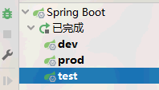
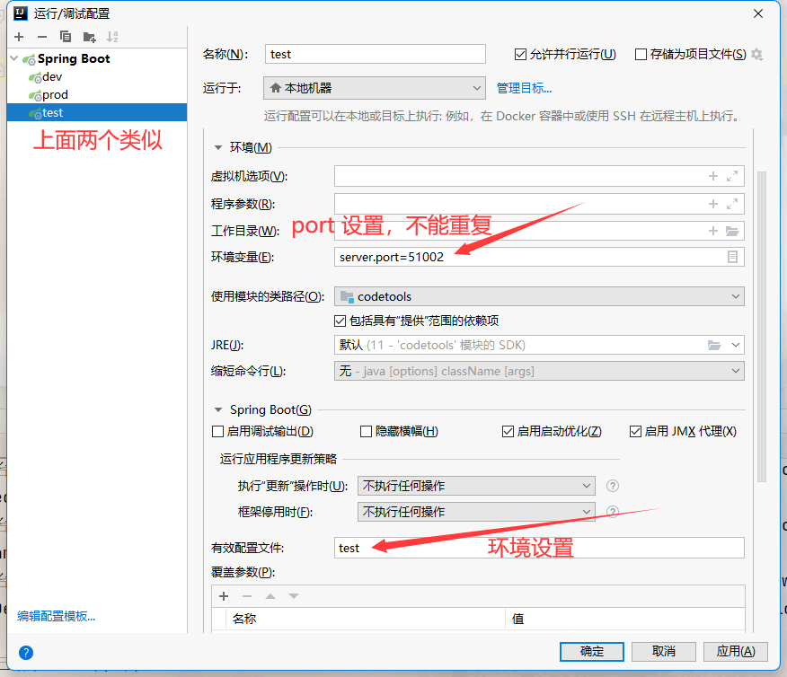

## idea插件：

Alibaba Java、CamelCase、Chinese、codeGlance3、codota、GenerateAllSetter、gitee、Grep Console、mybatis-log、RestfulToolkit、Translation、vuejs、GsonFormatPlus、json parser

## idea设置 java类文件注释模板

```java
/**
  * 
  * @author jf
  * @jdk-version: 17
  * @date: ${DATE} ${TIME}
  * /  

```


## 同一个启动类：多环境+多port 运行






